# Pipeline 01: Mod Boot / Patch Installation

> **Category:** Initialization & Lifecycle

## Summary

This pipeline carries TAC AI from DLL load (via TTSMM/0LogManager or Steam Workshop `ModBase`) through dependency validation, manager initialization, Harmony patch installation, deferred block-DB / tech-validation passes, and the late `ManWorldRTS.DelayedInitiate` triggered by a Harmony postfix on `ManSpawn.OnDLCLoadComplete`. Two compile-time entry shapes exist, selected by the `STEAM` preprocessor symbol — Steam Workshop (`KickStartTAC_AI : ModBase`) and TTSMM/TTMM (`KickStart.Main` per `mod.json`'s `EntryMethod`) — and both converge on `KickStart.MainOfficialInit`. The pipeline finishes once the block index, RawTech validation, RTS `SelectCircle`/`SelectWindow`/`autoWindow` UI, and `AIEPathMapper` GameObject (allocated lazily on first tile registration) are all live — at which point the world is ready for tank spawning (Pipeline 02).

## Entry points

| Trigger | Entry function | Reference |
|---|---|---|
| Steam Workshop: `ModBase` discovery | `KickStartTAC_AI.EarlyInit` | [KickStartTAC_AI.cs:25](../Modified/TACtical_AI-master/TACtical_AI-master/TAC_AI/KickStartTAC_AI.cs) |
| Steam Workshop: ModBase Init | `KickStartTAC_AI.Init` | [KickStartTAC_AI.cs:36](../Modified/TACtical_AI-master/TACtical_AI-master/TAC_AI/KickStartTAC_AI.cs) |
| Steam Workshop: ModBase DeInit | `KickStartTAC_AI.DeInit` | [KickStartTAC_AI.cs:63](../Modified/TACtical_AI-master/TACtical_AI-master/TAC_AI/KickStartTAC_AI.cs) |
| Steam Workshop: staged iterator | `KickStartTAC_AI.InitIterator` -> `KickStart.MainOfficialInitIterate` | [KickStart.cs:614](../Modified/TACtical_AI-master/TACtical_AI-master/TAC_AI/KickStart.cs) |
| TTMM / TTSMM: `EntryMethod` from `mod.json` | `KickStart.Main` | [KickStart.cs:891](../Modified/TACtical_AI-master/TACtical_AI-master/TAC_AI/KickStart.cs) |
| Shared post-validation core | `KickStart.MainOfficialInit` | [KickStart.cs:546](../Modified/TACtical_AI-master/TACtical_AI-master/TAC_AI/KickStart.cs) |
| Harmony postfix (world ready) | `ManagerPatches.ManSpawnPatches.OnDLCLoadComplete_Postfix` | [ManagerPatches.cs:19](../Modified/TACtical_AI-master/TACtical_AI-master/TAC_AI/PatchBatch/ManagerPatches.cs) |
| Block-DB ready (event-driven) | `KickStart.AfterBlocksLoaded` (sub'd to `InvokeHelper.BlocksPostChangeEvent`) | [KickStart.cs:599](../Modified/TACtical_AI-master/TACtical_AI-master/TAC_AI/KickStart.cs) |
| First-spawn lazy bootstrap | `AIEPathMapper.RegisterTile` | [AIEPathMapper.cs:244](../Modified/TACtical_AI-master/TACtical_AI-master/TAC_AI/AI/Movement/AIEPathMapper.cs) |

## Flow

```mermaid
graph TD
    Start((DLL Loaded))

    subgraph P1[Phase 1 - Entry and Validation]
        Entry{Build?}
        Early[KickStartTAC_AI.EarlyInit]
        SteamInit[KickStartTAC_AI.Init]
        TTMMMain[KickStart.Main]
        Encap[ModStatusChecker.EncapsulateSafeInit]
        MainInit[KickStart.MainOfficialInit]
        Validate[KickStart.VALIDATE_MODS]
        Harmony{Harmony present?}
        Abort[Log error and return]
        ModCheck[Probe optional mods]
    end

    subgraph P2[Phase 2 - SafeSaves and Managers]
        Hook[KickStart.HookToSafeSaves]
        LegExt[LegModExt.InsurePatches]
        BaseTeams[ManBaseTeams.Initiate]
        TAIM[TankAIManager.Initiate]
        TAIMHooks[Subscribe ManTechs events]
        SharedMenu[AIGlobals.InitSharedMenu]
        GUIMan[GUIAIManager.Initiate]
        RawExp[RawTechExporter.Initiate]
        BFM[BaseFunderManager.Initiate]
        MEW[ManEnemyWorld.Initiate]
        WRTSInit[ManWorldRTS.Initiate via LateInitiate]
        Siege[ManEnemySiege.Init]
        Spawner[SpecialAISpawner.Initiate]
        NPT[GUINPTInteraction.Initiate]
    end

    subgraph P3[Phase 3 - Harmony Patch Install]
        Patch[KickStart.PatchMod]
        MP1[MassPatcher GlobalPatches]
        MP2[MassPatcher ManagerPatches]
        MP3[MassPatcher UIPatches]
        MP4[MassPatcher ModulePatches]
        HPA[harmonyInstance.PatchAll]
        Special[InitSpecialPatch DEBUG only]
    end

    subgraph P4[Phase 4 - Post-Patch Finalize]
        RefDelay[AIERepair.RefreshDelays]
        DetActive[SpecialAISpawner.DetermineActiveOnModeType]
        CorrBlocks[TankAIManager.CorrectBlocksList]
        InitSet[KickStart.InitSettings]
        Pulse[Schedule EmitHealthPulse 10s]
        NetHooks[GUINPTInteraction.InsureNetHooks]
        CfgBranch{Config providers?}
        BothCfg[ENCAPSULATEErrorInitConfig]
        NOOnly[ENCAPSULATEErrorInitModOptions]
        CHOnly[PushExtModConfigHandlingConfigOnly]
        Cull[KickStart.UpdateCullDist]
        WikiSub[Subscribe InsureAllValidAIs]
        OvMax[KickStart.OverrideEnemyMax]
        Attract[Seed CustomAttract.Attracts]
        WikiInit[AIWiki.InitWiki]
        ModeSub[Subscribe OnModeSwitch]
        BlocksSub[Subscribe AfterBlocksLoaded]
    end

    subgraph P5[Phase 5 - Deferred Event-Driven]
        BlockEvt((BlocksPostChangeEvent fires))
        ABLoaded[KickStart.AfterBlocksLoaded]
        BaseLoader[KickStart.DelayedBaseLoader]
        BlkIdx[BlockIndexer.ConstructBlockLookupList]
        ValidTechs[ModTechsDatabase.ValidateAllStringTechs]
        DbgSpawn[DebugRawTechSpawner.Initiate]
        FAfterBI[Set firedAfterBlockInjector]
        DLCDone((ManSpawn.OnDLCLoadComplete fires))
        DLCPost[OnDLCLoadComplete_Postfix]
        DelInit[ManWorldRTS.DelayedInitiate]
        Halo[Build SelectCirclePrefab]
        Windows[Instantiate SelectWindow and autoWindow]
        TileSpawn((World tile spawns))
        PMReg[AIEPathMapper.RegisterTile lazy bootstrap]
    end

    Ready((World READY - see Pipeline 02))

    Start --> Entry
    Entry -->|STEAM| Early
    Early --> SteamInit
    SteamInit --> Encap
    Encap --> MainInit
    Entry -->|TTMM| TTMMMain
    TTMMMain -->|isSteamManaged| MainInit
    TTMMMain -->|TTMM only| Validate
    MainInit --> Validate
    Validate --> Harmony
    Harmony -->|no| Abort
    Abort --> Start
    Harmony -->|yes| ModCheck
    ModCheck --> Hook
    Hook --> LegExt
    LegExt --> BaseTeams
    BaseTeams --> TAIM
    TAIM --> TAIMHooks
    TAIMHooks --> SharedMenu
    SharedMenu --> GUIMan
    GUIMan --> RawExp
    RawExp --> BFM
    BFM --> MEW
    MEW --> WRTSInit
    WRTSInit --> Siege
    Siege --> Spawner
    Spawner --> NPT
    NPT --> Patch
    Patch --> MP1
    MP1 --> MP2
    MP2 --> MP3
    MP3 --> MP4
    MP4 --> HPA
    HPA --> RefDelay
    RefDelay --> DetActive
    DetActive --> CorrBlocks
    CorrBlocks --> InitSet
    InitSet --> Pulse
    Pulse --> NetHooks
    NetHooks --> CfgBranch
    CfgBranch -->|both| BothCfg
    CfgBranch -->|NO only| NOOnly
    CfgBranch -->|CH only| CHOnly
    CfgBranch -->|neither| Cull
    BothCfg --> Cull
    NOOnly --> Cull
    CHOnly --> Cull
    Cull --> WikiSub
    WikiSub --> OvMax
    OvMax --> Attract
    Attract --> WikiInit
    WikiInit --> ModeSub
    ModeSub -->|DEBUG| Special
    ModeSub --> BlocksSub
    Special --> BlocksSub
    BlocksSub -.subscription.-> BlockEvt
    BlockEvt --> ABLoaded
    ABLoaded --> BaseLoader
    BaseLoader --> BlkIdx
    BlkIdx --> ValidTechs
    ValidTechs --> DbgSpawn
    DbgSpawn --> FAfterBI
    MP2 -.installs patch.-> DLCPost
    DLCDone --> DLCPost
    DLCPost --> DelInit
    DelInit --> Halo
    Halo --> Windows
    FAfterBI --> Ready
    Windows --> Ready
    TileSpawn --> PMReg
    PMReg -.first-spawn lazy.-> Ready
```



## Node reference

| ID | Description | Reference |
|---|---|---|
| Entry | Branch on `#if STEAM` preprocessor; `mod.json` sets `EntryMethod=TAC_AI.KickStart.Main` | [mod.json:8](../Modified/TACtical_AI-master/TACtical_AI-master/TAC_AI/mod.json) |
| Early | Steam Workshop ModBase EarlyInit: creates `oInst = new ModDataHandle(ModID)` | [KickStartTAC_AI.cs:25](../Modified/TACtical_AI-master/TACtical_AI-master/TAC_AI/KickStartTAC_AI.cs) |
| SteamInit | Sets `ShouldBeActive=true`; first run dispatches `EncapsulateSafeInit(MainOfficialInit, DeInitALL)`; subsequent re-inits short-circuit | [KickStartTAC_AI.cs:36](../Modified/TACtical_AI-master/TACtical_AI-master/TAC_AI/KickStartTAC_AI.cs) |
| TTMMMain | TTSMM/TTMM entry; redirects to `MainOfficialInit` if `isSteamManaged`, otherwise runs TTMM-shaped init | [KickStart.cs:891](../Modified/TACtical_AI-master/TACtical_AI-master/TAC_AI/KickStart.cs) |
| Encap | `TerraTechETCUtil.ModStatusChecker.EncapsulateSafeInit` (external; wraps init+deinit with error reporting) | [KickStartTAC_AI.cs:47](../Modified/TACtical_AI-master/TACtical_AI-master/TAC_AI/KickStartTAC_AI.cs) |
| MainInit | Shared core init path | [KickStart.cs:546](../Modified/TACtical_AI-master/TACtical_AI-master/TAC_AI/KickStart.cs) |
| Validate | `KickStart.VALIDATE_MODS`: requires Harmony; probes NLogManager, ConfigHelper, NativeOptions, RandomAdditions, WaterMod, Control Block, WeaponAimMod, TweakTech, BlockInjector, PopulationInjector, AnimeAI; sets `is*Present` flags; side-effect `ManSafeSaves.DisableExternalBackupSaving=true` | [KickStart.cs:374](../Modified/TACtical_AI-master/TACtical_AI-master/TAC_AI/KickStart.cs) |
| Harmony | `if (!LookForMod("0Harmony")) return false` | [KickStart.cs:378](../Modified/TACtical_AI-master/TACtical_AI-master/TAC_AI/KickStart.cs) |
| Abort | `DebugTAC_AI.ErrorReport("This mod NEEDS Harmony to function!...")` and bail | [KickStart.cs:380](../Modified/TACtical_AI-master/TACtical_AI-master/TAC_AI/KickStart.cs) |
| ModCheck | Optional-dependency probes via `LookForMod` (assembly-prefix scan over `AppDomain.CurrentDomain.GetAssemblies()`) | [KickStart.cs:384-462, LookForMod 1021](../Modified/TACtical_AI-master/TACtical_AI-master/TAC_AI/KickStart.cs) |
| Hook | `HookToSafeSaves`: `ManSafeSaves.RegisterSaveSystem` with `OnSaveManagers`/`OnLoadManagers`; sets `HasHookedUpToSafeSaves=true`; FatalError on failure | [KickStart.cs:505](../Modified/TACtical_AI-master/TACtical_AI-master/TAC_AI/KickStart.cs) |
| LegExt | `LegModExt.InsurePatches` (legacy mod-extension prep) | [KickStart.cs:560](../Modified/TACtical_AI-master/TACtical_AI-master/TAC_AI/KickStart.cs) |
| BaseTeams | `ManBaseTeams.Initiate` — subscribes ModeStart/ModeSwitch | [ManBaseTeams.cs:511](../Modified/TACtical_AI-master/TACtical_AI-master/TAC_AI/World/ManBaseTeams.cs) |
| TAIM | `TankAIManager.Initiate` — creates `AIManager` GameObject, allocates AIECore lists (Minables/Depots/BlockHandlers/Chargers/RetreatingTeams), `teamsIndexed` dictionary | [TankAIManager.cs:54](../Modified/TACtical_AI-master/TACtical_AI-master/TAC_AI/AI/TankAIManager.cs) |
| TAIMHooks | Subscribes `ManPauseGame.PauseEvent`, `ManTechs.TankPostSpawnEvent`/`TankTeamChangedEvent`/`PlayerTankChangedEvent`, `ManVisible.OnStoppedTrackingVisible`, `ManGameMode.ModeStartEvent`; reflection-overrides `ManTechs.m_SleepRangeFromCamera` to `AIGlobals.EnemyExtendActionRange`; caches `ManWorld.m_SetPiecesPlacement` into `TankAIManager.SetPieces`; schedules `GatherAllMissionTechs` at 0.1s | [TankAIManager.cs:65-81](../Modified/TACtical_AI-master/TACtical_AI-master/TAC_AI/AI/TankAIManager.cs) |
| SharedMenu | `AIGlobals.InitSharedMenu` | [KickStart.cs:563](../Modified/TACtical_AI-master/TACtical_AI-master/TAC_AI/KickStart.cs) |
| GUIMan | `GUIAIManager.Initiate` | [GUIAIManager.cs:36](../Modified/TACtical_AI-master/TACtical_AI-master/TAC_AI/GUIAIManager.cs) |
| RawExp | `RawTechExporter.Initiate` | [RawTechExporter.cs:102](../Modified/TACtical_AI-master/TACtical_AI-master/TAC_AI/Templates/RawTechExporter.cs) |
| BFM | `RLoadedBases.BaseFunderManager.Initiate` | [RLoadedBases.cs:345](../Modified/TACtical_AI-master/TACtical_AI-master/TAC_AI/Enemy/RLoadedBases.cs) |
| MEW | `ManEnemyWorld.Initiate` creates `ManEnemyWorld` GameObject; under `#if STEAM` calls `LateInitiate()` which subscribes `TankDestroyedEvent`/`ModeStartEvent`/`ModeSwitchEvent` and chains `ManWorldRTS.Initiate` + `ManEnemySiege.Init` | [ManEnemyWorld.cs:244 / LateInitiate 286](../Modified/TACtical_AI-master/TACtical_AI-master/TAC_AI/World/ManEnemyWorld.cs) |
| WRTSInit | `ManWorldRTS.Initiate` creates `PlayerRTSControl` GameObject; subscribes `ModeSwitchEvent`/`CameraSwitchEvent`/`TankAIManager.TechRemovedEvent`; calls `PlayerRTSUI.Initiate` if `AllowPlayerRTSHUD` | [ManWorldRTS.cs:252](../Modified/TACtical_AI-master/TACtical_AI-master/TAC_AI/World/ManWorldRTS.cs) |
| Siege | `ManEnemySiege.Init` called from `LateInitiate` | [ManEnemyWorld.cs:295](../Modified/TACtical_AI-master/TACtical_AI-master/TAC_AI/World/ManEnemyWorld.cs) |
| Spawner | `SpecialAISpawner.Initiate` creates `AISpawnerAux` GameObject (`SetActive(false)`); subscribes `ModeStartEvent`; calls `RawTechLoader.Initiate`; runs `DetermineActiveOnModeType` | [SpecialAISpawner.cs:86](../Modified/TACtical_AI-master/TACtical_AI-master/TAC_AI/Templates/SpecialAISpawner.cs) |
| NPT | `GUINPTInteraction.Initiate` | [GUINPTInteraction.cs:81](../Modified/TACtical_AI-master/TACtical_AI-master/TAC_AI/GUINPTInteraction.cs) |
| Patch | `KickStart.PatchMod` gated by `hasPatched` and per-batch `patchedBatches`; Harmony instance ID `legionite.tactical_ai` | [KickStart.cs:480](../Modified/TACtical_AI-master/TACtical_AI-master/TAC_AI/KickStart.cs) |
| MP1 | `PatchBatchOnce(typeof(GlobalPatches))` | [KickStart.cs:487](../Modified/TACtical_AI-master/TACtical_AI-master/TAC_AI/KickStart.cs) |
| MP2 | `PatchBatchOnce(typeof(ManagerPatches))` — installs `ManSpawnPatches.OnDLCLoadComplete_Postfix` among others | [KickStart.cs:488](../Modified/TACtical_AI-master/TACtical_AI-master/TAC_AI/KickStart.cs) |
| MP3 | `PatchBatchOnce(typeof(UIPatches))` | [KickStart.cs:489](../Modified/TACtical_AI-master/TACtical_AI-master/TAC_AI/KickStart.cs) |
| MP4 | `PatchBatchOnce(typeof(ModulePatches))` | [KickStart.cs:490](../Modified/TACtical_AI-master/TACtical_AI-master/TAC_AI/KickStart.cs) |
| HPA | `harmonyInstance.PatchAll(Assembly.GetExecutingAssembly())` sweeps `[HarmonyPatch]` attribute classes in `PatchBatch.cs`; sets `hasPatched=true` on success | [KickStart.cs:492-494](../Modified/TACtical_AI-master/TACtical_AI-master/TAC_AI/KickStart.cs) |
| Special | `InitSpecialPatch` (DEBUG only) transpiles `SnapshotServiceDesktop.UpdateSnapshotCacheOnStartup` to swap `/Snapshots` -> `/SnapshotsCommunity`; sets `BlockIndexer.UseVanillaFallbackSnapUtility=false` | [KickStart.cs:524, called 603](../Modified/TACtical_AI-master/TACtical_AI-master/TAC_AI/KickStart.cs) |
| RefDelay | `AIERepair.RefreshDelays` | [AIERepair.cs:48](../Modified/TACtical_AI-master/TACtical_AI-master/TAC_AI/AI/AIERepair.cs) |
| DetActive | `SpecialAISpawner.DetermineActiveOnModeType` | [SpecialAISpawner.cs:109](../Modified/TACtical_AI-master/TACtical_AI-master/TAC_AI/Templates/SpecialAISpawner.cs) |
| CorrBlocks | `TankAIManager.CorrectBlocksList` (thin wrapper -> `BlockIndexer.ConstructBlockLookupListDelayed`, ~0.01s Invoke) | [TankAIManager.cs:430 / BlockIndexer.cs:106](../Modified/TACtical_AI-master/TACtical_AI-master/TAC_AI/AI/TankAIManager.cs) |
| InitSet | `KickStart.InitSettings` gated by `launched`; increments `initCycleCount` | [KickStart.cs:718](../Modified/TACtical_AI-master/TACtical_AI-master/TAC_AI/KickStart.cs) |
| Pulse | `InvokeHelper.InvokeSingleRepeat(EmitHealthPulse, 10f)` gated by `healthPulseScheduled` | [KickStart.cs:728 / handler 72](../Modified/TACtical_AI-master/TACtical_AI-master/TAC_AI/KickStart.cs) |
| NetHooks | `GUINPTInteraction.InsureNetHooks` | [KickStart.cs:731](../Modified/TACtical_AI-master/TACtical_AI-master/TAC_AI/KickStart.cs) |
| CfgBranch | Branch on `isConfigHelperPresent` / `isNativeOptionsPresent` | [KickStart.cs:732-770](../Modified/TACtical_AI-master/TACtical_AI-master/TAC_AI/KickStart.cs) |
| BothCfg | `ENCAPSULATEErrorInitConfig` -> `KickStartConfigHelper.PushExtModConfigHandling` | [KickStart.cs:692 / call 736](../Modified/TACtical_AI-master/TACtical_AI-master/TAC_AI/KickStart.cs) |
| NOOnly | `ENCAPSULATEErrorInitModOptions` -> `KickStartNativeOptions.PushExtModOptionsHandling` | [KickStart.cs:705 / call 749](../Modified/TACtical_AI-master/TACtical_AI-master/TAC_AI/KickStart.cs) |
| CHOnly | `KickStartConfigHelper.PushExtModConfigHandlingConfigOnly` | [KickStart.cs:762](../Modified/TACtical_AI-master/TACtical_AI-master/TAC_AI/KickStart.cs) |
| Cull | `KickStart.UpdateCullDist` (resolves `CullFarEnemyBasesMode` -> distance) | [KickStart.cs:213 / called 772](../Modified/TACtical_AI-master/TACtical_AI-master/TAC_AI/KickStart.cs) |
| WikiSub | `InvokeHelper.BlocksPostChangeEvent.Subscribe(AIWiki.InsureAllValidAIs)` | [KickStart.cs:773](../Modified/TACtical_AI-master/TACtical_AI-master/TAC_AI/KickStart.cs) |
| OvMax | `KickStart.OverrideEnemyMax` only if `!isPopInjectorPresent`; reflection sets `ManPop.m_PopulationLimit = AIPopMaxLimit`; saves original to `SavedDefaultPopulationLimit`; `FatalError` if reflection field missing | [KickStart.cs:582 / impl 986](../Modified/TACtical_AI-master/TACtical_AI-master/TAC_AI/KickStart.cs) |
| Attract | Seed `CustomAttract.Attracts = CustomAttract.InitAttracts` if null | [KickStart.cs:588-591](../Modified/TACtical_AI-master/TACtical_AI-master/TAC_AI/KickStart.cs) |
| WikiInit | `AIWiki.InitWiki` | [AIWiki.cs:60](../Modified/TACtical_AI-master/TACtical_AI-master/TAC_AI/AIWiki.cs) |
| ModeSub | `ManGameMode.inst.ModeSwitchEvent.Subscribe(OnModeSwitch)` | [KickStart.cs:593](../Modified/TACtical_AI-master/TACtical_AI-master/TAC_AI/KickStart.cs) |
| BlocksSub | `InvokeHelper.BlocksPostChangeEvent.Subscribe(AfterBlocksLoaded)` | [KickStart.cs:597](../Modified/TACtical_AI-master/TACtical_AI-master/TAC_AI/KickStart.cs) |
| BlockEvt | `InvokeHelper.BlocksPostChangeEvent` fires (vanilla + BlockInjector finished loading blocks) | n/a (external event) |
| ABLoaded | `KickStart.AfterBlocksLoaded` thin wrapper that calls `DelayedBaseLoader` | [KickStart.cs:599](../Modified/TACtical_AI-master/TACtical_AI-master/TAC_AI/KickStart.cs) |
| BaseLoader | `KickStart.DelayedBaseLoader` | [KickStart.cs:948](../Modified/TACtical_AI-master/TACtical_AI-master/TAC_AI/KickStart.cs) |
| BlkIdx | `BlockIndexer.ConstructBlockLookupList` (full sync pass) | [BlockIndexer.cs:121](../Modified/TACtical_AI-master/TACtical_AI-master/TAC_AI/BlockIndexer.cs) |
| ValidTechs | `ModTechsDatabase.ValidateAllStringTechs` | [KickStart.cs:952](../Modified/TACtical_AI-master/TACtical_AI-master/TAC_AI/KickStart.cs) |
| DbgSpawn | `DebugRawTechSpawner.Initiate` | [DebugRawTechSpawner.cs:72](../Modified/TACtical_AI-master/TACtical_AI-master/TAC_AI/Templates/DebugRawTechSpawner.cs) |
| FAfterBI | `firedAfterBlockInjector = true` (downstream gate for spawn pipelines) | [KickStart.cs:954](../Modified/TACtical_AI-master/TACtical_AI-master/TAC_AI/KickStart.cs) |
| DLCDone | Vanilla `ManSpawn.OnDLCLoadComplete` fires per DLC content load | n/a (vanilla) |
| DLCPost | `ManSpawnPatches.OnDLCLoadComplete_Postfix` — Harmony postfix; wraps `EncapsulateSafeInit("Advanced AI", ManWorldRTS.DelayedInitiate, KickStart.DeInitALL)` in typed `catch (Exception e)` that logs via `DebugTAC_AI.LogError` | [ManagerPatches.cs:19-28](../Modified/TACtical_AI-master/TACtical_AI-master/TAC_AI/PatchBatch/ManagerPatches.cs) |
| DelInit | `ManWorldRTS.DelayedInitiate` | [ManWorldRTS.cs:289](../Modified/TACtical_AI-master/TACtical_AI-master/TAC_AI/World/ManWorldRTS.cs) |
| Halo | If `SelectHalo.SelectCirclePrefab == null`: build `SelectCircle` GameObject + `SelectHalo` component, find `MAT_SFX_Explosion_01_Shockwave` material, register Default/Attack/Hover/Select halo materials (inner catch logs via `DebugTAC_AI.LogError`), configure `ParticleSystem` | [ManWorldRTS.cs:291-345](../Modified/TACtical_AI-master/TACtical_AI-master/TAC_AI/World/ManWorldRTS.cs) |
| Windows | `Destroy(SelectWindow)` then `Instantiate(new GameObject("TechSelectRect"))` + `GUIRectSelect`; same for `AutoPilot` + `GUIRectAuto`. Destroy-first guards prevent orphan-on-rebuild when DelayedInitiate re-fires per DLC load or runtime strategic-AI toggle | [ManWorldRTS.cs:349-357](../Modified/TACtical_AI-master/TACtical_AI-master/TAC_AI/World/ManWorldRTS.cs) |
| TileSpawn | First `WorldTile` reaches spawn-ready state | n/a (vanilla `TileManager`) |
| PMReg | `AIEPathMapper.RegisterTile` on first call: sets `sub=true`, creates `PathMapper` GameObject, subscribes `TileManager.TileDestroyedEvent` and `ManWorldDeformerExt.OnTerrainDeformed` (both -> `UnregisterTile`); duplicate-tile path logs and returns. `ResetAll` unsubscribes both events before destroying the GameObject | [AIEPathMapper.cs:244-296](../Modified/TACtical_AI-master/TACtical_AI-master/TAC_AI/AI/Movement/AIEPathMapper.cs) |

## Key data / state

**Singletons / GameObjects created (persist until DeInit):**

- `TankAIManager.inst` — `AIManager` GameObject (also seeds `AIECore.Minables/Depots/BlockHandlers/Chargers/RetreatingTeams`).
- `ManWorldRTS.inst` — `PlayerRTSControl` GameObject; later gains `SelectWindow`/`autoWindow` + `SelectHalo.SelectCirclePrefab` after `DelayedInitiate`.
- `ManEnemyWorld.inst` — `ManEnemyWorld` GameObject.
- `SpecialAISpawner.inst` — `AISpawnerAux` GameObject (initially `SetActive(false)`).
- `AIEPathMapper.inst` — `PathMapper` GameObject, lazily created on first `RegisterTile`.

**Flags (boot guards):**

- `KickStart.hasPatched = true` ([KickStart.cs:494](../Modified/TACtical_AI-master/TACtical_AI-master/TAC_AI/KickStart.cs)) — prevents Harmony re-application across mode switches.
- `KickStart.patchedBatches` HashSet ([KickStart.cs:470](../Modified/TACtical_AI-master/TACtical_AI-master/TAC_AI/KickStart.cs)) — per-batch tracking so retry after partial-patch failure doesn't double-patch.
- `KickStart.HasHookedUpToSafeSaves = true` ([KickStart.cs:512](../Modified/TACtical_AI-master/TACtical_AI-master/TAC_AI/KickStart.cs)).
- `KickStart.launched = true` ([KickStart.cs:722](../Modified/TACtical_AI-master/TACtical_AI-master/TAC_AI/KickStart.cs)) — `InitSettings` re-entry guard.
- `KickStart.healthPulseScheduled = true` ([KickStart.cs:729](../Modified/TACtical_AI-master/TACtical_AI-master/TAC_AI/KickStart.cs)).
- `KickStart.firedAfterBlockInjector = true` ([KickStart.cs:954](../Modified/TACtical_AI-master/TACtical_AI-master/TAC_AI/KickStart.cs)).
- `KickStart.initCycleCount` / `deInitCycleCount` lifecycle counters ([KickStart.cs:723, 808](../Modified/TACtical_AI-master/TACtical_AI-master/TAC_AI/KickStart.cs)).
- `KickStart.SavedDefaultPopulationLimit` stashed pre-override ([KickStart.cs:998](../Modified/TACtical_AI-master/TACtical_AI-master/TAC_AI/KickStart.cs)); restored on `DeInitALL` ([KickStart.cs:830-834](../Modified/TACtical_AI-master/TACtical_AI-master/TAC_AI/KickStart.cs)).
- `SafeSaves.ManSafeSaves.DisableExternalBackupSaving = true` ([KickStart.cs:463](../Modified/TACtical_AI-master/TACtical_AI-master/TAC_AI/KickStart.cs)).

**Reflection overrides:**

- `ManTechs.m_SleepRangeFromCamera` extended from vanilla `200` to `AIGlobals.EnemyExtendActionRange` ([TankAIManager.cs:78](../Modified/TACtical_AI-master/TACtical_AI-master/TAC_AI/AI/TankAIManager.cs)).
- `ManPop.m_PopulationLimit` overwritten to `KickStart.AIPopMaxLimit` (via `limitBreak` `FieldInfo` cached at [KickStart.cs:985](../Modified/TACtical_AI-master/TACtical_AI-master/TAC_AI/KickStart.cs); skipped when PopulationInjector present; `FatalError` if reflection field missing).
- `ManWorld.m_SetPiecesPlacement` snapshot captured into `TankAIManager.SetPieces` ([TankAIManager.cs:81](../Modified/TACtical_AI-master/TACtical_AI-master/TAC_AI/AI/TankAIManager.cs)).

**Event subscriptions (long-lived):**

- `ManGameMode.ModeSwitchEvent -> KickStart.OnModeSwitch` ([KickStart.cs:593, handler 603](../Modified/TACtical_AI-master/TACtical_AI-master/TAC_AI/KickStart.cs)).
- `InvokeHelper.BlocksPostChangeEvent -> AfterBlocksLoaded` & `AIWiki.InsureAllValidAIs`.
- `ManPauseGame.PauseEvent`; `ManTechs.TankPostSpawnEvent`/`TankTeamChangedEvent`/`PlayerTankChangedEvent`; `ManVisible.OnStoppedTrackingVisible`; `ManGameMode.ModeStartEvent -> OnStartup` (which defers `InsureLoadedCorrectly` by 1s).
- `ManGameMode.ModeSwitchEvent` and `CameraManager.CameraSwitchEvent` from `ManWorldRTS.Initiate`.
- `ManSpawn.OnDLCLoadComplete` postfix wires `ManWorldRTS.DelayedInitiate` per DLC content load.

## Exit points

| Output | Consumer | Reference |
|---|---|---|
| Managers initialised, Harmony patches active, block index ready | Pipeline 02 (Tank spawn) — receives `ManTechs.TankPostSpawnEvent` callbacks via `TankAIManager.OnTankAddition` | [TankAIManager.cs:157](../Modified/TACtical_AI-master/TACtical_AI-master/TAC_AI/AI/TankAIManager.cs) |
| `OnSaveManagers` / `OnLoadManagers` registered with SafeSaves | Pipeline 03 (World load/save) | [KickStart.cs:957, 971](../Modified/TACtical_AI-master/TACtical_AI-master/TAC_AI/KickStart.cs) |
| RTS UI (`SelectWindow`/`autoWindow`/`SelectCirclePrefab`) live | Pipeline 04 (Allied AI tick) & RTS pipelines | [ManWorldRTS.cs:349-357](../Modified/TACtical_AI-master/TACtical_AI-master/TAC_AI/World/ManWorldRTS.cs) |
| `AIEPathMapper` GameObject live (on first tile) | Pipelines 08-11 (drive/pathing/movement) | [AIEPathMapper.cs:250](../Modified/TACtical_AI-master/TACtical_AI-master/TAC_AI/AI/Movement/AIEPathMapper.cs) |
| `EmitHealthPulse` 10s repeat | Diagnostic / spawn-summary feed | [KickStart.cs:72, 728](../Modified/TACtical_AI-master/TACtical_AI-master/TAC_AI/KickStart.cs) |
| `DeInitALL` symmetric tear-down | Mode unload / mod-disable path | [KickStart.cs:784](../Modified/TACtical_AI-master/TACtical_AI-master/TAC_AI/KickStart.cs) |

## Cross-pipeline integration

- **Inbound from:** N/A (entry pipeline; triggered by mod loader).
- **Outbound to:**
  - Pipeline 02 (Tank spawn) — via `ManTechs.TankPostSpawnEvent` subscriptions established in `TankAIManager.Initiate`.
  - Pipeline 03 (World load/save) — via `KickStart.OnSaveManagers`/`OnLoadManagers` registered with SafeSaves.
  - Pipelines 04-13 (AI tick & combat) — `TankAIManager.inst` and `AIECore` collections are prerequisites for every tick.
  - Pipelines 08-11 (movement/pathing) — `AIEPathMapper.inst` allocated lazily here.
  - Pipeline 15 (Enemy world/tile) — `ManEnemyWorld.inst` created here; tile callbacks subscribed via `LateInitiate` (STEAM).
  - Pipeline 17 (RawTech spawn) — `SpecialAISpawner.inst` + `RawTechLoader.Initiate` chain.
  - Pipeline 18 (Harmony patches) — installed during `PatchMod`.
- **Patched by:** Pipeline 18 (Harmony patches) — but inverted: this pipeline *installs* them; `ManSpawnPatches.OnDLCLoadComplete_Postfix` is the only patch that fires back into this pipeline to trigger `ManWorldRTS.DelayedInitiate`.

## Issues

**NONE.**

If a new issue is found in this pipeline, replace `NONE.` above and add it under the matching heading, using a stable ID (`BUG-N`, `DEAD-N`, or `TD-N`) and a clickable `file.cs:line` link. Format:

```text
### Bugs
- **BUG-1 (High | Medium | Low)** - [File.cs:line](path) - what is wrong, and the intended fix.

### Dead code
- **DEAD-1** - [File.cs:line](path) - what is orphaned or unreachable, and why.

### Tech debt
- **TD-1** - [File.cs:line](path) - the smell, and the cleaner shape.
```
