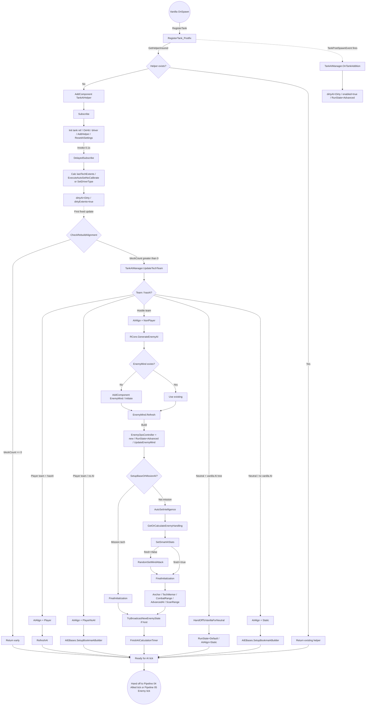

# Pipeline 02: Tank Spawn Lifecycle

> **Category:** Initialization & Lifecycle

## Summary

When a vanilla `Tank` is registered with `ManTechs`, the TAC AI mod intercepts via a Harmony postfix on `ManTechs.RegisterTank` and attaches (or retrieves) a `TankAIHelper` component. After a delayed initialization tick (`~0.1s`), `CheckRebuildAlignment` classifies the tank into one of four `AIAlignment` states (Player / PlayerNoAI / NonPlayer / Static) based on team membership and vanilla AI availability, then routes it to the appropriate setup path. Hostile (NonPlayer) techs additionally receive an `EnemyMind` component, intelligence/handling/attack-mode assignment, and `FinalInitialization` configuration before being handed off to the next AI tick.

## Entry points

| Trigger | Entry function | Reference |
|---|---|---|
| Vanilla `Tank.OnSpawn` calls `ManTechs.RegisterTank` (vanilla TerraTech) | `ManTechsPatches.RegisterTank_Postfix` (Harmony postfix) | [ManagerPatches.cs:97](../Modified/TACtical_AI-master/TACtical_AI-master/TAC_AI/PatchBatch/ManagerPatches.cs) |
| `ManTechs.TankPostSpawnEvent` fires after registration (vanilla event) | `TankAIManager.OnTankAddition` (event listener) | [TankAIManager.cs:178](../Modified/TACtical_AI-master/TACtical_AI-master/TAC_AI/AI/TankAIManager.cs) |
| `RegisterTank_Postfix` invokes extension method to insure helper presence | `Tank.GetHelperInsured` | [TankExtensions.cs:193](../Modified/TACtical_AI-master/TACtical_AI-master/TAC_AI/TankExtensions.cs) |

## Flow



## Node reference

| ID | Description | Reference |
|---|---|---|
| Start | Vanilla `Tank.OnSpawn` event in TerraTech (not in mod repo) | Tank.cs:1473 `[?]` (vanilla TT) |
| Postfix | Harmony postfix on `ManTechs.RegisterTank` that calls `t.GetHelperInsured()` | [ManagerPatches.cs:97](../Modified/TACtical_AI-master/TACtical_AI-master/TAC_AI/PatchBatch/ManagerPatches.cs) |
| Insure / Add | `GetHelperInsured` extension: get or create `TankAIHelper` via `AddComponent` | [TankExtensions.cs:193](../Modified/TACtical_AI-master/TACtical_AI-master/TAC_AI/TankExtensions.cs) |
| Sub / SubInit | `Subscribe`: null-guards Tank, inits `tank` ref, lazy-touches `boundsCentreWorld`, adds to `ManWorldTreadmill`, subscribes `OnHit`, sets `DriverType` via `AIECore.HandlingDetermine`, calls `SetupDefaultMovementAIController`, `AIECore.AddHelper`, `ResetAISettings`, schedules `DelayedSubscribe` via `nameof()` | [TankAIHelper.cs:620](../Modified/TACtical_AI-master/TACtical_AI-master/TAC_AI/AI/TankAIHelper.cs) |
| OnAdd / MarkDirty | `TankAIManager.OnTankAddition` listener on `TankPostSpawnEvent` — uses `EnforceSingleComponent` for duplicate enforcement, marks helper dirty, enables it (no longer writes RunState) | [TankAIManager.cs:178](../Modified/TACtical_AI-master/TACtical_AI-master/TAC_AI/AI/TankAIManager.cs) |
| Delayed / Extents / SetDirty | `DelayedSubscribe` (fires `AIGlobals.AISubscribeDelay` post-Subscribe): precondition guard + bounded retry, compute `lastTechExtents`, auto-set driver type, mark `dirtyAI=Dirty` and `dirtyExtents=true` in `finally` | [TankAIHelper.cs:655](../Modified/TACtical_AI-master/TACtical_AI-master/TAC_AI/AI/TankAIHelper.cs) |
| Check | `CheckRebuildAlignment`: resets stale `RunState=Default`, resolves `MpRole`, runs host extents flush, then `DispatchAlignment` | [TankAIHelper.cs:3339](../Modified/TACtical_AI-master/TACtical_AI-master/TAC_AI/AI/TankAIHelper.cs) |
| UpdTeam | `TankAIManager.UpdateTechTeam`: re-indexes tank into team roster | [TankAIManager.cs:348](../Modified/TACtical_AI-master/TACtical_AI-master/TAC_AI/AI/TankAIManager.cs) |
| Dispatch | `DispatchAlignment(bool, MpRole)`: classifier — Player-team → Player/PlayerNoAI, NonPlayer team → NonPlayer, neutral with vanilla AI → `HandOffToVanillaForNeutral` (host/SP only), else Static | [TankAIHelper.cs:3385](../Modified/TACtical_AI-master/TACtical_AI-master/TAC_AI/AI/TankAIHelper.cs) |
| Allied (Player) | `ApplyPlayerAlignment(rebootSame, role)`: sets `AIAlign=Player`, `RefreshAI`, optional `TechMemor.SaveTech` (host/SP only) | [TankAIHelper.cs:3411](../Modified/TACtical_AI-master/TACtical_AI-master/TAC_AI/AI/TankAIHelper.cs) |
| PNoAI | `ApplyPlayerNoAIAlignment(rebootSame, role)`: sets `AIAlign=PlayerNoAI`, `DriveVar=0`, optional `SetupBookmarkBuilder` (host/SP only) | [TankAIHelper.cs:3424](../Modified/TACtical_AI-master/TACtical_AI-master/TAC_AI/AI/TankAIHelper.cs) |
| Enemy | `ApplyNonPlayerAlignment(rebootSame, role)`: sets `AIAlign=NonPlayer`, calls `Enemy.RCore.GenerateEnemyAI` | [TankAIHelper.cs:3437](../Modified/TACtical_AI-master/TACtical_AI-master/TAC_AI/AI/TankAIHelper.cs) |
| HandOff / RunDefault | `HandOffToVanillaForNeutral`: set `RunState = Default` so `ControlTech_Prefix` returns `true` (vanilla runs) and `AIAlign = Static` | [TankAIHelper.cs:1029](../Modified/TACtical_AI-master/TACtical_AI-master/TAC_AI/AI/TankAIHelper.cs) |
| Static | `ApplyStaticAlignment(rebootSame, role)`: sets `AIAlign=Static`, `DriveVar=0`, optional `SetupBookmarkBuilder` (host/SP only) | [TankAIHelper.cs:3448](../Modified/TACtical_AI-master/TACtical_AI-master/TAC_AI/AI/TankAIHelper.cs) |
| Refresh | `RefreshAI`: `AvoidStuff=true`, `RunState=Advanced`, `ReValidateAI`, `ProcessControl(0,0,0)`, subscribe block attach/detach, `SetupTechAutoConstruction` | [TankAIHelper.cs:977](../Modified/TACtical_AI-master/TACtical_AI-master/TAC_AI/AI/TankAIHelper.cs) |
| Bookmark1 / Bookmark2 | `AIEBases.SetupBookmarkBuilder`: prepare bookmark builder for static/player-no-AI techs | [AIEBases.cs:37](../Modified/TACtical_AI-master/TACtical_AI-master/TAC_AI/AI/AIEBases.cs) |
| GenAI | `RCore.GenerateEnemyAI`: orchestrates EnemyMind, intelligence, handling, attack-mode, finalization; gates chain on `MissionSetupResult` | [RCore.cs:22](../Modified/TACtical_AI-master/TACtical_AI-master/TAC_AI/Enemy/RCore.cs) |
| MindNew | `AddComponent<EnemyMind>` then call `Initiate` | [RCore.cs:29](../Modified/TACtical_AI-master/TACtical_AI-master/TAC_AI/Enemy/RCore.cs) |
| Initiate body | `EnemyMind.Initiate`: get `Tank`/`AIControl` refs, subscribe events, swap damage handler, set `initWindowEndTime`, sweep existing blocks for `AbortSelfDestruct` | [EnemyMind.cs:99](../Modified/TACtical_AI-master/TACtical_AI-master/TAC_AI/Enemy/EnemyMind.cs) |
| Refresh2 / Ops | `EnemyMind.Refresh`: null-check refs, `EnforceSingleComponent<EnemyMind>` (destroys duplicates, returns first), refresh `initWindowEndTime`, create `EnemyOpsController`, set `RunState=Advanced`, `UpdateEnemyMind`, set `AvoidStuff=true`, `EndPursuit`, read `MainFaction` | [EnemyMind.cs:123](../Modified/TACtical_AI-master/TACtical_AI-master/TAC_AI/Enemy/EnemyMind.cs) |
| Mission | `RMission.SetupBaseOrMissionAI`: returns `MissionSetupResult` (None/PartialMind/FullyConfigured). Only `FullyConfigured` short-circuits the intelligence/handling/smart-stats chain; `PartialMind` continues to fill in missing fields | [RMission.cs:159](../Modified/TACtical_AI-master/TACtical_AI-master/TAC_AI/Enemy/RMission.cs) (called from [RCore.cs:47](../Modified/TACtical_AI-master/TACtical_AI-master/TAC_AI/Enemy/RCore.cs)) |
| Intel | `AutoSetIntelligence`: random roll → `CommanderSmarts` (Default/Mild/Meh/Smrt/IntAIligent); may enable `AllowRepairsOnFly`/`InvertBullyPriority` | [RCore.cs:81](../Modified/TACtical_AI-master/TACtical_AI-master/TAC_AI/Enemy/RCore.cs) |
| Hand | `GetOrCalculateEnemyHandling`: determine `EvilCommander` (Wheeled/Naval/Airplane/Chopper/Starship/Stationary) from RawTech metadata or block analysis | [RCore.cs:200](../Modified/TACtical_AI-master/TACtical_AI-master/TAC_AI/Enemy/RCore.cs) |
| Smart | `SetSmartAIStats`: analyze blocks/faction → `CommanderMind` (Default/Homing/Guardian/Miner/Junker/Boss/NPCBaseHost) and `CommanderAttack` (Safety/Chase/Circle/Ranged/Strong); may mark as `Eradicator`; returns `false` if no match | [RCore.cs:103](../Modified/TACtical_AI-master/TACtical_AI-master/TAC_AI/Enemy/RCore.cs) |
| Rand | `RandomSetMindAttack`: fallback random behavior assignment when `SetSmartAIStats` returned false | [RCore.cs:474](../Modified/TACtical_AI-master/TACtical_AI-master/TAC_AI/Enemy/RCore.cs) |
| Final1 / Final2 / Configure | `FinalInitialization`: anchor setup, `InsureTechMemor` for smart techs, attract-mode branch, `CheckShouldMakeBase`, `EnemyMindAlignment`, `ShouldDetonateBoltsNow` → `BlowBolts`, `MaxCombatRange`/`MinCombatRange` by attitude, `SecondAvoidence`, `AdvancedAI`, `ScanRange`, `MovementAIControllerDirty=true` | [RCore.cs:1122](../Modified/TACtical_AI-master/TACtical_AI-master/TAC_AI/Enemy/RCore.cs) |
| Broadcast | `NetworkHandler.TryBroadcastNewEnemyState` when host (sends `CommanderSmarts` to clients) | [RCore.cs:63](../Modified/TACtical_AI-master/TACtical_AI-master/TAC_AI/Enemy/RCore.cs) |
| Timer | `DebugTAC_AI.FinishAICalculationTimer`: log completion | [RCore.cs:1244](../Modified/TACtical_AI-master/TACtical_AI-master/TAC_AI/Enemy/RCore.cs) |
| End | Hand off to next-tick pipelines (Allied or Enemy AI tick) | — |

## Key data / state

State established by end of pipeline (per Tank):

- **`TankAIHelper`** component attached, with `tank` ref, `MovementController`, `AIList`, `AILimitSettings`, `AISetSettings`, event subscriptions (`OnHit`, attach/detach).
- **`AIAlign`** ∈ `{Player, PlayerNoAI, NonPlayer, Static}` — set by `CheckRebuildAlignment`.
- **`DriverType`** ∈ `AIDriverType` (Tank/Pilot/Sailor/etc.) — set by `AIECore.HandlingDetermine` or `ExecuteAutoSetNoCalibrate`.
- **`RunState`** ∈ `AIRunState` (`Advanced` for mod-driven; `Default` to let vanilla run).
- **`dirtyAI = AIDirtyState.Not`** by end of `CheckRebuildAlignment`.
- **`lastTechExtents`** — computed in `DelayedSubscribe`, used for scan/aim calculations.
- **`maxBlockCount`** — block count snapshot.
- **For NonPlayer:** `EnemyMind` component with `EnemyOpsController`, `CommanderSmarts`, `EvilCommander`, `CommanderMind`, `CommanderAttack`, `CommanderAlignment`, `MaxCombatRange`, `MinCombatRange`, `MainFaction`, optionally `StartedAnchored`, `BoltsQueued`.
- **For smart enemies (`CommanderSmarts > Meh`):** `TechMemor` design memory inserted; `CommanderBolts = AtFullOnAggro`.
- **`hasAI`** — cached from `tank.AI.CheckAIAvailable()`.

## Exit points

| Output | Consumer | Reference |
|---|---|---|
| `TankAIHelper` ready with `RunState=Advanced` / `Default` and `AIAlign` set | Pipeline 04: Allied AI tick (`ControlTech` loop) | [TankAIHelper.cs](../Modified/TACtical_AI-master/TACtical_AI-master/TAC_AI/AI/TankAIHelper.cs) |
| `EnemyMind` with `EnemyOpsController` bound, `MovementController.UpdateEnemyMind` called | Pipeline 05: Enemy AI tick | [EnemyMind.cs:138](../Modified/TACtical_AI-master/TACtical_AI-master/TAC_AI/Enemy/EnemyMind.cs) |
| `TankPostSpawnEvent` already fired → tank indexed in team roster via `UpdateTechTeam` | Team / targeting subsystems | [TankAIManager.cs:348](../Modified/TACtical_AI-master/TACtical_AI-master/TAC_AI/AI/TankAIManager.cs) |
| `TryBroadcastNewEnemyState` (if host) sends `CommanderSmarts` to clients | `NetworkHandler` → clients | [NetworkHandler.cs:472](../Modified/TACtical_AI-master/TACtical_AI-master/TAC_AI/NetworkHandler.cs), called from [RCore.cs:63](../Modified/TACtical_AI-master/TACtical_AI-master/TAC_AI/Enemy/RCore.cs) |
| `RunState = Default` for neutral-with-vanilla-AI → `ControlTech_Prefix` returns true, vanilla `TechAI.ControlTech` runs | Vanilla `TechAI` | [GlobalPatches.cs:270](../Modified/TACtical_AI-master/TACtical_AI-master/TAC_AI/PatchBatch/GlobalPatches.cs) |

## Cross-pipeline integration

- **Inbound from:**
  - Pipeline 01 (Mod boot): `ManSpawnPatches.OnDLCLoadComplete_Postfix` → `ManWorldRTS.DelayedInitiate` initializes `TankAIManager`, `AIECore`, and registers `TankPostSpawnEvent` listeners before any tanks spawn.
  - Vanilla TerraTech: `Tank.OnSpawn` → `ManTechs.RegisterTank` (intercepted by Harmony patch).
- **Outbound to:**
  - Pipeline 04: Allied AI tick — reads `AIAlign == Player` and `RunState == Advanced`, runs `ControlTech` with mod logic.
  - Pipeline 05: Enemy AI tick — drives `EnemyMind` / `EnemyOpsController` via mod-controlled `ControlTech` path.
  - Vanilla `TechAI.ControlTech` path retained for `RunState == Default` (neutral techs).
- **Patched by:**
  - `ManagerPatches.ManTechsPatches.RegisterTank_Postfix` ([ManagerPatches.cs:97](../Modified/TACtical_AI-master/TACtical_AI-master/TAC_AI/PatchBatch/ManagerPatches.cs)) — Harmony postfix injecting helper-insure step.
  - `GlobalPatches.TechAIPatches.ControlTech_Prefix` ([GlobalPatches.cs:270](../Modified/TACtical_AI-master/TACtical_AI-master/TAC_AI/PatchBatch/GlobalPatches.cs)) — Harmony prefix gating vanilla `TechAI.ControlTech` based on `RunState`.

## Issues

**NONE.**

If a new issue is found in this pipeline, replace `NONE.` above and add it under the matching heading, using a stable ID (`BUG-N`, `DEAD-N`, or `TD-N`) and a clickable `file.cs:line` link. Format:

```text
### Bugs
- **BUG-1 (High | Medium | Low)** - [File.cs:line](path) - what is wrong, and the intended fix.

### Dead code
- **DEAD-1** - [File.cs:line](path) - what is orphaned or unreachable, and why.

### Tech debt
- **TD-1** - [File.cs:line](path) - the smell, and the cleaner shape.
```
