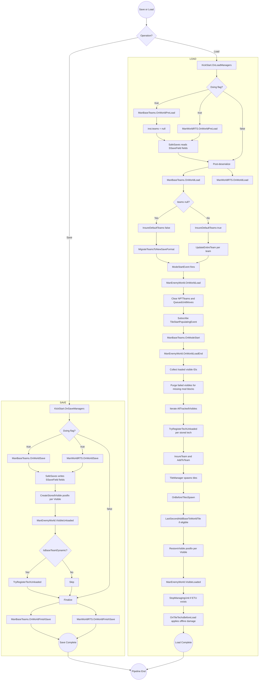

# Pipeline 03: World Load/Save

> **Category:** Initialization & Lifecycle

## Summary

The world load/save pipeline orchestrates persistence and restoration of enemy team metadata, unloaded enemy techs (ETUs / NP_TechUnits), unloaded base units (EBUs), and RTS command state. It bridges TerraTech's vanilla `ManSaveGame` and `ManGameMode` callbacks with TAC_AI state through two cooperating mechanisms:

1. **SafeSaves field serialization** — `[AutoSaveManager]`, `[SSManagerInst]`, and `[SSaveField]` attributes on `ManBaseTeams` and `ManWorldRTS` let SafeSaves write/restore declared fields automatically around vanilla save/load points.
2. **Harmony patches** in `ManagerPatches.ManSaveGamePatches` / `TileManagerPatches` hook `ManSaveGame.CreateStoredVisible`, `StoredTile.RestoreVisible`, and `TileManager.UpdateTileRequestStates` to register/unregister individual visibles and seed natural bases on new tiles.

A central `KickStart.OnLoadManagers(bool Doing)` / `OnSaveManagers(bool Doing)` pair (registered with `ManSafeSaves.RegisterSaveSystem` at [KickStart.cs:511](../Modified/TACtical_AI-master/TACtical_AI-master/TAC_AI/KickStart.cs)) is invoked twice per phase: once before SafeSaves runs (`Doing=true` → pre-load clear / pre-save log) and once after (`Doing=false` → post-load fix-up / post-save log).

## Entry points

| Event | Source | Handler | File:Line |
|---|---|---|---|
| SafeSaves registration | `ManSafeSaves.RegisterSaveSystem` | `KickStart.HookToSafeSaves` | [KickStart.cs:505-517](../Modified/TACtical_AI-master/TACtical_AI-master/TAC_AI/KickStart.cs) |
| Save Phase 1 (Doing=true) | SafeSaves | `KickStart.OnSaveManagers` | [KickStart.cs:957-969](../Modified/TACtical_AI-master/TACtical_AI-master/TAC_AI/KickStart.cs) |
| Load Phase 1 (Doing=true) | SafeSaves | `KickStart.OnLoadManagers` | [KickStart.cs:970-983](../Modified/TACtical_AI-master/TACtical_AI-master/TAC_AI/KickStart.cs) |
| ModeStartEvent | `ManGameMode.ModeStartEvent` | `ManEnemyWorld.OnWorldLoad` | [ManEnemyWorld.cs:299](../Modified/TACtical_AI-master/TACtical_AI-master/TAC_AI/World/ManEnemyWorld.cs) |
| ModeStartEvent (2nd sub) | `ManGameMode.ModeStartEvent` | `ManEnemyWorld.OnWorldLoadEnd` | [ManEnemyWorld.cs:313,319](../Modified/TACtical_AI-master/TACtical_AI-master/TAC_AI/World/ManEnemyWorld.cs) |
| ModeStartEvent | `ManGameMode.ModeStartEvent` | `ManBaseTeams.OnModeStart` | [ManBaseTeams.cs:671](../Modified/TACtical_AI-master/TACtical_AI-master/TAC_AI/World/ManBaseTeams.cs) |
| ModeSwitchEvent | `ManGameMode.ModeSwitchEvent` | `ManBaseTeams.OnModeSwitch` | [ManBaseTeams.cs:661](../Modified/TACtical_AI-master/TACtical_AI-master/TAC_AI/World/ManBaseTeams.cs) |
| TileStartPopulatingEvent | `TileManager.TileStartPopulatingEvent` | `ManEnemyWorld.OnTileTechsBeforeLoad` | [ManEnemyWorld.cs:312,525](../Modified/TACtical_AI-master/TACtical_AI-master/TAC_AI/World/ManEnemyWorld.cs) |
| Visible restored (postfix) | `ManSaveGame.StoredTile.RestoreVisible` | `RestoreVisible_Postfix` → `ManEnemyWorld.VisibleLoaded` | [ManagerPatches.cs:128-133](../Modified/TACtical_AI-master/TACtical_AI-master/TAC_AI/PatchBatch/ManagerPatches.cs) |
| Visible serialized (postfix) | `ManSaveGame.CreateStoredVisible` | `CreateStoredVisible_Postfix` → `ManEnemyWorld.VisibleUnloaded` | [ManagerPatches.cs:134-139](../Modified/TACtical_AI-master/TACtical_AI-master/TAC_AI/PatchBatch/ManagerPatches.cs) |
| Tile spawn request (postfix) | `TileManager.UpdateTileRequestStates` | `UpdateTileRequestStates_Postfix` → `ManEnemyWorld.OnBeforeTilesSpawn` | [ManagerPatches.cs:146-150](../Modified/TACtical_AI-master/TACtical_AI-master/TAC_AI/PatchBatch/ManagerPatches.cs) |

## Flow



## Node reference

### Save path

| Node | File:Line | Purpose |
|---|---|---|
| `OnSaveManagers` | [KickStart.cs:957-969](../Modified/TACtical_AI-master/TACtical_AI-master/TAC_AI/KickStart.cs) | Dispatches `Doing=true` (pre-save log) and `Doing=false` (finalize log) to managers. |
| `OnWorldSave` (Teams) | [ManBaseTeams.cs:1239-1253](../Modified/TACtical_AI-master/TACtical_AI-master/TAC_AI/World/ManBaseTeams.cs) | Logs team count; SafeSaves performs the actual field write around this call. |
| `OnWorldSave` (RTS) | [ManWorldRTS.cs:1507](../Modified/TACtical_AI-master/TACtical_AI-master/TAC_AI/World/ManWorldRTS.cs) | RTS pre-save hook; lazily inits and appends to `UnitGroupsSerial`. |
| `OnWorldFinishSave` (Teams) | [ManBaseTeams.cs:1254-1261](../Modified/TACtical_AI-master/TACtical_AI-master/TAC_AI/World/ManBaseTeams.cs) | Post-write log. |
| `OnWorldFinishSave` (RTS) | [ManWorldRTS.cs:1548](../Modified/TACtical_AI-master/TACtical_AI-master/TAC_AI/World/ManWorldRTS.cs) | Clears and nulls `UnitGroupsSerial` after SafeSaves writes it. |
| `CreateStoredVisible_Postfix` | [ManagerPatches.cs:134-139](../Modified/TACtical_AI-master/TACtical_AI-master/TAC_AI/PatchBatch/ManagerPatches.cs) | Fires once per visible during vanilla serialization. |
| `VisibleUnloaded` | [ManEnemyWorld.cs:423-440](../Modified/TACtical_AI-master/TACtical_AI-master/TAC_AI/World/ManEnemyWorld.cs) | Filters by `IsBaseTeamDynamic`, then calls `TryRegisterTechUnloaded`. |
| `IsBaseTeamDynamic` | [ManBaseTeams.cs:855](../Modified/TACtical_AI-master/TACtical_AI-master/TAC_AI/World/ManBaseTeams.cs) | Team-ID range check (dynamic NPT range). |
| `TryRegisterTechUnloaded` | [ManEnemyWorld.cs:717](../Modified/TACtical_AI-master/TACtical_AI-master/TAC_AI/World/ManEnemyWorld.cs) | Creates `NP_BaseUnit` or `NP_MobileUnit`, registers via `InsureTeam` + `AddToTeam`. |

### Load path

| Node | File:Line | Purpose |
|---|---|---|
| `OnLoadManagers` | [KickStart.cs:970-983](../Modified/TACtical_AI-master/TACtical_AI-master/TAC_AI/KickStart.cs) | Dispatches `Doing=true` (pre-load null teams) and `Doing=false` (post-deser fix-up). |
| `OnWorldPreLoad` (Teams) | [ManBaseTeams.cs:1262-1269](../Modified/TACtical_AI-master/TACtical_AI-master/TAC_AI/World/ManBaseTeams.cs) | Sets `inst.teams = null` so SafeSaves can repopulate. |
| `OnWorldPreLoad` (RTS) | [ManWorldRTS.cs:1563](../Modified/TACtical_AI-master/TACtical_AI-master/TAC_AI/World/ManWorldRTS.cs) | RTS pre-load reset; clears `UnitGroups` per-bucket. |
| `OnWorldLoad` (Teams) | [ManBaseTeams.cs:1270-1301](../Modified/TACtical_AI-master/TACtical_AI-master/TAC_AI/World/ManBaseTeams.cs) | Null-checks `HiddenVisibles` / `seededSpawnCoords`; migrates legacy or calls `UpdateEntireTeam`. |
| `OnWorldLoad` (RTS) | [ManWorldRTS.cs:1575-1611](../Modified/TACtical_AI-master/TACtical_AI-master/TAC_AI/World/ManWorldRTS.cs) | Rebuilds RTS unit groups from `UnitGroupsSerial`. |
| `OnWorldLoad` (Enemy) | [ManEnemyWorld.cs:299-318](../Modified/TACtical_AI-master/TACtical_AI-master/TAC_AI/World/ManEnemyWorld.cs) | Clears `NPTTeams`, `QueuedUnitMoves`; subscribes tile and load-end events. |
| `OnModeStart` | [ManBaseTeams.cs:671-679](../Modified/TACtical_AI-master/TACtical_AI-master/TAC_AI/World/ManBaseTeams.cs) | `InsureDefaultTeams(false)` + `CheckNeedNetworkHooks`. |
| `OnWorldLoadEnd` | [ManEnemyWorld.cs:319-414](../Modified/TACtical_AI-master/TACtical_AI-master/TAC_AI/World/ManEnemyWorld.cs) | Purges failed-restore visibles, iterates `ManVisible.AllTrackedVisibles` and registers unloaded stored techs. |
| `MigrateTeamsToNewSaveFormat` | [ManBaseTeams.cs:1151](../Modified/TACtical_AI-master/TACtical_AI-master/TAC_AI/World/ManBaseTeams.cs) | Scans `m_StoredTiles` / `m_StoredTilesJSON` for legacy team data and constructs `EnemyTeamData`. |
| `InsureDefaultTeams` | [ManBaseTeams.cs:596](../Modified/TACtical_AI-master/TACtical_AI-master/TAC_AI/World/ManBaseTeams.cs) | Creates/validates Player/Enemy/Neutral readonly teams. |
| `SanityCheckIfDefaultTeam` | [ManBaseTeams.cs:627](../Modified/TACtical_AI-master/TACtical_AI-master/TAC_AI/World/ManBaseTeams.cs) | Validates default-team alignment flags. |
| `RestoreVisible_Postfix` | [ManagerPatches.cs:122-127](../Modified/TACtical_AI-master/TACtical_AI-master/TAC_AI/PatchBatch/ManagerPatches.cs) | Calls `VisibleLoaded` for each restored visible. |
| `VisibleLoaded` | [ManEnemyWorld.cs:442-469](../Modified/TACtical_AI-master/TACtical_AI-master/TAC_AI/World/ManEnemyWorld.cs) | Removes from `HiddenVisibles`, applies shields, `StopManagingUnit` (loaded tech ≠ unloaded). |
| `StopManagingUnit` | [ManEnemyWorld.cs:1217](../Modified/TACtical_AI-master/TACtical_AI-master/TAC_AI/World/ManEnemyWorld.cs) | Removes `NP_TechUnit` from `NPTTeams`, unhooks events. |
| `UpdateTileRequestStates_Postfix` | [ManagerPatches.cs:146-150](../Modified/TACtical_AI-master/TACtical_AI-master/TAC_AI/PatchBatch/ManagerPatches.cs) | Forwards new tile-spawn requests. |
| `OnBeforeTilesSpawn` | [ManEnemyWorld.cs:471-524](../Modified/TACtical_AI-master/TACtical_AI-master/TAC_AI/World/ManEnemyWorld.cs) | Deterministic seed of natural bases based on tile coord parity and `seededSpawnCoords` dedup. |
| `LastSecondAddBaseToWorldTile` | [ManEnemyWorld.cs:547](../Modified/TACtical_AI-master/TACtical_AI-master/TAC_AI/World/ManEnemyWorld.cs) | Spawns a new base into `StoredTile` with cached seed. |
| `OnTileTechsBeforeLoad` | [ManEnemyWorld.cs:525-533](../Modified/TACtical_AI-master/TACtical_AI-master/TAC_AI/World/ManEnemyWorld.cs) | Applies accumulated offline damage to unloaded techs in the loading tile. |

## Key data / state

### Serialized fields

`ManBaseTeams` ([ManBaseTeams.cs:479-496](../Modified/TACtical_AI-master/TACtical_AI-master/TAC_AI/World/ManBaseTeams.cs) — `[AutoSaveManager]` on class, `[SSManagerInst]` on `inst`):

```csharp
[SSaveField] Dictionary<int, EnemyTeamData> teams;            // Roster + alignments + HQ
[SSaveField] Dictionary<int, int>           TradingSellOffers; // Per-visible sell offers
[SSaveField] HashSet<int>                   HiddenVisibles;    // Radar-hidden visible IDs
[SSaveField] HashSet<IntVector2>            seededSpawnCoords; // Per-coord dedup for natural bases
[SSaveField] int                            lowTeam;           // Next available NPT team ID counter
```

`ManWorldRTS` ([ManWorldRTS.cs:13-235](../Modified/TACtical_AI-master/TACtical_AI-master/TAC_AI/World/ManWorldRTS.cs) — `[AutoSaveManager]` on class, `[SSManagerInst]` on `inst`):

```csharp
[SSaveField] Dictionary<int, List<CommandLink>> TechMovementQueue;
[SSaveField] List<List<int>>                    UnitGroupsSerial;
```

### Non-persistent / per-session state

- `EnemyTeamData._HQ` ([ManBaseTeams.cs:89-90](../Modified/TACtical_AI-master/TACtical_AI-master/TAC_AI/World/ManBaseTeams.cs)) — not `[SSaveField]`; reconstructed via `SetHQToStrongestOrRandomBase`.
- `EnemyTeamData.angerThreshold` ([ManBaseTeams.cs:94-95](../Modified/TACtical_AI-master/TACtical_AI-master/TAC_AI/World/ManBaseTeams.cs)) — `[JsonIgnore]`; intentionally resets per session.

### Deserialization ordering

1. SafeSaves detects `[AutoSaveManager]` + `[SSManagerInst]` and reserves the `inst` slot.
2. `OnLoadManagers(Doing=true)` nulls `teams` so a stale dict can't pollute deser.
3. SafeSaves populates `[SSaveField]` fields from disk.
4. `OnLoadManagers(Doing=false)` runs `OnWorldLoad`; if `teams` is still null, `MigrateTeamsToNewSaveFormat` reconstructs from legacy `m_StoredTiles` / `m_StoredTilesJSON`.

## Exit points

| Outcome | Marker | File:Line |
|---|---|---|
| Save complete (success) | `OnWorldFinishSave` logs team count | [ManBaseTeams.cs:1254-1261](../Modified/TACtical_AI-master/TACtical_AI-master/TAC_AI/World/ManBaseTeams.cs) |
| Save error (swallowed) | `OnWorldSave` `catch { }` | [ManBaseTeams.cs:1252](../Modified/TACtical_AI-master/TACtical_AI-master/TAC_AI/World/ManBaseTeams.cs) |
| Load complete (success) | `OnWorldLoad` logs "Loaded N teams"; `inst.ready` cleared on mode switch and re-set elsewhere | [ManBaseTeams.cs:1294](../Modified/TACtical_AI-master/TACtical_AI-master/TAC_AI/World/ManBaseTeams.cs) |
| Migration triggered | "Migrating N NPT base teams" log | [ManBaseTeams.cs:1284](../Modified/TACtical_AI-master/TACtical_AI-master/TAC_AI/World/ManBaseTeams.cs) |
| Migration failure | "MigrateTeamsToNewSaveFormat FAILED at N Techs" log | [ManBaseTeams.cs:1235](../Modified/TACtical_AI-master/TACtical_AI-master/TAC_AI/World/ManBaseTeams.cs) |
| `OnWorldLoadEnd` partial-failure | "OnWorldLoadEnd FAILED at N Techs" log | [ManEnemyWorld.cs:412](../Modified/TACtical_AI-master/TACtical_AI-master/TAC_AI/World/ManEnemyWorld.cs) |
| `TryRegisterTechUnloaded` rejected | Returns `false`, tech remains in `m_StoredVisibles` | [ManEnemyWorld.cs:717](../Modified/TACtical_AI-master/TACtical_AI-master/TAC_AI/World/ManEnemyWorld.cs) |
| Mode unsupported | `OnWorldLoad` sets `enabledThis = false` and exits | [ManEnemyWorld.cs:307](../Modified/TACtical_AI-master/TACtical_AI-master/TAC_AI/World/ManEnemyWorld.cs) |

## Cross-pipeline integration

- **Pipeline 01 — Initialization:** `KickStart.HookToSafeSaves` ([KickStart.cs:505](../Modified/TACtical_AI-master/TACtical_AI-master/TAC_AI/KickStart.cs)) registers `OnSaveManagers` / `OnLoadManagers` at startup. `ManBaseTeams.Initiate` and `ManEnemyWorld.Initiate` are called from `MainOfficialInitIterate` ([KickStart.cs:627,641](../Modified/TACtical_AI-master/TACtical_AI-master/TAC_AI/KickStart.cs)).
- **Pipeline — Enemy AI / NPT simulation:** `TryRegisterTechUnloaded`, `InsureTeam`, `AddToTeam`, and `NP_BaseUnit` / `NP_MobileUnit` constructors feed the unloaded-presence simulation that the AI tick consumes.
- **Pipeline — Tile lifecycle:** `OnBeforeTilesSpawn` (natural-base seeding) and `OnTileTechsBeforeLoad` (offline damage) operate on `TileManager` events; `seededSpawnCoords` is the dedup contract between this pipeline and tile recycling.
- **Pipeline — Multiplayer:** `ManBaseTeams.CheckNeedNetworkHooks` ([ManBaseTeams.cs:1365](../Modified/TACtical_AI-master/TACtical_AI-master/TAC_AI/World/ManBaseTeams.cs)) wires team-delta replication to clients when host loads world. Orthogonal to single-player flow.
- **Pipeline — Trading:** `TradingSellOffers` SafeSaves field plus `PickupRecycled` ([ManBaseTeams.cs:498-502](../Modified/TACtical_AI-master/TACtical_AI-master/TAC_AI/World/ManBaseTeams.cs)) reconcile per-visible offers across sessions.
- **Vanilla:** Patches piggyback `ManSaveGame.StoredTile.RestoreVisible`, `ManSaveGame.CreateStoredVisible`, and `TileManager.UpdateTileRequestStates` postfixes.

## Issues

**NONE.**

If a new issue is found in this pipeline, replace `NONE.` above and add it under the matching heading, using a stable ID (`BUG-N`, `DEAD-N`, or `TD-N`) and a clickable `file.cs:line` link. Format:

```text
### Bugs
- **BUG-1 (High | Medium | Low)** - [File.cs:line](path) - what is wrong, and the intended fix.

### Dead code
- **DEAD-1** - [File.cs:line](path) - what is orphaned or unreachable, and why.

### Tech debt
- **TD-1** - [File.cs:line](path) - the smell, and the cleaner shape.
```
