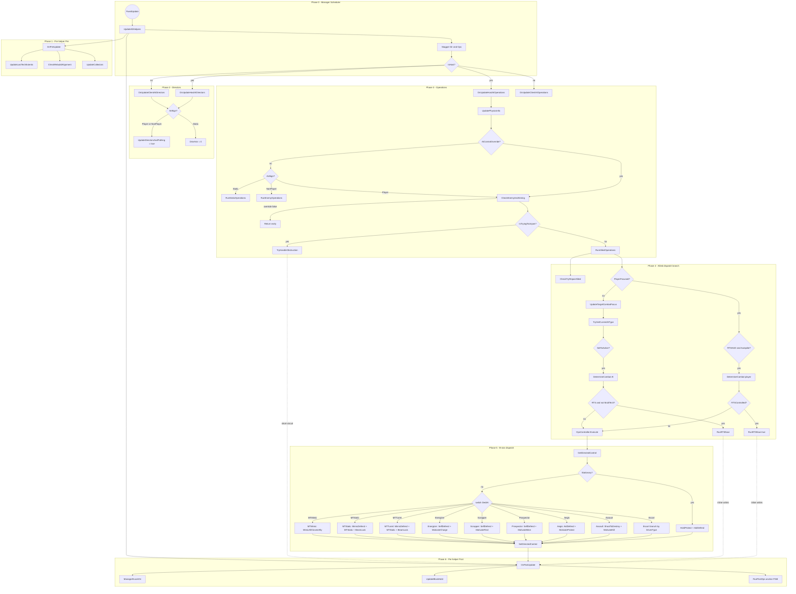
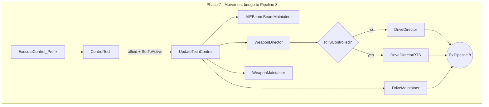

# Pipeline 04: Allied AI Tick

> **Category:** AI Tick & Decision Pipelines
> **Timing:** Operations-clock cadences (target/provoke/validation, anchor counters) catalogued in [21 Timing & Cadence Register](21_timing-cadence.md).

## Summary

The Allied AI tick is the per-fixed-frame AI processing loop for `AIAlignment.Player` techs. It runs from the central `TankAIManager` scheduler down through `TankAIHelper`'s lifecycle phases (Pre / Directors / Operations / Post), branches on alignment, evaluates retreat in `DetermineCombat`, then either runs the RTS override (`RunRTSNavi`) or dispatches through `AlliedOperationsController.Execute` into role-specific `B*` operation modules. The behavior tick is staggered across frames by `KickStart.AIDodgeCheapness` and `KickStart.AIClockPeriod`, while the per-vanilla-frame movement bridge (`ModuleTechController.ExecuteControl_Prefix` -> `ControlTech` -> `UpdateTechControl`) reads the populated `ControlOperator` and hands off to pipeline 8 (`IMovementAIController.DriveDirector` / `DriveMaintainer`).

Scope: allied behavior only. Enemy `RCore.BeEvil` paths, static-base operations, and individual B* implementations are out of scope (pipelines 5, 7, 13).

## Entry points

| Trigger | Entry function | Reference |
|---------|----------------|-----------|
| Unity FixedUpdate, when `!IsPaused && KickStart.EnableBetterAI` | `TankAIManager.FixedUpdate` | [TankAIManager.cs:765](../Modified/TACtical_AI-master/TACtical_AI-master/TAC_AI/AI/TankAIManager.cs) |
| FixedUpdate forwards into helpers loop | `TankAIManager.UpdateAllHelpers` | [TankAIManager.cs:667](../Modified/TACtical_AI-master/TACtical_AI-master/TAC_AI/AI/TankAIManager.cs) |
| Per-helper Pre phase | `TankAIHelper.OnPreUpdate` | [TankAIHelper.cs:3094](../Modified/TACtical_AI-master/TACtical_AI-master/TAC_AI/AI/TankAIHelper.cs) |
| Host-only Directors phase | `TankAIHelper.OnUpdateHostAIDirectors` | [TankAIHelper.cs:3162](../Modified/TACtical_AI-master/TACtical_AI-master/TAC_AI/AI/TankAIHelper.cs) |
| Host-only Operations phase (allied dispatch lives here) | `TankAIHelper.OnUpdateHostAIOperations` | [TankAIHelper.cs:3194](../Modified/TACtical_AI-master/TACtical_AI-master/TAC_AI/AI/TankAIHelper.cs) |
| Client-only Directors phase | `TankAIHelper.OnUpdateClientAIDirectors` | [TankAIHelper.cs:3288](../Modified/TACtical_AI-master/TACtical_AI-master/TAC_AI/AI/TankAIHelper.cs) |
| Client-only Operations phase (speed cache only) | `TankAIHelper.OnUpdateClientAIOperations` | [TankAIHelper.cs:3305](../Modified/TACtical_AI-master/TACtical_AI-master/TAC_AI/AI/TankAIHelper.cs) |
| Per-helper Post phase | `TankAIHelper.OnPostUpdate` | [TankAIHelper.cs:3110](../Modified/TACtical_AI-master/TACtical_AI-master/TAC_AI/AI/TankAIHelper.cs) |
| Per-vanilla-tick movement bridge (Harmony prefix) | `ModuleTechController.ExecuteControl_Prefix` -> `TankAIHelper.ControlTech` | [ModulePatches.cs:236](../Modified/TACtical_AI-master/TACtical_AI-master/TAC_AI/PatchBatch/ModulePatches.cs), [TankAIHelper.cs:2561](../Modified/TACtical_AI-master/TACtical_AI-master/TAC_AI/AI/TankAIHelper.cs) |

The TankAIManager loop is the **behavioral** tick (sets goals, decides "what to do"); the `ControlTech` / `UpdateTechControl` path is the **per-frame movement** tick (executes "how to drive") and is the bridge into pipeline 8.

## Flow

### Behavioral AI tick (Phases 0-6)



### Per-frame movement bridge to Pipeline 8 (Phase 7)



## Node reference

| ID | Description | Reference |
|----|-------------|-----------|
| FU | Physics-tick entry; bails if paused or `!KickStart.EnableBetterAI` | [TankAIManager.cs:765](../Modified/TACtical_AI-master/TACtical_AI-master/TAC_AI/AI/TankAIManager.cs) |
| UAH | Fills `helpersActive` from `AIECore.IterateAllHelpers`, runs Pre/Stagger/Post | [TankAIManager.cs:667](../Modified/TACtical_AI-master/TACtical_AI-master/TAC_AI/AI/TankAIManager.cs) |
| STAG | Two round-robin cursors over `helpersActive`; host vs client picks Host/Client methods | [TankAIManager.cs:694](../Modified/TACtical_AI-master/TACtical_AI-master/TAC_AI/AI/TankAIManager.cs) |
| DPF / OPF | Budget = `helpersActive.Count / KickStart.AIDodgeCheapness` (and AIClockPeriod) accumulators | [TankAIManager.cs:651](../Modified/TACtical_AI-master/TACtical_AI-master/TAC_AI/AI/TankAIManager.cs), [TankAIManager.cs:660](../Modified/TACtical_AI-master/TACtical_AI-master/TAC_AI/AI/TankAIManager.cs) |
| PRE | Recalibrates MovementController if null; refreshes speed; calls Extents/Alignment/Collectors | [TankAIHelper.cs:3094](../Modified/TACtical_AI-master/TACtical_AI-master/TAC_AI/AI/TankAIHelper.cs) |
| EXT | Recomputes block bounds and aggregates MultiTech extents | [TankAIHelper.cs:3118](../Modified/TACtical_AI-master/TACtical_AI-master/TAC_AI/AI/TankAIHelper.cs) |
| CRA | Handles `dirtyAI`; for allied sets `AIAlign = Player` and calls `RefreshAI` | [TankAIHelper.cs:3339](../Modified/TACtical_AI-master/TACtical_AI-master/TAC_AI/AI/TankAIHelper.cs) |
| UPC | UpdateCollectors | [TankAIHelper.cs:5589](../Modified/TACtical_AI-master/TACtical_AI-master/TAC_AI/AI/TankAIHelper.cs) |
| HDIR | Host directors; if `RunState == Advanced && AIAlign == Player`, sets `UpdateDirectorsAndPathing = true`. NonPlayer gated on `enablePainMode`; Static zeroes `DriveVar` | [TankAIHelper.cs:3162](../Modified/TACtical_AI-master/TACtical_AI-master/TAC_AI/AI/TankAIHelper.cs) |
| CDIR | Thinner client variant; sets `UpdateDirectorsAndPathing = true` for both Player and NonPlayer; no `RunState` gating | [TankAIHelper.cs:3288](../Modified/TACtical_AI-master/TACtical_AI-master/TAC_AI/AI/TankAIHelper.cs) |
| SETUP | `UpdateDirectorsAndPathing = true` flag set | [TankAIHelper.cs:3173](../Modified/TACtical_AI-master/TACtical_AI-master/TAC_AI/AI/TankAIHelper.cs) |
| HOPS | Host operations entry; UpdatePhysicsInfo, override check, alignment switch | [TankAIHelper.cs:3194](../Modified/TACtical_AI-master/TACtical_AI-master/TAC_AI/AI/TankAIHelper.cs) |
| COPS | Client operations; only updates `EstTopSped`, no behavior dispatch | [TankAIHelper.cs:3305](../Modified/TACtical_AI-master/TACtical_AI-master/TAC_AI/AI/TankAIHelper.cs) |
| UPI | UpdatePhysicsInfo (called at top of HOPS) | [TankAIHelper.cs:4016](../Modified/TACtical_AI-master/TACtical_AI-master/TAC_AI/AI/TankAIHelper.cs) |
| OVER | `AIControlOverride != null` early-return path; `ExtControlStatus.Operators` verdict | [TankAIHelper.cs:3199](../Modified/TACtical_AI-master/TACtical_AI-master/TAC_AI/AI/TankAIHelper.cs) |
| CEA | 0.6s validation tick: drops dead/non-enemy targets, LOS hysteresis (2-streak), 1.5x MaxCombatRange hysteresis | [TankAIHelper.cs:4403](../Modified/TACtical_AI-master/TACtical_AI-master/TAC_AI/AI/TankAIHelper.cs) |
| THO | Jam-recovery path used when `IsTryingToUnjam` | [TankAIHelper.cs:4126](../Modified/TACtical_AI-master/TACtical_AI-master/TAC_AI/AI/TankAIHelper.cs) |
| RAO | Core allied-only branch (PlayerFocused vs AI-autonomous) | [TankAIHelper.cs:2748](../Modified/TACtical_AI-master/TACtical_AI-master/TAC_AI/AI/TankAIHelper.cs) |
| CTRA | CheckTryRepairAllied | [TankAIHelper.cs:5657](../Modified/TACtical_AI-master/TACtical_AI-master/TAC_AI/AI/TankAIHelper.cs) |
| PFOC | `tank.PlayerFocused?` branch | [TankAIHelper.cs:2759](../Modified/TACtical_AI-master/TACtical_AI-master/TAC_AI/AI/TankAIHelper.cs) |
| AUTO | `AllowPlayerRTSHUD && AutopilotPlayer?` gate | [TankAIHelper.cs:2762](../Modified/TACtical_AI-master/TACtical_AI-master/TAC_AI/AI/TankAIHelper.cs) |
| DC1 | `DetermineCombat` (player-focused autopilot path) | [TankAIHelper.cs:2776](../Modified/TACtical_AI-master/TACtical_AI-master/TAC_AI/AI/TankAIHelper.cs) |
| RTSCHK1 / RTS1 | If RTSControlled call `RunRTSNavi(true)`, else `OpsController.Execute` | [TankAIHelper.cs:2777](../Modified/TACtical_AI-master/TACtical_AI-master/TAC_AI/AI/TankAIHelper.cs), [TankAIHelper.cs:2780](../Modified/TACtical_AI-master/TACtical_AI-master/TAC_AI/AI/TankAIHelper.cs) |
| UTCF | Decays `Provoked`; if no provoke, releases out-of-range targets via `EndPursuit` | [TankAIHelper.cs:4496](../Modified/TACtical_AI-master/TACtical_AI-master/TAC_AI/AI/TankAIHelper.cs) |
| AITY | `aI.TryGetCurrentAIType(out lastAIType)` | [TankAIHelper.cs:2790](../Modified/TACtical_AI-master/TACtical_AI-master/TAC_AI/AI/TankAIHelper.cs) |
| ACTIVE | `SetToActive` (lastAIType != Idle) gate | [TankAIHelper.cs:2795](../Modified/TACtical_AI-master/TACtical_AI-master/TAC_AI/AI/TankAIHelper.cs) |
| DC2 | `DetermineCombat` (AI-autonomous path); retreat decision only | [TankAIHelper.cs:2802](../Modified/TACtical_AI-master/TACtical_AI-master/TAC_AI/AI/TankAIHelper.cs) |
| RTSCHK2 / RTS2 | `RTSControlled && !IsMultiTech` -> RunRTSNavi; else OpsController.Execute | [TankAIHelper.cs:2804](../Modified/TACtical_AI-master/TACtical_AI-master/TAC_AI/AI/TankAIHelper.cs), [TankAIHelper.cs:2806](../Modified/TACtical_AI-master/TACtical_AI-master/TAC_AI/AI/TankAIHelper.cs) |
| DetermineCombat | Retreat decision; sets `Retreat = DoNotEngage`; does NOT acquire targets | [TankAIHelper.cs:4524](../Modified/TACtical_AI-master/TACtical_AI-master/TAC_AI/AI/TankAIHelper.cs) |
| OpsController | Lazy-instantiated `AlliedOperationsController` (created on first access) | [TankAIHelper.cs:54](../Modified/TACtical_AI-master/TACtical_AI-master/TAC_AI/AI/TankAIHelper.cs) |
| OPEX | `AlliedOperationsController.Execute` dispatch hub | [AlliedOperationsController.cs:35](../Modified/TACtical_AI-master/TACtical_AI-master/TAC_AI/AI/AlliedOperations/AlliedOperationsController.cs) |
| GDC | `helper.GetDirectedControl()` reads `EControlOperatorSet` from `ControlOperator` | [AlliedOperationsController.cs:37](../Modified/TACtical_AI-master/TACtical_AI-master/TAC_AI/AI/AlliedOperations/AlliedOperationsController.cs), [TankAIHelper.cs:390](../Modified/TACtical_AI-master/TACtical_AI-master/TAC_AI/AI/TankAIHelper.cs) |
| STATSW / STATBR | Stationary -> `BBase.HoldProtect + BGeneral.AidDefend` (commented Assault sub-branch is dead) | [AlliedOperationsController.cs:38](../Modified/TACtical_AI-master/TACtical_AI-master/TAC_AI/AI/AlliedOperations/AlliedOperationsController.cs), [AlliedOperationsController.cs:47-50](../Modified/TACtical_AI-master/TACtical_AI-master/TAC_AI/AI/AlliedOperations/AlliedOperationsController.cs) |
| BESC | Escort branch; nested `switch (DriverType)`: Tank / Astronaut / Sailor / Pilot / Stationary / AutoSet / default | [AlliedOperationsController.cs:57-97](../Modified/TACtical_AI-master/TACtical_AI-master/TAC_AI/AI/AlliedOperations/AlliedOperationsController.cs) |
| BASS | `BAssassin.ShootToDestroy + MotivateKill` | [AlliedOperationsController.cs:98-101](../Modified/TACtical_AI-master/TACtical_AI-master/TAC_AI/AI/AlliedOperations/AlliedOperationsController.cs) |
| BAEG | `BGeneral.AidDefend + BAegis.MotivateProtect` | [AlliedOperationsController.cs:103-107](../Modified/TACtical_AI-master/TACtical_AI-master/TAC_AI/AI/AlliedOperations/AlliedOperationsController.cs) |
| BPRO | `BGeneral.SelfDefend + BProspector.MotivateMine` | [AlliedOperationsController.cs:109-112](../Modified/TACtical_AI-master/TACtical_AI-master/TAC_AI/AI/AlliedOperations/AlliedOperationsController.cs) |
| BSCR | `BGeneral.SelfDefend + BScrapper.MotivateFind` | [AlliedOperationsController.cs:114-117](../Modified/TACtical_AI-master/TACtical_AI-master/TAC_AI/AI/AlliedOperations/AlliedOperationsController.cs) |
| BENE | `BGeneral.SelfDefend + BEnergizer.MotivateCharge` | [AlliedOperationsController.cs:119-122](../Modified/TACtical_AI-master/TACtical_AI-master/TAC_AI/AI/AlliedOperations/AlliedOperationsController.cs) |
| BMT1 | MTTurret -> `BMultiTech.MimicDefend + MTStatic + BeamLockWithinBounds` | [AlliedOperationsController.cs:124-130](../Modified/TACtical_AI-master/TACtical_AI-master/TAC_AI/AI/AlliedOperations/AlliedOperationsController.cs) |
| BMT2 | MTStatic -> `BMultiTech.MimicDefend + MTStatic + BeamLockWithinBounds` | [AlliedOperationsController.cs:132-135](../Modified/TACtical_AI-master/TACtical_AI-master/TAC_AI/AI/AlliedOperations/AlliedOperationsController.cs) |
| BMT3 | MTMimic -> `BMultiTech.MimicAllClosestAlly` | [AlliedOperationsController.cs:138-140](../Modified/TACtical_AI-master/TACtical_AI-master/TAC_AI/AI/AlliedOperations/AlliedOperationsController.cs) |
| SDC | `helper.SetDirectedControl(direct)` commits `EControlOperatorSet` back into `ControlOperator` | [AlliedOperationsController.cs:149](../Modified/TACtical_AI-master/TACtical_AI-master/TAC_AI/AI/AlliedOperations/AlliedOperationsController.cs), [TankAIHelper.cs:390](../Modified/TACtical_AI-master/TACtical_AI-master/TAC_AI/AI/TankAIHelper.cs) |
| RTS-NAVI | `RunRTSNavi` (RTS override; bypasses AlliedOperationsController; calls `BGeneral.ResetValues` + `BGeneral.RTSCombat`) | [TankAIHelper.cs:2806](../Modified/TACtical_AI-master/TACtical_AI-master/TAC_AI/AI/TankAIHelper.cs) |
| POST | `OnPostUpdate`; runs after all helpers' operations | [TankAIHelper.cs:3110](../Modified/TACtical_AI-master/TACtical_AI-master/TAC_AI/AI/TankAIHelper.cs) |
| MLO | ManageAILockOn | [TankAIHelper.cs:5072](../Modified/TACtical_AI-master/TACtical_AI-master/TAC_AI/AI/TankAIHelper.cs) |
| UBH | UpdateBlockHold | [TankAIHelper.cs:5339](../Modified/TACtical_AI-master/TACtical_AI-master/TAC_AI/AI/TankAIHelper.cs) |
| RPO | RunPostOps anchor FSM; dispatches `AIAnchorState.{Anchor,AnchorAuto,AnchorStaticAI,ForceAnchor,Unanchor}` | [TankAIHelper.cs:3460](../Modified/TACtical_AI-master/TACtical_AI-master/TAC_AI/AI/TankAIHelper.cs) |
| VANILLA | Harmony prefix on vanilla `ModuleTechController.ExecuteControl`; if `ControlTech` returns true, vanilla path is suppressed | [ModulePatches.cs:236](../Modified/TACtical_AI-master/TACtical_AI-master/TAC_AI/PatchBatch/ModulePatches.cs) |
| CTRL | Gates `UpdateTechControl`; allied path returns true when `RunState == Advanced && AIAlign == Player && SetToActive` | [TankAIHelper.cs:2561](../Modified/TACtical_AI-master/TACtical_AI-master/TAC_AI/AI/TankAIHelper.cs) |
| UTC | Per-frame work: BeamMaintainer, optional WeaponDirector + DriveDirector(RTS), then WeaponMaintainer + DriveMaintainer | [TankAIHelper.cs:2748](../Modified/TACtical_AI-master/TACtical_AI-master/TAC_AI/AI/TankAIHelper.cs) |
| BEAM | `AIEBeam.BeamMaintainer` | [TankAIHelper.cs:2688](../Modified/TACtical_AI-master/TACtical_AI-master/TAC_AI/AI/TankAIHelper.cs) |
| WD | `AIEWeapons.WeaponDirector` (gated on `UpdateDirectorsAndPathing`) | [TankAIHelper.cs:2694](../Modified/TACtical_AI-master/TACtical_AI-master/TAC_AI/AI/TankAIHelper.cs) |
| DD / DDRTS | `MovementController.DriveDirector` / `DriveDirectorRTS` (RTS gated) | [TankAIHelper.cs:2710](../Modified/TACtical_AI-master/TACtical_AI-master/TAC_AI/AI/TankAIHelper.cs), [TankAIHelper.cs:2780](../Modified/TACtical_AI-master/TACtical_AI-master/TAC_AI/AI/TankAIHelper.cs) |
| WM | `AIEWeapons.WeaponMaintainer` (when `NotInBeam`) | [TankAIHelper.cs:2726](../Modified/TACtical_AI-master/TACtical_AI-master/TAC_AI/AI/TankAIHelper.cs) |
| DM | `MovementController.DriveMaintainer(ref ControlCore)` (every frame when `NotInBeam`) | [TankAIHelper.cs:2734](../Modified/TACtical_AI-master/TACtical_AI-master/TAC_AI/AI/TankAIHelper.cs) |
| HANDOFF | `IMovementAIController.DriveDirector / DriveDirectorRTS / DriveMaintainer` interface edge | [IMovementAIController.cs:37-41](../Modified/TACtical_AI-master/TACtical_AI-master/TAC_AI/AI/Movement/IMovementAIController.cs) |

### Phase scheduling

The behavior tick is **staggered** across frames. Directors and Operations are NOT executed in the same frame for all techs:

- **Directors budget** (collision avoidance setup) = `helpersActive.Count / KickStart.AIDodgeCheapness` per frame
- **Operations budget** (behavior dispatch) = `helpersActive.Count / KickStart.AIClockPeriod` per frame
- **Two independent round-robin cursors** (`clockHelperStepDirectors`, `clockHelperStepOperations`) advance through `helpersActive`

This is why `DetermineCombat` may run one tick but `OpsController.Execute` the next.

## Key data / state

- `TankAIHelper.ControlOperator` (`EControlOperatorSet`) -- the **handoff bus** between behavior dispatch (B* modules / RTS / Obstruction) and movement execution (`UpdateTechControl`). Read by `GetDirectedControl`, written by `SetDirectedControl`.
- `TankAIHelper.ControlCore` (`EControlCoreSet`) -- accessor via `SetCoreControl` ([TankAIHelper.cs:409](../Modified/TACtical_AI-master/TACtical_AI-master/TAC_AI/AI/TankAIHelper.cs)); `UpdateTechControl` writes it from `MovementController.DriveDirector(ref coreCont)`.
- `AIAlignment` enum -- `Player` (allied; this pipeline), `NonPlayer` (enemy -> pipeline 5), `Static` (base structures -> pipeline 7).
- `AIType` enum -- Escort, Assault, Aegis, Prospector, Scrapper, Energizer, MTTurret, MTStatic, MTMimic (used in `DediAI` switch).
- `AIDriverType` enum -- Tank, Astronaut, Sailor, Pilot, Stationary, AutoSet (used in Escort nested switch).
- `helpersActive` -- per-frame list of TankAIHelper instances built from `AIECore.IterateAllHelpers`.
- `lastAIType` -- cached `AITreeType.AITypes`; set to `Idle` when `TryGetCurrentAIType` fails.
- `IsMultiTech` flag -- set from `DediAI` in `MTTurret`/`MTStatic`/`MTMimic` cases at top of `OnUpdateHostAIOperations`.
- `UpdateDirectorsAndPathing` flag -- set by Directors phase, consumed (and cleared) by `UpdateTechControl`.

## Exit points

There is **no direct procedural call** from the allied behavior pipeline into pipeline 8. The two pipelines share `ControlOperator` as the handoff buffer; the bridge fires at vanilla update cadence (not the staggered behavior cadence), so `ControlOperator` may be **stale by many frames** when `DriveDirector` reads it. The design relies on a "set goal, drive towards goal" loop rather than a tight per-frame closed loop.

| Exit | Site | Reference |
|------|------|-----------|
| `MovementController.DriveDirector(ref coreCont)` (non-RTS) | `UpdateTechControl` | [TankAIHelper.cs:2710](../Modified/TACtical_AI-master/TACtical_AI-master/TAC_AI/AI/TankAIHelper.cs) |
| `MovementController.DriveDirectorRTS(ref coreCont)` (RTS) | `UpdateTechControl` | [TankAIHelper.cs:2780](../Modified/TACtical_AI-master/TACtical_AI-master/TAC_AI/AI/TankAIHelper.cs) |
| `MovementController.DriveMaintainer(ref ControlCore)` (every frame when `NotInBeam`) | `UpdateTechControl` | [TankAIHelper.cs:2734](../Modified/TACtical_AI-master/TACtical_AI-master/TAC_AI/AI/TankAIHelper.cs) |
| `IMovementAIController` interface boundary | `AIControllerDefault` / `AIControllerAir` / `AIControllerStatic` forward to `IMovementAICore` (`Land/Vehicle/Sea/Space/Airplane/Helicopter/Vtol/Static`) | [IMovementAIController.cs:37-41](../Modified/TACtical_AI-master/TACtical_AI-master/TAC_AI/AI/Movement/IMovementAIController.cs) |

## Cross-pipeline integration

### Inbound

- Pipeline 02 (TankAIHelper lifecycle): `OnSpawn` / dirty-AI rebuild triggers `CheckRebuildAlignment` -> sets `AIAlign = Player`, which routes this tick to the allied branch.
- Pipeline 11 (rebuild/repair): invoked via `CheckTryRepairAllied` at the top of `RunAlliedOperations`.

### Outbound

- Pipeline 08 (AICore drive): consumes `ControlOperator` via `DriveDirector` / `DriveDirectorRTS` / `DriveMaintainer` (see Exit points).
- Pipeline 09 (stuck / unjam): `IsTryingToUnjam` branch diverts to `TryHandleObstruction` ([TankAIHelper.cs:4126](../Modified/TACtical_AI-master/TACtical_AI-master/TAC_AI/AI/TankAIHelper.cs)) before allied dispatch.
- Pipeline 13 (B* operation implementations): every `B*` call from `AlliedOperationsController.Execute` is a downstream entry into pipeline 13.
- Pipeline 07 (combat FSM): `DetermineCombat` reads `lastBasePos` / `lastPlayer` / `DamageThreshold` from combat state; `CheckEnemyAndAiming` mutates lock-on state.

### Patched by

- `ModuleTechController.ExecuteControl_Prefix` ([ModulePatches.cs:236](../Modified/TACtical_AI-master/TACtical_AI-master/TAC_AI/PatchBatch/ModulePatches.cs)) -- Harmony prefix that hijacks vanilla execution, calling `TankAIHelper.ControlTech` and suppressing the vanilla path on success. This is the **per-frame movement bridge** that drives `UpdateTechControl` -> pipeline 8.
- `GlobalPatches.TechAIPatches.ControlTech_Prefix` ([GlobalPatches.cs:270](../Modified/TACtical_AI-master/TACtical_AI-master/TAC_AI/PatchBatch/GlobalPatches.cs)) -- a **different** ControlTech prefix on vanilla `TechAI`; suppresses vanilla AI tree execution when `RunState != Default`. Distinct class/method despite the name overlap.

## Issues

**NONE.**

If a new issue is found in this pipeline, replace `NONE.` above and add it under the matching heading, using a stable ID (`BUG-N`, `DEAD-N`, or `TD-N`) and a clickable `file.cs:line` link. Format:

```text
### Bugs
- **BUG-1 (High | Medium | Low)** - [File.cs:line](path) - what is wrong, and the intended fix.

### Dead code
- **DEAD-1** - [File.cs:line](path) - what is orphaned or unreachable, and why.

### Tech debt
- **TD-1** - [File.cs:line](path) - the smell, and the cleaner shape.
```
