# Enemy AI Tick Pipeline

> **Category:** AI Tick & Decision Pipelines
> **Timing:** Operations-clock cadences (Provoke, WeaponDelayClock, idle actionPause) catalogued in [21 Timing & Cadence Register](21_timing-cadence.md).

## Summary

This pipeline maps the per-tick processing for enemy techs (`AIAlignment.NonPlayer`) in TAC AI. It begins in [TankAIHelper.cs:3341](../Modified/TACtical_AI-master/TACtical_AI-master/TAC_AI/AI/TankAIHelper.cs) (`OnUpdateHostAIOperations`), branches by `AIAlign`, gates on `KickStart.enablePainMode`, then forks on `RunState` into a light path (`RunEnemyOperations(true)` -> [RCore.BeEvilLight at RCore.cs:612](../Modified/TACtical_AI-master/TACtical_AI-master/TAC_AI/Enemy/RCore.cs)) or a full path (`RunEnemyOperations(false)` -> [RCore.BeEvil at RCore.cs:604](../Modified/TACtical_AI-master/TACtical_AI-master/TAC_AI/Enemy/RCore.cs)). The full path runs anchor-force, `RBolts.ManageBolts`, `TestShouldCommitDie`, conditional repair stepping, `Provoked` decay (with `EndAggro` when out of range), then a `CommanderAlignment` stance switch. Hostile / SubNeutral(when provoked) / Friendly stances funnel through [CombatChecking at RCore.cs:743](../Modified/TACtical_AI-master/TACtical_AI-master/TAC_AI/Enemy/RCore.cs) for aiming hand-off. Movement dispatches via `mind.EnemyOpsController.Execute` (or `helper.RunRTSNaviEnemy` when RTS-controlled) into a locomotion `R*` handler keyed off `mind.EvilCommander`. When no target is held, the locomotion handler falls through to [RGeneral.LollyGag at RGeneral.cs:39](../Modified/TACtical_AI-master/TACtical_AI-master/TAC_AI/Enemy/RGeneral.cs) which secondary-dispatches on `CommanderMind` to idle behaviors (`RMiner`, `RScavenger`, `RGuardian`, `BMultiTech`). The per-tick output is committed via `helper.SetDirectedControl(direct)` ([EnemyOperationsController.cs:48](../Modified/TACtical_AI-master/TACtical_AI-master/TAC_AI/Enemy/EnemyOperations/EnemyOperationsController.cs)), after which pipeline 8 (AICore drive) consumes `ControlOperator`.

Pipeline 5 stops at the `SetDirectedControl` commit and `EnemyOperationsController.Execute` return. Combat-aiming terminals are boundary hand-offs to pipeline 7 (Combat FSM). The body of each `Attack*` handler is treated as opaque and deferred to pipeline 13.

---

## Entry points

| Trigger | Method | File:Line | Condition |
|---|---|---|---|
| Per-tick host AI dispatch | `TankAIHelper.OnUpdateHostAIOperations` | [TankAIHelper.cs:3341](../Modified/TACtical_AI-master/TACtical_AI-master/TAC_AI/AI/TankAIHelper.cs) | Host-side AI tick |
| Physics cache | `UpdatePhysicsInfo` | [TankAIHelper.cs:3345](../Modified/TACtical_AI-master/TACtical_AI-master/TAC_AI/AI/TankAIHelper.cs) | Always (velocity, bounds, heading) |
| NonPlayer alignment branch | `switch (AIAlign) case NonPlayer` | [TankAIHelper.cs:3377](../Modified/TACtical_AI-master/TACtical_AI-master/TAC_AI/AI/TankAIHelper.cs) | `KickStart.enablePainMode == true` |
| Light tick (Default RunState) | `RunEnemyOperations(light:true)` | [TankAIHelper.cs:3396](../Modified/TACtical_AI-master/TACtical_AI-master/TAC_AI/AI/TankAIHelper.cs) | `RunState == AIRunState.Default && !IsTryingToUnjam` |
| Full tick (Advanced RunState) | `RunEnemyOperations()` | [TankAIHelper.cs:3410](../Modified/TACtical_AI-master/TACtical_AI-master/TAC_AI/AI/TankAIHelper.cs) | `RunState == AIRunState.Advanced && !IsTryingToUnjam` |
| Unjam recovery (both states) | `TryHandleObstruction + RCore.ScarePlayer` | [TankAIHelper.cs:3389, 3403](../Modified/TACtical_AI-master/TACtical_AI-master/TAC_AI/AI/TankAIHelper.cs) | `IsTryingToUnjam == true` |
| Light core | `RCore.BeEvilLight` | [RCore.cs:612](../Modified/TACtical_AI-master/TACtical_AI-master/TAC_AI/Enemy/RCore.cs) | Called from `RunEnemyOperations(true)` |
| Full core | `RCore.BeEvil` | [RCore.cs:604](../Modified/TACtical_AI-master/TACtical_AI-master/TAC_AI/Enemy/RCore.cs) | Called from `RunEnemyOperations(false)` |
| Static fallback | `RunStaticOperations` | [TankAIHelper.cs:3417](../Modified/TACtical_AI-master/TACtical_AI-master/TAC_AI/AI/TankAIHelper.cs) | `AIAlign` is neither Player nor NonPlayer |

---

## Flow

```mermaid
graph TD
    TICK((OnUpdateHostAIOperations))

    subgraph Phase1[Phase 1 - Alignment Dispatch]
        TICK --> PHYS[UpdatePhysicsInfo]
        PHYS --> OVR{AIControlOverride?}
        OVR -->|Yes| CHK_OVR[CheckEnemyAndAiming]
        OVR -->|No| ALIGN{switch AIAlign}
        CHK_OVR --> ALIGN
        ALIGN -->|Player| HANDOFF_ALLIED[RunAlliedOperations - pipeline 4]
        ALIGN -->|Static / default| STATIC[RunStaticOperations]
        ALIGN -->|NonPlayer| PAIN{enablePainMode?}
        PAIN -->|No| EXIT_SKIP[no-op]
        PAIN -->|Yes| RUNSTATE{switch RunState}
    end

    subgraph Phase2[Phase 2 - RunState Branch]
        RUNSTATE -->|Off| EXIT_OFF[no-op]
        RUNSTATE -->|Default| DEF_CHK[CheckEnemyAndAiming if not override]
        RUNSTATE -->|Advanced| ADV_CHK[CheckEnemyAndAiming if not override]
        DEF_CHK --> DEF_JAM{IsTryingToUnjam?}
        ADV_CHK --> ADV_JAM{IsTryingToUnjam?}
        DEF_JAM -->|Yes| UNJAM_L[TryHandleObstruction + ScarePlayer]
        ADV_JAM -->|Yes| UNJAM_A[TryHandleObstruction + ScarePlayer]
        DEF_JAM -->|No| RUN_LIGHT[RunEnemyOperations light=true]
        ADV_JAM -->|No| RUN_FULL[RunEnemyOperations light=false]
        UNJAM_L --> COMMIT
        UNJAM_A --> COMMIT
    end

    subgraph Phase3[Phase 3 - RunEnemyOperations Wrapper]
        RUN_LIGHT --> WRAP[DetermineRetreatPostureEnemy sets Retreat]
        RUN_FULL --> WRAP
        WRAP --> DETCOMBAT[ActionPause now decrements in OnPreUpdate - P04 B9]
        DETCOMBAT --> COREFORK{light?}
        COREFORK -->|true| BEEVILLIGHT[RCore.BeEvilLight]
        COREFORK -->|false| BEEVIL[RCore.BeEvil]
    end

    subgraph Phase4[Phase 4 - Core Mind Resolution]
        BEEVIL --> ENSURE[EnsureEnemyMind - shared helper]
        BEEVILLIGHT --> ENSURE
        ENSURE --> MINDCHK{Mind null?}
        MINDCHK -->|Null| EXIT_MIND[silent return - no ScarePlayer]
        MINDCHK -->|Ok| FORK{from BeEvilLight?}
        FORK -->|Yes| RUNLIGHTOP[RunLightEvilOp]
        FORK -->|No| RUNEVIL[RunEvilOperations]
    end

    subgraph Phase5a[Phase 5a - Light Tick Path]
        RUNLIGHTOP --> L_ANCH{StartedAnchored?}
        L_ANCH -->|Yes| L_FORCESTAT[EvilCommander = Stationary + Anchor]
        L_ANCH -->|No| L_REPAIR
        L_FORCESTAT --> L_REPAIR[EnemyRepairStepper if allowed]
        L_REPAIR --> L_STANCE{switch CommanderAlignment}
        L_STANCE -->|Enemy| L_HOSTILE[BeHostile]
        L_STANCE -->|SubNeutral| L_SUBN[BeSubNeutral]
        L_STANCE -->|Neutral| L_NEUT[BeNeutral]
        L_STANCE -->|Friendly| L_FRIE[BeFriendly]
        L_HOSTILE --> SCARE_L[ScarePlayer]
        L_SUBN --> SCARE_L
        L_NEUT --> SCARE_L
        L_FRIE --> SCARE_L
        SCARE_L --> COMMIT
    end

    subgraph Phase5b[Phase 5b - Full Tick Path]
        RUNEVIL --> F_ANCH{StartedAnchored?}
        F_ANCH -->|Yes| F_FORCESTAT[Force Stationary + Anchor]
        F_ANCH -->|No| F_BOLTS
        F_FORCESTAT --> F_BOLTS[RBolts.ManageBolts]
        F_BOLTS --> F_DIE[TestShouldCommitDie]
        F_DIE --> F_REPAIR[EnemyRepairStepper if allowed]
        F_REPAIR --> F_PROVOKE{Provoked le 0?}
        F_PROVOKE -->|Yes| F_AGGRO_END[EndAggro if out of range]
        F_PROVOKE -->|No| F_PROVDECAY[Decrement Provoked]
        F_AGGRO_END --> F_STANCE
        F_PROVDECAY --> F_STANCE{switch CommanderAlignment}
        F_STANCE -->|Enemy| F_HOSTILE[BeHostile]
        F_STANCE -->|SubNeutral| F_SUBN[BeSubNeutral]
        F_STANCE -->|Neutral| F_NEUT[BeNeutral]
        F_STANCE -->|Friendly| F_FRIE[BeFriendly]
    end

    subgraph Phase6[Phase 6 - Combat Checking - aiming hand-off]
        F_HOSTILE --> CCHECK[CombatChecking]
        F_SUBN -->|Provoked gt 0| CCHECK
        F_FRIE --> CCHECK
        F_SUBN -->|SubNeutral curious| F_MONITOR[RGeneral.Monitor]
        F_NEUT --> F_NEUTDECIDE[Hit-back DegradeRelations / EndPursuit]
        CCHECK --> CCFORK{switch EvilCommander}
        CCFORK -->|Airplane| C_AIR[RAircraft.EnemyDogfighting]
        CCFORK -->|Stationary| C_BASE[RGeneral.BaseAttack]
        CCFORK -->|default| CMATTACK{switch CommanderAttack}
        CMATTACK -->|Safety| C_SELF[RGeneral.SelfDefense]
        CMATTACK -->|Ranged| C_AIM[RGeneral.AimAttack]
        CMATTACK -->|Chase / default| C_AID[RGeneral.AidAttack]
        C_AIR --> POSTCC
        C_BASE --> POSTCC
        C_SELF --> POSTCC
        C_AIM --> POSTCC
        C_AID --> POSTCC
        F_MONITOR --> POSTCC
        F_NEUTDECIDE --> POSTCC
        POSTCC[Aiming decided - pipeline 7 hand-off]
    end

    subgraph Phase7[Phase 7 - Movement Dispatch]
        POSTCC --> RTSGATE{RTSControlled and not MultiTech?}
        RTSGATE -->|Yes| RTSEN[helper.RunRTSNaviEnemy]
        RTSGATE -->|No| OPSEXEC[EnemyOpsController.Execute]
        OPSEXEC --> GETDIR[GetDirectedControl]
        GETDIR --> DISPATCH{switch EvilCommander}
        DISPATCH -->|Wheeled| OP_WH[RWheeled.AttackVroom]
        DISPATCH -->|Airplane| OP_AIR[RAircraft.AttackWoosh]
        DISPATCH -->|Chopper| OP_CHOP[RChopper.AttackShwa]
        DISPATCH -->|Starship| OP_STAR[RStarship.AttackZoom]
        DISPATCH -->|Naval| OP_NAV[RNaval.AttackWhish]
        DISPATCH -->|SuicideMissile| OP_MISS[RCrashMissile.AttackCrash]
        DISPATCH -->|Stationary| OP_STAT[RStation.AttackWham]
    end

    subgraph Phase8[Phase 8 - LollyGag Fallback - no target]
        OP_WH -.->|lastEnemyGet null| LOLLY[RGeneral.LollyGag]
        OP_AIR -.->|lastEnemyGet null| LOLLYAIR[RAircraft.LollyGagAir]
        OP_CHOP -.->|lastEnemyGet null| LOLLY
        OP_NAV -.->|lastEnemyGet null| LOLLY
        OP_STAR -.->|lastEnemyGet null| LOLLY
        OP_MISS -.->|lastEnemyGet null| LOLLY
        LOLLY --> LH_HURT{Hurt and Smarts?}
        LH_HURT -->|Heal| LH_HEAL[FetchChargedChargers / Anchor / EnemyInstaRepair]
        LH_HURT -->|Continue| LH_HOLD{holdGround?}
        LH_HOLD -->|Yes| LH_HOLDPOS[SetLastDest sceneStationaryPos]
        LH_HOLD -->|No| LH_MIND{switch CommanderMind}
        LH_MIND -->|Default| LH_DEF[DefaultIdle]
        LH_MIND -->|Homing| LH_HOM[HomingIdle]
        LH_MIND -->|Miner / NPCBaseHost| LH_MINE[RMiner.MineYerOwnBusiness]
        LH_MIND -->|Boss / Junker| LH_SCAV[RScavenger.Scavenge]
        LH_MIND -->|Guardian| LH_GUARD[RGuardian.MotivateDefend]
        LH_MIND -->|PartTurret / PartStatic| LH_MT[BMultiTech.MimicDefend / MTStatic]
        LH_MIND -->|PartMimic| LH_MIM[BMultiTech.MimicAllClosestAlly]
        LH_HEAL --> COMMIT
        LH_HOLDPOS --> COMMIT
        LH_DEF --> COMMIT
        LH_HOM --> COMMIT
        LH_MINE --> COMMIT
        LH_SCAV --> COMMIT
        LH_GUARD --> COMMIT
        LH_MT --> COMMIT
        LH_MIM --> COMMIT
        LOLLYAIR --> COMMIT
    end

    subgraph Phase9[Phase 9 - Commit and Post-tick]
        OP_WH --> POSTRETREAT[Retreat override - GetRetreatLocation]
        OP_AIR --> POSTRETREAT
        OP_CHOP --> POSTRETREAT
        OP_STAR --> POSTRETREAT
        OP_NAV --> POSTRETREAT
        OP_MISS --> POSTRETREAT
        OP_STAT --> POSTRETREAT
        RTSEN --> POSTRETREAT
        POSTRETREAT --> COMMIT[helper.SetDirectedControl]
        COMMIT --> DYNTEAM{IsBaseTeamDynamic?}
        DYNTEAM -->|Yes| DYN_PROC[ProcessIfRetreat then SetDirectedControl]
        DYNTEAM -->|No| SCARE_F
        DYN_PROC --> SCARE_F[ScarePlayer final]
        SCARE_F --> HANDOFF((Pipeline 8 AICore drive))
    end

    EXIT_SKIP --> HANDOFF
    EXIT_OFF --> HANDOFF
    STATIC --> HANDOFF
    HANDOFF_ALLIED --> HANDOFF
```



---

## Node reference

| Node | Purpose | File:Line |
|---|---|---|
| `OnUpdateHostAIOperations` | Host-side per-tick ops entrypoint; switches on `AIAlign` then `RunState`. | [TankAIHelper.cs:3341](../Modified/TACtical_AI-master/TACtical_AI-master/TAC_AI/AI/TankAIHelper.cs) |
| `UpdatePhysicsInfo` | Caches velocity, bounds, heading for the tick. | [TankAIHelper.cs:3345](../Modified/TACtical_AI-master/TACtical_AI-master/TAC_AI/AI/TankAIHelper.cs) |
| `CheckEnemyAndAiming` | Refreshes target acquisition and aiming (pipeline 6 entry); called from lines 3130, 3168, 3183. | [TankAIHelper.cs:3386, 3400](../Modified/TACtical_AI-master/TACtical_AI-master/TAC_AI/AI/TankAIHelper.cs) |
| `TryHandleObstruction` | Unjam recovery (sets `ControlOperator` reverse/turn). | [TankAIHelper.cs:3389, 3403](../Modified/TACtical_AI-master/TACtical_AI-master/TAC_AI/AI/TankAIHelper.cs) |
| `RunEnemyOperations(bool light)` | Wrapper: decrement `ActionPause`, call `DetermineRetreatPostureEnemy`, fork to `BeEvil` or `BeEvilLight`. | [TankAIHelper.cs:2949](../Modified/TACtical_AI-master/TACtical_AI-master/TAC_AI/AI/TankAIHelper.cs) |
| `DetermineRetreatPostureEnemy` | Sets `helper.Retreat = RetreatingTeams.Contains(team)`; also defers to `AnimeAICompat.PollShouldRetreat` when present. | [TankAIHelper.cs:4650](../Modified/TACtical_AI-master/TACtical_AI-master/TAC_AI/AI/TankAIHelper.cs) |
| `RunRTSNaviEnemy(EnemyMind)` | Alternative when host is RTS-controlling a NonPlayer tech (only `RTSControlled && !IsMultiTech`). | [TankAIHelper.cs:3100](../Modified/TACtical_AI-master/TACtical_AI-master/TAC_AI/AI/TankAIHelper.cs) |
| `SetDirectedControl(EControlOperatorSet)` | Commit point that mutates `ControlOperator`; pipeline 8 reads this. | [TankAIHelper.cs:443](../Modified/TACtical_AI-master/TACtical_AI-master/TAC_AI/AI/TankAIHelper.cs) |
| `RCore.BeEvil` | Full-tick gate; resolves `Mind` (regenerates via `GenerateEnemyAI` if missing), calls `RunEvilOperations` then `ScarePlayer`. | [RCore.cs:604](../Modified/TACtical_AI-master/TACtical_AI-master/TAC_AI/Enemy/RCore.cs) |
| `RCore.BeEvilLight` | Light-tick gate; calls `RunLightEvilOp` then `ScarePlayer`. No `GenerateEnemyAI` fallback (see bugs). | [RCore.cs:612](../Modified/TACtical_AI-master/TACtical_AI-master/TAC_AI/Enemy/RCore.cs) |
| `RunLightEvilOp` | Skips bolts / aggro decay / die-check; runs anchor-force, repair stepper, stance switch. | [RCore.cs:620](../Modified/TACtical_AI-master/TACtical_AI-master/TAC_AI/Enemy/RCore.cs) |
| `RunEvilOperations` | Full pipeline: anchor-force, `RBolts.ManageBolts`, `TestShouldCommitDie`, conditional `RRepair.EnemyRepairStepper`, Provoked decay (`EndAggro` if expired), stance switch, RTS-or-OpsController dispatch, dynamic-team retreat post. | [RCore.cs:659](../Modified/TACtical_AI-master/TACtical_AI-master/TAC_AI/Enemy/RCore.cs) |
| `CombatChecking` | Aiming-side branch invoked by `BeHostile`/`BeFriendly`/provoked `BeSubNeutral`. Switches on `EvilCommander` (Airplane / Stationary), else on `CommanderAttack`. All terminals are pipeline-7 hand-offs. | [RCore.cs:743](../Modified/TACtical_AI-master/TACtical_AI-master/TAC_AI/Enemy/RCore.cs) |
| `BeHostile` / `BeSubNeutral` / `BeNeutral` / `BeFriendly` | Stance handlers. Neutral does not call `CombatChecking`; only handles damage-driven team relations. | [RCore.cs:829 / 833 / 840 / 875](../Modified/TACtical_AI-master/TACtical_AI-master/TAC_AI/Enemy/RCore.cs) |
| `ScarePlayer` | UI / music danger cue; not movement-affecting. | [RCore.cs:506](../Modified/TACtical_AI-master/TACtical_AI-master/TAC_AI/Enemy/RCore.cs) |
| `ProcessIfRetreat` (sic) | Wraps `GetRetreatLocation` when `helper.Retreat`. | [RCore.cs:775](../Modified/TACtical_AI-master/TACtical_AI-master/TAC_AI/Enemy/RCore.cs) |
| `GetRetreatLocation` | Resolves a retreat point: team HQ via `RLoadedBases.GetTeamHQ`, else last-enemy runaway vector (150u), else unloaded-base scene position. | [RCore.cs:783](../Modified/TACtical_AI-master/TACtical_AI-master/TAC_AI/Enemy/RCore.cs) |
| `TestShouldCommitDie` | Self-destructs near-empty population techs. | [RCore.cs:903](../Modified/TACtical_AI-master/TACtical_AI-master/TAC_AI/Enemy/RCore.cs) |
| `EnemyOperationsController.Execute` | Fetches `direct`, switches `EvilCommander` to `R*` handler, applies retreat override if `helper.Retreat`, commits via `SetDirectedControl`. No `default` branch. | [EnemyOperationsController.cs:12](../Modified/TACtical_AI-master/TACtical_AI-master/TAC_AI/Enemy/EnemyOperations/EnemyOperationsController.cs) |
| `RWheeled.AttackVroom` | Ground / wheeled locomotion handler (`EvilCommander == Wheeled`). | [RWheeled.cs:40](../Modified/TACtical_AI-master/TACtical_AI-master/TAC_AI/Enemy/EnemyOperations/RWheeled.cs) |
| `RAircraft.AttackWoosh` | Fixed-wing aircraft (`Airplane`). | [RAircraft.cs:22](../Modified/TACtical_AI-master/TACtical_AI-master/TAC_AI/Enemy/EnemyOperations/RAircraft.cs) |
| `RChopper.AttackShwa` | Rotorcraft (`Chopper`). | [RChopper.cs:22](../Modified/TACtical_AI-master/TACtical_AI-master/TAC_AI/Enemy/EnemyOperations/RChopper.cs) |
| `RStarship.AttackZoom` | Space units (`Starship`). | [RStarship.cs:15](../Modified/TACtical_AI-master/TACtical_AI-master/TAC_AI/Enemy/EnemyOperations/RStarship.cs) |
| `RNaval.AttackWhish` | Water units (`Naval`). | [RNaval.cs:14](../Modified/TACtical_AI-master/TACtical_AI-master/TAC_AI/Enemy/EnemyOperations/RNaval.cs) |
| `RCrashMissile.AttackCrash` | Suicide missile (`SuicideMissile`). | [RCrashMissile.cs:14](../Modified/TACtical_AI-master/TACtical_AI-master/TAC_AI/Enemy/EnemyOperations/RCrashMissile.cs) |
| `RStation.AttackWham` | Stationary anchored unit (`Stationary`). Returns early with no LollyGag when `lastEnemyGet == null`. | [RStation.cs:14](../Modified/TACtical_AI-master/TACtical_AI-master/TAC_AI/Enemy/EnemyOperations/RStation.cs) |
| `RGeneral.LollyGag` | No-target idle entry. Auto-clears stale `Hurt`; on Hurt with sufficient smarts dispatches anchor / `FetchChargedChargers` / `EnemyInstaRepair`. Otherwise switches on `CommanderMind`. | [RGeneral.cs:39](../Modified/TACtical_AI-master/TACtical_AI-master/TAC_AI/Enemy/RGeneral.cs) |
| `RGeneral.DefaultIdle` | Random-walk via `GetRANDPos`, paced by `ActionPause`. | [RGeneral.cs:192](../Modified/TACtical_AI-master/TACtical_AI-master/TAC_AI/Enemy/RGeneral.cs) |
| `RGeneral.HomingIdle` | Calls `TryRefreshEnemyEnemy` and sets last-dest, else `DefaultIdle`. | [RGeneral.cs:206](../Modified/TACtical_AI-master/TACtical_AI-master/TAC_AI/Enemy/RGeneral.cs) |
| `RGeneral.Monitor` | Curious-follow for SubNeutrals when `AIGlobals.BaseSubNeutralsCuriousFollow`. | [RGeneral.cs:246](../Modified/TACtical_AI-master/TACtical_AI-master/TAC_AI/Enemy/RGeneral.cs) |
| `RGeneral.BaseAttack` | Stationary-turret combat aiming. | [RGeneral.cs:267](../Modified/TACtical_AI-master/TACtical_AI-master/TAC_AI/Enemy/RGeneral.cs) |
| `RGeneral.AidAttack` | Chase / melee aiming. | [RGeneral.cs:282](../Modified/TACtical_AI-master/TACtical_AI-master/TAC_AI/Enemy/RGeneral.cs) |
| `RGeneral.AimAttack` | Ranged (artillery / sniper) aiming. | [RGeneral.cs:302](../Modified/TACtical_AI-master/TACtical_AI-master/TAC_AI/Enemy/RGeneral.cs) |
| `RGeneral.SelfDefense` | Safety / defensive aiming. | [RGeneral.cs:360](../Modified/TACtical_AI-master/TACtical_AI-master/TAC_AI/Enemy/RGeneral.cs) |
| `RAircraft.EnemyDogfighting` | Aircraft combat aiming (pipeline 7 hand-off). | [RAircraft.cs:337](../Modified/TACtical_AI-master/TACtical_AI-master/TAC_AI/Enemy/EnemyOperations/RAircraft.cs) |
| `RAircraft.LollyGagAir` | Aircraft-specific idle; can re-dispatch to `RMiner.MineYerOwnBusiness`. | [RAircraft.cs:193](../Modified/TACtical_AI-master/TACtical_AI-master/TAC_AI/Enemy/EnemyOperations/RAircraft.cs) |
| `RMiner.MineYerOwnBusiness` | Mining / collector loop. | [RMiner.cs:14](../Modified/TACtical_AI-master/TACtical_AI-master/TAC_AI/Enemy/EnemyOperations/RMiner.cs) |
| `RScavenger.Scavenge` | Ground-pickup loop. | [RScavenger.cs:17](../Modified/TACtical_AI-master/TACtical_AI-master/TAC_AI/Enemy/EnemyOperations/RScavenger.cs) |
| `RGuardian.MotivateDefend` | Defend-resource loop. Namespace anomaly (see bugs). | [RGuardian.cs:14](../Modified/TACtical_AI-master/TACtical_AI-master/TAC_AI/Enemy/EnemyOperations/RGuardian.cs) |
| `BMultiTech.MimicDefend / MTStatic / BeamLockWithinBounds / MimicAllClosestAlly` | Multi-tech part-mode dispatch invoked from `RGeneral` for `PartTurret` / `PartStatic` / `PartMimic`. | [RGeneral.cs:162-175](../Modified/TACtical_AI-master/TACtical_AI-master/TAC_AI/Enemy/RGeneral.cs) |

---

## Key data / state

- `class EnemyMind` ([EnemyMind.cs:11](../Modified/TACtical_AI-master/TACtical_AI-master/TAC_AI/Enemy/EnemyMind.cs)). Fields driving the pipeline: `EvilCommander` (locomotion enum), `CommanderMind` (attitude - Miner / Boss / Guardian / etc.), `CommanderAttack` (proxy to `AIControl.AttackMode`), `CommanderAlignment` (`Enemy` / `SubNeutral` / `Neutral` / `Friendly`), `CommanderSmarts`, `CommanderBolts`, `StartedAnchored`, `Hurt`, `AllowRepairsOnFly`, `sceneStationaryPos`, `MainFaction`, `BoltsQueued`.
- `Initiate` ([EnemyMind.cs:99](../Modified/TACtical_AI-master/TACtical_AI-master/TAC_AI/Enemy/EnemyMind.cs)) - first-time wiring (event subs, AIControl, damage routing).
- `Refresh` ([EnemyMind.cs:123](../Modified/TACtical_AI-master/TACtical_AI-master/TAC_AI/Enemy/EnemyMind.cs)) - re-binds `EnemyOpsController`, forces `RunState = Advanced`, calls `MovementController.UpdateEnemyMind`, `EndPursuit`, reads main corp.
- `GetRevengeOn` ([EnemyMind.cs:317](../Modified/TACtical_AI-master/TACtical_AI-master/TAC_AI/Enemy/EnemyMind.cs)) - upgrades attack mode to Chase (out of Safety) and resets attitude to Default before pursuing.
- `EndAggro` ([EnemyMind.cs:339](../Modified/TACtical_AI-master/TACtical_AI-master/TAC_AI/Enemy/EnemyMind.cs)) - reverts attitude to Miner (if has beam holders) or Junker (if base nearby) when not in target range.
- `InMaxCombatRangeOfTarget` ([EnemyMind.cs:357](../Modified/TACtical_AI-master/TACtical_AI-master/TAC_AI/Enemy/EnemyMind.cs)) - Ranged uses `AIGlobals.SpyperMaxCombatRange`; others use `MaxCombatRange`.
- `OnHit` ([EnemyMind.cs:196](../Modified/TACtical_AI-master/TACtical_AI-master/TAC_AI/Enemy/EnemyMind.cs)) - damage-driven `Provoke`; calls `RLoadedBases.RequestFocusFireNPTs` when smart enough.
- `ControlOperator` / `EControlOperatorSet` - the per-tick output written by `SetDirectedControl`; pipeline 8 (AICore drive) translates `DriveDest` / `DriveDir` / `ThrottleState` / `FullBoost` into per-axis tank input.
- Decision-point summary: `RunState` (light vs full), `IsTryingToUnjam` (recovery override), `CommanderAlignment` (stance), `EvilCommander` (locomotion R* handler), `CommanderAttack` (combat posture), `CommanderMind` (LollyGag idle behaviour), `Provoked` (aggro decay), `RTSControlled && !IsMultiTech` (RTS override), `IsBaseTeamDynamic` (dynamic-team retreat post-pass).

---

## Exit points

| Exit | Receiver | File:Line |
|---|---|---|
| Movement commit (final `ControlOperator`) | Pipeline 8 (AICore drive) consumes `helper.ControlOperator` via `MovementController.OnPreUpdate / OnUpdate` | [EnemyOperationsController.cs:48](../Modified/TACtical_AI-master/TACtical_AI-master/TAC_AI/Enemy/EnemyOperations/EnemyOperationsController.cs), [TankAIHelper.cs:443](../Modified/TACtical_AI-master/TACtical_AI-master/TAC_AI/AI/TankAIHelper.cs) |
| Aiming / `WantsToFight` signal | Pipeline 7 (Combat FSM) - five terminal calls in `CombatChecking` set `helper.WantsToFight`, `helper.FIRE_ALL`, `helper.WeaponDelayClock`, `helper.SideToThreat` | [RCore.cs:747-773](../Modified/TACtical_AI-master/TACtical_AI-master/TAC_AI/Enemy/RCore.cs), [RGeneral.cs:267, 282, 302, 360](../Modified/TACtical_AI-master/TACtical_AI-master/TAC_AI/Enemy/RGeneral.cs), [RAircraft.cs:337](../Modified/TACtical_AI-master/TACtical_AI-master/TAC_AI/Enemy/EnemyOperations/RAircraft.cs) |
| RTS-controlled NonPlayer detour | Bypasses `EnemyOpsController`; jumps to `RunRTSNaviEnemy` (player-style navigation on enemy team) | [RCore.cs:718-719](../Modified/TACtical_AI-master/TACtical_AI-master/TAC_AI/Enemy/RCore.cs), [TankAIHelper.cs:3100](../Modified/TACtical_AI-master/TACtical_AI-master/TAC_AI/AI/TankAIHelper.cs) |
| Retreat override | After op handler runs, if `helper.Retreat`, `GetRetreatLocation` overwrites `direct.lastDestination`; dynamic-team bases additionally run `ProcessIfRetreat` post-`Execute` | [EnemyOperationsController.cs:44-46](../Modified/TACtical_AI-master/TACtical_AI-master/TAC_AI/Enemy/EnemyOperations/EnemyOperationsController.cs), [RCore.cs:722-731, 783](../Modified/TACtical_AI-master/TACtical_AI-master/TAC_AI/Enemy/RCore.cs) |
| Self-destruct (low-block population minions) | `TestShouldCommitDie` triggers `damage.SelfDestruct(2f)` on remaining blocks; pipeline ends via despawn | [RCore.cs:903-896](../Modified/TACtical_AI-master/TACtical_AI-master/TAC_AI/Enemy/RCore.cs) |
| Aircraft recycling | `tank.Recycle()` removes far-from-player aircraft early in `AttackWoosh` | [RAircraft.cs:29-32](../Modified/TACtical_AI-master/TACtical_AI-master/TAC_AI/Enemy/EnemyOperations/RAircraft.cs) |
| Allied / Static branch hand-off | `RunAlliedOperations` (pipeline 4) and `RunStaticOperations` exit directly to their own commit paths | [TankAIHelper.cs:3374, 3417](../Modified/TACtical_AI-master/TACtical_AI-master/TAC_AI/AI/TankAIHelper.cs) |

---

## Cross-pipeline integration

- **Pipeline 4 (Allied / Player ops)**: `OnUpdateHostAIOperations` switches on `AIAlign` first; `Player` alignment routes to `RunAlliedOperations` and does NOT enter the enemy tick. Same wrapper, parallel pipeline.
- **Pipeline 6 (Targeting / `CheckEnemyAndAiming`)**: invoked synchronously at lines 3130 / 3168 / 3183 of `OnUpdateHostAIOperations` before the enemy tick body. Sets `helper.lastEnemy` / `lastEnemyGet`, which the stance and `R*` handlers consume.
- **Pipeline 7 (Combat FSM)**: receives control from the five `CombatChecking` terminals (`BaseAttack` / `SelfDefense` / `AimAttack` / `AidAttack` / `EnemyDogfighting`). Pipeline 5 only chooses which terminal to call; pipeline 7 owns weapon firing, aim leading, and threat-side calculations.
- **Pipeline 8 (AICore drive)**: consumes `helper.ControlOperator` (written by `SetDirectedControl`) and translates `DriveDest` / `DriveDir` / `ThrottleState` / `FullBoost` into per-axis tank input via `IMovementAIController` (`AIControllerDefault`, `AIControllerAir`, etc.) and the chosen `AICore` (Vehicle / Airplane / Vtol / Sea / Space / Static). No return path back to the enemy tick.
- **Pipeline 13 (R\* locomotion handler bodies)**: the body of each `Attack*` handler is opaque from pipeline 5's perspective; pipeline 13 owns spacing, circle-strafing, attack-mode geometry, and LollyGag re-entry rules.
- **Pipeline (Repair / Bolts)**: `RBolts.ManageBolts`, `RRepair.EnemyRepairStepper`, and the LollyGag heal-branch (`FetchChargedChargers` / `EnemyInstaRepair`) are invoked from within phases 5a / 5b / 8 but their internals are separate pipelines.
- **Pipeline (Base teams / dynamic bases)**: `ProcessIfRetreat`, `IsBaseTeamDynamic`, `RLoadedBases.GetTeamHQ`, `UnloadedBases.RefreshTeamMainBaseIfAnyPossible` are invoked in phases 4 / 9; ownership lives in the base-teams pipeline.

---

## Issues

**NONE.**

If a new issue is found in this pipeline, replace `NONE.` above and add it under the matching heading, using a stable ID (`BUG-N`, `DEAD-N`, or `TD-N`) and a clickable `file.cs:line` link. Format:

```text
### Bugs
- **BUG-1 (High | Medium | Low)** - [File.cs:line](path) - what is wrong, and the intended fix.

### Dead code
- **DEAD-1** - [File.cs:line](path) - what is orphaned or unreachable, and why.

### Tech debt
- **TD-1** - [File.cs:line](path) - the smell, and the cleaner shape.
```
