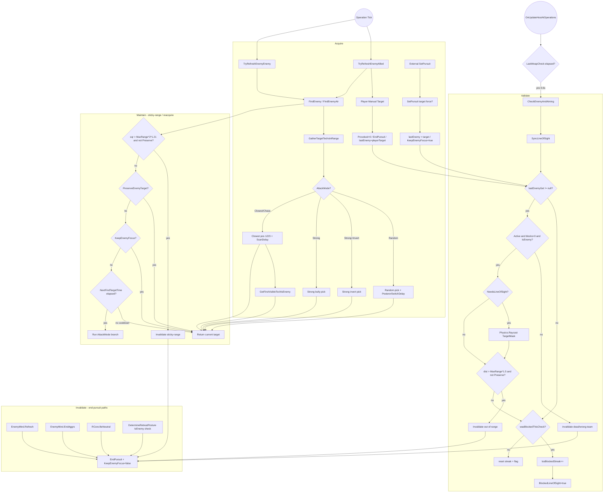
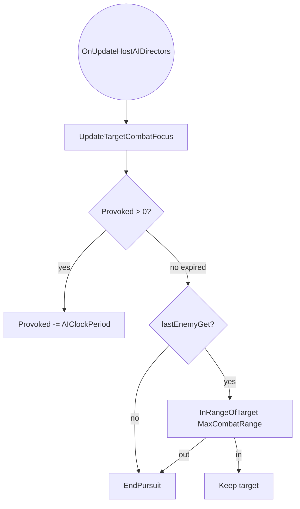
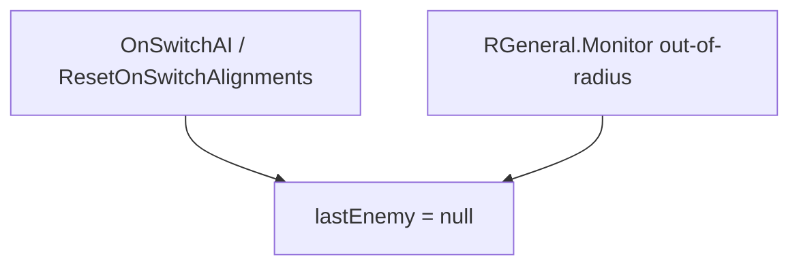

# 06 - Target Acquisition

> **Category:** AI Tick & Decision Pipelines
> **Timing:** the cadence and units of every refresh/delay here (ScanDelay, TargetValidationDelay, TargetCache, Provoked, LOS streak/grace) are catalogued in [21 Timing & Cadence Register](21_timing-cadence.md).

## Summary

The TAC AI target-acquisition pipeline determines how AI-driven tanks (Allied and NonPlayer/Enemy) discover, validate, lock onto, and abandon combat targets. The pipeline is centred on `TankAIHelper.lastEnemy` (exposed publicly as `lastEnemyGet`) and is driven once per AI tick by `CheckEnemyAndAiming`, and per operation by `TryRefreshEnemy*` calls from `BGeneral`, `RGeneral`, `RWheeled`, `RAircraft`, `BAviator`, `BAssassin`, and `BMultiTech`.

The pipeline has four logical phases:

1. **Acquire** - find a candidate Visible enemy via `FindEnemy` / `FindEnemyAir`, or via an external `SetPursuit` (damage events, RTS focus-fire requests, GUI orders, GetRevengeOn).
2. **Validate** - per-tick checks in `CheckEnemyAndAiming` (active flag, blockCount > 0, team-enemy relation, LOS raycast through `TargetMask`).
3. **Maintain** - sticky pursuit via `KeepEnemyFocus`, range-edge hysteresis (`MaxCombatRange * 1.5f` clear in `CheckEnemyAndAiming`, sqr `1.21f` clear in `FindEnemy`/`FindEnemyAir`), LOS hysteresis (`_losBlockedStreak`), and the `Provoked` decay counter.
4. **Invalidate** - `EndPursuit` + `lastEnemy = null` on any failed validity check; `UpdateTargetCombatFocus` clears when no longer in range and Provoked has expired; alignment switches reset all state.

Key time / damage constants live in `AIGlobals.cs`:

- `TargetValidationDelay = 0.6f` (one `CheckEnemyAndAiming` tick)
- `TargetCacheRefreshInterval = 1.5f` (target-tech cache)
- `ScanDelay = 0.5f` (`NextFindTargetTime` for ranked scan)
- `PestererSwitchDelay = 12.5f` (Random attack-mode switch)
- `ProvokeTime = 200` (~5s of ticks)
- `ProvokeTimeShort = 80`
- `DamageAlertThreshold = 45` (minimum hit to flip `Provoked` / re-pursue)

---

## Entry points

All file paths are under `Modified/TACtical_AI-master/TACtical_AI-master/TAC_AI/`.

### Pipeline entry (validation tick + provocation decay)

| Caller | File:Line | Purpose |
|---|---|---|
| `OnUpdateHostAIOperations` (OverrideControl branch) | [TankAIHelper.cs:3357](../Modified/TACtical_AI-master/TACtical_AI-master/TAC_AI/AI/TankAIHelper.cs) | Ensures validation runs when an external override is driving |
| `OnUpdateHostAIOperations` (Allied branch) | [TankAIHelper.cs:3376](../Modified/TACtical_AI-master/TACtical_AI-master/TAC_AI/AI/TankAIHelper.cs) | Per-tick validation for Allied techs |
| `OnUpdateHostAIOperations` (NonPlayer Default) | [TankAIHelper.cs:3394](../Modified/TACtical_AI-master/TACtical_AI-master/TAC_AI/AI/TankAIHelper.cs) | Per-tick validation for low-RunState enemies |
| `OnUpdateHostAIOperations` (NonPlayer Advanced) | [TankAIHelper.cs:3408](../Modified/TACtical_AI-master/TACtical_AI-master/TAC_AI/AI/TankAIHelper.cs) | Per-tick validation for Advanced enemies |
| `RunAlliedOperations` -> `UpdateTargetCombatFocus` | [TankAIHelper.cs:2889](../Modified/TACtical_AI-master/TACtical_AI-master/TAC_AI/AI/TankAIHelper.cs) | Per-allied-tick Provoked decay + range bailout (runs regardless of override driver - see B4 comment) |

### Refresh entry (Allied)

| Caller | File:Line | Purpose |
|---|---|---|
| `BGeneral.AidDefend` | [BGeneral.cs:24,32](../Modified/TACtical_AI-master/TACtical_AI-master/TAC_AI/AI/BGeneral.cs) | Defend-while-engaged + idle refresh |
| `BGeneral.AimDefend` | [BGeneral.cs:41](../Modified/TACtical_AI-master/TACtical_AI-master/TAC_AI/AI/BGeneral.cs) | Turret aim refresh |
| `BGeneral.RTSCombat` | [BGeneral.cs:116,121](../Modified/TACtical_AI-master/TACtical_AI-master/TAC_AI/AI/BGeneral.cs) | RTS pick-target while idle / dead-target replace |
| `BAviator.Dogfighting` | [BAviator.cs:96](../Modified/TACtical_AI-master/TACtical_AI-master/TAC_AI/AI/AlliedOperations/BAviator.cs) | Allied dogfight target refresh |
| `BAssassin.ShootToDestroy` | [BAssassin.cs:206](../Modified/TACtical_AI-master/TACtical_AI-master/TAC_AI/AI/AlliedOperations/BAssassin.cs) | Sniper-style turret refresh |
| `BMultiTech.MimicDefend` | [BMultiTech.cs:215,218](../Modified/TACtical_AI-master/TACtical_AI-master/TAC_AI/AI/AlliedOperations/BMultiTech.cs) | Mimic-MT host targeting |

### Refresh entry (Enemy)

| Caller | File:Line | Purpose |
|---|---|---|
| `RGeneral.DispatchNoTargetIdle` | [RGeneral.cs:232](../Modified/TACtical_AI-master/TACtical_AI-master/TAC_AI/Enemy/RGeneral.cs) | P05-added: centralized null-target idle dispatch before R* handlers run; replaces former per-handler null guards (e.g. removed `RWheeled.AttackVroom` line-65 guard) |
| `RGeneral.HomingIdle` | [RGeneral.cs:263](../Modified/TACtical_AI-master/TACtical_AI-master/TAC_AI/Enemy/RGeneral.cs) | Enemy "Homing" attitude idle scan |
| `RGeneral.Scurry` | [RGeneral.cs:305](../Modified/TACtical_AI-master/TACtical_AI-master/TAC_AI/Enemy/RGeneral.cs) | Sub-neutral coward attitude scan |
| `RGeneral.Monitor` | [RGeneral.cs:310,318](../Modified/TACtical_AI-master/TACtical_AI-master/TAC_AI/Enemy/RGeneral.cs) | Sub-neutral monitor inside base radius |
| `RGeneral.BaseAttack` | [RGeneral.cs:331,334](../Modified/TACtical_AI-master/TACtical_AI-master/TAC_AI/Enemy/RGeneral.cs) | Anchored base turret refresh |
| `RGeneral.AidAttack` | [RGeneral.cs:346,349](../Modified/TACtical_AI-master/TACtical_AI-master/TAC_AI/Enemy/RGeneral.cs) | Standard enemy combat refresh |
| `RGeneral.AimAttack` | [RGeneral.cs:366](../Modified/TACtical_AI-master/TACtical_AI-master/TAC_AI/Enemy/RGeneral.cs) | Sniper-style enemy turret refresh |
| `RGeneral.RTSCombat` | [RGeneral.cs:441,446](../Modified/TACtical_AI-master/TACtical_AI-master/TAC_AI/Enemy/RGeneral.cs) | RTS-controlled enemy refresh |
| `RAircraft.EnemyDogfighting` | [RAircraft.cs:345](../Modified/TACtical_AI-master/TACtical_AI-master/TAC_AI/Enemy/EnemyOperations/RAircraft.cs) | Enemy dogfight refresh |

### External pursuit setters (forcing target without scan)

| Caller | File:Line | Purpose |
|---|---|---|
| `TankAIHelper.OnHit` (allied) | [TankAIHelper.cs:1424](../Modified/TACtical_AI-master/TACtical_AI-master/TAC_AI/AI/TankAIHelper.cs) | Damage event - force-pursue attacker via `SetPursuit(force:true)` |
| `EnemyMind.OnHit` -> `GetRevengeOn` -> `SetPursuit` | [EnemyMind.cs:196,335](../Modified/TACtical_AI-master/TACtical_AI-master/TAC_AI/Enemy/EnemyMind.cs) | Enemy revenge target lock |
| `TankAIManager.ProcessFocusFireRequestAllied` (4 severities) | [TankAIManager.cs:489,501,513,522](../Modified/TACtical_AI-master/TACtical_AI-master/TAC_AI/AI/TankAIManager.cs) | Team-wide focus-fire after a hit (wraps entire body in silent `catch{}` - see B12) |
| `TankAIHelper.TryRefreshEnemyAllied` (player manual target) | [TankAIHelper.cs:4524-4534](../Modified/TACtical_AI-master/TACtical_AI-master/TAC_AI/AI/TankAIHelper.cs) | Player-locked target becomes ally's target |
| `BMultiTech.MimicDefend` (direct assign) | [BMultiTech.cs:213](../Modified/TACtical_AI-master/TACtical_AI-master/TAC_AI/AI/AlliedOperations/BMultiTech.cs) | Mimic-MT directly sets `lastEnemy = playerTarget` bypassing `SetPursuit` (see B13) |

### Forced clear sites

| Caller | File:Line | Purpose |
|---|---|---|
| `TankAIHelper.OnSwitchAI` | [TankAIHelper.cs:1500-1501](../Modified/TACtical_AI-master/TACtical_AI-master/TAC_AI/AI/TankAIHelper.cs) | AI-type switch wipes target |
| `TankAIHelper.ResetOnSwitchAlignments` | [TankAIHelper.cs:1104](../Modified/TACtical_AI-master/TACtical_AI-master/TAC_AI/AI/TankAIHelper.cs) | Player <-> NonPlayer alignment swap wipes target |
| `EnemyMind.Refresh` | [EnemyMind.cs:146](../Modified/TACtical_AI-master/TACtical_AI-master/TAC_AI/Enemy/EnemyMind.cs) | Mind re-init calls `EndPursuit` but does NOT null `lastEnemy` (inconsistent with OnSwitchAI - see B14) |
| `EnemyMind.EndAggro` | [EnemyMind.cs:371](../Modified/TACtical_AI-master/TACtical_AI-master/TAC_AI/Enemy/EnemyMind.cs) | "Calm down" path - reverts to Miner/Junker once safe |
| `RCore.BeNeutral` | [RCore.cs:854](../Modified/TACtical_AI-master/TACtical_AI-master/TAC_AI/Enemy/RCore.cs) | Hit by base-team/player - degrade relations & drop pursuit |
| `RGeneral.Monitor` (out-of-radius) | [RGeneral.cs:316,321](../Modified/TACtical_AI-master/TACtical_AI-master/TAC_AI/Enemy/RGeneral.cs) | Sub-neutral stops following far from base - direct `lastEnemy = null` without `EndPursuit` leaves `KeepEnemyFocus` stuck (see B15) |
| `CheckEnemyAndAiming` (validation fail) | [TankAIHelper.cs:4473-4474,4497-4498](../Modified/TACtical_AI-master/TACtical_AI-master/TAC_AI/AI/TankAIHelper.cs) | Inactive/dead/out-of-1.5x range |
| `UpdateTargetCombatFocus` (post-Provoked) | [TankAIHelper.cs:4562,4566](../Modified/TACtical_AI-master/TACtical_AI-master/TAC_AI/AI/TankAIHelper.cs) | Out of MaxCombatRange after Provoked expired |
| `DetermineRetreatPosture` (now-friendly target) | [TankAIHelper.cs:4596-4597](../Modified/TACtical_AI-master/TACtical_AI-master/TAC_AI/AI/TankAIHelper.cs) | Team change made target friendly (renamed from `DetermineCombat` in P04) |
| `FindEnemy` / `FindEnemyAir` (target invalid or 1.21x sqr out) | [TankAIHelper.cs:4738,4744-4745 / 4978,4984-4985](../Modified/TACtical_AI-master/TACtical_AI-master/TAC_AI/AI/TankAIHelper.cs) | Pre-scan target purge |

---

## Flow

### Acquire / validate / maintain / invalidate (operations tick)



### UpdateTargetCombatFocus: Provoked decay / range bailout (directors tick)



### Forced target wipe (AI switch / out-of-radius)



---

## Node reference

### State declarations

| Symbol | File:Line | Notes |
|---|---|---|
| `_lastEnemy` backing field | [TankAIHelper.cs:348](../Modified/TACtical_AI-master/TACtical_AI-master/TAC_AI/AI/TankAIHelper.cs) | Holds current target Visible |
| `lastEnemy` property | [TankAIHelper.cs:350-360](../Modified/TACtical_AI-master/TACtical_AI-master/TAC_AI/AI/TankAIHelper.cs) | Logs ownership on change |
| `lastEnemyGet` public getter | [TankAIHelper.cs:347](../Modified/TACtical_AI-master/TACtical_AI-master/TAC_AI/AI/TankAIHelper.cs) | Read-only access for consumers |
| `PreserveEnemyTarget` | [TankAIHelper.cs:361](../Modified/TACtical_AI-master/TACtical_AI-master/TAC_AI/AI/TankAIHelper.cs) | `RTSControlled && RTSDestInternal == RTSDisabled` |
| `Provoked` counter | [TankAIHelper.cs:5210](../Modified/TACtical_AI-master/TACtical_AI-master/TAC_AI/AI/TankAIHelper.cs) | Int, decremented by `AIClockPeriod` |
| `KeepEnemyFocus` | [TankAIHelper.cs:5211](../Modified/TACtical_AI-master/TACtical_AI-master/TAC_AI/AI/TankAIHelper.cs) | Sticky-lock flag (private setter; only `SetPursuit`/`EndPursuit` mutate) |
| `NextFindTargetTime` | [TankAIHelper.cs:328](../Modified/TACtical_AI-master/TACtical_AI-master/TAC_AI/AI/TankAIHelper.cs) | Scan cooldown timestamp |
| `BlockedLineOfSight` + `_losBlockedStreak` | [TankAIHelper.cs:272,277](../Modified/TACtical_AI-master/TACtical_AI-master/TAC_AI/AI/TankAIHelper.cs) | LOS hysteresis pair |
| `MaxCombatRange` | [TankAIHelper.cs:178](../Modified/TACtical_AI-master/TACtical_AI-master/TAC_AI/AI/TankAIHelper.cs) | `=> AISetSettings.CombatChase` |
| `TargetMask` | [TankAIHelper.cs:4400-4401](../Modified/TACtical_AI-master/TACtical_AI-master/TAC_AI/AI/TankAIHelper.cs) | Scenery + terrain + landmark layers |

### Validation tick

| Function | File:Line | Notes |
|---|---|---|
| `CheckEnemyAndAiming` body | [TankAIHelper.cs:4461-4518](../Modified/TACtical_AI-master/TACtical_AI-master/TAC_AI/AI/TankAIHelper.cs) | Periodic validity check |
| `LastWeapCheck` 0.6s gate | [TankAIHelper.cs:4463-4465](../Modified/TACtical_AI-master/TACtical_AI-master/TAC_AI/AI/TankAIHelper.cs) | Uses `AIGlobals.TargetValidationDelay` |
| Dead / wrong-team purge | [TankAIHelper.cs:4470-4475](../Modified/TACtical_AI-master/TACtical_AI-master/TAC_AI/AI/TankAIHelper.cs) | `isActive`, `blockCount`, `IsEnemy` |
| LOS raycast | [TankAIHelper.cs:4483-4490](../Modified/TACtical_AI-master/TACtical_AI-master/TAC_AI/AI/TankAIHelper.cs) | Only when `NeedsLineOfSight` |
| 1.5x range hysteresis purge | [TankAIHelper.cs:4495-4500](../Modified/TACtical_AI-master/TACtical_AI-master/TAC_AI/AI/TankAIHelper.cs) | Skipped if `PreserveEnemyTarget` |
| LOS streak hysteresis | [TankAIHelper.cs:4506-4516](../Modified/TACtical_AI-master/TACtical_AI-master/TAC_AI/AI/TankAIHelper.cs) | Needs 2 consecutive blocked checks; both `_losBlockedStreak` and `BlockedLineOfSight` reset together on clear tick |

### Refresh wrappers

| Function | File:Line | Notes |
|---|---|---|
| `TryRefreshEnemyAllied` | [TankAIHelper.cs:4519-4543](../Modified/TACtical_AI-master/TACtical_AI-master/TAC_AI/AI/TankAIHelper.cs) | Player manual-target short-circuit at 4522-4535 |
| `TryRefreshEnemyEnemy` | [TankAIHelper.cs:4544-4553](../Modified/TACtical_AI-master/TACtical_AI-master/TAC_AI/AI/TankAIHelper.cs) | Air vs ground dispatch |
| `UpdateTargetCombatFocus` | [TankAIHelper.cs:4554-4571](../Modified/TACtical_AI-master/TACtical_AI-master/TAC_AI/AI/TankAIHelper.cs) | Provoked decay + range bailout |

### Scanning

| Function | File:Line | Notes |
|---|---|---|
| `GatherTargetTechsInRange` (1.5s `targetCache`) | [TankAIHelper.cs:4681-4723](../Modified/TACtical_AI-master/TACtical_AI-master/TAC_AI/AI/TankAIHelper.cs) | Shared candidate cache |
| `FindEnemy` (ground) | [TankAIHelper.cs:4724-4918](../Modified/TACtical_AI-master/TACtical_AI-master/TAC_AI/AI/TankAIHelper.cs) | 1.21x sqr purge at 4740-4746; carry at 4747-4750 |
| `FindEnemy` Random branch | [TankAIHelper.cs:4753-4771](../Modified/TACtical_AI-master/TACtical_AI-master/TAC_AI/AI/TankAIHelper.cs) | Uses `PestererSwitchDelay` |
| `FindEnemy` Strong (invert/normal) | [TankAIHelper.cs:4772-4811](../Modified/TACtical_AI-master/TACtical_AI-master/TAC_AI/AI/TankAIHelper.cs) | Largest vs smallest blockCount |
| `FindEnemy` Closest pos==1/2/3 | [TankAIHelper.cs:4812-4908](../Modified/TACtical_AI-master/TACtical_AI-master/TAC_AI/AI/TankAIHelper.cs) | Chase early-return at 4815-4818; vanilla fallback at 4820-4821 |
| `FindEnemyAir` (air) | [TankAIHelper.cs:4964-5114](../Modified/TACtical_AI-master/TACtical_AI-master/TAC_AI/AI/TankAIHelper.cs) | Mirrors FindEnemy; Chase early-return reachable at 5022-5026 |
| `ScanAirborneRandom` helper | [TankAIHelper.cs:4919-4938](../Modified/TACtical_AI-master/TACtical_AI-master/TAC_AI/AI/TankAIHelper.cs) | Air random pick (uses smallest-distance, not random - see D1) |
| `ScanAirborneStrong` helper | [TankAIHelper.cs:4939-4963](../Modified/TACtical_AI-master/TACtical_AI-master/TAC_AI/AI/TankAIHelper.cs) | Air strong pick |

### Pursuit and range checks

| Function | File:Line | Notes |
|---|---|---|
| `SetPursuit(Visible)` | [TankAIHelper.cs:5212](../Modified/TACtical_AI-master/TACtical_AI-master/TAC_AI/AI/TankAIHelper.cs) | Convenience overload |
| `SetPursuit(Visible,bool force)` | [TankAIHelper.cs:5213-5227](../Modified/TACtical_AI-master/TACtical_AI-master/TAC_AI/AI/TankAIHelper.cs) | Returns false if locked and not forced |
| `EndPursuit` | [TankAIHelper.cs:5228-5234](../Modified/TACtical_AI-master/TACtical_AI-master/TAC_AI/AI/TankAIHelper.cs) | Clears `KeepEnemyFocus` |
| `InRangeOfTarget(float)` | [TankAIHelper.cs:5235-5238](../Modified/TACtical_AI-master/TACtical_AI-master/TAC_AI/AI/TankAIHelper.cs) | Tests current `lastEnemyGet` |
| `InRangeOfTarget(Visible,float)` | [TankAIHelper.cs:5239-5243](../Modified/TACtical_AI-master/TACtical_AI-master/TAC_AI/AI/TankAIHelper.cs) | `sqrMagnitude` compare; O(1) |

### External pursuit setters

| Function | File:Line | Notes |
|---|---|---|
| `TankAIHelper.OnHit` (Allied) | [TankAIHelper.cs:1420-1469](../Modified/TACtical_AI-master/TACtical_AI-master/TAC_AI/AI/TankAIHelper.cs) | `SetPursuit(force:true)` + sets `Provoked = ProvokeTime` |
| `EnemyMind.OnHit` | [EnemyMind.cs:196-?](../Modified/TACtical_AI-master/TACtical_AI-master/TAC_AI/Enemy/EnemyMind.cs) | Sets `lastEnemy` directly (line 223) + calls `GetRevengeOn` (line 224) |
| `EnemyMind.GetRevengeOn` | [EnemyMind.cs:335](../Modified/TACtical_AI-master/TACtical_AI-master/TAC_AI/Enemy/EnemyMind.cs) | Dispatches to `SetPursuit` |
| `TankAIManager.ProcessFocusFireRequestAllied` (4 severities) | [TankAIManager.cs:483-539](../Modified/TACtical_AI-master/TACtical_AI-master/TAC_AI/AI/TankAIManager.cs) | Team-wide focus-fire dispatch; entire body wrapped in silent `catch{}` at 538 (B12) |

---

## Key data / state

### Range hysteresis

- **Entry purge** (`FindEnemy`/`FindEnemyAir`): sqr `1.21f` (~`* 1.1` linear) at [TankAIHelper.cs:4740,4980](../Modified/TACtical_AI-master/TACtical_AI-master/TAC_AI/AI/TankAIHelper.cs).
- **Validation purge** (`CheckEnemyAndAiming`): linear `* 1.5f` at [TankAIHelper.cs:4495](../Modified/TACtical_AI-master/TACtical_AI-master/TAC_AI/AI/TankAIHelper.cs).
- Both gates skip when `PreserveEnemyTarget` is true.
- The widening from 1.1 -> 1.5 is intentional (comment at 4491-4494). Originally paired with a `RWheeled.AttackVroom` re-acquire guard that was removed in P05 once `EnemyOperationsController.Execute` started routing null-target ticks through `RGeneral.DispatchNoTargetIdle` before R* handlers run.

### LOS hysteresis

- `_losBlockedStreak` requires 2 consecutive blocked rays before flipping `BlockedLineOfSight = true`.
- Any unblocked check resets both immediately.
- Prevents one-frame flicker from allies / terrain crossing the ray.

### Sticky pursuit

- `KeepEnemyFocus` is set by `SetPursuit` (5226) and cleared by `EndPursuit` (5232).
- `SetPursuit` no-ops when locked unless `force == true` (5223).
- `Provoked` is set by `OnHit` paths to `AIGlobals.ProvokeTime`; decays in `UpdateTargetCombatFocus` (4570).

### Attack-mode routing

- **Random** (`PestererSwitchDelay`): switch every ~12.5s.
- **Strong** (`InvertBullyPriority` toggles bully vs threat).
- **Closest / Chase**: nearest pick, with Chase early-return on a still-active target (`FindEnemy`:4815-4818 / `FindEnemyAir`:5022-5026 - both reachable).

---

## Exit points

The pipeline has two output channels and three terminal lifecycle states.

### Outputs (downstream consumers of `lastEnemyGet`)

| Consumer | File:Line | Use |
|---|---|---|
| `ManageAILockOn` -> `lastLockOnTarget` for `Tank.Weapons` | [TankAIHelper.cs:5144..~5209](../Modified/TACtical_AI-master/TACtical_AI-master/TAC_AI/AI/TankAIHelper.cs) | Weapon-system aim hand-off (called from `OnPostUpdate` at 3271) |
| Combat-FSM ops (`AttackVroom`, `Dogfighting`, `RTSCombat`, `MimicDefend`) | various | Sets `WantsToFight`, distance, `direct.SetLastDest` |
| `AIECore.RequestFocusFirePlayer` / `RLoadedBases.RequestFocusFireNPTs` | - | Team-wide focus-fire propagation |
| `CanAnchorSafely` gate | [TankAIHelper.cs ~132](../Modified/TACtical_AI-master/TACtical_AI-master/TAC_AI/AI/TankAIHelper.cs) | `!lastEnemyGet \|\| lastCombatRange > SafeAnchorDist` |
| GUI strings ("Fighting <name>", etc.) | [TankAIHelper.cs ~1665..2400](../Modified/TACtical_AI-master/TACtical_AI-master/TAC_AI/AI/TankAIHelper.cs) | UI display (range approximate; spans many helpers, drift +136 from prior cite) |
| Debug overlays (`DrawDirIndicator`) | [TankAIHelper.cs ~5795..5825](../Modified/TACtical_AI-master/TACtical_AI-master/TAC_AI/AI/TankAIHelper.cs) | Editor visualisation (range approximate; drift +67 from prior cite) |

### Terminal lifecycle states

| State | Trigger | Effect |
|---|---|---|
| Carry | Most ticks - validation passes, no scan due | Target retained for next tick |
| Clear | `lastEnemy = null` + `EndPursuit()` | Next op tick calls `TryRefreshEnemy*`, re-enters Acquire |
| Wipe-all | `OnSwitchAI` / `ResetOnSwitchAlignments` / `EnemyMind.Refresh` | Provoked, KeepEnemyFocus, lastEnemy, lastLockOnTarget all reset |

---

## Cross-pipeline integration

- **Movement / Steering AI** - `AIControllerDefault` reads `lastEnemyGet`, `KeepEnemyFocus`, `BlockedLineOfSight`, and `Provoked` for urgency feedback; `lastCombatRange` drives movement calculations. `AIControllerAir` substitutes `FindEnemyAir` and uses `DodgeSphereCenter` for the aerial scan point; `preferAirborne` affects target selection.
- **Weapons subsystem** - `ManageAILockOn` translates `lastEnemyGet` to `Tank.Weapons.lastLockOnTarget`, including direct/indirect gating via `NeedsLineOfSight` and `WeaponAimType`.
- **Anchor management** - `CanAnchorSafely` blocks `TryInsureAutoAnchor` while a target is held closer than `SafeAnchorDist`.
- **Focus-fire / team coordination** - `OnHit` flows feed `TankAIManager.ProcessFocusFireRequestAllied` and `RLoadedBases.RequestFocusFireNPTs`, which broadcast the target via the same `SetPursuit` path used by manual pursuit.
- **Damage event pipeline** - `TankAIHelper.OnHit` (allied) and `EnemyMind.OnHit` are the only Provoked setters and the only paths that pass `force:true` to `SetPursuit` outside of `GetRevengeOn(forced:true)`.

---

## Issues

**NONE.**

If a new issue is found in this pipeline, replace `NONE.` above and add it under the matching heading, using a stable ID (`BUG-N`, `DEAD-N`, or `TD-N`) and a clickable `file.cs:line` link. Format:

```text
### Bugs
- **BUG-1 (High | Medium | Low)** - [File.cs:line](path) - what is wrong, and the intended fix.

### Dead code
- **DEAD-1** - [File.cs:line](path) - what is orphaned or unreachable, and why.

### Tech debt
- **TD-1** - [File.cs:line](path) - the smell, and the cleaner shape.
```
