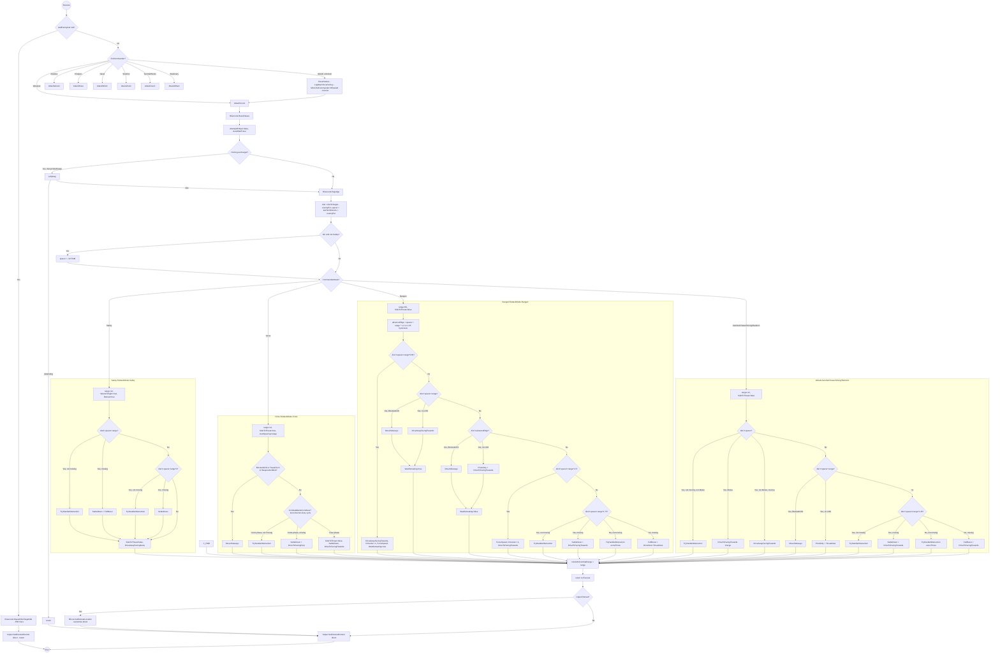
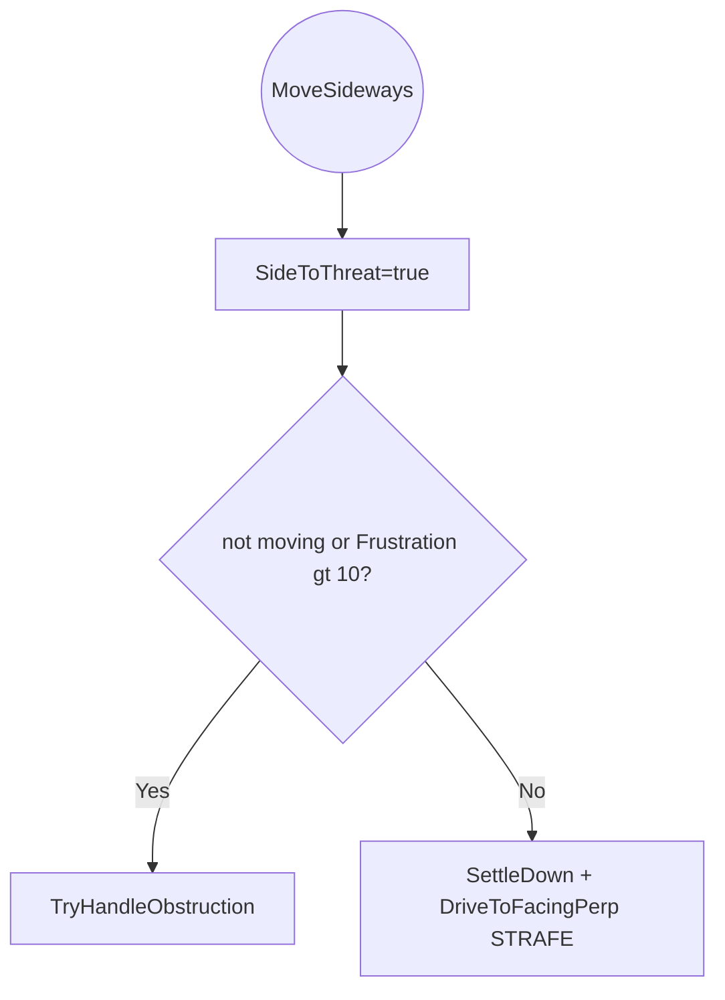

# Combat FSM Dispatch (EAttackMode)

> **Category:** AI Tick & Decision Pipelines
> **Timing:** the pass cadence driving this FSM and the bucket-hysteresis values are catalogued in [21 Timing & Cadence Register](21_timing-cadence.md).

## Summary

Once the enemy AI tick (pipeline 5) reaches [EnemyOperationsController.Execute](../Modified/TACtical_AI-master/TACtical_AI-master/TAC_AI/Enemy/EnemyOperations/EnemyOperationsController.cs), each enemy tech is dispatched into a per-`EnemyHandling` combat FSM keyed by `EAttackMode`. The flagship state machine is `RWheeled.AttackVroom` ([RWheeled.cs:40](../Modified/TACtical_AI-master/TACtical_AI-master/TAC_AI/Enemy/EnemyOperations/RWheeled.cs)), a switch over `mind.CommanderAttack` that selects one of four executed branches (Safety, Circle, Ranged, default) and partitions the engagement window into **distance buckets** computed as `spacer + range * k` where `spacer = lastTechExtents + enemyExt`.

Every FSM signature is `(TankAIHelper helper, Tank tank, EnemyMind mind, ref EControlOperatorSet direct)`. Each branch ends by populating `direct.DriveDest` and `direct.DriveDir` plus side-channel `helper.DriveVar` / `helper.ThrottleState`. After the switch, if `helper.Retreat == true`, [RCore.GetRetreatLocation](../Modified/TACtical_AI-master/TACtical_AI-master/TAC_AI/Enemy/EnemyOperations/EnemyOperationsController.cs) overwrites the destination with a retreat anchor; then `helper.SetDirectedControl(direct)` commits the populated `EControlOperatorSet` and hands off to the AICore movement pipelines.

Two cross-cutting modifiers shape every bucket in `RWheeled.AttackVroom`:

1. **`WasRetreatingInCombat` hysteresis** ([RWheeled.cs:150](../Modified/TACtical_AI-master/TACtical_AI-master/TAC_AI/Enemy/EnemyOperations/RWheeled.cs)) — set true after a retreat-bucket tick, expands the `advanceEdge` from `range * 1.25` to `range * 1.4` so the FSM does not snap-flip back to advance on the next frame. Also intercepted by `TankAIHelper.AvoidAssist` ([TankAIHelper.cs:3760](../Modified/TACtical_AI-master/TACtical_AI-master/TAC_AI/AI/TankAIHelper.cs)) which short-circuits sideways destination re-targeting while the flag is hot.
2. **`BlockedLineOfSight`** — when true within Circle / Ranged / default mid-buckets, swaps the planned move for [MoveSideways](../Modified/TACtical_AI-master/TACtical_AI-master/TAC_AI/Enemy/EnemyOperations/RWheeled.cs) (RWheeled.cs:14) which forces `SideToThreat = true` and `DriveToFacingPerp()` (strafing). Backed by a `_losBlockedStreak` debounce ([TankAIHelper.cs:277](../Modified/TACtical_AI-master/TACtical_AI-master/TAC_AI/AI/TankAIHelper.cs)) requiring `AIGlobals.LosBlockedStreakThreshold` (=2) consecutive blocked LOS checks before flipping the public flag.

A **GC ramming special case** ([RWheeled.cs:72-73](../Modified/TACtical_AI-master/TACtical_AI-master/TAC_AI/Enemy/EnemyOperations/RWheeled.cs), mirrored in [RNaval.cs:38-39](../Modified/TACtical_AI-master/TACtical_AI-master/TAC_AI/Enemy/EnemyOperations/RNaval.cs)) negates `spacer` to `-32` for GC-faction techs not in Safety mode, collapsing every bucket downward so the tech keeps charging through the close/inner reverse zones. The airborne / aquatic FSMs (`RAircraft.AttackWoosh`, `RChopper.AttackShwa`, `RNaval.AttackWhish`, `RStarship.AttackZoom`) are structurally similar (switch on `CommanderAttack` → `spacing + range * k` buckets) but with reduced bucket counts, `AIThrottleState.PivotOnly` / `Yield` substitutions for in-air pivoting, and no `WasRetreatingInCombat` hysteresis.

**P06 architectural change (2026-05-18):** the null-target re-acquire path that previously lived inside `RWheeled.AttackVroom:59-77` was hoisted into `EnemyOperationsController.Execute` via [`RGeneral.DispatchNoTargetIdle`](../Modified/TACtical_AI-master/TACtical_AI-master/TAC_AI/Enemy/RGeneral.cs) (RGeneral.cs:232) — every R* handler now runs with `helper.lastEnemyGet != null` guaranteed. Each R* file carries a `// B7: null-target case centralized` comment documenting this. The controller also gained a new `default:` self-heal arm ([EnemyOperationsController.cs:61-74](../Modified/TACtical_AI-master/TACtical_AI-master/TAC_AI/Enemy/EnemyOperations/EnemyOperationsController.cs)) for unknown `EnemyHandling` values.

## Entry points

Dispatch is keyed off `Mind.EvilCommander` inside `EnemyOperationsController.Execute`. Every FSM receives the same four arguments: `(TankAIHelper helper, Tank tank, EnemyMind mind, ref EControlOperatorSet direct)`.

| `EnemyHandling` | Target FSM | Site |
|---|---|---|
| (pre-switch null-target) | `RGeneral.DispatchNoTargetIdle` | [EnemyOperationsController.cs:25-35](../Modified/TACtical_AI-master/TACtical_AI-master/TAC_AI/Enemy/EnemyOperations/EnemyOperationsController.cs) — early-return path; commits `direct` without entering the per-handler switch when `lastEnemyGet == null` |
| `Wheeled` | `RWheeled.AttackVroom` | [EnemyOperationsController.cs:40](../Modified/TACtical_AI-master/TACtical_AI-master/TAC_AI/Enemy/EnemyOperations/EnemyOperationsController.cs) |
| `Airplane` | `RAircraft.AttackWoosh` | [EnemyOperationsController.cs:43](../Modified/TACtical_AI-master/TACtical_AI-master/TAC_AI/Enemy/EnemyOperations/EnemyOperationsController.cs) |
| `Chopper` | `RChopper.AttackShwa` | [EnemyOperationsController.cs:46](../Modified/TACtical_AI-master/TACtical_AI-master/TAC_AI/Enemy/EnemyOperations/EnemyOperationsController.cs) |
| `Starship` | `RStarship.AttackZoom` | [EnemyOperationsController.cs:49](../Modified/TACtical_AI-master/TACtical_AI-master/TAC_AI/Enemy/EnemyOperations/EnemyOperationsController.cs) |
| `Naval` | `RNaval.AttackWhish` | [EnemyOperationsController.cs:52](../Modified/TACtical_AI-master/TACtical_AI-master/TAC_AI/Enemy/EnemyOperations/EnemyOperationsController.cs) |
| `SuicideMissile` | `RCrashMissile.AttackCrash` | [EnemyOperationsController.cs:56](../Modified/TACtical_AI-master/TACtical_AI-master/TAC_AI/Enemy/EnemyOperations/EnemyOperationsController.cs) |
| `Stationary` | `RStation.AttackWham` | [EnemyOperationsController.cs:59](../Modified/TACtical_AI-master/TACtical_AI-master/TAC_AI/Enemy/EnemyOperations/EnemyOperationsController.cs) |
| **`default` (unknown)** | `BGeneral.ResetValues` → log → `Mind.EvilCommander = Wheeled` → `RWheeled.AttackVroom` | [EnemyOperationsController.cs:61-74](../Modified/TACtical_AI-master/TACtical_AI-master/TAC_AI/Enemy/EnemyOperations/EnemyOperationsController.cs) — P06 self-heal arm; mirrors `AlliedOperationsController` default-case precedent. **Side effect:** silently rewrites `Mind.EvilCommander` permanently (see B-NEW4). |

`EAttackMode` ([AIEnums.cs:225-234](../Modified/TACtical_AI-master/TACtical_AI-master/TAC_AI/AIEnums.cs)) defines seven values: `AutoSet, Circle, Chase, Strong, Random, Ranged, Safety`. Only `Safety`, `Circle`, and `Ranged` have dedicated switch cases in `RWheeled`, `RChopper`, and `RStarship`; `Chase, Strong, Random, AutoSet` all fall through to the `default` arm. `RAircraft` is more degenerate — only `Safety` is special-cased; everything else hits `default`. `RNaval` uses an `if/else` chain with the same Safety/Circle/Ranged/default partition.

## Flow

### Main: RWheeled.AttackVroom dispatch + buckets



### MoveSideways utility



### Summary: other locomotion FSMs

```mermaid
graph TD
    OTHERS((Per EnemyHandling FSM))

    subgraph RAircraft [RAircraft.AttackWoosh]
        AIR[range = SpacingRangeAircraft 24]
        AIR --> AIR_SW{CommanderAttack?}
        AIR_SW -->|Safety| AIR_S[DriveDest=FromLastDest, Retreat=true, 2 buckets r/4 and r]
        AIR_SW -->|default| AIR_D[4 buckets 1x 2x 3x, FromLastDest then ToLastDest, FullBoost on sprint]
        AIR -.Circle/Ranged.-> AIR_DEAD[Circle and Spyper commented-out DEAD]
    end

    subgraph RChopper [RChopper.AttackShwa]
        CHP[range = Hoverer 18 or SpyperAir 72]
        CHP --> CHP_SW{CommanderAttack?}
        CHP_SW -->|Safety| CHP_S[DriveAwayFacingAway, anchor offset -Vector3.down*50, 2 buckets]
        CHP_SW -->|Circle| CHP_C[DriveToFacingPerp orbit, SideToThreat=true]
        CHP_SW -->|Ranged + LikelyMelee| CHP_RM[Bomber range=8 magic, 2 buckets]
        CHP_SW -->|Ranged + not Melee| CHP_R[Sniper SpyperAir, 4 buckets, PivotOnly + LightBoost]
        CHP_SW -->|default| CHP_D[4 buckets 2 r 1.25x, PivotOnly + ToLastDest]
        CHP -.needsToSlowDown.-> CHP_YIELD[IsOrbiting yields ThrottleState=Yield in all modes]
    end

    subgraph RNaval [RNaval.AttackWhish]
        NAV[range = MinCombatRangeDefault + lastTechExtents]
        NAV --> NAV_GC[GC ram spacer=-32]
        NAV_GC --> NAV_SW{if/else CommanderAttack?}
        NAV_SW -->|Safety| NAV_S[DriveAwayFacingAway, Retreat=true, buckets r/4 and r]
        NAV_SW -->|Circle| NAV_C[DriveAwayFacingPerp / DriveToFacingPerp, SideToThreat=true]
        NAV_SW -->|Ranged| NAV_R[4 buckets r/2 r 2x, PivotOnly mid, FullBoost outer]
        NAV_SW -->|default| NAV_D[4 buckets 2 r 1.25x, DriveToFacingPerp broadside]
        NAV -.Attempt3DNavi=true.-> NAV_3D[Full 3D nav unlike RWheeled]
    end

    subgraph RStarship [RStarship.AttackZoom]
        STR[range = Hoverer 18, ThrottleState=ForceSpeed, DriveVar=1 preset]
        STR --> STR_SW{CommanderAttack?}
        STR_SW -->|Safety| STR_S[DriveAwayFacingTowards, 2 buckets r and 2x, FullBoost on close]
        STR_SW -->|Circle| STR_C[DriveAwayFacingPerp / DriveToFacingPerp, SideToThreat=false note]
        STR_SW -->|Ranged| STR_R[range=SpyperAir, 4 buckets 1x 1.5x 2x, ForceSpeed/PivotOnly]
        STR_SW -->|default| STR_D[4 buckets 2 r 1.25x, not Melee gating, FullBoost outer]
        STR -.needsToSlowDown.-> STR_YIELD[IsOrbiting yields Yield in Ranged and default only]
    end

    OTHERS --> AIR
    OTHERS --> CHP
    OTHERS --> NAV
    OTHERS --> STR

    AIR_S --> EXIT_OUT[return to Execute and SetDirectedControl]
    AIR_D --> EXIT_OUT
    CHP_S --> EXIT_OUT
    CHP_C --> EXIT_OUT
    CHP_RM --> EXIT_OUT
    CHP_R --> EXIT_OUT
    CHP_D --> EXIT_OUT
    NAV_S --> EXIT_OUT
    NAV_C --> EXIT_OUT
    NAV_R --> EXIT_OUT
    NAV_D --> EXIT_OUT
    STR_S --> EXIT_OUT
    STR_C --> EXIT_OUT
    STR_R --> EXIT_OUT
    STR_D --> EXIT_OUT
```



## Node reference

### Enum & dispatch

| Node | File:Line | Notes |
|---|---|---|
| `EAttackMode` enum | [AIEnums.cs:225-234](../Modified/TACtical_AI-master/TACtical_AI-master/TAC_AI/AIEnums.cs) | `AutoSet=0, Circle, Chase, Strong, Random, Ranged, Safety` (7 values; only 3 have explicit cases) |
| `EnemyOperationsController.Execute` | [EnemyOperationsController.cs:14](../Modified/TACtical_AI-master/TACtical_AI-master/TAC_AI/Enemy/EnemyOperations/EnemyOperationsController.cs) | Switch on `Mind.EvilCommander` (preceded by P06 null-target hoist at lines 25-35) |
| `RGeneral.DispatchNoTargetIdle` | [RGeneral.cs:232](../Modified/TACtical_AI-master/TACtical_AI-master/TAC_AI/Enemy/RGeneral.cs) | P06: centralized null-target dispatch; replaces per-FSM `TryRefreshEnemyEnemy`/hold-position logic that used to live in `RWheeled:59-77` |
| `EControlOperatorSet` | [AIEnums.cs:8-100](../Modified/TACtical_AI-master/TACtical_AI-master/TAC_AI/AIEnums.cs) | Output struct: `DriveDest`, `DriveDir`, `lastDestination` |
| `EControlOperatorSet.FaceDest` | [AIEnums.cs:63-66](../Modified/TACtical_AI-master/TACtical_AI-master/TAC_AI/AIEnums.cs) | `DriveDest=ToLastDestination, DriveDir=Neutral` |
| `EControlOperatorSet.DriveToFacingTowards` | [AIEnums.cs:68-72](../Modified/TACtical_AI-master/TACtical_AI-master/TAC_AI/AIEnums.cs) | `ToLastDestination, Forwards` |
| `EControlOperatorSet.DriveAwayFacingTowards` | [AIEnums.cs:79-83](../Modified/TACtical_AI-master/TACtical_AI-master/TAC_AI/AIEnums.cs) | `FromLastDestination, Forwards` |
| `EControlOperatorSet.DriveAwayFacingAway` | [AIEnums.cs:84-88](../Modified/TACtical_AI-master/TACtical_AI-master/TAC_AI/AIEnums.cs) | `FromLastDestination, Backwards` |
| `EControlOperatorSet.DriveToFacingPerp` | [AIEnums.cs:90-94](../Modified/TACtical_AI-master/TACtical_AI-master/TAC_AI/AIEnums.cs) | `ToLastDestination, Perpendicular` (strafe) |
| `EControlOperatorSet.DriveAwayFacingPerp` | [AIEnums.cs:95-99](../Modified/TACtical_AI-master/TACtical_AI-master/TAC_AI/AIEnums.cs) | `FromLastDestination, Perpendicular` |

### RWheeled internals

| Node | File:Line | Notes |
|---|---|---|
| `RWheeled.AttackVroom` | [RWheeled.cs:40-271](../Modified/TACtical_AI-master/TACtical_AI-master/TAC_AI/Enemy/EnemyOperations/RWheeled.cs) | Main wheeled / tracked combat FSM |
| `MoveSideways` | [RWheeled.cs:14-39](../Modified/TACtical_AI-master/TACtical_AI-master/TAC_AI/Enemy/EnemyOperations/RWheeled.cs) | Strafe helper; sets `SideToThreat=true`, then obstruction-clear or `DriveToFacingPerp` |
| `BGeneral.ResetValues` | [BGeneral.cs:7](../Modified/TACtical_AI-master/TACtical_AI-master/TAC_AI/AI/BGeneral.cs) | Zero per-tick fields: ThrottleState, FIRE_ALL, FullBoost, DriveVar etc. |
| ~~Single re-acquire~~ (REMOVED P06) | RWheeled.cs:59-61 (B7 comment marker only) | Previously per-FSM `TryRefreshEnemyEnemy`/hold-position logic; hoisted to `RGeneral.DispatchNoTargetIdle` (controller-side). Each R* file now carries a `// B7: null-target case centralized` comment at the same offset. |
| GC ram special | [RWheeled.cs:72-73](../Modified/TACtical_AI-master/TACtical_AI-master/TAC_AI/Enemy/EnemyOperations/RWheeled.cs) | `spacer = -32` when MainFaction==GC and Attack != Safety |
| Safety bucket | [RWheeled.cs:77-105](../Modified/TACtical_AI-master/TACtical_AI-master/TAC_AI/Enemy/EnemyOperations/RWheeled.cs) | Two boundaries: `range`, `range*2`. Always `Retreat=true`, `DriveAwayFacingAway` |
| Circle bucket | [RWheeled.cs:105-138](../Modified/TACtical_AI-master/TACtical_AI-master/TAC_AI/Enemy/EnemyOperations/RWheeled.cs) | Turret-fraction **duty cycle** (`helper.CombatWantsCircleNow()`, [RWheeled.cs:119](../Modified/TACtical_AI-master/TACtical_AI-master/TAC_AI/Enemy/EnemyOperations/RWheeled.cs#L119)): circle phase → `SettleDown` + `DriveToFacingPerp`; face phase → `SideToThreat=false` + `DriveToFacingTowards` (so front-fixed guns get firing windows). Circles ~`TurretFraction` of each `CombatFacingCyclePeriod`. **Replaced** the old `ActionPause > 120` stop-and-shoot. |
| Ranged bucket | [RWheeled.cs:140-217](../Modified/TACtical_AI-master/TACtical_AI-master/TAC_AI/Enemy/EnemyOperations/RWheeled.cs) | `range=60`. 6 boundaries: 0.65x, 1x, advanceEdge(1.25/1.4x), 1.5x, 1.75x, else |
| `advanceEdge` hysteresis | [RWheeled.cs:150](../Modified/TACtical_AI-master/TACtical_AI-master/TAC_AI/Enemy/EnemyOperations/RWheeled.cs) | `range * (WasRetreatingInCombat ? 1.4f : 1.25f)` |
| Default bucket | [RWheeled.cs:218-269](../Modified/TACtical_AI-master/TACtical_AI-master/TAC_AI/Enemy/EnemyOperations/RWheeled.cs) | 4 boundaries: spacer, range, 1.25x, else. `LikelyMelee` flips reverse to forward at close range |
| `mind.MinCombatRange = range` | [RWheeled.cs:270](../Modified/TACtical_AI-master/TACtical_AI-master/TAC_AI/Enemy/EnemyOperations/RWheeled.cs) | Always writes the chosen `range` back to the mind for later weapon-range checks |
| `helper.AISetSettings.ObjectiveRange = spacer + range` writebacks | [RWheeled.cs:79,108,142,220](../Modified/TACtical_AI-master/TACtical_AI-master/TAC_AI/Enemy/EnemyOperations/RWheeled.cs) | Per-bucket parallel writeback for movement / spacing; verified absent in RAircraft and RNaval — see B-NEW2 |

### Other locomotion FSMs

| Node | File:Line | Notes |
|---|---|---|
| `RAircraft.AttackWoosh` | [RAircraft.cs:22-194](../Modified/TACtical_AI-master/TACtical_AI-master/TAC_AI/Enemy/EnemyOperations/RAircraft.cs) | Only `Safety` is explicit; Circle/Spyper are dead-code |
| `RAircraft` Recycle on null rbody | [RAircraft.cs:29-39](../Modified/TACtical_AI-master/TACtical_AI-master/TAC_AI/Enemy/EnemyOperations/RAircraft.cs) | Early-returns via `InvokeHelper.InvokeSingle(tank.Recycle, 0f); return;` when rbody is null |
| `RAircraft.LollyGagAir` | [RAircraft.cs:197-?](../Modified/TACtical_AI-master/TACtical_AI-master/TAC_AI/Enemy/EnemyOperations/RAircraft.cs) | Idle / repair / anchor fallback for airborne |
| `RChopper.AttackShwa` | [RChopper.cs:22-206](../Modified/TACtical_AI-master/TACtical_AI-master/TAC_AI/Enemy/EnemyOperations/RChopper.cs) | `Safety, Circle, Ranged (Bomber/Sniper split), default` |
| `RChopper.IsOrbiting()` consumer | [RChopper.cs:43](../Modified/TACtical_AI-master/TACtical_AI-master/TAC_AI/Enemy/EnemyOperations/RChopper.cs) | `needsToSlowDown` flag → applied across all modes |
| `RChopper` Bomber magic range | [RChopper.cs:100-101](../Modified/TACtical_AI-master/TACtical_AI-master/TAC_AI/Enemy/EnemyOperations/RChopper.cs) | `range = 8` literal (no AIGlobals constant) |
| `RNaval.AttackWhish` | [RNaval.cs:14-172](../Modified/TACtical_AI-master/TACtical_AI-master/TAC_AI/Enemy/EnemyOperations/RNaval.cs) | `Attempt3DNavi=true`, perpendicular-biased broadside |
| `RNaval` GC ram | [RNaval.cs:38-39](../Modified/TACtical_AI-master/TACtical_AI-master/TAC_AI/Enemy/EnemyOperations/RNaval.cs) | `spacer = -32` mirror of RWheeled |
| `RStarship.AttackZoom` | [RStarship.cs:15-177](../Modified/TACtical_AI-master/TACtical_AI-master/TAC_AI/Enemy/EnemyOperations/RStarship.cs) | Preset `ForceSpeed + DriveVar=1` before switch |
| `RStarship` preset throttle | [RStarship.cs:40-41](../Modified/TACtical_AI-master/TACtical_AI-master/TAC_AI/Enemy/EnemyOperations/RStarship.cs) | `ThrottleState=ForceSpeed`, `DriveVar=1` defaults |
| `RStarship` Circle SideToThreat=false | [RStarship.cs:70](../Modified/TACtical_AI-master/TACtical_AI-master/TAC_AI/Enemy/EnemyOperations/RStarship.cs) | Intentional anomaly vs RWheeled/RChopper (commented: shell-fire alignment) |
| Post-dispatch retreat hook | [EnemyOperationsController.cs:76-79](../Modified/TACtical_AI-master/TACtical_AI-master/TAC_AI/Enemy/EnemyOperations/EnemyOperationsController.cs) | `if (helper.Retreat) RCore.GetRetreatLocation(...)` |
| Output commit | [EnemyOperationsController.cs:80](../Modified/TACtical_AI-master/TACtical_AI-master/TAC_AI/Enemy/EnemyOperations/EnemyOperationsController.cs) | `helper.SetDirectedControl(direct)` |

### Constants

| Constant | File:Line | Value |
|---|---|---|
| `MinCombatRangeDefault` | [AIGlobals.cs:429](../Modified/TACtical_AI-master/TACtical_AI-master/TAC_AI/AIGlobals.cs) | 12 |
| `MinCombatRangeSpyper` | [AIGlobals.cs:430](../Modified/TACtical_AI-master/TACtical_AI-master/TAC_AI/AIGlobals.cs) | 60 |
| `SpacingRangeSpyperAir` | [AIGlobals.cs:431](../Modified/TACtical_AI-master/TACtical_AI-master/TAC_AI/AIGlobals.cs) | 72 |
| `SpacingRangeAircraft` | [AIGlobals.cs:432](../Modified/TACtical_AI-master/TACtical_AI-master/TAC_AI/AIGlobals.cs) | 24 |
| `SpacingRangeHoverer` | [AIGlobals.cs:434](../Modified/TACtical_AI-master/TACtical_AI-master/TAC_AI/AIGlobals.cs) | 18 |
| `EnemyAISpeedPanicDividend` | [AIGlobals.cs:320](../Modified/TACtical_AI-master/TACtical_AI-master/TAC_AI/AIGlobals.cs) | 9 |
| `PlayerAISpeedPanicDividend` | [AIGlobals.cs](../Modified/TACtical_AI-master/TACtical_AI-master/TAC_AI/AIGlobals.cs) | — | sibling constant; **RChopper** is the only enemy-side FSM that uses it (10 sites) — see B-NEW3 |
| `LosBlockedStreakThreshold` (P06) | [AIGlobals.cs](../Modified/TACtical_AI-master/TACtical_AI-master/TAC_AI/AIGlobals.cs) | 2 | LOS debounce threshold consumed by `CheckEnemyAndAiming` → fed into combat-FSM `BlockedLineOfSight` |
| `CombatRangeRetentionMult` | [AIGlobals.cs](../Modified/TACtical_AI-master/TACtical_AI-master/TAC_AI/AIGlobals.cs) | 1.5 | Symmetric range-retention hysteresis |
| `RTSLockMaxRangeMultiplier` (P06) | [AIGlobals.cs](../Modified/TACtical_AI-master/TACtical_AI-master/TAC_AI/AIGlobals.cs) | 2.5 | Hard outer cap for `PreserveEnemyTarget` retention |
| `LOSLostGraceTime` (P06) | [AIGlobals.cs](../Modified/TACtical_AI-master/TACtical_AI-master/TAC_AI/AIGlobals.cs) | 3.0s | `UpdateTargetCombatFocus` LOS grace before EndPursuit |
| `CombatFacingCyclePeriod` (live setting) | [KickStart.cs:157](../Modified/TACtical_AI-master/TACtical_AI-master/TAC_AI/KickStart.cs#L157) | 4.0s | One full circle+face cycle for the turret-fraction duty cycle; player-tunable in mod options (bound at [KickStartExtras.cs:92](../Modified/TACtical_AI-master/TACtical_AI-master/TAC_AI/KickStartExtras.cs#L92)). |

## Key data / state

| Field | File:Line | Notes |
|---|---|---|
| `WasRetreatingInCombat` declaration | [TankAIHelper.cs:281](../Modified/TACtical_AI-master/TACtical_AI-master/TAC_AI/AI/TankAIHelper.cs) | Combat-bucket hysteresis flag. Set/cleared per Ranged bucket in RWheeled |
| `WasRetreatingInCombat` consumer | [TankAIHelper.cs:3760](../Modified/TACtical_AI-master/TACtical_AI-master/TAC_AI/AI/TankAIHelper.cs) | `AvoidAssist` short-circuits sideways destination retargeting while flag is true |
| `BlockedLineOfSight` declaration | [TankAIHelper.cs:272](../Modified/TACtical_AI-master/TACtical_AI-master/TAC_AI/AI/TankAIHelper.cs) | Public LOS-blocked flag |
| `_losBlockedStreak` debounce | [TankAIHelper.cs:277](../Modified/TACtical_AI-master/TACtical_AI-master/TAC_AI/AI/TankAIHelper.cs) | Private counter; requires `AIGlobals.LosBlockedStreakThreshold` (=2) consecutive blocked checks (set at [TankAIHelper.cs:4540-4552](../Modified/TACtical_AI-master/TACtical_AI-master/TAC_AI/AI/TankAIHelper.cs)) |
| `BlockedLineOfSight` per-tick reset | [TankAIHelper.cs:1145](../Modified/TACtical_AI-master/TACtical_AI-master/TAC_AI/AI/TankAIHelper.cs) | Cleared at tick start |
| `BlockedLineOfSight` aim consumers | [TankAIHelper.cs:2409, 2417, 2425](../Modified/TACtical_AI-master/TACtical_AI-master/TAC_AI/AI/TankAIHelper.cs) | Other call sites in aim FSM |
| `actionPause` auto-property / `ActionPause` property | [TankAIHelper.cs:422-426](../Modified/TACtical_AI-master/TACtical_AI-master/TAC_AI/AI/TankAIHelper.cs) | Both are properties sharing generated backing storage. `actionPause` is `internal int { get; set; }`; `ActionPause` wraps with `private set`. Still decremented each tick and paces `RGeneral.DefaultIdle`; **no longer gates the Circle bucket** — that moved to the turret-fraction duty cycle (`CombatWantsCircleNow`). |
| `TurretFraction` | [TankAIHelper.cs:81](../Modified/TACtical_AI-master/TACtical_AI-master/TAC_AI/AI/TankAIHelper.cs#L81) | Per-tech turret share, set in `RWeapSetup.GetAttackStrat` ([:331](../Modified/TACtical_AI-master/TACtical_AI-master/TAC_AI/Enemy/RWeapSetup.cs#L331)) / `EWeapSetup.GetAttackStrat` ([:378](../Modified/TACtical_AI-master/TACtical_AI-master/TAC_AI/AI/EWeapSetup.cs#L378)) as `circleWeaps / count`. 0 = all front-fixed (always faces), 1 = all wide-gimbal turrets (always circles). |
| `CombatWantsCircleNow()` | [TankAIHelper.cs:191](../Modified/TACtical_AI-master/TACtical_AI-master/TAC_AI/AI/TankAIHelper.cs#L191) | `Time.time`-based duty-cycle oscillator: true (circle) for ~`TurretFraction` of each `CombatFacingCyclePeriod`, with a per-tech phase offset so neighbours desync. Read by the RWheeled Circle bucket and allied `LandAICore.TryAdjustForCombat`; sampled at Operations/Director cadence. |
| `mind.MinCombatRange` writeback | [RWheeled.cs:270](../Modified/TACtical_AI-master/TACtical_AI-master/TAC_AI/Enemy/EnemyOperations/RWheeled.cs), [RStarship.cs:176](../Modified/TACtical_AI-master/TACtical_AI-master/TAC_AI/Enemy/EnemyOperations/RStarship.cs) | Per-tick writes selected `range` back to mind for downstream weapon checks. **Asymmetric:** RChopper/RAircraft/RNaval/RCrashMissile/RStation do NOT write — see B-NEW1. |
| `helper.AISetSettings.ObjectiveRange` writeback | RWheeled.cs (4 sites), RChopper.cs (4 sites), RStarship.cs (4 sites) | Per-bucket parallel writeback for movement/spacing. **Asymmetric:** RAircraft and RNaval do NOT write at all — see B-NEW2. |

## Exit points

Every branch terminates by populating two outputs that flow to the AICore via `helper.SetDirectedControl(direct)`:

1. `direct.DriveDest` (EDriveDest): `None | ToLastDestination | FromLastDestination | AvoidenceActive | Override` etc.
2. `direct.DriveDir` (EDriveFacing): `Stop | Neutral | Forwards | Perpendicular | Backwards`
3. Side-channel `helper.DriveVar` (float) and `helper.ThrottleState` (AIThrottleState)

### RWheeled exit-point matrix

| Mode | Bucket | DriveDest | DriveDir | DriveVar | ThrottleState | Extras |
|---|---|---|---|---|---|---|
| Safety | any | FromLastDest | Backwards | 0 (reset) | FullSpeed | `FullBoost=true` if close+moving; `Retreat=true`; `SideToThreat=false` |
| Circle | LOS-blocked / continuous | ToLastDest | Perpendicular | 0 | FullSpeed | `SideToThreat=true` via MoveSideways |
| Circle | paused window | ToLastDest | Forwards | 0 | FullSpeed | `SettleDown`; `SideToThreat=false`; if Hurt, randomize pause |
| Ranged | 0.65x (close) | FromLastDest | Forwards | **-1** | **ForceSpeed** | `WasRetreatingInCombat=true` |
| Ranged | 1.0x (inner, no LOS) | FromLastDest | Forwards | 0 | FullSpeed | `WasRetreatingInCombat=true` |
| Ranged | inner + LOS | ToLastDest | Perpendicular (strafe) | 0 | FullSpeed | via `MoveSideways` |
| Ranged | advanceEdge hold | ToLastDest | Forwards | 0 | **PivotOnly** | `WasRetreatingInCombat=false` |
| Ranged | 1.5x (advance) | ToLastDest | Forwards | **+1** | **ForceSpeed** | — |
| Ranged | 1.75x (cruise) | ToLastDest | Forwards | 0 | FullSpeed | `SettleDown` |
| Ranged | else (sprint) | ToLastDestination (raw) | (preset) | 0 | FullSpeed | `FullBoost=true` |
| Default | close (Melee) | ToLastDest | Forwards | 0 | FullSpeed | charge |
| Default | close (not Melee) | FromLastDest | Forwards | 0 | FullSpeed | reverse |
| Default | inner + LOS | ToLastDest | Perpendicular | 0 | FullSpeed | via `MoveSideways` |
| Default | inner (no LOS) | ToLastDestination (raw) | (preset) | 0 | **PivotOnly** | — |
| Default | hold | ToLastDest | Forwards | 0 | FullSpeed | — |
| Default | sprint | ToLastDest | Forwards | 0 | FullSpeed | `FullBoost=true` |

### Other FSM exits (high-level)

- **RAircraft**: only Safety and default branches populate; `FromLastDestination` dominates (aircraft retreat-spiral). `FullBoost=true` on outer sprint bucket. `tank.wheelGrounded` gates obstruction handling.
- **RChopper**: every mode terminates with `direct.SetLastDest(enemy)` + a `DriveTo/DriveAwayFacingPerp/Towards`. `ThrottleState=Yield` substitutes when `IsOrbiting()`. `Safety` uses `enemy - Vector3.down*50` (50-unit downward offset) to clear over the target.
- **RNaval**: same bucket structure as RWheeled-default but emits `DriveToFacingPerp` instead of `Towards` for broadside-fire orientation. `Attempt3DNavi=true`.
- **RStarship**: preset `ThrottleState=ForceSpeed, DriveVar=1` at function entry ([RStarship.cs:44-45](../Modified/TACtical_AI-master/TACtical_AI-master/TAC_AI/Enemy/EnemyOperations/RStarship.cs)) before the switch — buckets only override. `Attempt3DNavi=true`.

After return, if `helper.Retreat == true` (set inside Safety branches and conditionally elsewhere via `RGeneral.CanRetreat`), `RCore.GetRetreatLocation` overwrites `direct.lastDestination` with a retreat anchor before commit.

## Cross-pipeline integration

- **Upstream (pipeline 5, Enemy AI Tick):** `EnemyOperationsController.Execute` is the sole entry-point reached at the end of the per-tech enemy update cycle. The Mind's `EvilCommander` and `CommanderAttack` selectors are mutated by upstream targeting / threat-assessment phases (`TryRefreshEnemyEnemy`, `Engadge`, attitude switching). `Hurt` flag is set in the damage pipeline.
- **Upstream (P06 target acquisition):** P06's `RGeneral.DispatchNoTargetIdle` hoist means the FSM no longer has to handle `lastEnemyGet == null` — the controller commits a no-target output and returns before any per-handler switch runs. The per-FSM `// B7: null-target case centralized` comments are the local marker. Also, P06's `WasRetreatingInCombat` and `BlockedLineOfSight` debounce both feed combat-FSM bucket selection.
- **Downstream (pipelines 8, AICore movement):** `helper.SetDirectedControl(direct)` hands the populated `EControlOperatorSet` to the AICore which then drives steering, throttle, and avoidance. `mind.MinCombatRange = range` is published back to the Mind so the weapon-aim and engagement-range checks in subsequent ticks see the bucket's chosen `range` — **but only for RWheeled and RStarship** (see B-NEW1).
- **Downstream (pipeline 12, weapons):** `helper.AISetSettings.ObjectiveRange = spacer + range` is the parallel writeback used by movement spacing — RAircraft / RNaval skip this (B-NEW2).
- **Movement override:** `helper.Retreat` triggers `RCore.GetRetreatLocation`, which can overwrite `direct.lastDestination` with a retreat anchor; the downstream pathing then sees that target instead of the enemy's position.
- **Aim FSM cross-coupling:** `BlockedLineOfSight` is consumed both here (combat FSM mode-swap) and in the aim pipeline ([TankAIHelper.cs:2409, 2417, 2425](../Modified/TACtical_AI-master/TACtical_AI-master/TAC_AI/AI/TankAIHelper.cs)) — its debounce hysteresis affects both.
- **Avoidance cross-coupling:** `WasRetreatingInCombat` reaches into `AvoidAssist` ([TankAIHelper.cs:3760](../Modified/TACtical_AI-master/TACtical_AI-master/TAC_AI/AI/TankAIHelper.cs)) so the high-level destination-displacement (ally spacing / scenery dodge) is suppressed while retreating — the combat-FSM's retreat vector wins.
- **`KickStart.isTweakTechPresent` / `isWeaponAimModPresent` flags** force Circle into continuous-strafe mode at [RWheeled.cs:113](../Modified/TACtical_AI-master/TACtical_AI-master/TAC_AI/Enemy/EnemyOperations/RWheeled.cs) — cross-mod hook into TweakTech / WeaponAimMod.

## Issues

**NONE.**

If a new issue is found in this pipeline, replace `NONE.` above and add it under the matching heading, using a stable ID (`BUG-N`, `DEAD-N`, or `TD-N`) and a clickable `file.cs:line` link. Format:

```text
### Bugs
- **BUG-1 (High | Medium | Low)** - [File.cs:line](path) - what is wrong, and the intended fix.

### Dead code
- **DEAD-1** - [File.cs:line](path) - what is orphaned or unreachable, and why.

### Tech debt
- **TD-1** - [File.cs:line](path) - the smell, and the cleaner shape.
```
