# AICore Drive Pipeline

> **Category:** Movement & Pathing
> **Timing:** Director vs Maintainer cadences, the ControlOperator staleness contract, FrustrationMeter/unjam thresholds, and actionPause durations are catalogued in [21 Timing & Cadence Register](21_timing-cadence.md).

## Summary

The AICore drive pipeline translates high-level AI directives into per-tick vehicle controls (`tank.control.DriveControl`, steering, throttle, jets, props). It runs in two synchronous phases per vehicle:

1. **Director phase** (gated by `UpdateDirectorsAndPathing`, set ~5 Hz by the round-robin `OnUpdateHostAIDirectors` scheduler): resolves a `PathPoint`, populates an `EControlCoreSet` (`DriveDir`, `DriveDest`, `DrivePathing`, `TurningStrictness`, `lastDestination`), and persists it via `SetCoreControl` -> `ControlCore`.
2. **Maintainer phase** (every per-vanilla-tick frame unless beaming): reads the persisted `ControlCore` plus `helper.DriveVar` / `helper.ThrottleState`, computes drive + steering via `VehicleUtils.Turner` / `helper.SteerControl`, and writes the final outputs through `helper.ProcessControl` -> `tank.control.CollectMovementInput`.

Dispatch is two-layered: `IMovementAIController` selects the **family** (Default = land/sea/space/vehicle, Air = airplane/VTOL/helicopter, Static = anchored) and `IMovementAICore` provides the **per-type** behaviour. `LandAICore` is mapped in detail; other cores are summarised. Controller selection itself (`TankAIHelper.RecalibrateMovementAIController`) is out of scope (pipeline 11).

The Director uses the previous frame's `ControlOperator` (the high-level behaviour set produced by pipelines 4 / 5) as its seed: `EControlCoreSet coreCont = new EControlCoreSet(ControlOperator)` at [TankAIHelper.cs:2634](../Modified/TACtical_AI-master/TACtical_AI-master/TAC_AI/AI/TankAIHelper.cs). The Maintainer never reads `ControlOperator` directly - only the persisted `ControlCore`.

---

## Entry points

| Phase | Caller | Method | File:Line | Notes |
|-------|--------|--------|-----------|-------|
| Manager scheduler | `TankAIManager.StaggerUpdateAllHelpersDirAndOps` | `OnUpdateHostAIDirectors` | [TankAIManager.cs:684](../Modified/TACtical_AI-master/TACtical_AI-master/TAC_AI/AI/TankAIManager.cs) | Round-robin per FixedUpdate; sets `UpdateDirectorsAndPathing = true` |
| Director flag set | `TankAIHelper.OnUpdateHostAIDirectors` | sets `UpdateDirectorsAndPathing` | [TankAIHelper.cs:3090](../Modified/TACtical_AI-master/TACtical_AI-master/TAC_AI/AI/TankAIHelper.cs) | Player / NonPlayer alignment only; Static => `DriveVar = 0` and returns |
| Per-vanilla-tick patch | `ModuleTechController.ExecuteControl_Prefix` | `TankAIHelper.ControlTech` | [ModulePatches.cs:236](../Modified/TACtical_AI-master/TACtical_AI-master/TAC_AI/PatchBatch/ModulePatches.cs) -> [TankAIHelper.cs:2489](../Modified/TACtical_AI-master/TACtical_AI-master/TAC_AI/AI/TankAIHelper.cs) | Bridge from vanilla `ModuleTechController.ExecuteControl` into the AI movement layer |
| Movement entry | `TankAIHelper.ControlTech` | `UpdateTechControl(thisControl)` | [TankAIHelper.cs:2604](../Modified/TACtical_AI-master/TACtical_AI-master/TAC_AI/AI/TankAIHelper.cs) | Multiple call sites (lines 2499, 2530, 2536, 2552, 2582, 2589, 2595) - all RTS / Active / NPT branches converge here |
| Director dispatch | `UpdateTechControl` | `MovementController.DriveDirectorRTS` / `DriveDirector` | [TankAIHelper.cs:2636 / :2638](../Modified/TACtical_AI-master/TACtical_AI-master/TAC_AI/AI/TankAIHelper.cs) | Gated by `UpdateDirectorsAndPathing && !IsTryingToUnjam`; RTS branch when `RTSControlled` |
| Core persistence | `UpdateTechControl` | `SetCoreControl(coreCont)` | [TankAIHelper.cs:2640 -> :405](../Modified/TACtical_AI-master/TACtical_AI-master/TAC_AI/AI/TankAIHelper.cs) | Writes freshly-built `EControlCoreSet` into `ControlCore` for Maintainer consumption |
| Maintainer dispatch | `UpdateTechControl` | `MovementController.DriveMaintainer(ref ControlCore)` | [TankAIHelper.cs:2662](../Modified/TACtical_AI-master/TACtical_AI-master/TAC_AI/AI/TankAIHelper.cs) | Runs every frame when `NotInBeam`; uses persisted `ControlCore` |

---

## Flow

High-level dispatch (all AICore types):

```mermaid
graph TD
    EXT[ControlTech]
    UTC[UpdateTechControl]
    BEAM[AIEBeam.BeamMaintainer]
    UPDFLAG{UpdateDirectorsAndPathing?}
    UNJAM{NOT IsTryingToUnjam?}
    NEWCORE[coreCont = new EControlCoreSet from ControlOperator]
    RTSCHK{RTSControlled?}
    DDRTS[MovementController.DriveDirectorRTS]
    DDDEF[MovementController.DriveDirector]
    CTRLDISP{MovementController type}
    ACDEF[AIControllerDefault]
    ACAIR[AIControllerAir]
    ACSTA[AIControllerStatic]
    ALIGNCHK{helper.AIAlign?}
    ALLIED[AICore.DriveDirector]
    ENEMY[AICore.DriveDirectorEnemy]
    SETCORE[SetCoreControl writes ControlCore]
    NOTBEAM{NotInBeam?}
    DMC[MovementController.DriveMaintainer]
    COREDM{AICore concrete type}
    LAND_DM[LandAICore.DriveMaintainer]
    SEA_DM[SeaAICore.DriveMaintainer]
    SPACE_DM[SpaceAICore.DriveMaintainer]
    VEH_DM[VehicleAICore.DriveMaintainer Land or 3D path]
    AIR_DM[AirplaneAICore.DriveMaintainer]
    HELI_DM[HelicopterAICore.DriveMaintainer]
    VTOL_DM[VtolAICore.DriveMaintainer]
    STAT_DM[StaticAICore.DriveMaintainer aim only]
    EXIT((tank.control inputs))

    EXT --> UTC
    UTC --> BEAM
    BEAM --> UPDFLAG
    UPDFLAG -->|true| UNJAM
    UNJAM -->|true| NEWCORE
    NEWCORE --> RTSCHK
    RTSCHK -->|true| DDRTS
    RTSCHK -->|false| DDDEF
    DDRTS --> CTRLDISP
    DDDEF --> CTRLDISP
    CTRLDISP -->|Default| ACDEF
    CTRLDISP -->|Air| ACAIR
    CTRLDISP -->|Static| ACSTA
    ACDEF --> ALIGNCHK
    ACAIR --> ALIGNCHK
    ACSTA --> ALIGNCHK
    ALIGNCHK -->|Player| ALLIED
    ALIGNCHK -->|NonPlayer| ENEMY
    ALLIED --> SETCORE
    ENEMY --> SETCORE
    SETCORE --> NOTBEAM
    UPDFLAG -->|false| NOTBEAM
    UNJAM -->|false| NOTBEAM
    NOTBEAM -->|true| DMC
    DMC --> COREDM
    COREDM -->|LandAICore| LAND_DM
    COREDM -->|SeaAICore| SEA_DM
    COREDM -->|SpaceAICore| SPACE_DM
    COREDM -->|VehicleAICore| VEH_DM
    COREDM -->|AirplaneAICore| AIR_DM
    COREDM -->|HelicopterAICore| HELI_DM
    COREDM -->|VtolAICore| VTOL_DM
    COREDM -->|StaticAICore| STAT_DM
    LAND_DM --> EXIT
    SEA_DM --> EXIT
    SPACE_DM --> EXIT
    VEH_DM --> EXIT
    AIR_DM --> EXIT
    HELI_DM --> EXIT
    VTOL_DM --> EXIT
    STAT_DM --> EXIT

    subgraph LAND_DIRECTOR[LandAICore Director detail]
        GPT[VehicleUtils.GetPathingTarget reads DriveDestDirected ThrottleState DediAI]
        GPT_TAC[TryAdjustForCombat reads lastEnemyGet ChaseThreat FullMelee]
        LAND_OFFSET[OffsetFromGround OffsetFromSea ModerateMaxAlt]
        LAND_PSET1[controller.PathPointSet = Target]
        LAND_PLAN{PlanningPathing succeeded?}
        LAND_PLAN_AA[AvoidAssist or AvoidAssistPrecise per waypoint]
        LAND_PSET2[PathPointSet = adjusted waypoint]
        LAND_IMM{ImmedeatePathing switch on DrivePathing}
        LAND_IMM_AA[AvoidAssist or AvoidAssistPrecise variants]
        LAND_IMM_DIRECT[IgnoreAll uses target as-is]
        LAND_IMM_OFFSET[OffsetFromSea OffsetFromGround ModerateMaxAlt]
        LAND_IMM_PSET[PathPointSet = final]

        GPT --> GPT_TAC
        GPT_TAC --> LAND_OFFSET
        LAND_OFFSET --> LAND_PSET1
        LAND_PSET1 --> LAND_PLAN
        LAND_PLAN -->|yes waypoints| LAND_PLAN_AA
        LAND_PLAN_AA --> LAND_PSET2
        LAND_PLAN -->|no / not far enough| LAND_IMM
        LAND_IMM -->|Path / PrecisePath / PrecisePathIgnoreScenery| LAND_IMM_AA
        LAND_IMM -->|IgnoreAll / OnlyImmedeate| LAND_IMM_DIRECT
        LAND_IMM_AA --> LAND_IMM_OFFSET
        LAND_IMM_DIRECT --> LAND_IMM_OFFSET
        LAND_IMM_OFFSET --> LAND_IMM_PSET
    end

    subgraph LAND_MAINT[LandAICore.DriveMaintainer detail]
        LDM_AVOID[UpdateVanillaAvoidence sets m_USE_AVOIDANCE]
        LDM_DELTA[destDirect = PathPoint - boundsCentreWorldNoCheck]
        LDM_RANGE[range = lastOperatorRange or lastCombatRange]
        LDM_DDIR{core.DriveDir switch}
        LDM_STOP[DriveControl = 0 return]
        LDM_NEU[DriveControl = 0.001 return]
        LDM_FWD{core.DriveDest with AutoSpacing gating}
        LDM_PERP[Perpendicular AutoSpacing gating]
        LDM_BACK[Backwards AutoSpacing gating inverted]
        LDM_THROT{helper.ThrottleState switch}
        LDM_PIV[PivotOnly forces 0]
        LDM_YLD[Yield clamps via YieldSpeed]
        LDM_FSP[FullSpeed TryBoost + LightBoostFeatheringClock]
        LDM_FRC[ForceSpeed overrides with helper.DriveVar]
        LDM_STEER{DoSteerCore?}
        LDM_STEER_SW{core.DriveDir for steering}
        LDM_TURNER_PERP[Orbit aimDirect via Quaternion AngleAxis Turner]
        LDM_TURNER_BACK[Turner with -destDirect]
        LDM_TURNER_FWD[Turner with destDirect]
        TURNER[VehicleUtils.Turner switch on TurningStrictness]
        PROCCTRL[ProcessControl forwards to CollectMovementInput sets lastDrive]

        LDM_AVOID --> LDM_DELTA
        LDM_DELTA --> LDM_RANGE
        LDM_RANGE --> LDM_DDIR
        LDM_DDIR -->|Stop| LDM_STOP
        LDM_DDIR -->|Neutral| LDM_NEU
        LDM_DDIR -->|Forwards| LDM_FWD
        LDM_DDIR -->|Perpendicular| LDM_PERP
        LDM_DDIR -->|Backwards| LDM_BACK
        LDM_FWD --> LDM_THROT
        LDM_PERP --> LDM_THROT
        LDM_BACK --> LDM_THROT
        LDM_THROT -->|PivotOnly| LDM_PIV
        LDM_THROT -->|Yield| LDM_YLD
        LDM_THROT -->|FullSpeed| LDM_FSP
        LDM_THROT -->|ForceSpeed| LDM_FRC
        LDM_PIV --> LDM_STEER
        LDM_YLD --> LDM_STEER
        LDM_FSP --> LDM_STEER
        LDM_FRC --> LDM_STEER
        LDM_STEER -->|true| LDM_STEER_SW
        LDM_STEER_SW -->|Perpendicular| LDM_TURNER_PERP
        LDM_STEER_SW -->|Backwards| LDM_TURNER_BACK
        LDM_STEER_SW -->|default Forwards| LDM_TURNER_FWD
        LDM_TURNER_PERP --> TURNER
        LDM_TURNER_BACK --> TURNER
        LDM_TURNER_FWD --> TURNER
        LDM_STEER -->|false| PROCCTRL
        TURNER --> PROCCTRL
    end

    LAND_DM -.detail.-> LAND_DIRECTOR
    LAND_DM -.detail.-> LAND_MAINT
```



---

## Node reference

### Entry / scheduler bridge

| Symbol | File:Line | Role |
|--------|-----------|------|
| `TankAIHelper.UpdateTechControl` | [TankAIHelper.cs:2604](../Modified/TACtical_AI-master/TACtical_AI-master/TAC_AI/AI/TankAIHelper.cs) | Per-vanilla-tick movement entry. Beam check, Director dispatch (gated by `UpdateDirectorsAndPathing && !IsTryingToUnjam`), Maintainer dispatch (gated by `NotInBeam`). |
| `TankAIHelper.ControlTech` | [TankAIHelper.cs:2489](../Modified/TACtical_AI-master/TACtical_AI-master/TAC_AI/AI/TankAIHelper.cs) | Outer wrapper called from `ModuleTechController.ExecuteControl_Prefix`. Branches on `ManNetwork.IsHost`, `tank.TechIsActivePlayer`, `RTSControlled`, `RunState`, `AIAlign`, `SetToActive` before calling `UpdateTechControl`. |
| `TankAIHelper.OnUpdateHostAIDirectors` | [TankAIHelper.cs:3090](../Modified/TACtical_AI-master/TACtical_AI-master/TAC_AI/AI/TankAIHelper.cs) | Sets `UpdateDirectorsAndPathing = true` for Player / NonPlayer. Static branch sets `DriveVar = 0` and returns. |
| `EControlCoreSet` struct | [AIEnums.cs:101](../Modified/TACtical_AI-master/TACtical_AI-master/TAC_AI/AIEnums.cs) | Director-to-Maintainer state carrier. Fields: `_DriveDest`, `_DriveDir`, `DrivePathing`, `TurningStrictness`, `lastDest`. Constructors at :140 (seeded from `EControlOperatorSet`) and :150 (factory `Default`). Mutators: `Stop`, `NoBrakes`, `DriveToFacingTowards`, `DriveAwayFacingTowards`, `DriveToFacingPerp`, `DriveAwayFacingPerp`, `FlagBusyUnstucking`, `MergePrevCommands`. |
| `TankAIHelper.ControlCore` | [TankAIHelper.cs:396](../Modified/TACtical_AI-master/TACtical_AI-master/TAC_AI/AI/TankAIHelper.cs) | Persistent `EControlCoreSet` field. Accessors: `SetCoreControl` (:405), `SetCoreControlStop` (:401), `GetCoreControlString` (:397). Derived flags: `DoSteerCore` (:410), `AdviseAwayCore` (:412), `UsingPathfinding` (:112). |
| `TankAIHelper.ControlOperator` | [TankAIHelper.cs:381](../Modified/TACtical_AI-master/TACtical_AI-master/TAC_AI/AI/TankAIHelper.cs) | High-level behaviour-set seed (`EControlOperatorSet`, [AIEnums.cs:8](../Modified/TACtical_AI-master/TACtical_AI-master/TAC_AI/AIEnums.cs)) consumed by `new EControlCoreSet(ControlOperator)` at TankAIHelper.cs:2634. |

### IMovementAIController layer

| Symbol | File:Line | Role |
|--------|-----------|------|
| `IMovementAIController` interface | [IMovementAIController.cs:9](../Modified/TACtical_AI-master/TACtical_AI-master/TAC_AI/AI/Movement/IMovementAIController.cs) | Members: `AICore`, `Tank`, `Helper`, `EnemyMind`, `PathPoint`, `GetDrive`, `Initiate`, `UpdateEnemyMind`, `DriveDirector`, `DriveDirectorRTS`, `DriveMaintainer`, `OnMoveWorldOrigin`, `GetDestination`, `Recycle`. |
| `AIControllerDefault.DriveDirector` | [AIControllerDefault.cs:166](../Modified/TACtical_AI-master/TACtical_AI-master/TAC_AI/AI/Movement/AIControllerDefault.cs) | Switches on `Helper.AIAlign`: Player -> `AICore.DriveDirector`; NonPlayer -> `AICore.DriveDirectorEnemy(EnemyMind, ...)`. |
| `AIControllerDefault.DriveDirectorRTS` | [AIControllerDefault.cs:190](../Modified/TACtical_AI-master/TACtical_AI-master/TAC_AI/AI/Movement/AIControllerDefault.cs) | Mirror of `DriveDirector` with RTS overrides for Player. |
| `AIControllerDefault.DriveMaintainer` | [AIControllerDefault.cs:215](../Modified/TACtical_AI-master/TACtical_AI-master/TAC_AI/AI/Movement/AIControllerDefault.cs) | Thin pass-through: `AICore.DriveMaintainer(Helper, Tank, ref core)`. |
| `AIControllerDefault.Initiate` | [AIControllerDefault.cs:220](../Modified/TACtical_AI-master/TACtical_AI-master/TAC_AI/AI/Movement/AIControllerDefault.cs) | Picks `AICore` from `helper.DriverType` (AutoSet/Tank=>Land, Sailor=>Sea, Astronaut/Stationary=>Space) or `mind.EvilCommander` (Wheeled=>Land, Naval=>Sea, Starship/SuicideMissile/Stationary=>Space). |
| `AIControllerAir.Initiate` | [AIControllerAir.cs:93](../Modified/TACtical_AI-master/TACtical_AI-master/TAC_AI/AI/Movement/AIControllerAir.cs) | Branches on `PropBias.y` / `BoostBias.y` (>0.6 => Helicopter, >0.3 => Vtol, else Airplane). |
| `AIControllerAir.DriveDirector` | [AIControllerAir.cs:371](../Modified/TACtical_AI-master/TACtical_AI-master/TAC_AI/AI/Movement/AIControllerAir.cs) | Calls `TestForMayday`; sets `PathPointSet = AIEPathing.OffsetFromGroundA(helper.lastDestinationCore, helper)` unless `TargetGrounded`; dispatches to `AICore.DriveDirector` / `DriveDirectorEnemy`. |
| `AIControllerAir.DriveDirectorRTS` | [AIControllerAir.cs:408](../Modified/TACtical_AI-master/TACtical_AI-master/TAC_AI/AI/Movement/AIControllerAir.cs) | Player branch uses `helper.RTSDestination`. |
| `AIControllerAir.DriveMaintainer` | [AIControllerAir.cs:446](../Modified/TACtical_AI-master/TACtical_AI-master/TAC_AI/AI/Movement/AIControllerAir.cs) | Kills control during beam, applies `helper.MaxBoost` for `FullBoost`, delegates to `AICore.DriveMaintainer`. |
| `AIControllerStatic.DriveDirector` | [AIControllerStatic.cs:74](../Modified/TACtical_AI-master/TACtical_AI-master/TAC_AI/AI/Movement/AIControllerStatic.cs) | Calls `Helper.TryInsureAutoAnchor`, then dispatches. |
| `AIControllerStatic.DriveDirectorRTS` | [AIControllerStatic.cs:100](../Modified/TACtical_AI-master/TACtical_AI-master/TAC_AI/AI/Movement/AIControllerStatic.cs) | Same as `DriveDirector` (movement commands ignored). |
| `AIControllerStatic.DriveMaintainer` | [AIControllerStatic.cs:126](../Modified/TACtical_AI-master/TACtical_AI-master/TAC_AI/AI/Movement/AIControllerStatic.cs) | Pass-through to `AICore.DriveMaintainer`. |

### IMovementAICore layer

| Symbol | File:Line | Role |
|--------|-----------|------|
| `IMovementAICore` interface | [IMovementAICore.cs:10](../Modified/TACtical_AI-master/TACtical_AI-master/TAC_AI/AI/Movement/AICores/IMovementAICore.cs) | Surface: `DriveMaintainer`, `Initiate`, `DriveDirector`, `DriveDirectorRTS`, `DriveDirectorEnemy`, `DriveDirectorEnemyRTS`, `TryAdjustForCombat`, `TryAdjustForCombatEnemy`, `AvoidAssist(Vector3, Vector3)` (interface-required; most implementations throw), `GetDrive`. |

LandAICore ([LandAICore.cs](../Modified/TACtical_AI-master/TACtical_AI-master/TAC_AI/AI/Movement/AICores/LandAICore.cs)):

| Member | Line | Role |
|--------|------|------|
| `Initiate` | :17 | Casts controller to `AIControllerDefault`, sets `WaterPathing.AvoidWater`, `GroundOffsetHeight`. |
| `AvoidAssist` | :37 | Throws `NotImplementedException` (DEAD). |
| `PlanningPathing` | :42 | Sets `controller.TargetDestination`; switches on `EDrivePathing` (IgnoreAll/OnlyImmedeate disables pathfinder via `controller.SetAutoPathfinding(false)`); runs `AIEAutoPather.IsFarEnough`; dequeues waypoints from `controller.PathPlanned`; snaps via `AIEPathing.SnapOffsetFromGroundA`; applies `helper.AvoidAssist` (:93) / `AvoidAssistPrecise` (:96/:99); sets `controller.PathPointSet`. |
| `DriveDirectorRTS` | :110 | Calls `VehicleUtils.GetPathingTargetRTS`, applies offsets, tries `PlanningPathing` then `ImmedeatePathing`. |
| `DriveDirectorEnemyRTS` | :129 | Calls `VehicleUtils.GetPathingTargetRTSEnemy`, same flow. |
| `ImmedeatePathing` | :149 | Switch on `EDrivePathing`: IgnoreAll => `PathPointSet = Target` and return; OnlyImmedeate skips avoidance; Path => `helper.AvoidAssist` (:161); PrecisePathIgnoreScenery => `helper.AvoidAssistPrecise(IgnoreDestructable:true)` (:164); PrecisePath => `helper.AvoidAssistPrecise` (:167). Always finishes with `OffsetFromSea` -> `OffsetFromGround` -> `ModerateMaxAlt` (:171-174). |
| `DriveDirector` | :179 | Calls `VehicleUtils.GetPathingTarget`; offsets unless `DrivePathing == IgnoreAll` (:184-190); sets `PathPointSet = Target` (:191); tries `PlanningPathing` then `ImmedeatePathing`. |
| `ImmedeatePathingEnemy` | :199 | Same as `ImmedeatePathing` but writes `DebugTAC_AI.LogPathing` with enemy tag. |
| `DriveDirectorEnemy` | :229 | Calls `VehicleUtils.GetPathingTargetEnemy`, applies offsets, gates `PlanningPathing` on `!helper.Attempt3DNavi` (:245), falls back to `ImmedeatePathingEnemy`. Throws `NullReferenceException` if target lookup returns false (:233). |
| `DriveMaintainer` | :251 | The main per-frame routine - see detailed sequence below. |
| `TryAdjustForCombat` | :514 | Reads `helper.ChaseThreat`, `IsDirectedMoving`, `Retreat`, `lastEnemyGet`; computes `targPos = helper.InterceptTargetDriving(helper.lastEnemyGet)`; branches on `helper.SideToThreat` / `BlockedLineOfSight` / `FullMelee` / `driveDyna` to set `core.DriveDir`, `core.DriveDest`, `helper.AutoSpacing`, and `pos` (with `helper.AvoidAssist` applied). |
| `TryAdjustForCombatEnemy` | :601 | Enemy variant; reads `mind.CommanderAttack`, `mind.CommanderMind`, `mind.MinCombatRange`, `mind.LikelyMelee`. |

`LandAICore.DriveMaintainer` per-frame sequence (lines 251-512):

1. `helper.UpdateVanillaAvoidence()` (:253) -> writes `tank.control.m_Movement.m_USE_AVOIDANCE`.
2. `destDirect = controller.PathPoint - tank.boundsCentreWorldNoCheck` (:255).
3. `range = helper.lastOperatorRange` (or `lastCombatRange` if `helper.lastEnemyGet`) (:260-262).
4. Switch on `core.DriveDir` (:264): `Stop` -> `DriveControl = 0` and return (:267); `Neutral` -> `DriveControl = 0.001` and return (:270); `Forwards` / `Perpendicular` / `Backwards` apply `AutoSpacing` gating to compute tentative `DriveControl` of `-1`, `0`, or `1` (:273-329).
5. Switch on `helper.ThrottleState` (:335): `PivotOnly` forces 0 (:338); `Yield` clamps magnitude against `AIGlobals.YieldSpeed` based on `recentSpeed`/`recentSpeedSigned` (:340-355); `FullSpeed` invokes `controller.TryBoost(forwardLocal)` with `LightBoostFeatheringClock` gating (:356-388); `ForceSpeed` overrides `DriveControl = helper.DriveVar` then runs the same boost logic (:389-422).
6. If `helper.DoSteerCore` (:426), switch again on `core.DriveDir` to call `VehicleUtils.Turner(helper, destDirect, DriveControl, ref core)` (or `-destDirect` for Backwards / Perpendicular branches, with orbit-aim via `Quaternion.AngleAxis` for Perpendicular when in mid-range) (:428-489).
7. `helper.ProcessControl(new Vector3(0, 0, DriveControl), Vector3.zero, Vector3.zero, helper.FirePROPS, false)` (:508) -> forwards to `tank.control.CollectMovementInput`.
8. `lastDrive = DriveControl` (:510) - the field `IMovementAIController.GetDrive` returns.

### VehicleUtils helpers (shared by Land/Sea/Space/Vehicle)

| Symbol | File:Line | Role |
|--------|-----------|------|
| `VehicleUtils.GetPathingTarget` | [VehicleUtils.cs:409](../Modified/TACtical_AI-master/TACtical_AI-master/TAC_AI/AI/Movement/AICores/VehicleUtils.cs) | Allied path resolver. Branches on `helper.IsMultiTech` (`MultiTechUtils.HandleMultiTech`), `helper.DriveDestDirected == Override / ToBase / ToMine`, `helper.DediAI == Aegis`, default (calls `controller.AICore.TryAdjustForCombat`). Sets `core.DriveDir / DriveDest / DrivePathing`, `helper.AutoSpacing`, `core.TurningStrictness`, and writes `core.lastDestination = controller.GetTargetDestination()` at :632. |
| `VehicleUtils.GetPathingTargetEnemy` | [VehicleUtils.cs:636](../Modified/TACtical_AI-master/TACtical_AI-master/TAC_AI/AI/Movement/AICores/VehicleUtils.cs) | Enemy variant. |
| `VehicleUtils.GetPathingTargetRTS` | [VehicleUtils.cs:211](../Modified/TACtical_AI-master/TACtical_AI-master/TAC_AI/AI/Movement/AICores/VehicleUtils.cs) | RTS variant for allied (uses `helper.RTSDestination`). |
| `VehicleUtils.GetPathingTargetRTSEnemy` | [VehicleUtils.cs:311](../Modified/TACtical_AI-master/TACtical_AI-master/TAC_AI/AI/Movement/AICores/VehicleUtils.cs) | RTS variant for enemy. |
| `VehicleUtils.Turner` | [VehicleUtils.cs:23](../Modified/TACtical_AI-master/TACtical_AI-master/TAC_AI/AI/Movement/AICores/VehicleUtils.cs) | Steering kernel. Computes `forwards = dot(destVec.XZ, tank.rootBlockTrans.forward.XZ)`. Switch on `core.TurningStrictness`: `Strict` (:31-65) enforces `ignoreSteeringAboveAngle=0.925`, writes `helper.DriveControl` and calls `helper.SteerControl`; `MaxSteering` (:66-82) stops drive below `maxSteeringStopDriveBelowAngle=0.875`, otherwise full turn + steer; `Lazy/default` (:83-130) only sets `turnVal` + calls `SteerControl` (does NOT write `helper.DriveControl`). All branches call `helper.FixControlReversal` to detect reverse-drive and flip `destVec`. |
| `VehicleUtils.TurnerHovership` | [VehicleUtils.cs:137](../Modified/TACtical_AI-master/TACtical_AI-master/TAC_AI/AI/Movement/AICores/VehicleUtils.cs) | Hovership-variant steering (SeaAICore / VehicleAICore 3D paths). |

### TankAIHelper sinks / helpers (consumed by Maintainer)

| Symbol | File:Line | Role |
|--------|-----------|------|
| `TankAIHelper.DriveVar` | [TankAIHelper.cs:415](../Modified/TACtical_AI-master/TACtical_AI-master/TAC_AI/AI/TankAIHelper.cs) | `public float DriveVar { get; set; } = 0`. Override magnitude (`-1..1`) when `ThrottleState == ForceSpeed`. Written by behaviour pipelines (e.g. obstruction recovery `:4156-4285`, repair / unjam paths). |
| `TankAIHelper.ThrottleState` | [TankAIHelper.cs:418](../Modified/TACtical_AI-master/TACtical_AI-master/TAC_AI/AI/TankAIHelper.cs) | `public AIThrottleState ThrottleState { get; set; } = AIThrottleState.FullSpeed`. Enum at [AIStates.cs:51](../Modified/TACtical_AI-master/TACtical_AI-master/TAC_AI/AIStates.cs): `PivotOnly`, `Yield`, `FullSpeed`, `ForceSpeed`. |
| `TankAIHelper.AutoSpacing` | [TankAIHelper.cs:414](../Modified/TACtical_AI-master/TACtical_AI-master/TAC_AI/AI/TankAIHelper.cs) | Range gate used by `DriveMaintainer` and `Turner`. |
| `TankAIHelper.DriveControl` (setter) | [TankAIHelper.cs:3500-3503](../Modified/TACtical_AI-master/TACtical_AI-master/TAC_AI/AI/TankAIHelper.cs) | `set => tank.control.DriveControl = value;`. The terminal writer the entire pipeline drives toward. |
| `TankAIHelper.UpdateVanillaAvoidence` | [TankAIHelper.cs:3504](../Modified/TACtical_AI-master/TACtical_AI-master/TAC_AI/AI/TankAIHelper.cs) | Sets `tank.control.m_Movement.m_USE_AVOIDANCE = AvoidStuff`. |
| `TankAIHelper.ProcessControl` | [TankAIHelper.cs:3515](../Modified/TACtical_AI-master/TACtical_AI-master/TAC_AI/AI/TankAIHelper.cs) | Calls `tank.control.CollectMovementInput(DriveVal, TurnVal, Throttle, props, jets)`. Per-frame stick / throttle / jets snapshot. |
| `TankAIHelper.SteerControl` | [TankAIHelper.cs:3519](../Modified/TACtical_AI-master/TACtical_AI-master/TAC_AI/AI/TankAIHelper.cs) | `tank.control.m_Movement.FaceDirection(tank, direction, throttle)`. |
| `TankAIHelper.AvoidAssist` | [TankAIHelper.cs:3571](../Modified/TACtical_AI-master/TACtical_AI-master/TAC_AI/AI/TankAIHelper.cs) | Shared avoidance kernel. Builds `posWeights` from `AIEPathing.AllyList`, `ClosestAlly` / `SecondClosestAlly`, `AIEPathing.ObstDodgeOffset`. Bails when `WasRetreatingInCombat` (:3580). Invoked by per-type AICores via `helper.AvoidAssist(target, ...)` overloads. |
| `TankAIHelper.AvoidAssistPrecise` | [TankAIHelper.cs:3775](../Modified/TACtical_AI-master/TACtical_AI-master/TAC_AI/AI/TankAIHelper.cs) | Heavier variant for `PrecisePath` / `PrecisePathIgnoreScenery`. Accepts `IgnoreDestructable` flag. |
| `TankAIHelper.InterceptTargetDriving` | [TankAIHelper.cs:5048](../Modified/TACtical_AI-master/TACtical_AI-master/TAC_AI/AI/TankAIHelper.cs) | Leading-shot estimator used inside `TryAdjustForCombat`. |

### Other AICore implementations (high-level)

| Core | File | Key lines | Notes |
|------|------|-----------|-------|
| `SeaAICore` | [SeaAICore.cs](../Modified/TACtical_AI-master/TACtical_AI-master/TAC_AI/AI/Movement/AICores/SeaAICore.cs) | `Initiate :17` (sets `WaterPathing.StayInWater`); `DriveDirectorRTS :41`; `PlanningPathing :84`; `ImmedeatePathing :143`; `DriveDirector :175`; `ImmedeatePathingEnemy :197`; `DriveDirectorEnemy :226`; `DriveMaintainer :247` (uses `TurnerHovership` + Navi3D logic); `TryAdjustForCombat :628`. | Uses `OffsetToSea` / `OffsetFromGroundH` adjustments. |
| `SpaceAICore` | [SpaceAICore.cs](../Modified/TACtical_AI-master/TACtical_AI-master/TAC_AI/AI/Movement/AICores/SpaceAICore.cs) | `Initiate :17` (sets `WaterPathing.AllowWater`); `PlanningPathing :41`; `DriveDirectorRTS :108`; `DriveDirector :139`; `ImmedeatePathing :154`; `DriveDirectorEnemy :184`; `ImmedeatePathingEnemy :199`; `DriveMaintainer :228`; `TryAdjustForCombat :622`. | |
| `VehicleAICore` | [VehicleAICore.cs](../Modified/TACtical_AI-master/TACtical_AI-master/TAC_AI/AI/Movement/AICores/VehicleAICore.cs) | `DriveDirector :188`; `DriveDirectorEnemy :323`; `DriveMaintainer :353` branches on `helper.Attempt3DNavi` (true => `SpaceMaintainer`; false => land path using `Turner` + reflection-based control reset via `controlGet`). `GetDrive => 0`. | Generic combined driver. |
| `AirplaneAICore` | [AirplaneAICore.cs](../Modified/TACtical_AI-master/TACtical_AI-master/TAC_AI/AI/Movement/AICores/AirplaneAICore.cs) | `DiveState` FSM :23 (deferred to pipeline 10); `Initiate :35`; `DriveMaintainer :51` (Grounded / beam / normal flight via `AngleTowards` + `pilot.UpdateThrottle`); `DriveDirector :427`; `DriveDirectorEnemy :793`; `TryAdjustForCombat :905`; `AvoidAssist :1067` (real implementation using `pilot.Helper.DodgeSphereCenter`). | |
| `VtolAICore` | [VtolAICore.cs](../Modified/TACtical_AI-master/TACtical_AI-master/TAC_AI/AI/Movement/AICores/VtolAICore.cs) | Inherits much of AirplaneAICore's flow; selected when `0.3 < bias.y <= 0.6`. | Not expanded - pipeline 10. |
| `HelicopterAICore` | [HelicopterAICore.cs](../Modified/TACtical_AI-master/TACtical_AI-master/TAC_AI/AI/Movement/AICores/HelicopterAICore.cs) | `Initiate :19` (sets `FlyStyle.Helicopter`, `FlyingChillFactor` per axis, computes `GroundOffsetHeight` from rotor envelope); `DriveMaintainer :43` (Grounded / beam / takeoff / normal-flight branches, writing `pilot.MainThrottle` then calling `HelicopterUtils.UpdateThrottleCopter` + `AngleTowardsUp`); `DriveDirector :289`; `DriveDirectorEnemy :518`; `AvoidAssist :567`; `TryAdjustForCombat :616`. | |
| `StaticAICore` | [StaticAICore.cs](../Modified/TACtical_AI-master/TACtical_AI-master/TAC_AI/AI/Movement/AICores/StaticAICore.cs) | `Initiate :16`; `AvoidAssist :24` (throws); `DriveDirector :29` (forces `ThrottleState = PivotOnly`, sets `HoldHeight` and `AimTarget`); `DriveDirectorEnemy :87`; `DriveMaintainer :111` (no thrust - turret only); `GetDrive => 0`. | |

### `PathPoint` flow

- Set on controller via `controller.PathPointSet` (e.g. [AIControllerDefault.cs:48](../Modified/TACtical_AI-master/TACtical_AI-master/TAC_AI/AI/Movement/AIControllerDefault.cs)), validates NaN/infinity and stores into `PathPointMain` as a `WorldPosition`.
- Read by Maintainer as `controller.PathPoint` to compute `destDirect`.
- Separately, `core.lastDestination` is written in `VehicleUtils.GetPathingTarget :632` and read by Maintainers through `helper.lastDestinationCore` ([TankAIHelper.cs:273](../Modified/TACtical_AI-master/TACtical_AI-master/TAC_AI/AI/TankAIHelper.cs)) - the same Vector3 is reachable through both routes.

---

## Key data / state

### `EControlCoreSet` ([AIEnums.cs:101](../Modified/TACtical_AI-master/TACtical_AI-master/TAC_AI/AIEnums.cs))

The persistent struct that carries Director output to Maintainer through `TankAIHelper.ControlCore`.

| Field | Type | Source | Purpose |
|-------|------|--------|---------|
| `_DriveDest` (`DriveDest`) | `EDriveDest` | `VehicleUtils.GetPathingTarget*`, `TryAdjustForCombat*` | Target semantic: `None`, `FromLastDestination`, `ToLastDestination`, `AvoidenceActive`, `ToBase`, `ToMine`, `Override` (declaration order at [AIEnums.cs:236-252](../Modified/TACtical_AI-master/TACtical_AI-master/TAC_AI/AIEnums.cs); ordering is load-bearing for `>=` comparisons in `DriveMaintainer`). |
| `_DriveDir` (`DriveDir`) | `EDriveFacing` | Same | Facing intent: `Stop`, `Neutral`, `Forwards`, `Backwards`, `Perpendicular`. |
| `DrivePathing` | `EDrivePathing` | Same | Avoidance strategy: `IgnoreAll`, `OnlyImmedeate`, `Path`, `PrecisePath`, `PrecisePathIgnoreScenery`. |
| `TurningStrictness` | `ESteeringStrength` | Same | `Lazy` (default), `MaxSteering`, `Strict`. Controls `VehicleUtils.Turner` branch. |
| `lastDest` (`lastDestination`) | `Vector3` | Written at `VehicleUtils.cs:632` (`= controller.GetTargetDestination()`); NaN-checked in setter | Combat / target world position. |

Constructors: `:140` from `EControlOperatorSet` (the seed); `:150` private factory used by `Default` (`EDriveDest.None`, `EDriveFacing.Stop`). Mutator helpers: `Stop`, `NoBrakes`, `DriveToFacingTowards`, `DriveToFacingBackwards`, `DriveAwayFacingTowards`, `DriveAwayFacingAway`, `DriveToFacingPerp`, `DriveAwayFacingPerp`, `FlagBusyUnstucking`, `MergePrevCommands`.

### Drive control inputs (Maintainer-consumed)

| Variable | Source | Purpose | Notes |
|----------|--------|---------|-------|
| `helper.DriveVar` | Behaviour FSMs (obstruction recovery, repair, unjam) | Throttle override magnitude when `ThrottleState == ForceSpeed` | `[-1, 1]` |
| `helper.ThrottleState` | Behaviour FSM, `GetPathingTarget` | Throttle application mode | `PivotOnly`, `Yield`, `FullSpeed`, `ForceSpeed` |
| `core.DriveDest` | `EControlCoreSet` | Direction of motion | See `EDriveDest` above; `>= ToLastDestination` accepts `AvoidenceActive`/`ToBase`/`ToMine`/`Override` |
| `core.DriveDir` | `EControlCoreSet` | Facing direction | `Forwards`, `Backwards`, `Perpendicular`, `Stop`, `Neutral` |
| `core.DrivePathing` | `EControlCoreSet` | Avoidance strategy | `Path`, `PrecisePath`, `OnlyImmedeate`, `IgnoreAll`, `PrecisePathIgnoreScenery` |
| `helper.AutoSpacing` | `GetPathingTarget`, `TryAdjustForCombat` | Target stand-off distance for stop/reverse logic | When 0, drive direct |
| `controller.PathPoint` | `PathPlanned` queue or direct target via `PathPointSet` | Immediate goal position | World `Vector3` |

---

## Exit points

What writes inputs to `tank.control` (the terminal sinks of this pipeline).

| Exit | File:Line | Effect |
|------|-----------|--------|
| `tank.control.DriveControl = value` (setter) | [TankAIHelper.cs:3500-3503](../Modified/TACtical_AI-master/TACtical_AI-master/TAC_AI/AI/TankAIHelper.cs) | Terminal throttle sink. Written from `VehicleUtils.Turner` (Strict :56, MaxSteering :70/:75) - **not** written by `Turner` Lazy/default branch. |
| `tank.control.CollectMovementInput(DriveVal, TurnVal, Throttle, props, jets)` | [TankAIHelper.cs:3517](../Modified/TACtical_AI-master/TACtical_AI-master/TAC_AI/AI/TankAIHelper.cs) (via `ProcessControl :3515`) | Per-frame stick / throttle / props / jets snapshot. Called from `LandAICore.DriveMaintainer :508` (and Sea/Space equivalents). |
| `tank.control.m_Movement.FaceDirection(tank, direction, throttle)` | [TankAIHelper.cs:3521](../Modified/TACtical_AI-master/TACtical_AI-master/TAC_AI/AI/TankAIHelper.cs) (via `SteerControl :3519`) | Steering output. Called from `VehicleUtils.Turner` (`:62`, `:64`, `:79`, `:81`, `:127`, `:129`) and `TurnerHovership` (`:167`, `:169`). |
| `tank.control.m_Movement.m_USE_AVOIDANCE = AvoidStuff` | [TankAIHelper.cs:3506](../Modified/TACtical_AI-master/TACtical_AI-master/TAC_AI/AI/TankAIHelper.cs) (via `UpdateVanillaAvoidence`) | Toggles vanilla collision avoidance per-tick. Called from `LandAICore.cs:253`, `SeaAICore.cs:249`, `VehicleAICore.cs:362`, etc. |
| `pilot.MainThrottle = ...` / `HelicopterUtils.UpdateThrottleCopter(pilot)` | [HelicopterAICore.cs:62, :87, :104](../Modified/TACtical_AI-master/TACtical_AI-master/TAC_AI/AI/Movement/AICores/HelicopterAICore.cs) | Helicopter terminal sink. `pilot.MainThrottle` / `pilot.CurrentThrottle` flow into `tank.control` through `AIControllerAir` housekeeping. |
| `pilot.UpdateThrottle(helper)` / `AngleTowards(...)` | [AirplaneAICore.cs:72](../Modified/TACtical_AI-master/TACtical_AI-master/TAC_AI/AI/Movement/AICores/AirplaneAICore.cs) etc. | Airplane terminal sink. |
| `controller.AimTarget = ...` | [StaticAICore.cs:46, :104](../Modified/TACtical_AI-master/TACtical_AI-master/TAC_AI/AI/Movement/AICores/StaticAICore.cs) | Static turret-only sink (no thrust written, only aim). |
| `SetCoreControl(coreCont)` | [TankAIHelper.cs:2640 -> :405](../Modified/TACtical_AI-master/TACtical_AI-master/TAC_AI/AI/TankAIHelper.cs) | Hands `EControlCoreSet` from Director to Maintainer through `ControlCore`. Read again next frame by `DriveMaintainer(ref ControlCore)` at :2662. |
| `controller.PathPointSet = ...` | [AIControllerDefault.cs:48](../Modified/TACtical_AI-master/TACtical_AI-master/TAC_AI/AI/Movement/AIControllerDefault.cs) and per-core `DriveDirector` bodies | Persists resolved drive target across Director->Maintainer boundary as `WorldPosition`. Read by Maintainer as `controller.PathPoint`. |

Beyond `tank.control`, the next consumer is the vanilla `TankControl.Update` -> Unity physics step (out of scope).

---

## Cross-pipeline integration

- **Upstream from pipeline 4 (allied tick) and pipeline 5 (enemy tick)**: those pipelines produce `helper.ControlOperator` (an `EControlOperatorSet`), which is consumed as the seed for `new EControlCoreSet(ControlOperator)` at `TankAIHelper.cs:2634`. They also set `helper.DriveDestDirected`, `helper.ThrottleState`, `helper.DriveVar`, `helper.lastEnemyGet`, `helper.ChaseThreat`, `helper.SideToThreat`, etc. - the fields `VehicleUtils.GetPathingTarget` and `LandAICore.TryAdjustForCombat` read.
- **Upstream from pipeline 6 (target acquisition)**: provides `helper.lastEnemyGet` consumed by `TryAdjustForCombat` (:514) via `helper.InterceptTargetDriving(helper.lastEnemyGet)` ([TankAIHelper.cs:5048](../Modified/TACtical_AI-master/TACtical_AI-master/TAC_AI/AI/TankAIHelper.cs)). Combat range from pipeline 7 reaches `helper.lastCombatRange` used to override `range` in `DriveMaintainer :260-262`.
- **Upstream from pipeline 7 (combat FSM)**: sets `helper.FullMelee`, `helper.Retreat`, `helper.WasRetreatingInCombat` (the last of which is checked at `AvoidAssist :3580` and at `TryAdjustForCombat` branches).
- **Sibling pipeline 9 (stuck / unjam)**: when `IsTryingToUnjam` is true the Director phase is **skipped** entirely (`UpdateTechControl :2631`), so the persisted `ControlCore` keeps running through the Maintainer until the unjam FSM clears the flag.
- **Sibling pipeline 10 (dive / U-turn / mayday FSMs)**: lives inside `AirplaneAICore.DiveState` ([AirplaneAICore.cs:23](../Modified/TACtical_AI-master/TACtical_AI-master/TAC_AI/AI/Movement/AICores/AirplaneAICore.cs)) and `AIControllerAir.TestForMayday`; consumes the same `EControlCoreSet` but adds altitude / dive state.
- **Sibling pipeline 11 (movement controller selection)**: `TankAIHelper.RecalibrateMovementAIController` selects between `AIControllerDefault`, `AIControllerAir`, `AIControllerStatic`. Once selected, this pipeline runs as described. Not expanded here.
- **Downstream into vanilla physics**: the terminal sinks (`tank.control.DriveControl`, `CollectMovementInput`, `FaceDirection`, `m_USE_AVOIDANCE`) feed `TankControl.Update` -> Unity Rigidbody forces.
- **HUD / diagnostics consumer**: `IMovementAIController.GetDrive` is read by HUD overlays and audio cues; it returns `lastDrive` (set only at `LandAICore.DriveMaintainer :510` and Sea/Space equivalents) - so VehicleAICore- and StaticAICore-driven techs always report 0.

---

## Issues

**NONE.**

If a new issue is found in this pipeline, replace `NONE.` above and add it under the matching heading, using a stable ID (`BUG-N`, `DEAD-N`, or `TD-N`) and a clickable `file.cs:line` link. Format:

```text
### Bugs
- **BUG-1 (High | Medium | Low)** - [File.cs:line](path) - what is wrong, and the intended fix.

### Dead code
- **DEAD-1** - [File.cs:line](path) - what is orphaned or unreachable, and why.

### Tech debt
- **TD-1** - [File.cs:line](path) - the smell, and the cleaner shape.
```
