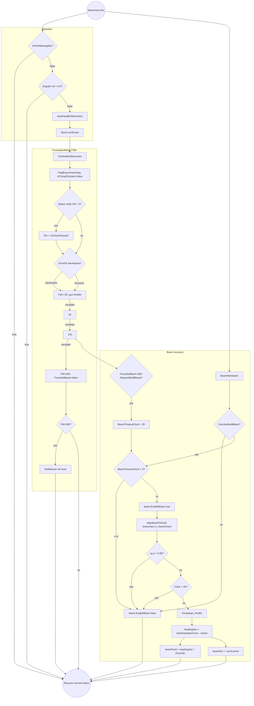

# Stuck / Unjam FSM

> **Category:** Movement & Pathing
> **Timing:** FrustrationMeter ladder (Operations) + BeamTimeoutClock (render-frame Maintainer) catalogued in [21 Timing & Cadence Register](21_timing-cadence.md).

## Summary

The stuck/unjam FSM detects when a tech cannot make progress toward its goal and escalates corrective action through a frustration-meter state machine. Detection is gated by `IsTechMovingAbs/Signed/Actual`, which combines a linear-velocity test with an angular-velocity fallback so deliberate pivots (bad turn-radius twitches) don't snowball into a full unjam cycle. Once stuck is confirmed, `TryHandleObstruction` accumulates `FrustrationMeter` across four thresholds (25 / 120 / 240 / 260): gun-throttle, weapon-fire (`RemoveObstruction`), beam-force (`ForceSetBeam`), and timeout reset (`SettleDown`). When the beam phase activates, `BeamMaintainer` enables the TankBeam, `AlignBeamToGoal` overwrites the hover orientation toward the goal (correcting the vanilla post-beam misalignment), and `TankBeamPatches.OnUpdate_Postfix` injects a goal-aligned push/turn every frame (replacing the vanilla world-east hardcode). Soft decay bleeds the meter whenever genuine motion resumes, so brief stalls don't escalate.

## Entry points

| Entry point | File:line | Trigger | Role |
|---|---|---|---|
| `IsTechMovingAbs(float minSpeed)` | [TankAIHelper.cs:2565](../Modified/TACtical_AI-master/TACtical_AI-master/TAC_AI/AI/TankAIHelper.cs) | Movement check from any controller | Stuck-detection gate with angular fallback |
| `IsTechMovingActual(float minSpeed)` | [TankAIHelper.cs:2589](../Modified/TACtical_AI-master/TACtical_AI-master/TAC_AI/AI/TankAIHelper.cs) | Strict movement check | No-throttle-bypass stuck gate |
| `AutoHandleObstruction(ref EControlOperatorSet, ...)` | [TankAIHelper.cs:4262](../Modified/TACtical_AI-master/TACtical_AI-master/TAC_AI/AI/TankAIHelper.cs) | Wrapper called by movement controllers | Boolean gate → `TryHandleObstruction` |
| `TryHandleObstruction(...)` | [TankAIHelper.cs:4271](../Modified/TACtical_AI-master/TACtical_AI-master/TAC_AI/AI/TankAIHelper.cs) | Confirmed stuck | FSM body + meter accumulation |
| `BeamMaintainer(TankControl, TankAIHelper, Tank)` | [AIEBeam.cs:25](../Modified/TACtical_AI-master/TACtical_AI-master/TAC_AI/AI/AIEBeam.cs) | Every movement-control tick | Beam lifecycle (enable / align / decrement / release) |
| `TankBeamPatches.OnUpdate_Postfix(TankBeam)` | [GlobalPatches.cs:147](../Modified/TACtical_AI-master/TACtical_AI-master/TAC_AI/PatchBatch/GlobalPatches.cs) | Every beam-active frame | Goal-aligned nudge injection (`m_NudgeStrafe` / `m_NudgeRotate`) |
| `RemoveObstruction(float searchRad = 12)` | [TankAIHelper.cs:4465](../Modified/TACtical_AI-master/TACtical_AI-master/TAC_AI/AI/TankAIHelper.cs) | Meter > `UnjamUpdateFire` (25) | Acquire obstacle, mark stale obstacle for re-acquisition |

## Flow



## Node reference

| Node | File:line | Role |
|---|---|---|
| `IsTechMovingAbs` | [TankAIHelper.cs:2342](../Modified/TACtical_AI-master/TACtical_AI-master/TAC_AI/AI/TankAIHelper.cs) | Stuck gate; short-circuits if `IsTryingToUnjam`; angular fallback at line 2360 |
| `IsTechMovingSigned` | [TankAIHelper.cs:2363](../Modified/TACtical_AI-master/TACtical_AI-master/TAC_AI/AI/TankAIHelper.cs) | Signed variant for backward checks; fallback at line 2382 |
| `IsTechMovingActual` | [TankAIHelper.cs:2385](../Modified/TACtical_AI-master/TACtical_AI-master/TAC_AI/AI/TankAIHelper.cs) | Strict variant (no throttle bypass); fallback at line 2401 |
| `AutoHandleObstruction` | [TankAIHelper.cs:4122](../Modified/TACtical_AI-master/TACtical_AI-master/TAC_AI/AI/TankAIHelper.cs) | Calls `TryHandleObstruction` when `!IsTechMovingAbs(EstTopSped / div)` |
| `TryHandleObstruction` | [TankAIHelper.cs:4131](../Modified/TACtical_AI-master/TACtical_AI-master/TAC_AI/AI/TankAIHelper.cs) | FSM body: soft decay, direction branch, threshold ladder |
| Soft decay block | [TankAIHelper.cs:4147-4152](../Modified/TACtical_AI-master/TACtical_AI-master/TAC_AI/AI/TankAIHelper.cs) | `FrustrationMeter -= max(1, AIClockPeriod/2)` when motion detected |
| Backwards branch | [TankAIHelper.cs:4154-4220](../Modified/TACtical_AI-master/TACtical_AI-master/TAC_AI/AI/TankAIHelper.cs) | `DriveVar = -1`; thresholds at 4178/4187/4204 |
| Forwards branch | [TankAIHelper.cs:4222-4287](../Modified/TACtical_AI-master/TACtical_AI-master/TAC_AI/AI/TankAIHelper.cs) | `DriveVar = 1`; thresholds at 4245/4254/4271 |
| Backwards `SettleDown` exit | [TankAIHelper.cs:4184](../Modified/TACtical_AI-master/TACtical_AI-master/TAC_AI/AI/TankAIHelper.cs) | FM > `UnjamUpdateEnd` |
| Forwards `SettleDown` exit | [TankAIHelper.cs:4251](../Modified/TACtical_AI-master/TACtical_AI-master/TAC_AI/AI/TankAIHelper.cs) | FM > `UnjamUpdateEnd` |
| Backwards `ForceSetBeam=true` | [TankAIHelper.cs:4201](../Modified/TACtical_AI-master/TACtical_AI-master/TAC_AI/AI/TankAIHelper.cs) | 120 < FM <= 240 phase |
| Forwards `ForceSetBeam=true` | [TankAIHelper.cs:4268](../Modified/TACtical_AI-master/TACtical_AI-master/TAC_AI/AI/TankAIHelper.cs) | 120 < FM <= 240 phase |
| `RemoveObstruction` | [TankAIHelper.cs:4316](../Modified/TACtical_AI-master/TACtical_AI-master/TAC_AI/AI/TankAIHelper.cs) | Acquires `Obst` via `GetObstruction`, sets `FIRE_ALL = true` |
| `GetObstruction` | [TankAIHelper.cs:4289](../Modified/TACtical_AI-master/TACtical_AI-master/TAC_AI/AI/TankAIHelper.cs) | Queries `AIEPathing.ObstructionAwareness`, returns closest |
| `SettleDown` | [TankAIHelper.cs:4325](../Modified/TACtical_AI-master/TACtical_AI-master/TAC_AI/AI/TankAIHelper.cs) | Full reset of meter / urgency / `Obst` / unjam / beam flags |
| `FlagBusyUnstucking` | [AIEnums.cs:188](../Modified/TACtical_AI-master/TACtical_AI-master/TAC_AI/AIEnums.cs) | Sets `DriveDest = AvoidenceActive`, `DriveDir = Neutral` |
| `BeamMaintainer` | [AIEBeam.cs:17](../Modified/TACtical_AI-master/TACtical_AI-master/TAC_AI/AI/AIEBeam.cs) | Beam state machine; gate at 21, clock at 28, release at 49 |
| `ForceSetBeam` trigger | [AIEBeam.cs:63-66](../Modified/TACtical_AI-master/TACtical_AI-master/TAC_AI/AI/AIEBeam.cs) | Sets `BeamTimeoutClock = 35` when `ForceSetBeam && RequestBuildBeam` |
| `AlignBeamToGoal` | [AIEBeam.cs:165](../Modified/TACtical_AI-master/TACtical_AI-master/TAC_AI/AI/AIEBeam.cs) | Reflection-overwrites `m_HoverOrient` toward `lastDestinationCore` |
| `hoverOrient` FieldInfo | [AIEBeam.cs:14-15](../Modified/TACtical_AI-master/TACtical_AI-master/TAC_AI/AI/AIEBeam.cs) | Static reflection handle for `TankBeam.m_HoverOrient` |
| `OnUpdate_Postfix` | [GlobalPatches.cs:147](../Modified/TACtical_AI-master/TACtical_AI-master/TAC_AI/PatchBatch/GlobalPatches.cs) | Patches `TankBeam.OnUpdate` to inject nudges every frame |
| Nudge heading calc | [GlobalPatches.cs:169-171](../Modified/TACtical_AI-master/TACtical_AI-master/TAC_AI/PatchBatch/GlobalPatches.cs) | `headingVec = (lastDestinationCore - centre).ToVector2XZ().normalized` |
| Nudge turn calc | [GlobalPatches.cs:173-194](../Modified/TACtical_AI-master/TACtical_AI-master/TAC_AI/PatchBatch/GlobalPatches.cs) | `IsTryingToUnjam` -> perp steering; else direction-dependent |
| Nudge `beamRot` write | [GlobalPatches.cs:195](../Modified/TACtical_AI-master/TACtical_AI-master/TAC_AI/PatchBatch/GlobalPatches.cs) | `beamRot.SetValue(__instance, -turnControl)` |
| Nudge `beamPush` write (DriveVar) | [GlobalPatches.cs:204-207](../Modified/TACtical_AI-master/TACtical_AI-master/TAC_AI/PatchBatch/GlobalPatches.cs) | `headingVec * DriveVar` -> local-space push (overrides vanilla world-east) |

## Key data / state

| Symbol | Definition | Purpose |
|---|---|---|
| `FrustrationMeter` | [TankAIHelper.cs:253](../Modified/TACtical_AI-master/TACtical_AI-master/TAC_AI/AI/TankAIHelper.cs) `internal int = 0` | Tardiness buildup; drives FSM threshold ladder |
| `ForceSetBeam` | `bool` on `TankAIHelper` | Set true at FM phase 3 (120<FM<=240); cleared at phase 4 and in `SettleDown` |
| `BeamTimeoutClock` | `int` on `TankAIHelper` | Counts up while beam active; reset to 35 on force-trigger, 0 on upright or > 40 |
| `RequestBuildBeam` | `bool` on `TankAIHelper` | Gate for build-beam usage; required alongside `ForceSetBeam` to set the clock |
| `Urgency`, `UrgencyOverload` | `float` on `TankAIHelper` | Secondary safety meter; overload > 180 forces `EstTopSped=1` & `AvoidStuff=true` ([TankAIHelper.cs:4161](../Modified/TACtical_AI-master/TACtical_AI-master/TAC_AI/AI/TankAIHelper.cs) / [4228](../Modified/TACtical_AI-master/TACtical_AI-master/TAC_AI/AI/TankAIHelper.cs)) |
| `IsTryingToUnjam` | `bool` on `TankAIHelper` | Latched at FM > `UnjamUpdateStart`; short-circuits `IsTechMoving*` |
| `Obst` | `Transform` on `TankAIHelper` | Current obstacle target for `RemoveObstruction` weapon fire |
| `UnjamUpdateFire` = 25 | [AIGlobals.cs:274](../Modified/TACtical_AI-master/TACtical_AI-master/TAC_AI/AIGlobals.cs) | Threshold 1: enter fire phase |
| `UnjamUpdateStart` = 120 | [AIGlobals.cs:275](../Modified/TACtical_AI-master/TACtical_AI-master/TAC_AI/AIGlobals.cs) | Threshold 2: set `IsTryingToUnjam=true` |
| `UnjamUpdateTicks` = 120 | [AIGlobals.cs:276](../Modified/TACtical_AI-master/TACtical_AI-master/TAC_AI/AIGlobals.cs) | Span Start -> Drop |
| `UnjamUpdateEndDelay` = 20 | [AIGlobals.cs:277](../Modified/TACtical_AI-master/TACtical_AI-master/TAC_AI/AIGlobals.cs) | Span Drop -> End |
| `UnjamUpdateDrop` = 240 | [AIGlobals.cs:280](../Modified/TACtical_AI-master/TACtical_AI-master/TAC_AI/AIGlobals.cs) | Threshold 3: clear `ForceSetBeam`, drop tech |
| `UnjamUpdateEnd` = 260 | [AIGlobals.cs:281](../Modified/TACtical_AI-master/TACtical_AI-master/TAC_AI/AIGlobals.cs) | Threshold 4: `SettleDown` reset |
| `AngularProgressThreshold` = 0.5 rad/s | [AIGlobals.cs:285](../Modified/TACtical_AI-master/TACtical_AI-master/TAC_AI/AIGlobals.cs) | ~28 deg/sec — pivot counts as progress |
| `UrgencyOverloadReconsideration` = 180 | [AIGlobals.cs:279](../Modified/TACtical_AI-master/TACtical_AI-master/TAC_AI/AIGlobals.cs) | Triggers top-speed re-estimate |

### Soft-decay rule

`if (FrustrationMeter > 0 && rbody && (velocity.sqrMagnitude > 0.25 || |angularVelocity.y| > AngularProgressThreshold)) FrustrationMeter = max(0, FM - max(1, AIClockPeriod/2));` — [TankAIHelper.cs:4147-4152](../Modified/TACtical_AI-master/TACtical_AI-master/TAC_AI/AI/TankAIHelper.cs). Reads `rbody.velocity` directly because `recentSpeed` is floored at 1f.

### FSM phase table

| Range | Phase | DriveVar (bwd / fwd) | ForceSetBeam | Action | File:line |
|---|---|---|---|---|---|
| 0-24 | Throttle baseline | -1 / +1 | false | `FrustrationMeter += AIClockPeriod` | [4214-4219](../Modified/TACtical_AI-master/TACtical_AI-master/TAC_AI/AI/TankAIHelper.cs) / [4281-4286](../Modified/TACtical_AI-master/TACtical_AI-master/TAC_AI/AI/TankAIHelper.cs) |
| 25-119 | Fire phase | -0.5 / +0.5 | false | `RemoveObstruction()` | [4204-4212](../Modified/TACtical_AI-master/TACtical_AI-master/TAC_AI/AI/TankAIHelper.cs) / [4271-4279](../Modified/TACtical_AI-master/TACtical_AI-master/TAC_AI/AI/TankAIHelper.cs) |
| 120-239 | Beam force | +1 / -1 | **true** | `DriveToFacingTowards` / `DriveAwayFacingTowards` | [4195-4202](../Modified/TACtical_AI-master/TACtical_AI-master/TAC_AI/AI/TankAIHelper.cs) / [4262-4269](../Modified/TACtical_AI-master/TACtical_AI-master/TAC_AI/AI/TankAIHelper.cs) |
| 240-260 | Beam drop | +1 / -1 | **false** | Continue beam-active, awaiting upright/timeout | [4187-4194](../Modified/TACtical_AI-master/TACtical_AI-master/TAC_AI/AI/TankAIHelper.cs) / [4254-4261](../Modified/TACtical_AI-master/TACtical_AI-master/TAC_AI/AI/TankAIHelper.cs) |
| > 260 | Reset | 0 | false | `SettleDown()` -> return | [4184](../Modified/TACtical_AI-master/TACtical_AI-master/TAC_AI/AI/TankAIHelper.cs) / [4251](../Modified/TACtical_AI-master/TACtical_AI-master/TAC_AI/AI/TankAIHelper.cs) |

## Exit points

| Exit | Condition | State after | File:line |
|---|---|---|---|
| Motion restored (gate skip) | `IsTechMovingAbs() == true` | `AutoHandleObstruction` returns false; FSM not entered | [TankAIHelper.cs:4124](../Modified/TACtical_AI-master/TACtical_AI-master/TAC_AI/AI/TankAIHelper.cs) |
| Soft-decay bleed | Motion AND FM > 0 | `FrustrationMeter -= max(1, AIClockPeriod/2)` | [TankAIHelper.cs:4151](../Modified/TACtical_AI-master/TACtical_AI-master/TAC_AI/AI/TankAIHelper.cs) |
| FSM timeout (backwards) | `FM > UnjamUpdateEnd` (260) | `SettleDown()`; `return` | [TankAIHelper.cs:4184](../Modified/TACtical_AI-master/TACtical_AI-master/TAC_AI/AI/TankAIHelper.cs) |
| FSM timeout (forwards) | `FM > UnjamUpdateEnd` (260) | `SettleDown()`; `return` | [TankAIHelper.cs:4251](../Modified/TACtical_AI-master/TACtical_AI-master/TAC_AI/AI/TankAIHelper.cs) |
| Beam upright release | `rootBlockTrans.up.y > 0.95` | `BeamTimeoutClock = 0` -> `EnableBeam(false)` next tick | [AIEBeam.cs:39](../Modified/TACtical_AI-master/TACtical_AI-master/TAC_AI/AI/AIEBeam.cs) |
| Beam timeout release | `BeamTimeoutClock > 40` | `BeamTimeoutClock = 0` | [AIEBeam.cs:41-44](../Modified/TACtical_AI-master/TACtical_AI-master/TAC_AI/AI/AIEBeam.cs) |
| Beam disable (no build-beam) | `!CanUseBuildBeam` | `beam.EnableBeam(false)` | [AIEBeam.cs:23-24](../Modified/TACtical_AI-master/TACtical_AI-master/TAC_AI/AI/AIEBeam.cs) |
| External `SettleDown` | Called by caller (task abort, etc.) | Full reset | [TankAIHelper.cs:4325](../Modified/TACtical_AI-master/TACtical_AI-master/TAC_AI/AI/TankAIHelper.cs) |

## Cross-pipeline integration

- **Pipeline 8 (Movement controllers)** — Ground / air / sea movement controllers all call `AutoHandleObstruction` from their drive directors. Ground controller is the primary client; air handoff is detected at [AIEBeam.cs:51](../Modified/TACtical_AI-master/TACtical_AI-master/TAC_AI/AI/AIEBeam.cs) where `AIControllerAir` short-circuits the beam unless grounded and above terrain.
- **Weapons pipeline** — `RemoveObstruction` sets `FIRE_ALL = true`, which the weapon-fire pipeline reads to engage scenery / obstacle blocks with all armed weapons.
- **Pathing / `AIEPathing`** — `GetObstruction` queries `AIEPathing.ObstructionAwareness(center, helper, radius)` to discover visible blockers; the FSM does **not** request a fresh path while unjamming (relies on `FlagBusyUnstucking` to suppress pathing).
- **Multi-tech beam coordination** — `BeamMaintainer` short-circuits when `IsMultiTech` (host beam controls the link); the slave snaps to host transform at [AIEBeam.cs:92-105](../Modified/TACtical_AI-master/TACtical_AI-master/TAC_AI/AI/AIEBeam.cs) instead of running its own beam.
- **Control core (`AIEnums`)** — `FlagBusyUnstucking` ([AIEnums.cs:188](../Modified/TACtical_AI-master/TACtical_AI-master/TAC_AI/AIEnums.cs)) locks `DriveDest = AvoidenceActive` / `DriveDir = Neutral` so other movement decisions don't override the unjam attempt. `DriveToFacingTowards` / `DriveAwayFacingTowards` set the destination semantics consumed by `OnUpdate_Postfix` for nudge direction.

## Issues

**NONE.**

If a new issue is found in this pipeline, replace `NONE.` above and add it under the matching heading, using a stable ID (`BUG-N`, `DEAD-N`, or `TD-N`) and a clickable `file.cs:line` link. Format:

```text
### Bugs
- **BUG-1 (High | Medium | Low)** - [File.cs:line](path) - what is wrong, and the intended fix.

### Dead code
- **DEAD-1** - [File.cs:line](path) - what is orphaned or unreachable, and why.

### Tech debt
- **TD-1** - [File.cs:line](path) - the smell, and the cleaner shape.
```
