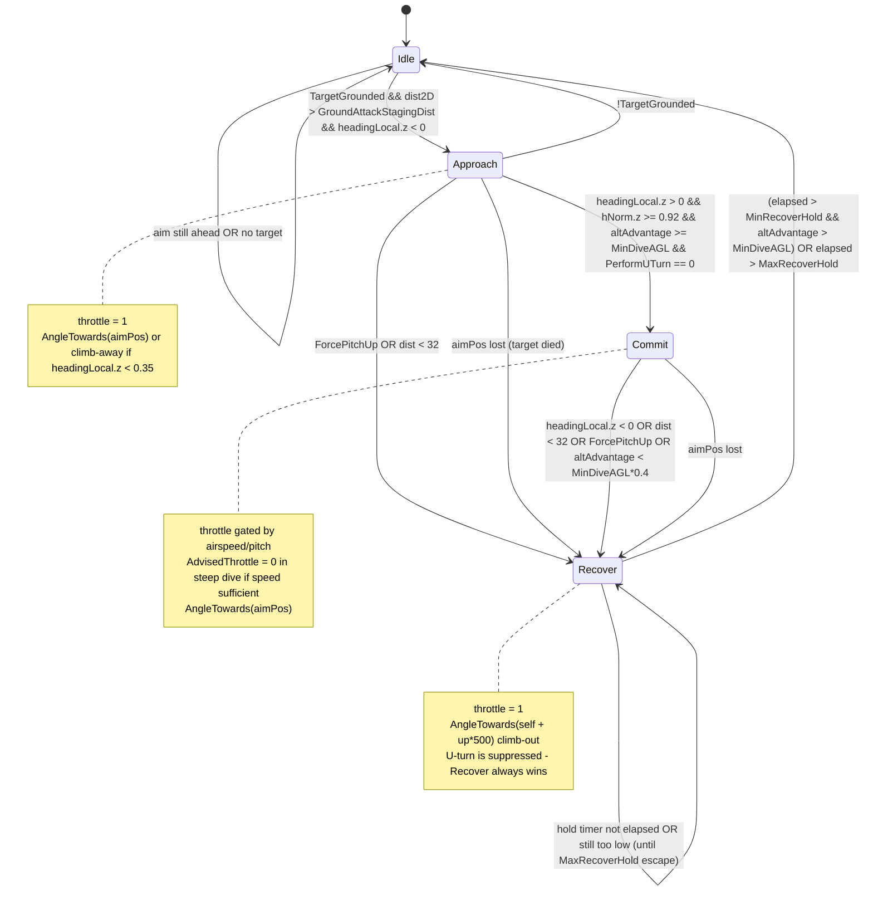

# Dive Attack FSM (AirplaneAICore)

> **Category:** Movement & Pathing
> **Timing:** dive FSM runs on the render-frame Maintainer (MinRecoverHold/MaxRecoverHold/MinDiveAGL) — catalogued in [21 Timing & Cadence Register](21_timing-cadence.md).

## Summary

The Dive Attack FSM is a 4-state machine (`Idle / Approach / Commit / Recover`) embedded in [AirplaneAICore.cs:22-32](../Modified/TACtical_AI-master/TACtical_AI-master/TAC_AI/AI/Movement/AICores/AirplaneAICore.cs). It replaces a previously scattered set of `PerformDiveAttack` integer writes; the integer is now a read-only HUD shim derived from `diveState`. The FSM is ticked once per `DriveMaintainer` call and is the *only* path that allows the airplane to point its nose at the ground.

Critical design points:

- **Approach -> Commit is gated by altitude advantage** (`MyAGLAboveTarget` >= `AIGlobals.MinDiveAGL`, 60 m). This prevents a stale or `Vector3.zero` aim point from flying the plane into terrain (the "world-origin nose-dive" bug surface).
- **The aim point has its own priority resolver** (`ResolveAimPos`) that intentionally reads `lastDestinationOp` (the upstream operator intent), *not* `lastDestinationCore` (which `DriveDirector` overwrites and can default to `Vector3.zero`). The cached `lastDestinationOp` fallback is additionally gated on `!helper.IsControlOperatorStale` and bounded by `AIGlobals.DiveCachedAimMaxRange` (2000 m) so a stale, map-distant operator goal cannot spin up an Approach.
- **A loss of target during a dive forces `Recover`** with a synthetic 500 m climb-out aim point.
- **Recover has a minimum hold timer** (`MinRecoverHold`, 1.5 s) so the FSM cannot oscillate Recover <-> Idle, plus a **max-hold escape** (`MaxRecoverHold`, 8 s) so an unsatisfiable altitude clause cannot wedge the FSM in Recover forever.
- **U-Turn (Immelmann) is mutually exclusive with the dive states except in Recover** — Recover always proceeds (climb-out has priority over U-turn). The U-turn dispatch is a single shared helper (`TryRunUTurn`) called by both the post-FSM cruise fall-through and the FSM; the FSM keeps the `diveState != Recover` exemption at its call site.
- **The airplane-wide hard pitch clamp** `AircraftMaxDive` (0.75) in `AngleTowards` is the final safety net regardless of FSM state.

---

## Entry points

| # | Entry | Location | Notes |
|---|-------|----------|-------|
| E1 | `TankAIHelper.UpdateTechControl` -> `MovementController.DriveMaintainer(ref ControlCore)` | [TankAIHelper.cs:2925](../Modified/TACtical_AI-master/TACtical_AI-master/TAC_AI/AI/TankAIHelper.cs) (method at `:2833`) | Top-level per-tick movement dispatch (inside try/catch). |
| E2 | `AIControllerAir.DriveMaintainer(ref core)` -> `AICore.DriveMaintainer(helper, tank, ref core)` | [AIControllerAir.cs:447, call at :466](../Modified/TACtical_AI-master/TACtical_AI-master/TAC_AI/AI/Movement/AIControllerAir.cs) | Forwards into the per-mode AICore. `Tank.beam.IsActive` short-circuits earlier (line 457). |
| E3 | `AirplaneAICore.DriveMaintainer(...)` | [AirplaneAICore.cs:51](../Modified/TACtical_AI-master/TACtical_AI-master/TAC_AI/AI/Movement/AICores/AirplaneAICore.cs) | Drive-pipeline override; the only caller of `TickDiveStateMachine`. |
| E4 | `AirplaneAICore.TickDiveStateMachine(helper, tank, aimPosOpt)` | [AirplaneAICore.cs:205](../Modified/TACtical_AI-master/TACtical_AI-master/TAC_AI/AI/Movement/AICores/AirplaneAICore.cs) (called from `:116`) | The FSM proper. |
| E5 | `AirplaneAICore.ResolveAimPos(helper, tank)` | [AirplaneAICore.cs:151](../Modified/TACtical_AI-master/TACtical_AI-master/TAC_AI/AI/Movement/AICores/AirplaneAICore.cs) | Aim-point priority resolver (enemy -> resource -> base -> cached `lastDestinationOp`). |
| HUD | `AirplaneAICore.PerformDiveAttack` (get-only int) | [AirplaneAICore.cs:26-32](../Modified/TACtical_AI-master/TACtical_AI-master/TAC_AI/AI/Movement/AICores/AirplaneAICore.cs) | Read by `TankAIHelper` HUD status text at `TankAIHelper.cs:1838-1851`. |

Per-tick gating logic in `DriveMaintainer` ([AirplaneAICore.cs:108-128](../Modified/TACtical_AI-master/TACtical_AI-master/TAC_AI/AI/Movement/AICores/AirplaneAICore.cs)):

```csharp
Vector3? aimPosOpt = ResolveAimPos(helper, tank);
bool diveEligible = pilot.TargetGrounded && aimPosOpt.HasValue;
if (diveEligible || diveState != DiveState.Idle) {
    TickDiveStateMachine(helper, tank, aimPosOpt);
    if (diveState != DiveState.Idle) return true;   // FSM owns this tick
    // else fall through to cruise
}

if (TryRunUTurn(helper, tank))   // shared U-turn / reorient dispatch
    return true;
```

`pilot.TargetGrounded` is assigned upstream in `DriveDirectorEnemy` / `DriveDirector` branches via `AIEPathing.AboveHeightFromGround(...)`.

---

## Flow



---

## Node reference

| Node | Location | Purpose / Transitions & Gates |
|------|----------|-------------------------------|
| `enum DiveState { Idle, Approach, Commit, Recover }` | [AirplaneAICore.cs:22](../Modified/TACtical_AI-master/TACtical_AI-master/TAC_AI/AI/Movement/AICores/AirplaneAICore.cs) | FSM state definition. |
| `internal DiveState diveState = DiveState.Idle;` | [AirplaneAICore.cs:23](../Modified/TACtical_AI-master/TACtical_AI-master/TAC_AI/AI/Movement/AICores/AirplaneAICore.cs) | Current FSM state (only writer: `TransitionTo`). |
| `private float diveStateEnteredAt = 0f;` | [AirplaneAICore.cs:24](../Modified/TACtical_AI-master/TACtical_AI-master/TAC_AI/AI/Movement/AICores/AirplaneAICore.cs) | Timestamp for Recover hold/escape timers. |
| `PerformDiveAttack` getter (int 0/1/2/3) | [AirplaneAICore.cs:26-32](../Modified/TACtical_AI-master/TACtical_AI-master/TAC_AI/AI/Movement/AICores/AirplaneAICore.cs) | HUD-compatibility shim derived from `diveState`. |
| `TransitionTo(DiveState next)` | [AirplaneAICore.cs:140-144](../Modified/TACtical_AI-master/TACtical_AI-master/TAC_AI/AI/Movement/AICores/AirplaneAICore.cs) | Assigns `diveState` and stamps `diveStateEnteredAt = Time.time`. |
| `ResolveAimPos(helper, tank)` | [AirplaneAICore.cs:151-171](../Modified/TACtical_AI-master/TACtical_AI-master/TAC_AI/AI/Movement/AICores/AirplaneAICore.cs) | Priority: `lastEnemyGet.tank.boundsCentreWorldNoCheck` -> `theResource.tank.boundsCentreWorldNoCheck` (else `theResource.centrePosition`) -> `theBase.boundsCentreWorldNoCheck` -> cached `lastDestinationOp` if non-zero, `!IsControlOperatorStale`, and within `DiveCachedAimMaxRange` (2 km). Returns `null` otherwise. |
| `MyAGLAboveTarget(aimPos, tank)` | [AirplaneAICore.cs:175-180](../Modified/TACtical_AI-master/TACtical_AI-master/TAC_AI/AI/Movement/AICores/AirplaneAICore.cs) | Uses `AIEPathMapper.GetAltitudeLoadedOnly` when terrain is loaded; falls back to raw Y-delta. |
| `TryRunUTurn(helper, tank)` | [AirplaneAICore.cs:185-203](../Modified/TACtical_AI-master/TACtical_AI-master/TAC_AI/AI/Movement/AICores/AirplaneAICore.cs) | Shared U-turn / reorient dispatch. `PerformUTurn > 0` -> `UTurn`; `== -1` -> PathPointSet reorient. Returns `true` if the tick was consumed. Caller owns state gating (the FSM's Recover exemption). |
| `TickDiveStateMachine(helper, tank, aimPosNullable)` | [AirplaneAICore.cs:205-317](../Modified/TACtical_AI-master/TACtical_AI-master/TAC_AI/AI/Movement/AICores/AirplaneAICore.cs) | Main FSM tick. Sections below. |
| Lost-target override -> Recover | [AirplaneAICore.cs:208-214](../Modified/TACtical_AI-master/TACtical_AI-master/TAC_AI/AI/Movement/AICores/AirplaneAICore.cs) | When `!aimPosNullable.HasValue` and state != Idle/Recover, force Recover with synthetic `tank.boundsCentre + up*500` aim. |
| Vector setup (`posOffset`, `dist`, `dist2D`, `headingLocal`, `hNorm`, `altAdvantage`) | [AirplaneAICore.cs:217-222](../Modified/TACtical_AI-master/TACtical_AI-master/TAC_AI/AI/Movement/AICores/AirplaneAICore.cs) | Geometry used by transitions and bodies. |
| `Idle -> Approach` | [AirplaneAICore.cs:232-233](../Modified/TACtical_AI-master/TACtical_AI-master/TAC_AI/AI/Movement/AICores/AirplaneAICore.cs) | Gate: `pilot.TargetGrounded && dist2D > AIGlobals.GroundAttackStagingDist && headingLocal.z < 0`. |
| `Approach -> Idle` | [AirplaneAICore.cs:240-241](../Modified/TACtical_AI-master/TACtical_AI-master/TAC_AI/AI/Movement/AICores/AirplaneAICore.cs) | Gate: `!pilot.TargetGrounded` (target stopped being a ground target -> stand down). |
| `Approach -> Recover` | [AirplaneAICore.cs:242-243](../Modified/TACtical_AI-master/TACtical_AI-master/TAC_AI/AI/Movement/AICores/AirplaneAICore.cs) | Gate: `pilot.ForcePitchUp || dist < 32f` (aborted pass). Symmetric with the Commit case: gets the MinRecoverHold dwell + guaranteed climb-out instead of dropping to Idle. |
| `Approach -> Commit` | [AirplaneAICore.cs:244-247](../Modified/TACtical_AI-master/TACtical_AI-master/TAC_AI/AI/Movement/AICores/AirplaneAICore.cs) | Gate (all must hold): `headingLocal.z > 0 && hNorm.z >= 0.92f && altAdvantage >= AIGlobals.MinDiveAGL && PerformUTurn == 0`. The 0.92 threshold ~= 23 degrees cone alignment. |
| `Commit -> Recover` | [AirplaneAICore.cs:250-252](../Modified/TACtical_AI-master/TACtical_AI-master/TAC_AI/AI/Movement/AICores/AirplaneAICore.cs) | Gate: `headingLocal.z < 0 || dist < 32f || pilot.ForcePitchUp || altAdvantage < AIGlobals.MinDiveAGL * 0.4f`. |
| `Recover -> Idle` | [AirplaneAICore.cs:259-262](../Modified/TACtical_AI-master/TACtical_AI-master/TAC_AI/AI/Movement/AICores/AirplaneAICore.cs) | Gate: `(Time.time - diveStateEnteredAt > AIGlobals.MinRecoverHold && altAdvantage > AIGlobals.MinDiveAGL) || Time.time - diveStateEnteredAt > AIGlobals.MaxRecoverHold` (the second clause is the max-hold escape hatch). |
| Early-return when Idle | [AirplaneAICore.cs:266](../Modified/TACtical_AI-master/TACtical_AI-master/TAC_AI/AI/Movement/AICores/AirplaneAICore.cs) | FSM stops, `DriveMaintainer` falls through to cruise. |
| U-turn integration (Recover exempt) | [AirplaneAICore.cs:270-271](../Modified/TACtical_AI-master/TACtical_AI-master/TAC_AI/AI/Movement/AICores/AirplaneAICore.cs) | If `diveState != Recover && TryRunUTurn(...)`, the shared helper runs `UTurn` / PathPointSet re-orient and the tick returns. |
| Approach body | [AirplaneAICore.cs:276-295](../Modified/TACtical_AI-master/TACtical_AI-master/TAC_AI/AI/Movement/AICores/AirplaneAICore.cs) | `MainThrottle = 1`. If `headingLocal.z < 0.35`, build climb-away vector (`self + AwayFlat*1000`). Else `AngleTowards(LargeAircraft ? PathPointSet : aimPos)`. |
| Commit body | [AirplaneAICore.cs:296-305](../Modified/TACtical_AI-master/TACtical_AI-master/TAC_AI/AI/Movement/AICores/AirplaneAICore.cs) | Throttle gate: full throttle if `GetSpeed() < AirStallSpeed + 16f` (58 m/s) or `headingLocal.y > -0.25f`; else `AdvisedThrottle = 0` (idle in dive, gravity-fed). `AngleTowards(LargeAircraft ? PathPointSet : aimPos)`. |
| Recover body | [AirplaneAICore.cs:306-315](../Modified/TACtical_AI-master/TACtical_AI-master/TAC_AI/AI/Movement/AICores/AirplaneAICore.cs) | `MainThrottle = 1`, `AngleTowards(tank.boundsCentre + Vector3.up * 500f)`. |
| `AngleTowards` | [AirplaneAICore.cs:1337-1481](../Modified/TACtical_AI-master/TACtical_AI-master/TAC_AI/AI/Movement/AICores/AirplaneAICore.cs) | Common steering output. AGL-too-low -> `EmergencyUp = true` (`(0,1.45,0) + forwardFlat`, `:1357`). Hard pitch clamp `noseDirect.y < -AircraftMaxDive` -> `-0.75` (`:1359-1362`). Target-behind level-off (`:1363-1374`). Final write `helper.ProcessControl(...)` at `:1481`. |
| `UTurn` (Immelmann) | [AirplaneAICore.cs:1184-1247](../Modified/TACtical_AI-master/TACtical_AI-master/TAC_AI/AI/Movement/AICores/AirplaneAICore.cs) | Multi-stage `PerformUTurn` int: 1=accelerate, 2=pitch up, 3=aim back at target inverted, 4=roll level. `-1` = abort/reorient via PathPointSet. Abort on stall or ballistic descent; `>3` failures permanently disable Immelmann. |

---

## Key data / state

### `PerformDiveAttack` (HUD shim)
[AirplaneAICore.cs:26-32](../Modified/TACtical_AI-master/TACtical_AI-master/TAC_AI/AI/Movement/AICores/AirplaneAICore.cs) — read-only int derived from `diveState`: `Approach => 1`, `Commit => 2`, `Recover => 3`, otherwise `0`. Read by `TankAIHelper.cs:1838-1851` to render `AILOC.Fly_Dive`/`Fly_Dive2` status strings. Backward-compatible with old scattered integer writes.

### `diveStateEnteredAt`
[AirplaneAICore.cs:24](../Modified/TACtical_AI-master/TACtical_AI-master/TAC_AI/AI/Movement/AICores/AirplaneAICore.cs) — `Time.time` stamp set by `TransitionTo`. Used by the `Recover -> Idle` hold timer (`elapsed > MinRecoverHold`) and the max-hold escape (`elapsed > MaxRecoverHold`).

### `MinDiveAGL`
[AIGlobals.cs:466](../Modified/TACtical_AI-master/TACtical_AI-master/TAC_AI/AIGlobals.cs) — `60f`. Minimum altitude advantage (meters) over the ground at the aim column required to commit to a dive. Also gates `Recover -> Idle` (must exceed full `MinDiveAGL`) and triggers `Commit -> Recover` (`altAdvantage < MinDiveAGL * 0.4f` = 24 m danger zone).

### `MinRecoverHold`
[AIGlobals.cs:468](../Modified/TACtical_AI-master/TACtical_AI-master/TAC_AI/AIGlobals.cs) — `1.5f` seconds. Minimum dwell time in Recover before re-arming. Prevents Recover <-> Idle oscillation under noisy gate conditions.

### `MaxRecoverHold`
[AIGlobals.cs:473](../Modified/TACtical_AI-master/TACtical_AI-master/TAC_AI/AIGlobals.cs) — `8f` seconds. Hard ceiling on time in Recover. An underpowered tech or a rising ground reference can keep `altAdvantage <= MinDiveAGL` indefinitely; this escape forces `Recover -> Idle` regardless. Re-arming is still gated by `MinDiveAGL` at `Approach -> Commit`, so the escape cannot trigger a too-low dive.

### `DiveCachedAimMaxRange`
[AIGlobals.cs:477](../Modified/TACtical_AI-master/TACtical_AI-master/TAC_AI/AIGlobals.cs) — `2000f` meters. Max distance a stale `lastDestinationOp` may sit from the aircraft and still seed a dive when no live target exists. Replaces the old inline `20000f` literal that was effectively map-wide.

### `ResolveAimPos` priority chain
[AirplaneAICore.cs:151-171](../Modified/TACtical_AI-master/TACtical_AI-master/TAC_AI/AI/Movement/AICores/AirplaneAICore.cs):

1. `helper.lastEnemyGet?.tank.boundsCentreWorldNoCheck` — live enemy target.
2. `helper.theResource.tank.boundsCentreWorldNoCheck` (else `theResource.centrePosition`) — resource pickup.
3. `helper.theBase.boundsCentreWorldNoCheck` — friendly/structural base.
4. Cached `helper.lastDestinationOp` if `!= Vector3.zero` AND `!helper.IsControlOperatorStale` AND within `AIGlobals.DiveCachedAimMaxRange` (`sqrMagnitude < DiveCachedAimMaxRange^2` = 2 km).
5. Else `null` -> FSM does not fire / forces Recover if mid-dive.

`lastDestinationOp` is the `ControlOperator.lastDestination` mirror (`TankAIHelper.cs:310`) — the upstream operator intent. The function deliberately avoids `lastDestinationCore`, which `DriveDirector` overwrites and can default to `Vector3.zero` (the world-origin nose-dive bug surface). `IsControlOperatorStale` (`TankAIHelper.cs:449`) flags when the operator goal has gone unrefreshed beyond `AIClockPeriod * 3` frames.

### Other tuning constants (`AIGlobals.cs`)

| Constant | Value | Location | Use |
|----------|-------|----------|-----|
| `GroundAttackStagingDistMain` | `275` | [AIGlobals.cs:359](../Modified/TACtical_AI-master/TACtical_AI-master/TAC_AI/AIGlobals.cs) | Attract-mode staging distance. |
| `GroundAttackStagingDist` | `120` (normal) / `275` (attract) | [AIGlobals.cs:360](../Modified/TACtical_AI-master/TACtical_AI-master/TAC_AI/AIGlobals.cs) | `Idle -> Approach` `dist2D` threshold. `IsNotAttract ? 120 : GroundAttackStagingDistMain`. |
| `AircraftMaxDive` | `0.75f` | [AIGlobals.cs:333](../Modified/TACtical_AI-master/TACtical_AI-master/TAC_AI/AIGlobals.cs) | Hard pitch clamp in `AngleTowards` (~48.6 degrees below horizon). |
| `AirStallSpeed` | `42f` | [AIGlobals.cs:358](../Modified/TACtical_AI-master/TACtical_AI-master/TAC_AI/AIGlobals.cs) | Commit throttle gate (`AirStallSpeed + 16` = 58 m/s) and U-Turn abort. |
| `GroundOffsetAircraft` | `22f` | [AIGlobals.cs:272](../Modified/TACtical_AI-master/TACtical_AI-master/TAC_AI/AIGlobals.cs) | Used in LargeAircraft AGL emergency-up trigger. |
| `ImmelmanTtWRThreshold` | `1.5f` | [AIGlobals.cs:326](../Modified/TACtical_AI-master/TACtical_AI-master/TAC_AI/AIGlobals.cs) | Init gate that sets `BankOnly`. |
| `BoosterThrustBias` | `0.5f` | [AIGlobals.cs:325](../Modified/TACtical_AI-master/TACtical_AI-master/TAC_AI/AIGlobals.cs) | Init thrust calc. |
| `MinDiveAGL` | `60f` | [AIGlobals.cs:466](../Modified/TACtical_AI-master/TACtical_AI-master/TAC_AI/AIGlobals.cs) | Altitude-advantage gate (see above). |
| `MinRecoverHold` | `1.5f` | [AIGlobals.cs:468](../Modified/TACtical_AI-master/TACtical_AI-master/TAC_AI/AIGlobals.cs) | Recover dwell floor (see above). |
| `MaxRecoverHold` | `8f` | [AIGlobals.cs:473](../Modified/TACtical_AI-master/TACtical_AI-master/TAC_AI/AIGlobals.cs) | Recover max-hold escape (see above). |
| `DiveCachedAimMaxRange` | `2000f` | [AIGlobals.cs:477](../Modified/TACtical_AI-master/TACtical_AI-master/TAC_AI/AIGlobals.cs) | Cached-aim distance bound in `ResolveAimPos` (see above). |

---

## Exit points

| # | Where the FSM hands control back | Location |
|---|----------------------------------|----------|
| X1 | `diveState == Idle` after transition; `DriveMaintainer` falls through to `TryRunUTurn` / cruise (`AngleTowards(PathPointSet)`). | [AirplaneAICore.cs:117-128, 266](../Modified/TACtical_AI-master/TACtical_AI-master/TAC_AI/AI/Movement/AICores/AirplaneAICore.cs) |
| X2 | Per-state body issues `pilot.MainThrottle = ...; pilot.UpdateThrottle(helper); AngleTowards(...)` then `DriveMaintainer` returns `true`. | [AirplaneAICore.cs:276-315 then :118](../Modified/TACtical_AI-master/TACtical_AI-master/TAC_AI/AI/Movement/AICores/AirplaneAICore.cs) |
| X3 | U-turn integration takes over (`diveState != Recover && TryRunUTurn(...)`) and returns from `TickDiveStateMachine` without applying per-state body. | [AirplaneAICore.cs:270-271](../Modified/TACtical_AI-master/TACtical_AI-master/TAC_AI/AI/Movement/AICores/AirplaneAICore.cs) |
| X4 | Recover synthetic climb aim drives `AngleTowards(self + Vector3.up * 500)`. | [AirplaneAICore.cs:314](../Modified/TACtical_AI-master/TACtical_AI-master/TAC_AI/AI/Movement/AICores/AirplaneAICore.cs) |
| X5 | `AngleTowards` final write -> `helper.ProcessControl(DriveVal, TurnVal, Vector3.zero, false, false)`. Actual exit to the vehicle control state every dive path funnels through. | [AirplaneAICore.cs:1481](../Modified/TACtical_AI-master/TACtical_AI-master/TAC_AI/AI/Movement/AICores/AirplaneAICore.cs) |
| X6 | `AirplaneAICore.DriveMaintainer` returns `true` -> `AIControllerAir.DriveMaintainer` returns -> `TankAIHelper.UpdateTechControl` continues to next subsystem. | [AirplaneAICore.cs:118, 130](../Modified/TACtical_AI-master/TACtical_AI-master/TAC_AI/AI/Movement/AICores/AirplaneAICore.cs); [AIControllerAir.cs:466](../Modified/TACtical_AI-master/TACtical_AI-master/TAC_AI/AI/Movement/AIControllerAir.cs); [TankAIHelper.cs:2925](../Modified/TACtical_AI-master/TACtical_AI-master/TAC_AI/AI/TankAIHelper.cs) |
| X7 | HUD readout: `TankAIHelper` reads `plane.PerformDiveAttack` int (1/2/3) to append `Fly_Dive` status strings; pure read, no FSM side-effects. | [TankAIHelper.cs:1838-1851](../Modified/TACtical_AI-master/TACtical_AI-master/TAC_AI/AI/TankAIHelper.cs) |
| X8 | Forced abort: `pilot.ForcePitchUp` -> Approach exits to Recover (`:242`), Commit exits to Recover (`:250`). External controller can interrupt dive; both routes get the MinRecoverHold dwell + climb-out. | [AirplaneAICore.cs:242, 250](../Modified/TACtical_AI-master/TACtical_AI-master/TAC_AI/AI/Movement/AICores/AirplaneAICore.cs) |

---

## Cross-pipeline integration

- **Parent drive pipeline:** `TankAIHelper.UpdateTechControl` calls `MovementController.DriveMaintainer(ref ControlCore)` once per tick ([TankAIHelper.cs:2925](../Modified/TACtical_AI-master/TACtical_AI-master/TAC_AI/AI/TankAIHelper.cs), method at `:2833`). `AIControllerAir.DriveMaintainer` dispatches to `AICore.DriveMaintainer` ([AIControllerAir.cs:466](../Modified/TACtical_AI-master/TACtical_AI-master/TAC_AI/AI/Movement/AIControllerAir.cs)). `AirplaneAICore.DriveMaintainer` ([AirplaneAICore.cs:51](../Modified/TACtical_AI-master/TACtical_AI-master/TAC_AI/AI/Movement/AICores/AirplaneAICore.cs)) is the only writer of `diveState` (via `TransitionTo`); when it returns `true` after a non-Idle tick the caller treats the tick as fully owned by the FSM.
- **DriveDirector / DriveDirectorEnemy:** Populate `pilot.PathPointSet` and assign `pilot.TargetGrounded` *before* `DriveMaintainer` runs ([AIControllerAir.cs:371-407](../Modified/TACtical_AI-master/TACtical_AI-master/TAC_AI/AI/Movement/AIControllerAir.cs); `AirplaneAICore.cs:463-700+`). Both feed the dive FSM via `pilot.TargetGrounded`. Post-processing on `PathPointSet` runs through `AIEPathing.OffsetFromGroundA(...)` (`:650`), `AIEPathing.ModerateMaxAlt(...)` (`:651`), `AvoidAssist(...)` (`:652`) in `DriveDirector` (and the parallel `:731-733` / `:813-815` blocks in the enemy/RTS directors).
- **U-Turn (Immelmann) handler:** `UTurn` ([AirplaneAICore.cs:1184-1247](../Modified/TACtical_AI-master/TACtical_AI-master/TAC_AI/AI/Movement/AICores/AirplaneAICore.cs)) is dispatched through the shared `TryRunUTurn` helper ([AirplaneAICore.cs:185-203](../Modified/TACtical_AI-master/TACtical_AI-master/TAC_AI/AI/Movement/AICores/AirplaneAICore.cs)). It is mutually exclusive with Approach/Commit but suspended when `diveState == Recover` ([AirplaneAICore.cs:270](../Modified/TACtical_AI-master/TACtical_AI-master/TAC_AI/AI/Movement/AICores/AirplaneAICore.cs)) — Recover always climbs. Stall (`LocalSafeVelocity.z < AirStallSpeed`, `:1189`) and ballistic descent (`Dot(down, vel.normalized) > 0.6`, `:1198`) increment `ErrorsInUTurn`; >3 disables future Immelmanns permanently.
- **`AngleTowards` final stage:** All exit paths funnel through `AngleTowards` ([AirplaneAICore.cs:1337-1481](../Modified/TACtical_AI-master/TACtical_AI-master/TAC_AI/AI/Movement/AICores/AirplaneAICore.cs)). AGL-too-low promotes `EmergencyUp = true` (LargeAircraft uses `!AboveHeightFromGround(DodgeSphereCenter, GroundOffsetAircraft)` at `:1344`; normal aircraft use `!AboveHeightFromGround(DodgeSphereCenter, lastTechExtents + 4)` at `:1349`). The hard `AircraftMaxDive` clamp (`:1359-1362`) is the final safety net regardless of FSM state. Pitch/yaw/roll computed via `AIGlobals.LookRot` divided by `FlyingChillFactor`, clamped by `AirMaxYaw` / `AirMaxYawBankOnly` (`:1393-1404`).
- **Lead prediction:** There is *no* kinematic target-lead solver in the FSM. The "predicted aim" comes from `pilot.PathPointSet`, which the upstream director computes and the `headingLocal.z >= 0.92` cone gate enforces. Commit aims at raw `aimPos` for fighters and processed `PathPointSet` for `LargeAircraft`.
- **HUD:** `TankAIHelper.cs:1838-1851` reads `plane.PerformDiveAttack` (read-only int) to append `AILOC.Fly_Dive`/`Fly_Dive2` status strings.

---

## Issues

**NONE.**

If a new issue is found in this pipeline, replace `NONE.` above and add it under the matching heading, using a stable ID (`BUG-N`, `DEAD-N`, or `TD-N`) and a clickable `file.cs:line` link. Format:

```text
### Bugs
- **BUG-1 (High | Medium | Low)** - [File.cs:line](path) - what is wrong, and the intended fix.

### Dead code
- **DEAD-1** - [File.cs:line](path) - what is orphaned or unreachable, and why.

### Tech debt
- **TD-1** - [File.cs:line](path) - the smell, and the cleaner shape.
```
