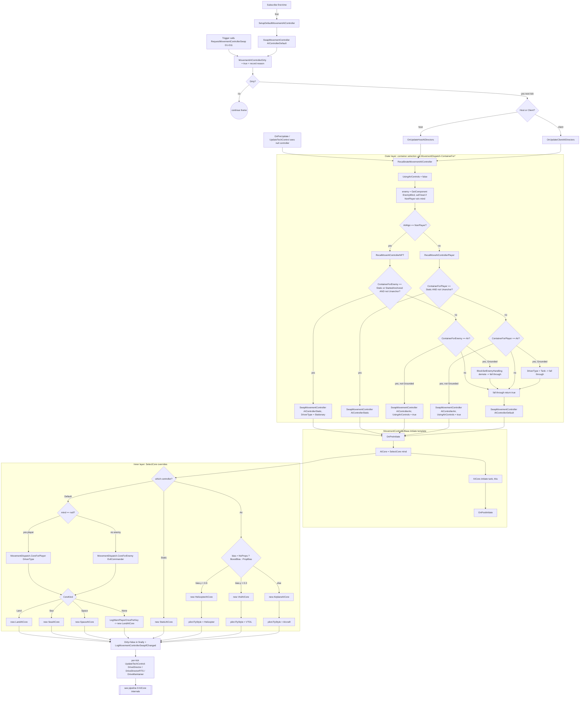

# Movement Controller Dispatch Pipeline

> **Category:** Movement & Pathing
> **Timing:** mostly structural; dirty-flag swap latency (Directors), CheckEngines, anchor counters — catalogued in [21 Timing & Cadence Register](21_timing-cadence.md).

## Summary

`TankAIHelper.MovementController` is the per-tech polymorphic strategy object that owns an `IMovementAICore` and forwards `DriveDirector(RTS)` and `DriveMaintainer` calls into it each tick. Dispatch happens in **two layers**, both keyed off a single shared mapping table (`MovementDispatch`), with a deferred-swap scheduler that funnels every swap request through one chokepoint.

1. **Outer layer — `IMovementAIController` (one of 3 MonoBehaviours on the tech GameObject):** `AIControllerDefault` (ground/water/space), `AIControllerAir` (flight), or `AIControllerStatic` (anchored). All three derive from the shared base class `MovementControllerBase`. The container is chosen in `RecalibrateMovementAIController` from `(AIAlign, DriverType, EvilCommander, AnchorState, StartedAnchored, Grounded)` by consulting `MovementDispatch.ContainerFor*`. Swaps are deferred — callers raise the `MovementAIControllerDirty` flag through `RequestMovementControllerSwap(...)`, which is consumed at the next `OnUpdateHostAIDirectors` / `OnUpdateClientAIDirectors`.
2. **Inner layer — `IMovementAICore` (one of 7 plain classes):** `LandAICore`, `SeaAICore`, `SpaceAICore` (under `AIControllerDefault`); `AirplaneAICore`, `HelicopterAICore`, `VtolAICore` (under `AIControllerAir`); `StaticAICore` (under `AIControllerStatic`). The core is chosen by the controller's own `SelectCore(mind)` override inside `Initiate(...)`. Default's `SelectCore` consults `MovementDispatch.CoreFor*`; Air's picks its sub-type from thrust geometry; Static always returns `StaticAICore`.

The outer mapping is intentionally coarse — `Tank / Sailor / Astronaut / Stationary-unanchored (default)` (player) and `Wheeled / Naval / Starship / SuicideMissile / Stationary-unanchored (default)` (enemy) all collapse into `AIControllerDefault`, which then re-derives its inner `AICore` via `MovementDispatch.CoreForPlayer(DriverType)` / `CoreForEnemy(EvilCommander)`. Air techs (`DriverType.Pilot` / `EnemyHandling.Chopper`/`Airplane`) are the only category with a dedicated outer controller (`AIControllerAir`); inside it the per-flight-mode sub-core (Airplane / Helicopter / VTOL) is decided at `SelectCore` time from `PropBias.y` / `BoostBias.y` thresholds (0.6 / 0.3). The air sub-type is exposed to the rest of the code via the `IAirMovementAICore` interface (`IsRotorcraft` / `IsFixedWing`), not via a back-channel field.

Pipeline 8 (`08_aicore-drive_A.md`) covers what happens **inside** each AICore's `DriveDirector` / `DriveMaintainer`; this doc stops at the call site `MovementController.DriveDirector(ref coreCont)` at [TankAIHelper.cs:2910](../Modified/TACtical_AI-master/TACtical_AI-master/TAC_AI/AI/TankAIHelper.cs#L2910).

---

## Entry points

### Sites that mutate or install `MovementController`

All installation goes through `SwapMovementController<T>(mind)`, which builds and `Initiate`s the new controller into a local, publishes `MovementController` in one assignment, then recycles the previous controller. A same-type request re-`Initiate`s the existing component in place.

| # | Trigger / Caller | File:line | Effect |
|---|------------------|-----------|--------|
| EP1 | `TankAIHelper.Subscribe()` initial install | [TankAIHelper.cs:748](../Modified/TACtical_AI-master/TACtical_AI-master/TAC_AI/AI/TankAIHelper.cs#L748) | First-time `SetupDefaultMovementAIController()`, then `RequestMovementControllerSwap(Subscribe)` so the real recalibrate runs next tick. |
| EP2 | `SetupDefaultMovementAIController()` | [TankAIHelper.cs:1270](../Modified/TACtical_AI-master/TACtical_AI-master/TAC_AI/AI/TankAIHelper.cs#L1270) | Clears `UsingAirControls`, force-installs `AIControllerDefault` via `SwapMovementController<AIControllerDefault>(null)`, then logs the swap. |
| EP3 | `RecalibrateMovementAIController()` | [TankAIHelper.cs:1374](../Modified/TACtical_AI-master/TACtical_AI-master/TAC_AI/AI/TankAIHelper.cs#L1374) | Inspects `AIAlign`, dispatches to `RecalMoveAIControllerNPT` or `RecalMoveAIControllerPlayer`; falls through to install `AIControllerDefault`. `finally` clears the dirty flag and logs the swap. |
| EP4 | `RecalMoveAIControllerNPT(enemy)` (enemy) | [TankAIHelper.cs:1277](../Modified/TACtical_AI-master/TACtical_AI-master/TAC_AI/AI/TankAIHelper.cs#L1277) | Consults `MovementDispatch.ContainerForEnemy`: `Static` (or `StartedAnchored`) and not Unanchor -> install Static; `Air` -> install Air (unless `Grounded`, then demote via `BlockSetEnemyHandling`); else returns `true` to fall through to Default. |
| EP5 | `RecalMoveAIControllerPlayer()` (player) | [TankAIHelper.cs:1332](../Modified/TACtical_AI-master/TACtical_AI-master/TAC_AI/AI/TankAIHelper.cs#L1332) | Consults `MovementDispatch.ContainerForPlayer`: `Static` and not Unanchor -> install Static; `Air` -> install Air + set `UsingAirControls` (unless `Grounded`, then demote `DriverType` to `Tank`); else returns `true` to fall through to Default. |
| EP6 | `OnUpdateHostAIDirectors` consumes dirty flag | [TankAIHelper.cs:3401](../Modified/TACtical_AI-master/TACtical_AI-master/TAC_AI/AI/TankAIHelper.cs#L3401) | `if (MovementAIControllerDirty) RecalibrateMovementAIController();` |
| EP7 | `OnUpdateClientAIDirectors` consumes dirty flag | [TankAIHelper.cs:3522](../Modified/TACtical_AI-master/TACtical_AI-master/TAC_AI/AI/TankAIHelper.cs#L3522) | Same as EP6, client-side path. |
| EP8 | `OnPreUpdate` null-recovery | [TankAIHelper.cs:3318](../Modified/TACtical_AI-master/TACtical_AI-master/TAC_AI/AI/TankAIHelper.cs#L3318) | Defensive: if `MovementController == null` at tick start, asserts and calls `RecalibrateMovementAIController()`. |
| EP9 | `UpdateTechControl` null-recovery | [TankAIHelper.cs:2856](../Modified/TACtical_AI-master/TACtical_AI-master/TAC_AI/AI/TankAIHelper.cs#L2856) | Self-heals a null controller at the start of the per-tick control pass before the Drive* calls. |
| EP10 | `DoAnchor` post-anchor reassignment | [TankAIHelper.cs:5504](../Modified/TACtical_AI-master/TACtical_AI-master/TAC_AI/AI/TankAIHelper.cs#L5504) | After a successful anchor, calls Recalibrate synchronously so `AIControllerStatic` engages before the next tick. |

### Sites that request a deferred swap (`RequestMovementControllerSwap`)

`MovementAIControllerDirty` has a **private setter**; every writer goes through `RequestMovementControllerSwap(MovementSwapReason)`, which records the requester (`lastSwapRequest`) and appends a `SwapReq <reason>` history entry. The reason is reported in the swap log.

| # | Site | File:line | Reason |
|---|------|-----------|--------|
| D1 | `SetDriverType(AIDriverType)` | [TankAIHelper.cs:53](../Modified/TACtical_AI-master/TACtical_AI-master/TAC_AI/AI/TankAIHelper.cs#L53) | `SetDriverType` |
| D2 | `Subscribe()` | [TankAIHelper.cs:749](../Modified/TACtical_AI-master/TACtical_AI-master/TAC_AI/AI/TankAIHelper.cs#L749) | `Subscribe` |
| D3 | `Recycled()` | [TankAIHelper.cs:879](../Modified/TACtical_AI-master/TACtical_AI-master/TAC_AI/AI/TankAIHelper.cs#L879) | `Recycled` (also resets `DriverType = AutoSet`) |
| D4 | `TrySetAITypeRemote(...)` | [TankAIHelper.cs:946](../Modified/TACtical_AI-master/TACtical_AI-master/TAC_AI/AI/TankAIHelper.cs#L946) | `RemoteAIType` |
| D5 | `ReValidateAI()` end | [TankAIHelper.cs:1083](../Modified/TACtical_AI-master/TACtical_AI-master/TAC_AI/AI/TankAIHelper.cs#L1083) | `ReValidate` |
| D6 | `ResetOnSwitchAlignments(...)` | [TankAIHelper.cs:1233](../Modified/TACtical_AI-master/TACtical_AI-master/TAC_AI/AI/TankAIHelper.cs#L1233) | `AlignmentReset` |
| D7 | `ExecuteAutoSet()` | [TankAIHelper.cs:1426](../Modified/TACtical_AI-master/TACtical_AI-master/TAC_AI/AI/TankAIHelper.cs#L1426) | `ExecuteAutoSet` |
| D8 | `ReevaluatePlayerMovementIfNeeded()` | [TankAIHelper.cs:1480](../Modified/TACtical_AI-master/TACtical_AI-master/TAC_AI/AI/TankAIHelper.cs#L1480) | `PlayerRecompose` (only on a real class change or while on `AIControllerAir`) |
| D9 | `OnSwitchAI(...)` | [TankAIHelper.cs:1595](../Modified/TACtical_AI-master/TACtical_AI-master/TAC_AI/AI/TankAIHelper.cs#L1595) | `SwitchAI` |
| D10 | `ForceAllAIsToEscort(...)` | [TankAIHelper.cs:1667](../Modified/TACtical_AI-master/TACtical_AI-master/TAC_AI/AI/TankAIHelper.cs#L1667) | `ForceEscort` |
| D11 | `WakeAIForChange(...)` | [TankAIHelper.cs:1679](../Modified/TACtical_AI-master/TACtical_AI-master/TAC_AI/AI/TankAIHelper.cs#L1679) | `WakeForChange` |

`MovementSwapReason` ([TankAIHelper.cs:59-64](../Modified/TACtical_AI-master/TACtical_AI-master/TAC_AI/AI/TankAIHelper.cs#L59)) also defines `PlayerAutopilot`, `EnemyGenerate`, and `EnemyMindSetup` for requesters outside this file (KickStart self-driving toggle, enemy bootstrap, enemy-mind setup).

### Inner-layer (AICore) selection points

| # | Where | File:line | Decision input |
|---|-------|-----------|----------------|
| AC1 | `AIControllerDefault.SelectCore` | [AIControllerDefault.cs:199](../Modified/TACtical_AI-master/TACtical_AI-master/TAC_AI/AI/Movement/AIControllerDefault.cs#L199) | `mind == null ? MovementDispatch.CoreForPlayer(DriverType) : MovementDispatch.CoreForEnemy(EvilCommander)`. `Sea` -> `SeaAICore`, `Space` -> `SpaceAICore`, else (`Land` / `None`) -> `LandAICore`. `None` also logs once via `LogWarnPlayerOncePerKey`. |
| AC2 | `AIControllerAir.SelectCore` | [AIControllerAir.cs:93](../Modified/TACtical_AI-master/TACtical_AI-master/TAC_AI/AI/Movement/AIControllerAir.cs#L93) | `bias = NoProps ? BoostBias : PropBias`; `bias.y > 0.6` -> `HelicopterAICore`; `> 0.3` -> `VtolAICore`; else `AirplaneAICore`. Player and enemy use the same ladder. |
| AC3 | `AIControllerStatic.SelectCore` | [AIControllerStatic.cs:20](../Modified/TACtical_AI-master/TACtical_AI-master/TAC_AI/AI/Movement/AIControllerStatic.cs#L20) | Unconditional `new StaticAICore()`. |
| AC4 | AICore sets `pilot.FlyStyle` on init | [AirplaneAICore.cs:41](../Modified/TACtical_AI-master/TACtical_AI-master/TAC_AI/AI/Movement/AICores/AirplaneAICore.cs#L41), [HelicopterAICore.cs:26](../Modified/TACtical_AI-master/TACtical_AI-master/TAC_AI/AI/Movement/AICores/HelicopterAICore.cs#L26), [VtolAICore.cs:18](../Modified/TACtical_AI-master/TACtical_AI-master/TAC_AI/AI/Movement/AICores/VtolAICore.cs#L18) | `FlightType.Aircraft` / `Helicopter` / `VTOL` written to the air controller's **internal** `FlyStyle` cache, read only by `AIControllerAir`'s own throttle / wing / mayday logic. |

### Per-tick consumers (dispatch, not change)

| # | Site | File:line | Notes |
|---|------|-----------|-------|
| C1 | `UpdateTechControl` -> `DriveDirectorRTS` (RTS path) | [TankAIHelper.cs:2908](../Modified/TACtical_AI-master/TACtical_AI-master/TAC_AI/AI/TankAIHelper.cs#L2908) | RTS variant. |
| C2 | `UpdateTechControl` -> `DriveDirector` (non-RTS) | [TankAIHelper.cs:2910](../Modified/TACtical_AI-master/TACtical_AI-master/TAC_AI/AI/TankAIHelper.cs#L2910) | Standard path. |
| C3 | `UpdateTechControl` -> `DriveMaintainer` | [TankAIHelper.cs:2937](../Modified/TACtical_AI-master/TACtical_AI-master/TAC_AI/AI/TankAIHelper.cs#L2937) | After WeaponMaintainer, only `if (NotInBeam)`. |
| C4 | `TankAIHelper.OnMoveWorldOrigin` -> `MovementController.OnMoveWorldOrigin` | [TankAIHelper.cs:911-912](../Modified/TACtical_AI-master/TACtical_AI-master/TAC_AI/AI/TankAIHelper.cs#L911) | World-origin shift propagation (null-guarded). |

---

## Flow



---

## Node reference

### Shared base

| Class | File:line | Role |
|-------|-----------|------|
| `IMovementAIController` (interface) | [IMovementAIController.cs:9](../Modified/TACtical_AI-master/TACtical_AI-master/TAC_AI/AI/Movement/IMovementAIController.cs#L9) | Public surface: `AICore`, `Tank`, `Helper`, `EnemyMind`, `PathPoint`, `GetDrive`, `Initiate`, `UpdateEnemyMind`, `DriveDirector`, `DriveDirectorRTS`, `DriveMaintainer`, `OnMoveWorldOrigin`, `GetDestination`, `Recycle`. |
| `MovementControllerBase` (abstract MonoBehaviour) | [MovementControllerBase.cs:17](../Modified/TACtical_AI-master/TACtical_AI-master/TAC_AI/AI/Movement/MovementControllerBase.cs#L17) | Owns `Tank` / `Helper` / `AICore` / `EnemyMind`, `GetDrive`, `UpdateEnemyMind`, `Recycle`, and the `Initiate` template (`OnPreInitiate` -> `SelectCore(mind)` -> `AICore.Initiate` -> `OnPostInitiate`, [:30-39](../Modified/TACtical_AI-master/TACtical_AI-master/TAC_AI/AI/Movement/MovementControllerBase.cs#L30)). Subclasses supply `protected override IMovementAICore SelectCore(...)` plus the `OnPreInitiate` / `OnPostInitiate` / `OnRecycle` hooks and the abstract per-tick members. |

### Outer-layer controllers (MonoBehaviours on the tech GameObject)

| Class | File:line | Container chosen for | `SelectCore` |
|-------|-----------|----------------------|--------------|
| `AIControllerDefault : MovementControllerBase, IPathfindable` | [AIControllerDefault.cs:16](../Modified/TACtical_AI-master/TACtical_AI-master/TAC_AI/AI/Movement/AIControllerDefault.cs#L16) | `MovementContainerKind.Default` (ground/sea/space) — also owns `Pathfinder` | `SelectCore` at [:199](../Modified/TACtical_AI-master/TACtical_AI-master/TAC_AI/AI/Movement/AIControllerDefault.cs#L199) via `MovementDispatch.CoreFor*` |
| `AIControllerAir : MovementControllerBase` | [AIControllerAir.cs:12](../Modified/TACtical_AI-master/TACtical_AI-master/TAC_AI/AI/Movement/AIControllerAir.cs#L12) | `MovementContainerKind.Air` — owns `PropBias`, `BoostBias`, `NoProps`, throttle state, internal `FlyStyle` | `SelectCore` at [:93](../Modified/TACtical_AI-master/TACtical_AI-master/TAC_AI/AI/Movement/AIControllerAir.cs#L93) via thrust geometry |
| `AIControllerStatic : MovementControllerBase` | [AIControllerStatic.cs:11](../Modified/TACtical_AI-master/TACtical_AI-master/TAC_AI/AI/Movement/AIControllerStatic.cs#L11) | `MovementContainerKind.Static` — trivial `PathPoint` from `SceneStayPos` | `SelectCore` at [:20](../Modified/TACtical_AI-master/TACtical_AI-master/TAC_AI/AI/Movement/AIControllerStatic.cs#L20) -> `new StaticAICore()` |

### Inner-layer AICores (plain classes, never MonoBehaviour)

| Class | File:line | Used by controller | Selection key | Side-effect on init |
|-------|-----------|--------------------|---------------|---------------------|
| `IMovementAICore` (interface) | [IMovementAICore.cs:10](../Modified/TACtical_AI-master/TACtical_AI-master/TAC_AI/AI/Movement/AICores/IMovementAICore.cs#L10) | — | exposes `Initiate(tank, IMovementAIController)`, `DriveMaintainer`, `DriveDirector`, `DriveDirectorRTS`, `DriveDirectorEnemy`, `DriveDirectorEnemyRTS`, `TryAdjustForCombat`, `TryAdjustForCombatEnemy`, `AvoidAssist`, `GetDrive` | — |
| `IAirMovementAICore : IMovementAICore` (interface) | [IMovementAICore.cs:35](../Modified/TACtical_AI-master/TACtical_AI-master/TAC_AI/AI/Movement/AICores/IMovementAICore.cs#L35) | air cores | adds `IsRotorcraft` / `IsFixedWing`, queried polymorphically by cross-pipeline consumers | — |
| `LandAICore` | [LandAICore.cs:10](../Modified/TACtical_AI-master/TACtical_AI-master/TAC_AI/AI/Movement/AICores/LandAICore.cs#L10) | `AIControllerDefault` | `CoreKind.Land` (`Tank`/`AutoSet` / `Wheeled`) or `None` fallback | `WaterPathing.AvoidWater` |
| `SeaAICore` | [SeaAICore.cs:10](../Modified/TACtical_AI-master/TACtical_AI-master/TAC_AI/AI/Movement/AICores/SeaAICore.cs#L10) | `AIControllerDefault` | `CoreKind.Sea` (`Sailor` / `Naval`) | `WaterPathing.StayInWater` |
| `SpaceAICore` | [SpaceAICore.cs:10](../Modified/TACtical_AI-master/TACtical_AI-master/TAC_AI/AI/Movement/AICores/SpaceAICore.cs#L10) | `AIControllerDefault` | `CoreKind.Space` (`Astronaut`/`Stationary-unanchored` / `Starship`/`SuicideMissile`/`Stationary-unanchored`) | `WaterPathing.AllowWater` |
| `StaticAICore` | [StaticAICore.cs:10](../Modified/TACtical_AI-master/TACtical_AI-master/TAC_AI/AI/Movement/AICores/StaticAICore.cs#L10) | `AIControllerStatic` | unconditional | — |
| `AirplaneAICore : IAirMovementAICore` | [AirplaneAICore.cs:10](../Modified/TACtical_AI-master/TACtical_AI-master/TAC_AI/AI/Movement/AICores/AirplaneAICore.cs#L10) | `AIControllerAir` | `bias.y <= 0.3` | `FlyStyle = Aircraft` ([:41](../Modified/TACtical_AI-master/TACtical_AI-master/TAC_AI/AI/Movement/AICores/AirplaneAICore.cs#L41)); `IsRotorcraft=false`, `IsFixedWing=true` |
| `HelicopterAICore : IAirMovementAICore` | [HelicopterAICore.cs:10](../Modified/TACtical_AI-master/TACtical_AI-master/TAC_AI/AI/Movement/AICores/HelicopterAICore.cs#L10) | `AIControllerAir` | `bias.y > 0.6` | `FlyStyle = Helicopter` ([:26](../Modified/TACtical_AI-master/TACtical_AI-master/TAC_AI/AI/Movement/AICores/HelicopterAICore.cs#L26)); `IsRotorcraft=true`, `IsFixedWing=false` |
| `VtolAICore : AirplaneAICore` | [VtolAICore.cs:10](../Modified/TACtical_AI-master/TACtical_AI-master/TAC_AI/AI/Movement/AICores/VtolAICore.cs#L10) | `AIControllerAir` | `0.3 < bias.y <= 0.6` | `FlyStyle = VTOL` ([:18](../Modified/TACtical_AI-master/TACtical_AI-master/TAC_AI/AI/Movement/AICores/VtolAICore.cs#L18)); inherits `IsRotorcraft=false`, overrides `IsFixedWing=false` |

### Enums

| Enum | File:line | Values | Used by |
|------|-----------|--------|---------|
| `MovementContainerKind` | [MovementDispatch.cs:5](../Modified/TACtical_AI-master/TACtical_AI-master/TAC_AI/AI/Movement/MovementDispatch.cs#L5) | `Default, Air, Static` | `RecalMoveAIController*` container choice |
| `MovementCoreKind` | [MovementDispatch.cs:7](../Modified/TACtical_AI-master/TACtical_AI-master/TAC_AI/AI/Movement/MovementDispatch.cs#L7) | `None, Land, Sea, Space` | `AIControllerDefault.SelectCore` core choice (`None` = unmapped, falls back to Land + warn) |
| `AIDriverType` | [AIType.cs:28-40](../Modified/TACtical_AI-master/TACtical_AI-master/TAC_AI/AI/AIType.cs#L28) | `Null = -1, AutoSet, Tank, Pilot, Sailor, Astronaut, Stationary` | `MovementDispatch.ContainerForPlayer`/`CoreForPlayer` |
| `EnemyHandling` | [EnemyEnums.cs:25-34](../Modified/TACtical_AI-master/TACtical_AI-master/TAC_AI/EnemyEnums.cs#L25) | `Wheeled, Chopper, Airplane, Starship, Naval, SuicideMissile, Stationary` (no `VTOL` by design) | `MovementDispatch.ContainerForEnemy`/`CoreForEnemy` |
| `AIControllerAir.FlightType` | [AIControllerAir.cs:18-23](../Modified/TACtical_AI-master/TACtical_AI-master/TAC_AI/AI/Movement/AIControllerAir.cs#L18) | `Aircraft, Helicopter, VTOL` | air controller's internal `FlyStyle` cache, read by `UpdateThrottle`, `CheckWings`, `TestForMayday` only |
| `MovementSwapReason` | [TankAIHelper.cs:59-64](../Modified/TACtical_AI-master/TACtical_AI-master/TAC_AI/AI/TankAIHelper.cs#L59) | `SetDriverType, Subscribe, Recycled, RemoteAIType, ReValidate, AlignmentReset, ExecuteAutoSet, PlayerRecompose, SwitchAI, ForceEscort, WakeForChange, PlayerAutopilot, EnemyGenerate, EnemyMindSetup` | `RequestMovementControllerSwap` / swap log |
| `AIAlignment` | (referenced throughout `TankAIHelper`) | `Player, NonPlayer, PlayerNoAI, Static` | top-level `Recalibrate` branch at [:1401](../Modified/TACtical_AI-master/TACtical_AI-master/TAC_AI/AI/TankAIHelper.cs#L1401); container `DriveDirector` ally/enemy split |

### Mapping table + selection helpers

| Function | File:line | Role |
|----------|-----------|------|
| `MovementDispatch.ContainerForPlayer(AIDriverType)` | [MovementDispatch.cs:18](../Modified/TACtical_AI-master/TACtical_AI-master/TAC_AI/AI/Movement/MovementDispatch.cs#L18) | `Stationary` -> Static, `Pilot` -> Air, else Default. Consulted in `RecalMoveAIControllerPlayer`. |
| `MovementDispatch.ContainerForEnemy(EnemyHandling)` | [MovementDispatch.cs:28](../Modified/TACtical_AI-master/TACtical_AI-master/TAC_AI/AI/Movement/MovementDispatch.cs#L28) | `Stationary` -> Static, `Chopper`/`Airplane` -> Air, else Default. Consulted in `RecalMoveAIControllerNPT`. |
| `MovementDispatch.CoreForPlayer(AIDriverType)` | [MovementDispatch.cs:39](../Modified/TACtical_AI-master/TACtical_AI-master/TAC_AI/AI/Movement/MovementDispatch.cs#L39) | `AutoSet`/`Tank` -> Land, `Sailor` -> Sea, `Astronaut`/`Stationary` -> Space, else None. Consulted in `AIControllerDefault.SelectCore`. |
| `MovementDispatch.CoreForEnemy(EnemyHandling)` | [MovementDispatch.cs:52](../Modified/TACtical_AI-master/TACtical_AI-master/TAC_AI/AI/Movement/MovementDispatch.cs#L52) | `Wheeled` -> Land, `Naval` -> Sea, `Starship`/`SuicideMissile`/`Stationary` -> Space, else None. Consulted in `AIControllerDefault.SelectCore`. |
| `AIECore.HandlingDetermine(tank, helper)` | [AIECore.cs:482](../Modified/TACtical_AI-master/TACtical_AI-master/TAC_AI/AI/AIECore.cs) | Walks blocks, tallies thrust/locomotion stats, returns `AIDriverType`. Called from `ExecuteAutoSetNoCalibrate` (`:1430`) and `Subscribe` (`:747`). |
| `TankAIHelper.SwapMovementController<T>(mind)` | [TankAIHelper.cs:1254](../Modified/TACtical_AI-master/TACtical_AI-master/TAC_AI/AI/TankAIHelper.cs#L1254) | Atomic build-then-publish swap: re-`Initiate` in place for a same-type request; otherwise `AddComponent` + `Initiate` into a local, publish `MovementController`, then `Recycle` the previous controller. |
| `TankAIHelper.SetupDefaultMovementAIController` | [TankAIHelper.cs:1270](../Modified/TACtical_AI-master/TACtical_AI-master/TAC_AI/AI/TankAIHelper.cs#L1270) | Installs a fresh `AIControllerDefault` (`mind = null`) and logs. |
| `TankAIHelper.RecalMoveAIControllerNPT` | [TankAIHelper.cs:1277](../Modified/TACtical_AI-master/TACtical_AI-master/TAC_AI/AI/TankAIHelper.cs#L1277) | NPT container selector. Returns `false` if it installed a non-Default container, `true` to fall through to Default. Houses anchor gating + Grounded-demote escape hatch. |
| `TankAIHelper.RecalMoveAIControllerPlayer` | [TankAIHelper.cs:1332](../Modified/TACtical_AI-master/TACtical_AI-master/TAC_AI/AI/TankAIHelper.cs#L1332) | Allied container selector. Same true/false contract + Grounded-demote. |
| `TankAIHelper.RecalibrateMovementAIController` | [TankAIHelper.cs:1374](../Modified/TACtical_AI-master/TACtical_AI-master/TAC_AI/AI/TankAIHelper.cs#L1374) | Outer `try/finally` that self-heals a missing `EnemyMind`, runs `RecalMove*`, falls through to install `AIControllerDefault`, and in `finally` clears the dirty flag + logs. |
| `TankAIHelper.RequestMovementControllerSwap` | [TankAIHelper.cs:72](../Modified/TACtical_AI-master/TACtical_AI-master/TAC_AI/AI/TankAIHelper.cs#L72) | Chokepoint that raises `MovementAIControllerDirty`, records `lastSwapRequest`, and logs a `SwapReq <reason>` history entry. |
| `TankAIHelper.LogMovementControllerSwapIfChanged` | [TankAIHelper.cs:1362](../Modified/TACtical_AI-master/TACtical_AI-master/TAC_AI/AI/TankAIHelper.cs#L1362) | Emits a `Movement`-tagged `core swap <old> -> <new>` log (with `requestedBy=lastSwapRequest`) + a `CoreSwap` history entry when the runtime type changed. |
| `TankAIHelper.ReevaluatePlayerMovementIfNeeded` | [TankAIHelper.cs:1470](../Modified/TACtical_AI-master/TACtical_AI-master/TAC_AI/AI/TankAIHelper.cs#L1470) | Debounced player-composition re-pick: re-derives `DriverType` via `ExecuteAutoSetNoCalibrate` and requests a swap only on a class change or while on `AIControllerAir`. |
| `TankAIHelper.ExecuteAutoSet` / `ExecuteAutoSetNoCalibrate` | [TankAIHelper.cs:1423, 1428](../Modified/TACtical_AI-master/TACtical_AI-master/TAC_AI/AI/TankAIHelper.cs#L1423) | Runs `HandlingDetermine`, then demotes unsupported AI to `Tank` against `isAstrotechAvail` / `isAviatorAvail` / `isBuccaneerAvail` ([:1431-1454](../Modified/TACtical_AI-master/TACtical_AI-master/TAC_AI/AI/TankAIHelper.cs#L1431)). |

---

## Key data / state

### `TankAIHelper` fields

| Field | File:line | Purpose |
|-------|-----------|---------|
| `MovementController` | [TankAIHelper.cs:714](../Modified/TACtical_AI-master/TACtical_AI-master/TAC_AI/AI/TankAIHelper.cs#L714) | The active `IMovementAIController`; null until `Subscribe()` runs. Only ever assigned inside `SwapMovementController`. |
| `MovementAIControllerDirty` (backed by `MCD`) | [TankAIHelper.cs:67-71](../Modified/TACtical_AI-master/TACtical_AI-master/TAC_AI/AI/TankAIHelper.cs#L67) | Deferred-swap flag with a **private setter**; raised only via `RequestMovementControllerSwap`, consumed at `:3401` / `:3522`. |
| `lastSwapRequest` | [TankAIHelper.cs:66](../Modified/TACtical_AI-master/TACtical_AI-master/TAC_AI/AI/TankAIHelper.cs#L66) | The `MovementSwapReason` of the most recent request; surfaced as `requestedBy` in the swap log. |
| `DriverType` (backed by `driveType`) | [TankAIHelper.cs:29-39](../Modified/TACtical_AI-master/TACtical_AI-master/TAC_AI/AI/TankAIHelper.cs#L29), `SetDriverType :47` | Player-side selector; private setter, public chokepoint `SetDriverType`. |
| `UsingAirControls` | [TankAIHelper.cs:304](../Modified/TACtical_AI-master/TACtical_AI-master/TAC_AI/AI/TankAIHelper.cs#L304) | Cache mirror of "current controller is `AIControllerAir`". Set in the `RecalMoveAIController*` Air paths, cleared in `Recalibrate`/`SetupDefault`. |
| `lastLoggedMovementControllerType` | [TankAIHelper.cs:1361](../Modified/TACtical_AI-master/TACtical_AI-master/TAC_AI/AI/TankAIHelper.cs#L1361) | Used by `LogMovementControllerSwapIfChanged` for one-shot logging on actual transitions. |
| `PendingPlayerRecompose` | [TankAIHelper.cs:1469](../Modified/TACtical_AI-master/TACtical_AI-master/TAC_AI/AI/TankAIHelper.cs#L1469) | Debounce latch set in `OnBlockAttached`/`OnBlockDetaching`, consumed in `ReevaluatePlayerMovementIfNeeded` (via `CheckRebuildAlignment`). |
| `autoPather` getter | [TankAIHelper.cs:715](../Modified/TACtical_AI-master/TACtical_AI-master/TAC_AI/AI/TankAIHelper.cs#L715) | `(MovementController is AIControllerDefault def) ? def.Pathfinder : null` — only `Default` has a pathfinder. |

### Dispatch-key sources (what feeds the selectors)

| Key | Source | Drives container | Drives core |
|-----|--------|------------------|-------------|
| `helper.AIAlign` | runtime alignment | NPT vs Player branch split in `Recalibrate` | `DriveDirector` vs `DriveDirectorEnemy` at AICore level |
| `helper.DriverType` (allied) | `AIECore.HandlingDetermine` -> `ExecuteAutoSetNoCalibrate` | `ContainerForPlayer`: `Pilot` -> Air, `Stationary` -> Static, else Default | `CoreForPlayer`: `Tank/AutoSet` -> Land, `Sailor` -> Sea, `Astronaut/Stationary` -> Space |
| `enemy.EvilCommander` (NPT) | `RCore` classifier | `ContainerForEnemy`: `Stationary` -> Static, `Chopper/Airplane` -> Air, else Default | `CoreForEnemy`: `Wheeled` -> Land, `Naval` -> Sea, `Starship/SuicideMissile/Stationary` -> Space |
| `enemy.StartedAnchored` | base spawn | forces Static container in `RecalMoveAIControllerNPT` | n/a |
| `existingAir.Grounded` | `AIControllerAir.TestForMayday` verdict | Grounded-demote escape hatch out of the Air container | n/a |
| `PropBias.y` / `BoostBias.y` (`NoProps`-selected) | `AIControllerAir.CheckAllFlightBlocks` -> `CheckEngines` (run in `OnPreInitiate`) | n/a | `> 0.6` -> Heli, `> 0.3` -> VTOL, else Airplane |
| `helper.AnchorState` | anchor FSM | `!= Unanchor` is required for the Static path | n/a |
| `helper.isAstrotechAvail / isAviatorAvail / isBuccaneerAvail` | `ModuleAIExtension` presence | downgrades `DriverType` to `Tank` if unavailable (`ExecuteAutoSetNoCalibrate`) | indirect |

### Composition-change transitions

Block attach/detach does **not** swap `MovementController` directly. The pipeline reacts indirectly:

1. `OnBlockAttached` / `OnBlockDetaching` set `dirtyAI` and `dirtyExtents = true` ([TankAIHelper.cs:809, 836](../Modified/TACtical_AI-master/TACtical_AI-master/TAC_AI/AI/TankAIHelper.cs#L809)). NonPlayer uses `AIDirtyState.DirtyAndReboot`; Player uses `AIDirtyState.Dirty` **and** sets `PendingPlayerRecompose = true` ([:819, 850](../Modified/TACtical_AI-master/TACtical_AI-master/TAC_AI/AI/TankAIHelper.cs#L819)).
2. `CheckRebuildAlignment` (called from `OnPreUpdate`) consumes `dirtyAI`, dispatches the alignment, then calls `ReevaluatePlayerMovementIfNeeded()` ([:3611](../Modified/TACtical_AI-master/TACtical_AI-master/TAC_AI/AI/TankAIHelper.cs#L3611)).
3. For an already-Player tech, `ReevaluatePlayerMovementIfNeeded` re-derives `DriverType` via `ExecuteAutoSetNoCalibrate` and, when the class changed **or** the tech is on `AIControllerAir`, calls `RequestMovementControllerSwap(PlayerRecompose)` ([:1479-1480](../Modified/TACtical_AI-master/TACtical_AI-master/TAC_AI/AI/TankAIHelper.cs#L1479)). NonPlayer techs re-classify through the `DirtyAndReboot` rebuild path instead.
4. The next `OnUpdateHostAIDirectors` / `OnUpdateClientAIDirectors` reads the dirty flag and calls `RecalibrateMovementAIController` ([:3401 / :3522](../Modified/TACtical_AI-master/TACtical_AI-master/TAC_AI/AI/TankAIHelper.cs#L3401)).
5. If the container type is unchanged, `SwapMovementController<T>` re-`Initiate`s the existing instance in place; if it changed, the old instance is recycled after the new one is published.
6. For `AIControllerAir`, the re-`Initiate` re-runs `CheckAllFlightBlocks` in `OnPreInitiate` -> re-evaluates `PropBias.y`/`BoostBias.y` -> `SelectCore` may swap the **core** (Heli / VTOL / Airplane) even when the container stays the same.

---

## Exit points

| # | Exit | File:line | Meaning |
|---|------|-----------|---------|
| X1 | `MovementController.DriveDirector(ref coreCont)` | [TankAIHelper.cs:2910](../Modified/TACtical_AI-master/TACtical_AI-master/TAC_AI/AI/TankAIHelper.cs#L2910) | Per-tick "where do we want to go" call (handed off to AICore — see pipeline 8). |
| X2 | `MovementController.DriveDirectorRTS(ref coreCont)` | [TankAIHelper.cs:2908](../Modified/TACtical_AI-master/TACtical_AI-master/TAC_AI/AI/TankAIHelper.cs#L2908) | RTS variant of X1. |
| X3 | `MovementController.DriveMaintainer(ref ControlCore)` | [TankAIHelper.cs:2937](../Modified/TACtical_AI-master/TACtical_AI-master/TAC_AI/AI/TankAIHelper.cs#L2937) | Per-tick "execute throttle/steering" (handed off to AICore). |
| X4 | `MovementController.OnMoveWorldOrigin(move)` | [TankAIHelper.cs:911-912](../Modified/TACtical_AI-master/TACtical_AI-master/TAC_AI/AI/TankAIHelper.cs#L911) | Forwarded world-origin shift (only `AIControllerAir.OnMoveWorldOrigin :371` is non-empty). |
| X5 | `MovementController.UpdateEnemyMind(this/null)` | [EnemyMind.cs:144, 168](../Modified/TACtical_AI-master/TACtical_AI-master/TAC_AI/Enemy/EnemyMind.cs#L144) | Repoints the controller's `EnemyMind` on enemy mind Refresh / removal. |
| X6 | `previous.Recycle()` after publish | [TankAIHelper.cs:1266](../Modified/TACtical_AI-master/TACtical_AI-master/TAC_AI/AI/TankAIHelper.cs#L1266) | On a type change, the previous controller is recycled only after `MovementController` already points at the new one (`MovementControllerBase.Recycle` nulls `AICore`, runs `OnRecycle`, then `DestroyImmediate`s the MonoBehaviour). |
| X7 | `LogMovementControllerSwapIfChanged()` | [TankAIHelper.cs:1362-1373](../Modified/TACtical_AI-master/TACtical_AI-master/TAC_AI/AI/TankAIHelper.cs#L1362) | Logs only when the runtime type actually changed; appends a `CoreSwap` history entry. |
| X8 | HUD reads `Air.AICore is AirplaneAICore plane` | [TankAIHelper.cs:1848](../Modified/TACtical_AI-master/TACtical_AI-master/TAC_AI/AI/TankAIHelper.cs#L1848) | `GetActionStatus` queries the inner AICore for dive/U-turn state via the `PerformDiveAttack` shim. |
| X9 | Target-acquisition branching on `IsFixedWing` | [TankAIHelper.cs:4705, 4715](../Modified/TACtical_AI-master/TACtical_AI-master/TAC_AI/AI/TankAIHelper.cs#L4705); weapon strat on `IsRotorcraft` [EWeapSetup.cs:251](../Modified/TACtical_AI-master/TACtical_AI-master/TAC_AI/AI/EWeapSetup.cs#L251) | `TryRefreshEnemyAllied`/`TryRefreshEnemyEnemy` use `FindEnemyAir` vs `FindEnemy`; weapon strat tunes for rotorcraft. Both query `AICore is IAirMovementAICore`. |
| X10 | Null `MovementController` self-heal | [TankAIHelper.cs:2854-2856](../Modified/TACtical_AI-master/TACtical_AI-master/TAC_AI/AI/TankAIHelper.cs#L2854) | `UpdateTechControl` recalibrates in place; persistent null is logged per-tank and escalated. |

---

## Cross-pipeline integration

This pipeline ends at the container-level `DriveDirector` / `DriveDirectorRTS` / `DriveMaintainer` calls; everything past those is the responsibility of **pipeline 8 — AICore Drive** (`08_aicore-drive_A.md`).

| Outbound link | Site | Where it goes |
|---------------|------|---------------|
| `AIControllerStatic.DriveDirector` -> `AICore.DriveDirector` / `DriveDirectorEnemy` | [AIControllerStatic.cs:35-86](../Modified/TACtical_AI-master/TACtical_AI-master/TAC_AI/AI/Movement/AIControllerStatic.cs#L35) | Per-tick ally/enemy branch dispatch into `StaticAICore`. Pipeline 8. |
| `AIControllerDefault.DriveDirector` -> `AICore.DriveDirector` / `DriveDirectorEnemy` | [AIControllerDefault.cs:143-192](../Modified/TACtical_AI-master/TACtical_AI-master/TAC_AI/AI/Movement/AIControllerDefault.cs#L143) | Per-tick ally/enemy branch dispatch into `LandAICore` / `SeaAICore` / `SpaceAICore`. Pipeline 8. |
| `AIControllerAir.DriveDirector` -> `AICore.DriveDirector` / `DriveDirectorEnemy` | [AIControllerAir.cs:272-345](../Modified/TACtical_AI-master/TACtical_AI-master/TAC_AI/AI/Movement/AIControllerAir.cs#L272) | Per-tick dispatch into `AirplaneAICore` / `HelicopterAICore` / `VtolAICore`; runs `TestForMayday` and (internally) consults `FlyStyle` before delegating. Pipeline 8. |
| `MovementController.DriveMaintainer` -> `AICore.DriveMaintainer(helper, tank, ref core)` | All three containers | Per-tick throttle/steering apply into the chosen AICore. Pipeline 8. |
| `IPathfindable.Pathfinder` (`AIControllerDefault` only) | `autoPather` getter at [TankAIHelper.cs:715](../Modified/TACtical_AI-master/TACtical_AI-master/TAC_AI/AI/TankAIHelper.cs#L715) | Pathfinding subsystem reads the active pathfinder only when the outer container is `AIControllerDefault`. |

Air sub-type is exposed across pipeline boundaries through the **`IAirMovementAICore` interface** (`IsRotorcraft` / `IsFixedWing`), queried polymorphically with `AICore is IAirMovementAICore`. Consumers: `EWeapSetup.cs:251` (rotorcraft weapon-aim strategy), `TankAIHelper.cs:4705/4715` (fixed-wing target-acquisition branching). `AIControllerAir.FlyStyle` is internal controller-only state and is no longer read across pipeline boundaries.

---

## Issues

**NONE.**

If a new issue is found in this pipeline, replace `NONE.` above and add it under the matching heading, using a stable ID (`BUG-N`, `DEAD-N`, or `TD-N`) and a clickable `file.cs:line` link. Format:

```text
### Bugs
- **BUG-1 (High | Medium | Low)** - [File.cs:line](path) - what is wrong, and the intended fix.

### Dead code
- **DEAD-1** - [File.cs:line](path) - what is orphaned or unreachable, and why.

### Tech debt
- **TD-1** - [File.cs:line](path) - the smell, and the cleaner shape.
```
