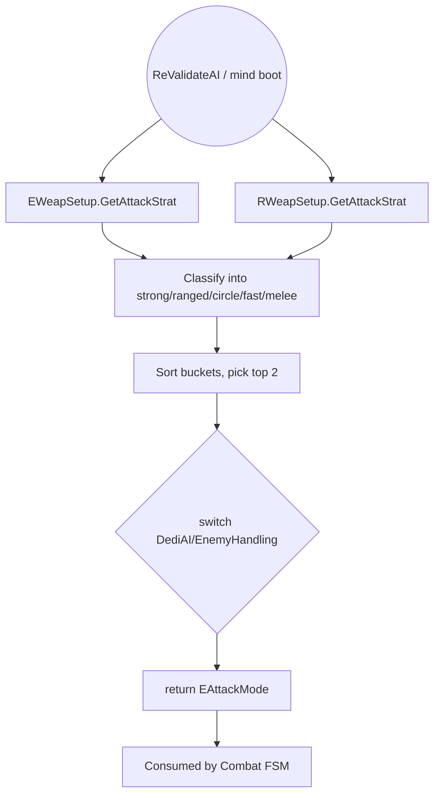

# Weapon Firing Pipeline

> **Category:** Combat Subsystems
> **Timing:** Director (2.5Hz) vs Maintainer (render-frame) split, WeaponDelayClock, LeadPredictionMaxTOF — catalogued in [21 Timing & Cadence Register](21_timing-cadence.md).

## Summary

The weapon firing pipeline is the per-tick subsystem that decides **what** to shoot at, **where** to aim, and **whether to pull the trigger**. It is shared between allied and enemy techs through a single static class — `AIEWeapons` (`AI/AIEWeapons.cs`) — and runs in two stages per tech-tick:

1. **WeaponDirector** ([AIEWeapons.cs:9](../Modified/TACtical_AI-master/TACtical_AI-master/TAC_AI/AI/AIEWeapons.cs)) — a pure FSM that classifies the situation into an `AIWeaponState` (`Enemy`, `HoldFire`, `Obsticle`, `Normal`) and flips the master weapons-enabled switch via `SuppressFiring`. Runs only on collision-avoidance ticks (gated by `UpdateDirectorsAndPathing`).
2. **WeaponMaintainer** ([AIEWeapons.cs:73](../Modified/TACtical_AI-master/TACtical_AI-master/TAC_AI/AI/AIEWeapons.cs)) — consumes the Director's state, re-asserts the hard weapons gate via `SuppressFiring`, picks an aim point via `AimAndFireWeapons(aimWorld, aimRadius)`, and latches `tank.control.FireControl = true` via `FireAllWeapons()`. Runs every operation tick (gated by `NotInBeam`).

The two stages communicate via two fields on `TankAIHelper`:

| Field | Type | Set by | Read by |
|---|---|---|---|
| `WeaponState` ([TankAIHelper.cs:302](../Modified/TACtical_AI-master/TACtical_AI-master/TAC_AI/AI/TankAIHelper.cs)) | `AIWeaponState` | Director | Maintainer |
| `ActiveAimState` ([TankAIHelper.cs:277](../Modified/TACtical_AI-master/TACtical_AI-master/TAC_AI/AI/TankAIHelper.cs)) | `AIWeaponState` | Maintainer | `ModuleWeapon.UpdateAim` Harmony prefix ([ModulePatches.cs:42](../Modified/TACtical_AI-master/TACtical_AI-master/TAC_AI/PatchBatch/ModulePatches.cs)), `ManageAILockOn` |

Read order: **Director decides intent → Maintainer commits orders → Harmony prefix re-routes per-weapon aim → `tank.control.FireControl` resolves → vanilla `Tank.Weapons` consumes**.

**Naming clarifications:**
- The historical filenames `EWeapons.cs` / `RWeapons.cs` do **not** exist. Both allied and enemy live weapon control runs through `AIEWeapons`. Enemy weapon firing is fully delegated to `WeaponDirector`/`WeaponMaintainer`; there is no enemy-specific runtime firing controller. To alter enemy firing behavior, modify `AI/AIEWeapons.cs` and gate on `helper.AIAlign == AIAlignment.NonPlayer`.
- `EWeapSetup.GetAttackStrat` / `RWeapSetup.GetAttackStrat` are **boot-time / recalibrate-only** weapon inventory analyzers that return an `EAttackMode`. They are not per-tick. See "Boot classification" subgraph.

**FIRE_ALL latch:** `helper.FIRE_ALL` ([TankAIHelper.cs:554](../Modified/TACtical_AI-master/TACtical_AI-master/TAC_AI/AI/TankAIHelper.cs)) is the per-tick "hold-down-spacebar" bit. Reset to false each operation tick by `BGeneral.ResetValues` ([BGeneral.cs:8](../Modified/TACtical_AI-master/TACtical_AI-master/TAC_AI/AI/BGeneral.cs)) — except for a live player-RTS held command, which `ResetValues` guards against clearing ([BGeneral.cs:14-17](../Modified/TACtical_AI-master/TACtical_AI-master/TAC_AI/AI/BGeneral.cs)). It is re-asserted by the reactive on-hit path (`EnemyMind.OnHit`/`OnBlockLoss` at [EnemyMind.cs:223, 253](../Modified/TACtical_AI-master/TACtical_AI-master/TAC_AI/Enemy/EnemyMind.cs)), by certain operation states (`RGuardian` [RGuardian.cs:152](../Modified/TACtical_AI-master/TACtical_AI-master/TAC_AI/Enemy/EnemyOperations/RGuardian.cs); allied `BAegis`/`BBuccaneer`/`BAstrotech`/`BEscort`), and by the player-RTS hold-fire path (`ManWorldRTS.Update`).

**WantsToFight:** `helper.WantsToFight` ([TankAIHelper.cs:515](../Modified/TACtical_AI-master/TACtical_AI-master/TAC_AI/AI/TankAIHelper.cs)) is the operation states' sustained "engage" intent, set by both allied (`BGeneral.AidAttack`/`AimAttack`, `BAviator`, `BAssassin`, `BMultiTech`) and enemy (`RGeneral`, `RWheeled`, `RAircraft`, `RCrashMissile`) combat ops while the tech intends to fight a confirmed hostile. In the Maintainer's `Enemy` case it opens fire alongside `FIRE_ALL` (`if (helper.FIRE_ALL || helper.WantsToFight)` — [AIEWeapons.cs:152](../Modified/TACtical_AI-master/TACtical_AI-master/TAC_AI/AI/AIEWeapons.cs)). The `Obsticle` and `Normal`/default cases still gate on `FIRE_ALL` alone.

**Weapon AIM lead is per-weapon, in the Harmony aim prefix.** For the `Enemy` aim state, `ModuleWeaponPatches.UpdateAim_Prefix` ([ModulePatches.cs:46-76](../Modified/TACtical_AI-master/TACtical_AI-master/TAC_AI/PatchBatch/ModulePatches.cs)) computes a per-weapon lead using that gun's own muzzle velocity (`ModuleWeaponGun.GetVelocity()`), an iterative time-of-flight (two passes) capped by `AIGlobals.LeadPredictionMaxTOF = 3f` ([AIGlobals.cs:167](../Modified/TACtical_AI-master/TACtical_AI-master/TAC_AI/AIGlobals.cs)), composed through the existing gravity-drop `AimDelegate` so arc weapons still solve elevation for the led point, then aims there and returns `false` to skip vanilla auto-aim. Separately, `TankAIHelper.RoughPredictTarget` ([TankAIHelper.cs:5191](../Modified/TACtical_AI-master/TACtical_AI-master/TAC_AI/AI/TankAIHelper.cs)) is **DRIVE-only** lead: it uses the global constant `AIGlobals.TargetVelocityLeadPredictionMulti = 0.01f` ([AIGlobals.cs:166](../Modified/TACtical_AI-master/TACtical_AI-master/TAC_AI/AIGlobals.cs)) and is consumed only by movement cores to bias **driving direction** (repositioning the platform). The Maintainer itself feeds raw `boundsCentreWorldNoCheck` ([AIEWeapons.cs:144](../Modified/TACtical_AI-master/TACtical_AI-master/TAC_AI/AI/AIEWeapons.cs)) into `tank.control.TargetPositionWorld`; the per-weapon lead is applied downstream in the aim prefix.

**No per-weapon "automatic vs manual" mode:** all `ModuleWeapon`s on an AI tech share one master `tank.control.FireControl` boolean (set by `FireAllWeapons`). Per-block firing decisions are vanilla, downstream of this pipeline. `tank.Weapons.enabled` is the harder global gate set by `SuppressFiring`.

**AIWeaponType** ([AIStates.cs:19](../Modified/TACtical_AI-master/TACtical_AI-master/TAC_AI/AIStates.cs)) is a tri-state enum (`Unknown`, `Direct`, `Indirect`) classifying the tech's **own** weapon loadout, computed lazily once inside `SyncLineOfSight`. Consumed by LOS / range systems (not by the Maintainer flow directly) — `Direct` techs need LOS checks; `Indirect` (arc / seeking) techs skip them.

---

## Entry points

| Entry | File:Line | Notes |
|---|---|---|
| `TankAIManager.FixedUpdate` | [TankAIManager.cs:815](../Modified/TACtical_AI-master/TACtical_AI-master/TAC_AI/AI/TankAIManager.cs) | Unity FixedUpdate root. |
| `TankAIManager.UpdateAllHelpers` | [TankAIManager.cs:716](../Modified/TACtical_AI-master/TACtical_AI-master/TAC_AI/AI/TankAIManager.cs) | Iterates active helpers; calls `OnPreUpdate`, stagger-dispatches directors/operations, then `OnPostUpdate`. |
| `StaggerUpdateAllHelpersDirAndOps` | [TankAIManager.cs:743](../Modified/TACtical_AI-master/TACtical_AI-master/TAC_AI/AI/TankAIManager.cs) | Rate-limited identity-resume round-robin (directors and operations dispatched separately). |
| `OnUpdateHostAIDirectors` | [TankAIHelper.cs:3406](../Modified/TACtical_AI-master/TACtical_AI-master/TAC_AI/AI/TankAIHelper.cs) | Sets `UpdateDirectorsAndPathing = true` ([line 3417 / 3421](../Modified/TACtical_AI-master/TACtical_AI-master/TAC_AI/AI/TankAIHelper.cs)) which gates the Director stage. |
| `ModuleTechControllerPatches.ExecuteControl_Prefix` | [ModulePatches.cs:279](../Modified/TACtical_AI-master/TACtical_AI-master/TAC_AI/PatchBatch/ModulePatches.cs) | Harmony prefix on `ModuleTechController.ExecuteControl`, the per-vanilla-tick entry. Routes into `RunMovementBridge` ([line 2739](../Modified/TACtical_AI-master/TACtical_AI-master/TAC_AI/AI/TankAIHelper.cs)) → `UpdateTechControl` ([line 2854](../Modified/TACtical_AI-master/TACtical_AI-master/TAC_AI/AI/TankAIHelper.cs)). |
| `UpdateTechControl` | [TankAIHelper.cs:2854](../Modified/TACtical_AI-master/TACtical_AI-master/TAC_AI/AI/TankAIHelper.cs) | Per-tick dispatcher. Calls `BeamMaintainer` first ([line 2893](../Modified/TACtical_AI-master/TACtical_AI-master/TAC_AI/AI/TankAIHelper.cs)), then Director ([line 2901](../Modified/TACtical_AI-master/TACtical_AI-master/TAC_AI/AI/TankAIHelper.cs)) if `UpdateDirectorsAndPathing`, then Maintainer ([line 2936](../Modified/TACtical_AI-master/TACtical_AI-master/TAC_AI/AI/TankAIHelper.cs)) if `NotInBeam`. |
| `ModuleWeaponPatches.UpdateAim_Prefix` | [ModulePatches.cs:33](../Modified/TACtical_AI-master/TACtical_AI-master/TAC_AI/PatchBatch/ModulePatches.cs) | Per-weapon Harmony prefix. Reads `ActiveAimState`; computes per-weapon lead for `Enemy`, overrides aim transform for `HoldFire` / `Obsticle`, and returns `false` to skip vanilla auto-aim. |
| `OnPostUpdate` → `ManageAILockOn` | [TankAIHelper.cs:3354 → 5213](../Modified/TACtical_AI-master/TACtical_AI-master/TAC_AI/AI/TankAIHelper.cs) | Read-only consumer of `ActiveAimState`; drives player-RTS lock-on reticule. Does not fire. |
| Player-resource manual `Obst` injection | [TankAIManager.cs:620-645](../Modified/TACtical_AI-master/TACtical_AI-master/TAC_AI/AI/TankAIManager.cs) | When player holds LMB on a `ResourceDispenser` within ~100m (sqrMag ≤ 10000) while `FireControl == true` and no visible enemy, the player's tech gets `Obst = visible.transform` + `ActiveAimState = Obsticle` injected — the only path for the player to force an obstacle target onto their own AI. Cleared otherwise. |

**Director gate:** `UpdateDirectorsAndPathing` (set by host or client directors phase based on `AIAlignment`).
**Maintainer gate:** `NotInBeam` ([TankAIHelper.cs:148](../Modified/TACtical_AI-master/TACtical_AI-master/TAC_AI/AI/TankAIHelper.cs)) = `BeamTimeoutClock == 0`.

---

## Flow

### Per-tick weapon director / maintainer / aim-prefix

```mermaid
graph TD
    ENTRY((UpdateTechControl))
    ENTRY --> BEAM[BeamMaintainer]
    ENTRY -->|UpdateDirectorsAndPathing| DIRGATE{Director gate}
    ENTRY -->|NotInBeam| MAINTGATE{Maintainer gate}

    subgraph Director
        DIRGATE -->|true| WD[WeaponDirector]
        WD --> BEAMCHK{beam.IsActive?}
        BEAMCHK -->|yes| WSN1[WeaponState=Normal, SuppressFiring false]
        BEAMCHK -->|no| TGTCHK{lastEnemyGet.tank?}
        TGTCHK -->|yes| DISARM1{AllowWeaponsDisarm2?}
        DISARM1 -->|true & Stationary/IsEnemy| WSE1[WeaponState=Enemy, SuppressFiring false]
        DISARM1 -->|true & sub-neutral| WSH1[WeaponState=HoldFire, SuppressFiring true]
        DISARM1 -->|false| WSE2[WeaponState=Enemy]
        TGTCHK -->|null| OBSTCHK{Obst != null?}
        OBSTCHK -->|yes| WSO[WeaponState=Obsticle, SuppressFiring false]
        OBSTCHK -->|no| DISARM2{AllowWeaponsDisarm2?}
        DISARM2 -->|true & IsActivePlayer| WSN2[WeaponState=Normal]
        DISARM2 -->|true & not player| WSH2[WeaponState=HoldFire]
        DISARM2 -->|false| WSN3[WeaponState=Normal, SuppressFiring false]
    end

    subgraph Maintainer
        MAINTGATE -->|true| WM[WeaponMaintainer]
        WM --> AAS_RESET[ActiveAimState=Normal]
        AAS_RESET --> MT{IsMultiTech?}
        MT -->|yes & shared target| MIMIC[ActiveAimState=Mimic, AimAndFireWeapons; FIRE_ALL gates FireAllWeapons]
        MT -->|yes & ally firing, no target| MFIRE[ActiveAimState=Mimic, copy host aim, FireAllWeapons]
        MT -->|no| PERTICK[SuppressFiring WeaponState==HoldFire]
        PERTICK --> SW{switch WeaponState}
        SW -->|Enemy & lastEnemyGet| REVAL{target still valid enemy?}
        REVAL -->|no| DEMOTE[WeaponState=Normal, break]
        REVAL -->|yes| EAIM[ActiveAimState=Enemy, AimAndFireWeapons center, bounds]
        EAIM --> EFA{FIRE_ALL or WantsToFight?}
        EFA -->|yes| FAW1[FireAllWeapons]
        SW -->|HoldFire| HFAIM[ActiveAimState=HoldFire, aim near own height, down capped 8m, radius=0]
        SW -->|Obsticle| ORES{Obst Visible active?}
        ORES -->|no| OCLR1[Obst = null, break]
        ORES -->|yes| OAIM[ActiveAimState=Obsticle, AimAndFireWeapons Obst.pos+up, 3]
        OAIM --> OFA{FIRE_ALL?}
        OFA -->|yes| FAW2[FireAllWeapons]
        OAIM --> INVCHK{Damageable null or Invulnerable?}
        INVCHK -->|yes| OCLR2[Obst = null]
        SW -->|Normal/default| NFA{FIRE_ALL?}
        NFA -->|yes| FAW3[FireAllWeapons]
    end

    MIMIC --> AAF
    MFIRE --> AAF
    FAW1 --> AAF
    FAW2 --> AAF
    FAW3 --> AAF
    EAIM --> AAF[AimAndFireWeapons]
    HFAIM --> AAF
    OAIM --> AAF
    AAF -->|small tech & radius gt 0 & not Obsticle| SMOL[FireAllWeapons small-tech bypass]
    AAF --> WRITE[tank.control.TargetPositionWorld, TargetRadiusWorld]
    FAW1 --> FC[tank.control.FireControl = true]
    FAW2 --> FC
    FAW3 --> FC
    SMOL --> FC

    WSH1 --> SUPP[SuppressFiring true]
    WSH2 --> SUPP
    PERTICK --> SUPP
    SUPP -->|self-heal vs tank.Weapons.enabled| WEAPOFF[tank.Weapons.enabled = false]
    SUPP -->|per tick| FCOFF[tank.control.FireControl = false]

    WRITE --> VMW[vanilla ModuleWeapon.UpdateAim]
    VMW --> HP[UpdateAim_Prefix]
    HP --> AAS{ActiveAimState}
    AAS -->|Enemy| OVR0[per-weapon lead via muzzle velocity + AimDelegate, return false]
    AAS -->|HoldFire| OVR1[AimAtWorldPos fireTrans+down+fwd, return false]
    AAS -->|Obsticle| OVR2[AimAtWorldPos Obst.pos+up*2, return false]
    AAS -->|Normal/Mimic| VAIM[vanilla aim runs]
    FC --> VFIRE[vanilla ModuleWeapon polls FireControl, FireOnce]
```



### Boot-time weapon-loadout attack-strat classification



---

## Node reference

| Node | File:Line | Role |
|---|---|---|
| `TankAIManager.FixedUpdate` | [TankAIManager.cs:815](../Modified/TACtical_AI-master/TACtical_AI-master/TAC_AI/AI/TankAIManager.cs) | FixedUpdate root |
| `UpdateAllHelpers` | [TankAIManager.cs:716](../Modified/TACtical_AI-master/TACtical_AI-master/TAC_AI/AI/TankAIManager.cs) | Iterate helpers |
| `StaggerUpdateAllHelpersDirAndOps` | [TankAIManager.cs:743](../Modified/TACtical_AI-master/TACtical_AI-master/TAC_AI/AI/TankAIManager.cs) | Rate-limited dispatch |
| `OnPreUpdate` / `OnPostUpdate` | [TankAIHelper.cs:3325 / 3354](../Modified/TACtical_AI-master/TACtical_AI-master/TAC_AI/AI/TankAIHelper.cs) | Tick wrappers |
| `OnUpdateHostAIDirectors` | [TankAIHelper.cs:3406](../Modified/TACtical_AI-master/TACtical_AI-master/TAC_AI/AI/TankAIHelper.cs) | Sets `UpdateDirectorsAndPathing` |
| `OnUpdateHostAIOperations` | [TankAIHelper.cs:3436](../Modified/TACtical_AI-master/TACtical_AI-master/TAC_AI/AI/TankAIHelper.cs) | Operation-tick wrapper |
| `ModuleTechControllerPatches.ExecuteControl_Prefix` | [ModulePatches.cs:279](../Modified/TACtical_AI-master/TACtical_AI-master/TAC_AI/PatchBatch/ModulePatches.cs) | Harmony entry |
| `RunMovementBridge` → `UpdateTechControl` | [TankAIHelper.cs:2739 → 2854](../Modified/TACtical_AI-master/TACtical_AI-master/TAC_AI/AI/TankAIHelper.cs) | Per-tick dispatcher |
| `AIEBeam.BeamMaintainer` | [AIEBeam.cs:25](../Modified/TACtical_AI-master/TACtical_AI-master/TAC_AI/AI/AIEBeam.cs) | Beam build precedence |
| `AIEWeapons.WeaponDirector` | [AIEWeapons.cs:9](../Modified/TACtical_AI-master/TACtical_AI-master/TAC_AI/AI/AIEWeapons.cs) | Stage 1 FSM |
| Beam-active early-out | [AIEWeapons.cs:54-59](../Modified/TACtical_AI-master/TACtical_AI-master/TAC_AI/AI/AIEWeapons.cs) | `WeaponState = Normal` (weapons NOT suppressed while beam active) |
| Enemy / HoldFire branch | [AIEWeapons.cs:17-34](../Modified/TACtical_AI-master/TACtical_AI-master/TAC_AI/AI/AIEWeapons.cs) | Disarm2-gated |
| Obsticle branch (Director) | [AIEWeapons.cs:35-39](../Modified/TACtical_AI-master/TACtical_AI-master/TAC_AI/AI/AIEWeapons.cs) | |
| Normal branch (Director) | [AIEWeapons.cs:40-52](../Modified/TACtical_AI-master/TACtical_AI-master/TAC_AI/AI/AIEWeapons.cs) | |
| `AIEWeapons.WeaponMaintainer` | [AIEWeapons.cs:73](../Modified/TACtical_AI-master/TACtical_AI-master/TAC_AI/AI/AIEWeapons.cs) | Stage 2 commit |
| `ActiveAimState = Normal` reset | [AIEWeapons.cs:75](../Modified/TACtical_AI-master/TACtical_AI-master/TAC_AI/AI/AIEWeapons.cs) | Per-tick |
| MultiTech mimic branch | [AIEWeapons.cs:83-115](../Modified/TACtical_AI-master/TACtical_AI-master/TAC_AI/AI/AIEWeapons.cs) | Aim shared target, or copy host aim when host fires with no target |
| Per-tick `SuppressFiring` re-assert | [AIEWeapons.cs:123](../Modified/TACtical_AI-master/TACtical_AI-master/TAC_AI/AI/AIEWeapons.cs) | `SuppressFiring(WeaponState == HoldFire)` every tick |
| `case Enemy` | [AIEWeapons.cs:126-155](../Modified/TACtical_AI-master/TACtical_AI-master/TAC_AI/AI/AIEWeapons.cs) | Stale-target re-validation, aim, `FIRE_ALL \|\| WantsToFight` gate |
| `case HoldFire` | [AIEWeapons.cs:156-173](../Modified/TACtical_AI-master/TACtical_AI-master/TAC_AI/AI/AIEWeapons.cs) | Aim near own height, capped downward, radius 0 |
| `case Obsticle` | [AIEWeapons.cs:174-200](../Modified/TACtical_AI-master/TACtical_AI-master/TAC_AI/AI/AIEWeapons.cs) | Resolve Visible, aim, `FIRE_ALL` gate, clear on dead/invulnerable |
| `case Normal/default` | [AIEWeapons.cs:201-209](../Modified/TACtical_AI-master/TACtical_AI-master/TAC_AI/AI/AIEWeapons.cs) | `FIRE_ALL` only |
| `AimAndFireWeapons(Vector3, float)` | [TankAIHelper.cs:4531](../Modified/TACtical_AI-master/TACtical_AI-master/TAC_AI/AI/TankAIHelper.cs) | Writes aim, optional small-tech auto-fire |
| Small-tech auto-fire gate | [TankAIHelper.cs:4537-4538](../Modified/TACtical_AI-master/TACtical_AI-master/TAC_AI/AI/TankAIHelper.cs) | `maxBlockCount < SmolTechBlockThreshold && aimRadius > 0 && ActiveAimState != Obsticle` |
| `FireAllWeapons` | [TankAIHelper.cs:4543](../Modified/TACtical_AI-master/TACtical_AI-master/TAC_AI/AI/TankAIHelper.cs) | One-liner `tank.control.FireControl = true` |
| `SuppressFiring(bool)` | [TankAIHelper.cs:4588](../Modified/TACtical_AI-master/TACtical_AI-master/TAC_AI/AI/TankAIHelper.cs) | Self-healing flip of `tank.Weapons.enabled`; per-tick `FireControl=false` re-clamp |
| `ResetToNormalAimState` | [TankAIHelper.cs:279](../Modified/TACtical_AI-master/TACtical_AI-master/TAC_AI/AI/TankAIHelper.cs) | |
| `ModuleWeaponPatches.UpdateAim_Prefix` | [ModulePatches.cs:33](../Modified/TACtical_AI-master/TACtical_AI-master/TAC_AI/PatchBatch/ModulePatches.cs) | Per-weapon aim override + lead |
| `ModuleWeaponPatches.UpdateAutoAimBehaviour_Postfix` | [ModulePatches.cs:126](../Modified/TACtical_AI-master/TACtical_AI-master/TAC_AI/PatchBatch/ModulePatches.cs) | Mirrors aimer position |
| `ManageAILockOn` | [TankAIHelper.cs:5213](../Modified/TACtical_AI-master/TACtical_AI-master/TAC_AI/AI/TankAIHelper.cs) | Player-RTS lock-on reticule |
| `SyncLineOfSight` | [TankAIHelper.cs:4550](../Modified/TACtical_AI-master/TACtical_AI-master/TAC_AI/AI/TankAIHelper.cs) | Lazy `WeaponAimType` classification |
| `CheckEnemyAndAiming` | [TankAIHelper.cs:4610](../Modified/TACtical_AI-master/TACtical_AI-master/TAC_AI/AI/TankAIHelper.cs) | Calls `SyncLineOfSight`, LOS raycast |
| `RoughPredictTarget` | [TankAIHelper.cs:5191](../Modified/TACtical_AI-master/TACtical_AI-master/TAC_AI/AI/TankAIHelper.cs) | Lead prediction (drive-only) |
| `InterceptTargetDriving` | [TankAIHelper.cs:5175](../Modified/TACtical_AI-master/TACtical_AI-master/TAC_AI/AI/TankAIHelper.cs) | `AdvancedAI`-gated lead wrapper |
| `BGeneral.ResetValues` | [BGeneral.cs:8](../Modified/TACtical_AI-master/TACtical_AI-master/TAC_AI/AI/BGeneral.cs) | Clears `FIRE_ALL` per operation tick (guards live player-RTS command) |
| `EWeapSetup.GetAttackStrat` | [EWeapSetup.cs:63](../Modified/TACtical_AI-master/TACtical_AI-master/TAC_AI/AI/EWeapSetup.cs) | Boot weapon analysis (allied) |
| `EWeapSetup.HasArtilleryWeapon` | [EWeapSetup.cs:37](../Modified/TACtical_AI-master/TACtical_AI-master/TAC_AI/AI/EWeapSetup.cs) | |
| `RWeapSetup.GetAttackStrat` | [RWeapSetup.cs:24](../Modified/TACtical_AI-master/TACtical_AI-master/TAC_AI/Enemy/RWeapSetup.cs) | Boot weapon analysis (enemy mirror) |
| Player-resource Obst injection | [TankAIManager.cs:620-645](../Modified/TACtical_AI-master/TACtical_AI-master/TAC_AI/AI/TankAIManager.cs) | Manual Obsticle assignment |

---

## Key data / state

### `WeaponState` ([TankAIHelper.cs:302](../Modified/TACtical_AI-master/TACtical_AI-master/TAC_AI/AI/TankAIHelper.cs))
The Director's output — intent for the next Maintainer tick. Values from `AIWeaponState` enum.

### `ActiveAimState` ([TankAIHelper.cs:277](../Modified/TACtical_AI-master/TACtical_AI-master/TAC_AI/AI/TankAIHelper.cs))
The Maintainer's output — the state actually committed this tick. Read by `ModuleWeaponPatches.UpdateAim_Prefix` ([ModulePatches.cs:42](../Modified/TACtical_AI-master/TACtical_AI-master/TAC_AI/PatchBatch/ModulePatches.cs)) and `ManageAILockOn`.

### `AIWeaponState` enum ([AIStates.cs:25](../Modified/TACtical_AI-master/TACtical_AI-master/TAC_AI/AIStates.cs))
Ordering `Normal`(0), `Enemy`(1), `HoldFire`(2), `Obsticle`(3), `Mimic`(4) — matching the enum's own `// 0 Normal, 1 Enemy, 2 HoldFire, 3 Obsticle, 4 Mimic` comment at [AIStates.cs:26](../Modified/TACtical_AI-master/TACtical_AI-master/TAC_AI/AIStates.cs).

### `AIWeaponType` enum ([AIStates.cs:19](../Modified/TACtical_AI-master/TACtical_AI-master/TAC_AI/AIStates.cs))
Tri-state `Unknown`/`Direct`/`Indirect`. Cached in `helper.WeaponAimType` ([TankAIHelper.cs:278](../Modified/TACtical_AI-master/TACtical_AI-master/TAC_AI/AI/TankAIHelper.cs)). Set lazily on first `SyncLineOfSight` call. Indirect criteria: melee/short-range, OR `gun.AimWithTrajectory() && Range > 500 && (m_SeekingRounds || velocity < 60)` ([TankAIHelper.cs:4563-4573](../Modified/TACtical_AI-master/TACtical_AI-master/TAC_AI/AI/TankAIHelper.cs)). `helper.NeedsLineOfSight` ([line 285](../Modified/TACtical_AI-master/TACtical_AI-master/TAC_AI/AI/TankAIHelper.cs)) is `WeaponAimType == Direct`. `helper.BlockedLineOfSight` lives at [line 286](../Modified/TACtical_AI-master/TACtical_AI-master/TAC_AI/AI/TankAIHelper.cs).

### `FIRE_ALL` ([TankAIHelper.cs:554](../Modified/TACtical_AI-master/TACtical_AI-master/TAC_AI/AI/TankAIHelper.cs))
Per-tick "hold-down-spacebar" latch. Reset to false every operation tick by `BGeneral.ResetValues` (which guards a live player-RTS held command at [BGeneral.cs:14-17](../Modified/TACtical_AI-master/TACtical_AI-master/TAC_AI/AI/BGeneral.cs)). Re-asserted by the on-hit path ([EnemyMind.cs:223, 253](../Modified/TACtical_AI-master/TACtical_AI-master/TAC_AI/Enemy/EnemyMind.cs)), `RGuardian` ([RGuardian.cs:152](../Modified/TACtical_AI-master/TACtical_AI-master/TAC_AI/Enemy/EnemyOperations/RGuardian.cs)), allied ops (`BAegis`, `BBuccaneer`, `BAstrotech`, `BEscort`), and the player-RTS path. Gates `FireAllWeapons` in the Maintainer's `Enemy` (with `WantsToFight`), `Obsticle`, and `Normal`/default cases.

### `helper.WantsToFight` ([TankAIHelper.cs:515](../Modified/TACtical_AI-master/TACtical_AI-master/TAC_AI/AI/TankAIHelper.cs))
The operation states' sustained "engage" intent. Set by allied (`BGeneral.AidAttack`/`AimAttack`, `BAviator`, `BAssassin`, `BMultiTech`) and enemy (`RGeneral`, `RWheeled`, `RAircraft`, `RCrashMissile`) combat ops. In the Maintainer's `Enemy` case it opens fire on a confirmed hostile alongside the reactive `FIRE_ALL` latch (`if (helper.FIRE_ALL || helper.WantsToFight)` — [AIEWeapons.cs:152](../Modified/TACtical_AI-master/TACtical_AI-master/TAC_AI/AI/AIEWeapons.cs)).

### Per-weapon AIM lead (Enemy state)
- Site: `ModuleWeaponPatches.UpdateAim_Prefix` `case AIWeaponState.Enemy` ([ModulePatches.cs:46-76](../Modified/TACtical_AI-master/TACtical_AI-master/TAC_AI/PatchBatch/ModulePatches.cs)).
- Uses this gun's muzzle velocity via `ModuleWeaponGun.GetVelocity()`; iterative time-of-flight (two passes) capped at `AIGlobals.LeadPredictionMaxTOF = 3f` ([AIGlobals.cs:167](../Modified/TACtical_AI-master/TACtical_AI-master/TAC_AI/AIGlobals.cs)).
- Composes the led point through the existing gravity-drop `AimDelegate` (read by reflection from `TargetAimer`) so arc weapons still solve elevation, then `AimAtWorldPos` + `return false` to skip vanilla auto-aim.
- Guards: requires `m_TargetAimer`, `lastEnemyGet?.tank?.rbody != null`, `m_WeaponComponent is ModuleWeaponGun`, `muzzleVel > 1f`, and a non-NaN/Inf target velocity; otherwise falls through to vanilla aim.

### Lead prediction (DRIVE-only — repositions the platform)
- Function: `RoughPredictTarget(Tank)` ([TankAIHelper.cs:5191](../Modified/TACtical_AI-master/TACtical_AI-master/TAC_AI/AI/TankAIHelper.cs)).
- Constant: `AIGlobals.TargetVelocityLeadPredictionMulti = 0.01f` ([AIGlobals.cs:166](../Modified/TACtical_AI-master/TACtical_AI-master/TAC_AI/AIGlobals.cs)) — tuned "for projectiles of speed 100".
- Velocity clamp: `MaxBoundsVelo = 350` per axis ([TankAIHelper.cs:5188](../Modified/TACtical_AI-master/TACtical_AI-master/TAC_AI/AI/TankAIHelper.cs)).
- Guards: `DriverType != Stationary && rbody != null && velo non-NaN/Inf && lastCombatRange < float.MaxValue` — otherwise returns raw `boundsCentreWorldNoCheck`.
- Consumers (all driving / facing, **not** weapon aim):
  - [`Enemy/RCore.cs:758`](../Modified/TACtical_AI-master/TACtical_AI-master/TAC_AI/Enemy/RCore.cs)
  - [`AI/Movement/AICores/LandAICore.cs:535, 625`](../Modified/TACtical_AI-master/TACtical_AI-master/TAC_AI/AI/Movement/AICores/LandAICore.cs) (via `InterceptTargetDriving`)
  - [`AI/Movement/AICores/SeaAICore.cs:616, 698`](../Modified/TACtical_AI-master/TACtical_AI-master/TAC_AI/AI/Movement/AICores/SeaAICore.cs) (via `InterceptTargetDriving`)
  - [`AI/Movement/AICores/SpaceAICore.cs:609`](../Modified/TACtical_AI-master/TACtical_AI-master/TAC_AI/AI/Movement/AICores/SpaceAICore.cs) (via `InterceptTargetDriving`)
  - [`AI/Movement/AICores/HelicopterAICore.cs:640`](../Modified/TACtical_AI-master/TACtical_AI-master/TAC_AI/AI/Movement/AICores/HelicopterAICore.cs) (via `InterceptTargetDriving`)
  - [`AI/Movement/AICores/AirplaneAICore.cs:950, 1004, 1041, 1047, 1053, 1058, 1066, 1071, 1080, 1084`](../Modified/TACtical_AI-master/TACtical_AI-master/TAC_AI/AI/Movement/AICores/AirplaneAICore.cs) (10 calls — most prediction-heavy core)
- `InterceptTargetDriving` ([TankAIHelper.cs:5175](../Modified/TACtical_AI-master/TACtical_AI-master/TAC_AI/AI/TankAIHelper.cs)) is the `AdvancedAI`-gated wrapper: returns `RoughPredictTarget` when `AdvancedAI`, else raw target center.

### Boot-time classifier constants ([EWeapSetup.cs](../Modified/TACtical_AI-master/TACtical_AI-master/TAC_AI/AI/EWeapSetup.cs))
- `OHKOCapableDamage = 1750` ([line 16](../Modified/TACtical_AI-master/TACtical_AI-master/TAC_AI/AI/EWeapSetup.cs))
- `SnipeVelo = 140` ([line 18](../Modified/TACtical_AI-master/TACtical_AI-master/TAC_AI/AI/EWeapSetup.cs))
- `RangedRange = 75` ([line 19](../Modified/TACtical_AI-master/TACtical_AI-master/TAC_AI/AI/EWeapSetup.cs))
- `CircleRange = 170`, `MinCircleSpeed = 140` ([lines 34-35](../Modified/TACtical_AI-master/TACtical_AI-master/TAC_AI/AI/EWeapSetup.cs))
- `ranged` HashSet of hardcoded artillery block IDs ([lines 20-32](../Modified/TACtical_AI-master/TACtical_AI-master/TAC_AI/AI/EWeapSetup.cs))

---

## Exit points

| Exit | File:Line | Effect |
|---|---|---|
| `tank.control.FireControl = true` | [TankAIHelper.cs:4543](../Modified/TACtical_AI-master/TACtical_AI-master/TAC_AI/AI/TankAIHelper.cs) | Vanilla `ModuleWeapon.OnUpdate` reads it and triggers `FireOnce` → `FireData.Fire()` → projectile spawn. |
| `tank.control.FireControl = false` | [TankAIHelper.cs:4603](../Modified/TACtical_AI-master/TACtical_AI-master/TAC_AI/AI/TankAIHelper.cs) | Forced false every call to `SuppressFiring(true)`. |
| `tank.control.TargetPositionWorld` | [TankAIHelper.cs:4540](../Modified/TACtical_AI-master/TACtical_AI-master/TAC_AI/AI/TankAIHelper.cs) | Vanilla `TankWeaponManager` / `GimbalAimer` rotates turret toward this point. Raw enemy center; per-weapon lead is applied later in the aim prefix. |
| `tank.control.TargetRadiusWorld` | [TankAIHelper.cs:4541](../Modified/TACtical_AI-master/TACtical_AI-master/TAC_AI/AI/TankAIHelper.cs) | Aim spread tolerance. `HoldFire` passes 0 (its aim point only feeds the lock-on reticule, never the gimbals). |
| `tank.Weapons.enabled = false` | [TankAIHelper.cs:4599](../Modified/TACtical_AI-master/TACtical_AI-master/TAC_AI/AI/TankAIHelper.cs) | Hard-disables every `ModuleWeapon` update. Flipped only when `tank.Weapons.enabled == Disable` (self-healing against external changes). |
| `TargetAimer.AimAtWorldPos` direct override | [ModulePatches.cs:71 / 78 / 104 / 108](../Modified/TACtical_AI-master/TACtical_AI-master/TAC_AI/PatchBatch/ModulePatches.cs) | Harmony prefix short-circuits vanilla auto-aim with per-weapon override for `Enemy` (lead) / `HoldFire` (downward) / `Obsticle` (Obst.pos+up*2). |
| `tank.Weapons.m_ManualTargetingSettingsMAndKB` | [TankAIHelper.cs:5274-5276](../Modified/TACtical_AI-master/TACtical_AI-master/TAC_AI/AI/TankAIHelper.cs) | Read-only — `ManageAILockOn` consults to invalidate lock-on display when target drifts out of manual-targeting radius. |
| `EAttackMode` return | [EWeapSetup.cs:63](../Modified/TACtical_AI-master/TACtical_AI-master/TAC_AI/AI/EWeapSetup.cs) / [RWeapSetup.cs:24](../Modified/TACtical_AI-master/TACtical_AI-master/TAC_AI/Enemy/RWeapSetup.cs) | Stored in `helper.AttackMode` / `mind.CommanderAttack`; consumed by Combat FSM (pipeline 7) for bucket selection. |
| Lead-prediction indirect exit | [TankAIHelper.cs:5205](../Modified/TACtical_AI-master/TACtical_AI-master/TAC_AI/AI/TankAIHelper.cs) | Writes no weapon state; movement cores set `DriveDir`/`DriveDest` so the tech repositions into a better firing spot. |
| Vanilla projectile spawns | n/a | `WeaponRound.Init`, `MissileProjectile.Init`, `BeamWeapon.SetFiring` — all downstream vanilla code. |

---

## Cross-pipeline integration

- **Combat FSM (pipeline 7)** consumes `EAttackMode` returned by `EWeapSetup.GetAttackStrat` / `RWeapSetup.GetAttackStrat` (boot-time). `EWeapSetup.GetAttackStrat` is called from `TankAIHelper.ReValidateAI` ([TankAIHelper.cs:1097](../Modified/TACtical_AI-master/TACtical_AI-master/TAC_AI/AI/TankAIHelper.cs)). `RWeapSetup.GetAttackStrat` is called 7 times from [`Enemy/RCore.cs:137, 146, 154, 161, 168, 175, 518`](../Modified/TACtical_AI-master/TACtical_AI-master/TAC_AI/Enemy/RCore.cs).
- **Operation states** (`AidAttack`, `AimAttack`, `BAegis`, `BGeneral`, `RGeneral`, `RGuardian`, `EnemyMind`) own the `FIRE_ALL` / `WantsToFight` intent and re-assert it each tick when the tech wants to fight. The player-RTS hold-fire command is owned by `ManWorldRTS.Update` ([ManWorldRTS.cs:1423-1428](../Modified/TACtical_AI-master/TACtical_AI-master/TAC_AI/World/ManWorldRTS.cs)) on a single per-frame clock — it iterates `LocalPlayerTechsControlled` when `!ManNetwork.IsNetworked && PlayerClientFireCommand()` and sets `FIRE_ALL = true` on each player-aligned helper. The Maintainer never self-promotes `FIRE_ALL`.
- **Drive controllers** (pipeline 8 / movement) consume lead prediction via `RoughPredictTarget` / `InterceptTargetDriving` to reposition the firing platform. The Maintainer never consumes drive-side lead prediction; weapon AIM lead lives per-weapon in the Harmony aim prefix.
- **Enemy threat selection** (pipeline 9) populates `helper.lastEnemyGet`, which the Director and Maintainer both consume as their target oracle. The Maintainer's `Enemy` case re-validates this target with `CheckEnemyAndAiming`'s predicate before aiming.
- **Beam build (pipeline 11)** runs `BeamMaintainer` ([AIEBeam.cs:25](../Modified/TACtical_AI-master/TACtical_AI-master/TAC_AI/AI/AIEBeam.cs)) before the Director/Maintainer each tick; `NotInBeam` gates the Maintainer and `tank.beam.IsActive` short-circuits the Director to `Normal` + `SuppressFiring(false)` (weapons are **not** suppressed while building with the beam).
- **Harmony patches** ([ModulePatches.cs](../Modified/TACtical_AI-master/TACtical_AI-master/TAC_AI/PatchBatch/ModulePatches.cs)) — `ExecuteControl_Prefix` (entry, routes to `RunMovementBridge`), `UpdateAim_Prefix` (per-weapon aim override + Enemy-state lead using `ActiveAimState`), `UpdateAutoAimBehaviour_Postfix` (mirrors target position).

---

## Issues

**NONE.**

If a new issue is found in this pipeline, replace `NONE.` above and add it under the matching heading, using a stable ID (`BUG-N`, `DEAD-N`, or `TD-N`) and a clickable `file.cs:line` link. Format:

```text
### Bugs
- **BUG-1 (High | Medium | Low)** - [File.cs:line](path) - what is wrong, and the intended fix.

### Dead code
- **DEAD-1** - [File.cs:line](path) - what is orphaned or unreachable, and why.

### Tech debt
- **TD-1** - [File.cs:line](path) - the smell, and the cleaner shape.
```
