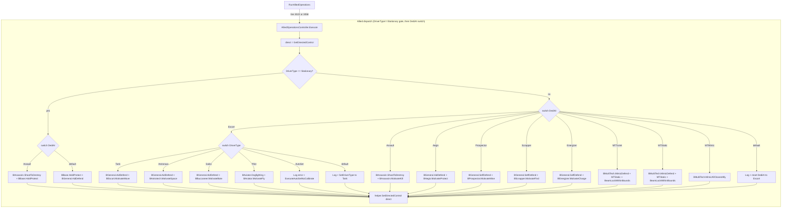
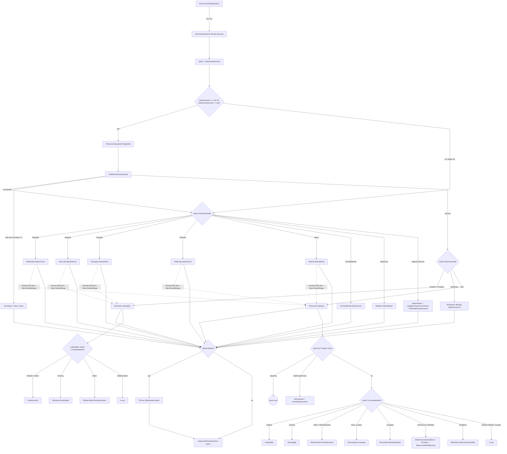

# Operations Dispatch Pipeline (B* / R*)

> **Category:** Combat Subsystems
> **Timing:** the actionPause family, Urgency, and WeaponDelayClock cadences are catalogued in [21 Timing & Cadence Register](21_timing-cadence.md).

## Summary

The operations dispatch pipeline is the final per-tick branch in the AI loop. After the alignment-aware tick pipelines (pipelines 4/5) select `RunAlliedOperations` or `RunEnemyOperations`, control passes to a single `Execute()` call on either `AlliedOperationsController` (for `AIAlignment.Player` techs) or `EnemyOperationsController` (for `AIAlignment.NonPlayer` techs). Each controller is a thin per-tick switch that selects the appropriate role/behavior module.

- **Allied path** branches first on `helper.DriverType == AIDriverType.Stationary` (a top-level `if` that sub-switches on `DediAI`: `Assault` → `BAssassin.ShootToDestroy` + `BBase.HoldProtect`; everything else → `BBase.HoldProtect` + `BGeneral.AidDefend`). Non-stationary techs key on `TankAIHelper.DediAI` (`AIType` enum: Escort/Assault/Aegis/Prospector/Scrapper/Energizer/MTTurret/MTStatic/MTMimic), and the `Escort` case keys again on `helper.DriverType` (Tank/Astronaut/Sailor/Pilot/AutoSet/default). It calls the matching `B*` module (BEscort, BAstrotech, BBuccaneer, BAviator, BAssassin, BAegis, BProspector, BScrapper, BEnergizer, BMultiTech, BBase).
- **Enemy path** runs through `EnemyOperationsController.Execute`, which **centralizes the no-target case before its `EvilCommander` switch**: when `helper.lastEnemyGet == null || helper.lastEnemyGet.tank == null`, it calls `RGeneral.DispatchNoTargetIdle` (re-acquire via `TryRefreshEnemyEnemy`, then route by archetype) and returns early if a target still can't be found. Only when a live target exists does it switch on `EnemyMind.EvilCommander` (`EnemyHandling` enum: Wheeled/Airplane/Chopper/Starship/Naval/SuicideMissile/Stationary) and dispatch to the matching `R*` "Attack*" entry, with a `default` arm for unknown handling. The R* attack entries do **not** own a no-target→idle branch; the only in-handler idle calls left are the `EnemyAttitude.Homing && dist > MaxCombatRange` "mending" branches (aircraft/chopper mend via `RAircraft.LollyGagAir`; wheeled/naval/starship/missile via `RGeneral.LollyGag`). `DispatchNoTargetIdle` and `RGeneral.LollyGag` re-dispatch on `EnemyMind.CommanderMind` (`EnemyAttitude` enum: Default/Homing/Miner/Junker/OnRails/NPCBaseHost/Boss/Invader/Guardian/PartTurret/PartStatic/PartMimic) to the idle/role modules (`RMiner`, `RScavenger`, `RGuardian`, `BMultiTech`, plus the in-file `DefaultIdle`/`HomingIdle`).

Both controllers share one output channel: they mutate an `EControlOperatorSet direct` struct fetched via `helper.GetDirectedControl()` and re-commit it via `helper.SetDirectedControl(direct)`. Every B*/R* leaf module reads/writes this struct plus various `helper.*` flags (`ThrottleState`, `DriveVar`, `Attempt3DNavi`, `AvoidStuff`, `IsMultiTech`, `WantsToFight`). Downstream `AICores` consume that struct on the next physics tick.

**Note on naming:** the protective role on the allied side is filled by `BAegis.MotivateProtect`; the enemy-side `RGuardian` is the closest analogue. The resource-scrapper role is `BScrapper.MotivateFind`. `RGuardian`, `RScavenger`, and `RMiner` are *not* reached through the top-level `EnemyHandling` switch — they are reached from the secondary `EnemyAttitude` switch inside `RGeneral.LollyGag` (and, for no-target idle, `RGeneral.DispatchNoTargetIdle` → `LollyGag`).

## Entry points

| Source pipeline | Caller method | File | Dispatches to |
|-----------------|---------------|------|---------------|
| Pipeline 4 (allied tick) | `TankAIHelper.RunAlliedOperations` | [TankAIHelper.cs:2980](../Modified/TACtical_AI-master/TACtical_AI-master/TAC_AI/AI/TankAIHelper.cs) | `OpsController.Execute()` at line 3022 (PlayerFocused autopilot) and line 3058 (active non-RTS) |
| Pipeline 4 (allied tick) | `TankAIHelper.OpsController` property (lazy init) | [TankAIHelper.cs:82](../Modified/TACtical_AI-master/TACtical_AI-master/TAC_AI/AI/TankAIHelper.cs) | Constructs `new AlliedOperationsController(this)` on first access (line 92) |
| Pipeline 5 (enemy tick) | `TankAIHelper.RunEnemyOperations` | [TankAIHelper.cs:3061](../Modified/TACtical_AI-master/TACtical_AI-master/TAC_AI/AI/TankAIHelper.cs) | `RCore.BeEvil` (heavy, line 3071) or `RCore.BeEvilLight` (light, line 3068) |
| Pipeline 5 (enemy tick) | `RCore.RunEvilOperations` | [RCore.cs:726](../Modified/TACtical_AI-master/TACtical_AI-master/TAC_AI/Enemy/RCore.cs) | `mind.EnemyOpsController.Execute()` at line 741 (host-side non-RTS path) |
| Pipeline 5 (enemy tick) | `EnemyMind.Refresh` | [EnemyMind.cs:123](../Modified/TACtical_AI-master/TACtical_AI-master/TAC_AI/Enemy/EnemyMind.cs) | Constructs `new EnemyOperationsController(this)` at line 142 |
| RTS override (allied) | `TankAIHelper.RunRTSNavi` | [TankAIHelper.cs:3075](../Modified/TACtical_AI-master/TACtical_AI-master/TAC_AI/AI/TankAIHelper.cs) | Bypasses `Execute()` entirely when `RTSControlled && IsRTSReceivable` (called at TankAIHelper.cs:3019/3055) |
| RTS override (enemy) | `TankAIHelper.RunRTSNaviEnemy` | [TankAIHelper.cs:3213](../Modified/TACtical_AI-master/TACtical_AI-master/TAC_AI/AI/TankAIHelper.cs) | Replaces `EnemyOpsController.Execute()` for `RTSControlled && !IsMultiTech` enemy techs (called from [RCore.cs:738](../Modified/TACtical_AI-master/TACtical_AI-master/TAC_AI/Enemy/RCore.cs)) |

After `Execute()` returns, the controller writes back `helper.SetDirectedControl(direct)` and pipelines 4/5 continue into the movement-controller handoff (pipeline 8).

## Flow

### Allied operations dispatch (DediAI / DriverType)

### Enemy dispatch + LollyGag fallback (EvilCommander / CommanderMind)

## Node reference

### Allied B* modules (`AI/AlliedOperations/*.cs`)

| Module | Entry method | File | Purpose |
|--------|--------------|------|---------|
| `AlliedOperationsController` | `Execute()` | [AlliedOperationsController.cs:17](../Modified/TACtical_AI-master/TACtical_AI-master/TAC_AI/AI/AlliedOperations/AlliedOperationsController.cs) | Per-tick allied dispatch. Branches first on `DriverType == Stationary` (sub-switches `DediAI`: `Assault` → `BAssassin.ShootToDestroy` + `BBase.HoldProtect`; `default` → `BBase.HoldProtect` + `BGeneral.AidDefend`), otherwise on the `DediAI` switch. Resets invalid `DediAI` to `Escort`; invalid Escort `DriverType` to `Tank`; `AutoSet` reaching dispatch self-heals via `ExecuteAutoSetNoCalibrate`. |
| `BBase` | `HoldProtect` / `HoldSupport` | [BBase.cs:17 / 13](../Modified/TACtical_AI-master/TACtical_AI-master/TAC_AI/AI/AlliedOperations/BBase.cs) | `HoldProtect` is the stationary base/turret hold: pivots toward `lastEnemyGet`, otherwise cycles a random 50-300 tick action-pause. Guards `lastEnemyGet.tank` (not just the Visible) before dereferencing. `HoldSupport` (line 13) is a thin forwarder to `HoldProtect` (they were identical); kept as an alias. |
| `BEscort` | `MotivateMove` | [BEscort.cs:9](../Modified/TACtical_AI-master/TACtical_AI-master/TAC_AI/AI/AlliedOperations/BEscort.cs) | Wheeled escort follow-the-player behavior. Holds position if `lastPlayer == tank.visible`. |
| `BAstrotech` | `MotivateSpace` | [BAstrotech.cs:11](../Modified/TACtical_AI-master/TACtical_AI-master/TAC_AI/AI/AlliedOperations/BAstrotech.cs) | Escort for Astronaut driver type (hovership/space). Same logic as BEscort but 3D nav enabled. |
| `BBuccaneer` | `MotivateBote` | [BBuccaneer.cs:8](../Modified/TACtical_AI-master/TACtical_AI-master/TAC_AI/AI/AlliedOperations/BBuccaneer.cs) | Escort for Sailor driver type. Falls back to `DediAI = AIType.Escort` if WaterMod isn't installed. |
| `BAviator` | `Dogfighting` + `MotivateFly` | [BAviator.cs:92 / 9](../Modified/TACtical_AI-master/TACtical_AI-master/TAC_AI/AI/AlliedOperations/BAviator.cs) | Aircraft escort. The dispatch calls `Dogfighting` (weapon-aim helper, line 92) then `MotivateFly` (movement, line 9). Requires `MovementController is AIControllerAir`. |
| `BAssassin` | `ShootToDestroy` + `MotivateKill` | [BAssassin.cs:195 / 10](../Modified/TACtical_AI-master/TACtical_AI-master/TAC_AI/AI/AlliedOperations/BAssassin.cs) | `AIType.Assault` behavior - chase and destroy any radar-visible enemy beyond normal escort range. The dispatch calls `ShootToDestroy` (aim/fire gate, line 195) then `MotivateKill` (movement, line 10). |
| `BAegis` | `MotivateProtect` | [BAegis.cs:9](../Modified/TACtical_AI-master/TACtical_AI-master/TAC_AI/AI/AlliedOperations/BAegis.cs) | `AIType.Aegis` behavior - protect the nearest non-player allied tech, will chase enemy some distance from the protected ally. Bails (asserts) if `theResource.tank == tank` (self-protect assertion). |
| `BProspector` | `MotivateMine` | [BProspector.cs:9](../Modified/TACtical_AI-master/TACtical_AI-master/TAC_AI/AI/AlliedOperations/BProspector.cs) | `AIType.Prospector` behavior - harvest resource chunks and return to receiver when full. Flees home on enemy detection. |
| `BScrapper` | `MotivateFind` | [BScrapper.cs:11](../Modified/TACtical_AI-master/TACtical_AI-master/TAC_AI/AI/AlliedOperations/BScrapper.cs) | `AIType.Scrapper` behavior - find loose blocks, return to base when threatened. |
| `BEnergizer` | `MotivateCharge` | [BEnergizer.cs:10](../Modified/TACtical_AI-master/TACtical_AI-master/TAC_AI/AI/AlliedOperations/BEnergizer.cs) | `AIType.Energizer` behavior - charge/heal other techs. Toggles `CollectedTarget` at charge < 20% / > 90% (tighter thresholds than BAssassin). |
| `BMultiTech` | `MTStatic` / `MimicAllClosestAlly` / `BeamLockWithinBounds` / `MimicDefend` | [BMultiTech.cs:9 / 29 / 142 / 205](../Modified/TACtical_AI-master/TACtical_AI-master/TAC_AI/AI/AlliedOperations/BMultiTech.cs) | Multi-tech (build-beam) roles. `MTStatic` (line 9, MTTurret/MTStatic) pivots in place + aims at enemy; `MimicAllClosestAlly` (line 29, MTMimic) copies the nearest non-MT ally's actions; `BeamLockWithinBounds` (line 142) locks the rigidbody to its anchor; `MimicDefend` (line 205) is the aim/fire helper paired with the MT roles. |
| `BGeneral` | `ResetValues`, `AidDefend`, `SelfDefend` | [BGeneral.cs:8 / 27 / 101](../Modified/TACtical_AI-master/TACtical_AI-master/TAC_AI/AI/BGeneral.cs) | Shared utilities. `ResetValues` (line 8) clears per-tick flags (`ThrottleState=FullSpeed`, `FIRE_ALL=false`, `FullBoost=false`, etc.) before every B* call. `AidDefend` (line 27) fires when allies have an enemy. `SelfDefend` (line 101) is the resource-collector variant used by Prospector/Scrapper/Energizer. |

### Enemy R* modules (`Enemy/EnemyOperations/*.cs` and `Enemy/RGeneral.cs`)

| Module | Entry method | File | Purpose |
|--------|--------------|------|---------|
| `EnemyOperationsController` | `Execute()` | [EnemyOperationsController.cs:12](../Modified/TACtical_AI-master/TACtical_AI-master/TAC_AI/Enemy/EnemyOperations/EnemyOperationsController.cs) | Per-tick enemy dispatch. Centralizes the no-target case (`lastEnemyGet == null \|\| lastEnemyGet.tank == null` → `RGeneral.DispatchNoTargetIdle`, line 33-43) before the `EvilCommander` switch; only dispatches an R* attack entry when a live target exists, then applies the retreat-location override (line 92-94). Has a `default` arm (line 69): unknown `EnemyHandling` → `ResetValues` + `LogWarnPlayerOncePerKey` + `RWheeled.AttackVroom`, leaving `Mind.EvilCommander` untouched. |
| `RWheeled` | `AttackVroom` | [RWheeled.cs:34](../Modified/TACtical_AI-master/TACtical_AI-master/TAC_AI/Enemy/EnemyOperations/RWheeled.cs) | Ground-vehicle attack. Range/spacing logic per `CommanderAttack` (Safety/Circle/Ranged/default). Has only one in-handler idle call: the `EnemyAttitude.Homing && dist > MaxCombatRange` mend branch (line 43-52) calls `RGeneral.LollyGag`. No-target idle is handled upstream by the controller. |
| `RAircraft` | `AttackWoosh` + `LollyGagAir` | [RAircraft.cs:22 / 169](../Modified/TACtical_AI-master/TACtical_AI-master/TAC_AI/Enemy/EnemyOperations/RAircraft.cs) | Airplane attack and dedicated aircraft idle/heal `LollyGagAir` (separate from `RGeneral.LollyGag` since it applies the trailing altitude/sea/ground snap, lines 275-280). The `EnemyAttitude.Homing && dist > MaxCombatRange` mend branch (line 45-56) calls `LollyGagAir`. Also defines `FlutterAround` (line 283, random air patrol) and `EnemyDogfighting` (line 301). Defers `tank.Recycle()` one frame if `tank.rbody` is null (out-of-player-range cleanup, line 29-39). |
| `RChopper` | `AttackShwa` | [RChopper.cs:22](../Modified/TACtical_AI-master/TACtical_AI-master/TAC_AI/Enemy/EnemyOperations/RChopper.cs) | Helicopter attack. Per-`CommanderAttack` range table differs from Aircraft (bomber-style Ranged for melee, sniper-style otherwise). The `EnemyAttitude.Homing && dist > MaxCombatRange` mend branch (line 31-41) calls `RAircraft.LollyGagAir`. |
| `RStarship` | `AttackZoom` | [RStarship.cs:15](../Modified/TACtical_AI-master/TACtical_AI-master/TAC_AI/Enemy/EnemyOperations/RStarship.cs) | Spaceship/hovership attack with multi-plane (3D) navigation. Same Homing-mend pattern as RWheeled (`RGeneral.LollyGag`). |
| `RNaval` | `AttackWhish` | [RNaval.cs:14](../Modified/TACtical_AI-master/TACtical_AI-master/TAC_AI/Enemy/EnemyOperations/RNaval.cs) | Naval attack. Same Homing-mend pattern as RWheeled (`RGeneral.LollyGag`). |
| `RCrashMissile` | `AttackCrash` | [RCrashMissile.cs:14](../Modified/TACtical_AI-master/TACtical_AI-master/TAC_AI/Enemy/EnemyOperations/RCrashMissile.cs) | Suicide-missile straight-line ram (`FullMelee + FullBoost + ForceSpeed`). No `CommanderAttack` switch and no in-handler idle branch; the no-target case is handled upstream by the controller. |
| `RStation` | `AttackWham` | [RStation.cs:14](../Modified/TACtical_AI-master/TACtical_AI-master/TAC_AI/Enemy/EnemyOperations/RStation.cs) | Stationary turret. Holds `sceneStationaryPos` (pivot-only). No in-handler idle branch; the no-target case is handled upstream by `DispatchNoTargetIdle` → `RGeneral.LollyGag(holdGround:true)`. |
| `RMiner` | `MineYerOwnBusiness` | [RMiner.cs:14](../Modified/TACtical_AI-master/TACtical_AI-master/TAC_AI/Enemy/EnemyOperations/RMiner.cs) | Reached via `LollyGag` for `EnemyAttitude.Miner`/`NPCBaseHost`, and via `RAircraft.LollyGagAir`'s `Miner` case (RAircraft.cs:262). Harvest chunks, return to base when full. Wrapped in try/catch with `errorCode` tracking. |
| `RScavenger` | `Scavenge` | [RScavenger.cs:17](../Modified/TACtical_AI-master/TACtical_AI-master/TAC_AI/Enemy/EnemyOperations/RScavenger.cs) | Reached via `LollyGag` for `EnemyAttitude.Boss`/`Junker`. Picks up loose blocks. `reverseFromResourceTime = 35` (line 15). |
| `RGuardian` | `MotivateDefend` | [RGuardian.cs:14](../Modified/TACtical_AI-master/TACtical_AI-master/TAC_AI/Enemy/EnemyOperations/RGuardian.cs) | Reached via `LollyGag` for `EnemyAttitude.Guardian`. Protects `helper.theResource` like an enemy-side Aegis. Returns early if `theResource`/`theResource.tank` is null. |
| `RGeneral` | `LollyGag` / `DispatchNoTargetIdle` | [RGeneral.cs:38 / 238](../Modified/TACtical_AI-master/TACtical_AI-master/TAC_AI/Enemy/RGeneral.cs) | `LollyGag` (line 38) is the central idle re-dispatcher: handles Hurt-state recovery (energy/repair), an optional `holdGround` pin to `sceneStationaryPos`, a heartbeat re-aggro, then switches on `CommanderMind` to dispatch idle/role behavior. `DispatchNoTargetIdle` (line 238) is the controller's no-target entry: re-acquires via `TryRefreshEnemyEnemy`, holds (DriveDest=None) when `Provoked > 0`, else routes Airplane/Chopper → `RAircraft.LollyGagAir`, Stationary → `LollyGag(holdGround:true)`, else → `LollyGag`. Also exposes `DefaultIdle` (204), `HomingIdle` (269), `Engadge` (188), `CanRetreat` (15), `Scurry`, `Monitor`, `BaseAttack`, `AidAttack`, `AimAttack`, `SelfDefense`, `RTSCombat`. |
| `RCore` | `BeEvil` / `RunEvilOperations` / `CombatChecking` / `GetRetreatLocation` / `ProcessIfRetreat` | [RCore.cs:635 / 726 / 763 / 802 / 794](../Modified/TACtical_AI-master/TACtical_AI-master/TAC_AI/Enemy/RCore.cs) | Outer wrapper invoked by pipeline 5. `BeEvil` looks up the `EnemyMind`, calls `RunEvilOperations` (shared `CommonEvilOp` housekeeping + alignment switch, then `EnemyOpsController.Execute` or `RunRTSNaviEnemy`), then `ScarePlayer`. `CombatChecking` is the pre-controller combat work (aim/fire intent per `EvilCommander`/`CommanderAttack`). `GetRetreatLocation` overrides the dispatcher's output for retreating dynamic-team techs; `ProcessIfRetreat` gates it on `helper.Retreat`. |

### CommanderMind / EnemyAttitude coverage matrix

The `EnemyAttitude` enum values ([EnemyEnums.cs:36](../Modified/TACtical_AI-master/TACtical_AI-master/TAC_AI/EnemyEnums.cs)) and where they are handled:

| EnemyAttitude | LollyGag ([RGeneral.cs:141](../Modified/TACtical_AI-master/TACtical_AI-master/TAC_AI/Enemy/RGeneral.cs)) | LollyGagAir ([RAircraft.cs:253](../Modified/TACtical_AI-master/TACtical_AI-master/TAC_AI/Enemy/EnemyOperations/RAircraft.cs)) | Action |
|---------------|--------|--------|--------|
| Default | line 143 | line 255 | `DefaultIdle` (random nearby pos) / `FlutterAround` (random air pos) |
| Homing | line 146 | line 258 | `HomingIdle` (nearest tech regardless of MaxCombatRange) |
| Miner | line 149 | line 261 | `RMiner.MineYerOwnBusiness` |
| Junker | line 158 | line 264 | `RScavenger.Scavenge` (ground) / `FlutterAround` (air) |
| OnRails | `default` (line 181) | `default` (line 271) | no-op (resolves via `default`) |
| NPCBaseHost | line 152 | `default` (line 271) | `RMiner.MineYerOwnBusiness` (ground) / no-op (air) |
| Boss | line 155 | `default` (line 271) | `RScavenger.Scavenge` (ground) / no-op (air) |
| Invader | `default` (line 181) | `default` (line 271) | no-op (resolves via `default`) |
| Guardian | line 163 | `default` (line 271) | `RGuardian.MotivateDefend` (ground) / no-op (air) |
| PartTurret | line 166 | `default` (line 271) | `BMultiTech.MimicDefend + MTStatic + BeamLockWithinBounds` (ground) / no-op (air) |
| PartStatic | line 173 | `default` (line 271) | `BMultiTech.MimicDefend + MTStatic + BeamLockWithinBounds` (ground) / no-op (air) |
| PartMimic | line 178 | `default` (line 271) | `BMultiTech.MimicAllClosestAlly` (ground) / no-op (air) |

For `LollyGag`, `OnRails`/`Invader` have no dedicated case and resolve to the `default` (no-op) arm. For `LollyGagAir`, only Default/Homing/Miner/Junker have dedicated cases; OnRails/NPCBaseHost/Boss/Invader/Guardian/PartTurret/PartStatic/PartMimic all resolve to the `default` (no-op) arm and then fall through to the unconditional altitude/sea/ground snap (RAircraft.cs:275-280).

## Key data / state

### Shared boilerplate across all handlers

Every B*/R* movement handler (those taking `ref EControlOperatorSet direct`) starts with:

1. **`BGeneral.ResetValues(helper, ref direct)`** ([BGeneral.cs:8-25](../Modified/TACtical_AI-master/TACtical_AI-master/TAC_AI/AI/BGeneral.cs)) clears `ThrottleState=FullSpeed`, `FIRE_ALL=false` (preserving a live player-RTS hold-fire command), `FullBoost=false`, `FirePROPS=false`, `ForceSetBeam=false`, `LightBoost=false`, `DriveVar=0`, then calls `direct.FaceDest()` to set the default facing intent.
2. Sets `IsMultiTech` (true only for `BMultiTech.*`).
3. Sets `Attempt3DNavi` based on driver-type or locomotion shape.
4. Optionally sets `AvoidStuff`.
5. Computes `dist` from current task/destination via `helper.GetDistanceFromTask(...)` and branches accordingly.

The combat assertion `helper.WantsToFight = true` is set by `BGeneral.AidDefend` / `BGeneral.SelfDefend` (allied) or implicitly by R* modules when `lastEnemyGet != null`.

### Output channel: `EControlOperatorSet`

All dispatch endpoints write the same struct fields:

- `direct.DriveDest` (`EDriveDest` enum: `None`, `ToLastDestination`, `FromLastDestination`)
- `direct.DriveDir` (`EDriveFacing` enum: `Forwards`, `Reverse`, `Neutral`, etc.)
- `direct.lastDestination` (Vector3, via `direct.SetLastDest(pos)`)
- Convenience setters: `direct.FaceDest()`, `direct.STOP(helper)`, `direct.Reverse(helper)`, `direct.DriveToFacingPerp()`, `direct.DriveAwayFacingTowards()`

Plus side-effects on `helper`:

- `helper.ThrottleState` (`AIThrottleState`)
- `helper.DriveVar`, `helper.WantsToFight`, `helper.ChaseThreat`
- `helper.MTLockedToTechBeam`, `helper.MTMimicHostAvail`, `helper.AllMT` (multitech)
- `helper.foundGoal`, `helper.foundBase`, `helper.CollectedTarget` (resource/charge state machines)
- `helper.actionPause` (countdown timers)

The committed struct is consumed by `MovementController` / `AIControllerXxx` on the next physics tick.

### `AIType` role enum and the legacy save-compat shim

The allied `DediAI` switch keys on the `AIType` enum ([AIType.cs:3](../Modified/TACtical_AI-master/TACtical_AI-master/TAC_AI/AI/AIType.cs)): Escort/Assault/Aegis/Prospector/Scrapper/Energizer/MTTurret/MTStatic/MTMimic. The trailing entries `Aviator`/`Buccaneer`/`Astrotech` ([AIType.cs:29-31](../Modified/TACtical_AI-master/TACtical_AI-master/TAC_AI/AI/AIType.cs)) are a **retained save-compatibility shim**, not live dispatch arms: the role is dispatched at runtime as `AIType.Escort` + `AIDriverType` (Pilot/Sailor/Astronaut). They are kept as the trailing, contiguous, highest-valued members because (1) `ModuleAIExtension.savedMode` persists the raw `AIType` ordinal in old saves, and (2) `KickStart.TransferLegacyIfNeeded` ([KickStart.cs:1113](../Modified/TACtical_AI-master/TACtical_AI-master/TAC_AI/KickStart.cs)) migrates them on load via the ordinal-dependent test `type >= AIType.Aviator` ([KickStart.cs:1117](../Modified/TACtical_AI-master/TACtical_AI-master/TAC_AI/KickStart.cs)). Removing or reordering them would corrupt that migration. The `LEGACY ... DO NOT REMOVE OR REORDER` annotation lives at [AIType.cs:20](../Modified/TACtical_AI-master/TACtical_AI-master/TAC_AI/AI/AIType.cs).

### Per-handler flag set summary

| Module | `IsMultiTech` | `Attempt3DNavi` | `AvoidStuff` | Notes |
|--------|---------------|-----------------|--------------|-------|
| BAegis | false | per driver | - | Errors on self-protect |
| BAssassin | false | - | true | Charge-and-fire toggle |
| BBase | false | true | - | `ThrottleState=PivotOnly` |
| BBuccaneer | false | true | true | Falls back to Escort w/o WaterMod |
| BEnergizer | false | - | true | Tighter charge thresholds |
| BEscort | false | false | true | Primary tank path |
| BMultiTech | true | - | - | `ThrottleState=PivotOnly` (MTStatic) |
| BProspector | false | - | true | Flee-to-base on enemy |
| BScrapper | false | - | true | Flee-to-base on enemy |
| BAviator | false | - | true | Requires `AIControllerAir` |
| BAstrotech | false | true | true | 3D BEscort variant |
| RWheeled | - | false | true | Homing-mend → `RGeneral.LollyGag` |
| RAircraft | - | false | true | Defers Recycle if `rbody` null; Homing-mend → `LollyGagAir` |
| RChopper | - | false | true | Homing-mend → `RAircraft.LollyGagAir` |
| RNaval | - | true | true | Homing-mend → `RGeneral.LollyGag` |
| RStarship | - | true | true | Multi-plane; Homing-mend → `RGeneral.LollyGag` |
| RStation | - | true | - | `Retreat=true`, `ThrottleState=PivotOnly` |
| RCrashMissile | - | true | false | `WantsToFight=true`, `FullMelee=true`, `FullBoost=true`, `ThrottleState=ForceSpeed` |
| RGuardian | false | per loco | - | Early-return if `theResource`/`.tank` null |
| RScavenger | false | per loco | - | `reverseFromResourceTime=35` |
| RMiner | - | - | true | try/catch with `errorCode` |

## Exit points

| Path | Action | File |
|------|--------|------|
| Allied dispatch end | `helper.SetDirectedControl(direct)` | [AlliedOperationsController.cs:144](../Modified/TACtical_AI-master/TACtical_AI-master/TAC_AI/AI/AlliedOperations/AlliedOperationsController.cs) |
| Enemy no-target early return | `DispatchNoTargetIdle` runs, then `SetDirectedControl` and `return` if still no target (retreat override applied first if `helper.Retreat`) | [EnemyOperationsController.cs:35-42](../Modified/TACtical_AI-master/TACtical_AI-master/TAC_AI/Enemy/EnemyOperations/EnemyOperationsController.cs) |
| Enemy dispatch end (no retreat) | `helper.SetDirectedControl(direct)` | [EnemyOperationsController.cs:96](../Modified/TACtical_AI-master/TACtical_AI-master/TAC_AI/Enemy/EnemyOperations/EnemyOperationsController.cs) |
| Enemy dispatch end (retreating) | `RCore.GetRetreatLocation(...)` overwrites `direct`, then `SetDirectedControl` | [EnemyOperationsController.cs:92-96](../Modified/TACtical_AI-master/TACtical_AI-master/TAC_AI/Enemy/EnemyOperations/EnemyOperationsController.cs) |
| Retreat-override (dynamic teams) | `RCore.ProcessIfRetreat` runs **after** `EnemyOpsController.Execute()` only for `ManBaseTeams.IsBaseTeamDynamic(tank.Team)` and can replace `direct` again | [RCore.cs:742-751, 794](../Modified/TACtical_AI-master/TACtical_AI-master/TAC_AI/Enemy/RCore.cs) |
| Enemy unknown `EnemyHandling` | `default` arm: `ResetValues` + `LogWarnPlayerOncePerKey` + `RWheeled.AttackVroom` (Mind.EvilCommander left untouched) | [EnemyOperationsController.cs:69-90](../Modified/TACtical_AI-master/TACtical_AI-master/TAC_AI/Enemy/EnemyOperations/EnemyOperationsController.cs) |
| Allied invalid `DediAI` | Log + auto-reset to `AIType.Escort` | [AlliedOperationsController.cs:137-141](../Modified/TACtical_AI-master/TACtical_AI-master/TAC_AI/AI/AlliedOperations/AlliedOperationsController.cs) |
| Allied invalid `DriverType` in Escort | Log + `SetDriverType(AIDriverType.Tank)` | [AlliedOperationsController.cs:81-85](../Modified/TACtical_AI-master/TACtical_AI-master/TAC_AI/AI/AlliedOperations/AlliedOperationsController.cs) |
| Allied `AutoSet` reaching dispatch | Log error + `ExecuteAutoSetNoCalibrate()` (self-heal) | [AlliedOperationsController.cs:71-79](../Modified/TACtical_AI-master/TACtical_AI-master/TAC_AI/AI/AlliedOperations/AlliedOperationsController.cs) |
| Hurt-state early returns in LollyGag | Returns true (`isRegenerating`/repair in progress) and skips the `CommanderMind` switch | [RGeneral.cs:67, 90, 112](../Modified/TACtical_AI-master/TACtical_AI-master/TAC_AI/Enemy/RGeneral.cs) |
| Aircraft world-recycle | Deferred `tank.Recycle()` (one frame) if `tank.rbody` is null (out of player range), then bail out of the tick | [RAircraft.cs:29-39](../Modified/TACtical_AI-master/TACtical_AI-master/TAC_AI/Enemy/EnemyOperations/RAircraft.cs) |
| RTS bypass (allied) | `RunRTSNavi()` synthesises its own `EControlOperatorSet`; skips `OpsController.Execute()` | [TankAIHelper.cs:3075](../Modified/TACtical_AI-master/TACtical_AI-master/TAC_AI/AI/TankAIHelper.cs) |
| RTS bypass (enemy) | `RunRTSNaviEnemy(mind)` replaces `EnemyOpsController.Execute()` for `RTSControlled && !IsMultiTech` techs | [RCore.cs:738](../Modified/TACtical_AI-master/TACtical_AI-master/TAC_AI/Enemy/RCore.cs) |

After exit, control returns to the caller (pipeline 4 or 5), which proceeds to the movement controller / drive maintainer step (pipeline 8).

## Cross-pipeline integration

- **Upstream (pipelines 4/5)** select which controller runs based on `AIAlignment`. The allied tick (pipeline 4) calls `OpsController.Execute()` directly; the enemy tick (pipeline 5) routes through `RCore.BeEvil` -> `RunEvilOperations` -> `EnemyOpsController.Execute()`. `RunEvilOperations` first runs `CommonEvilOp` ([RCore.cs:660](../Modified/TACtical_AI-master/TACtical_AI-master/TAC_AI/Enemy/RCore.cs)), whose `CommanderAlignment` switch (`BeHostile` / `BeSubNeutral` / `BeNeutral` / `BeFriendly`) calls `RCore.CombatChecking` to set the per-tick combat/aim intent before the dispatch fires.
- **Downstream (pipeline 8 - movement controller)** consumes the `EControlOperatorSet` written by the controllers. Both `MovementController.UpdateThrottle` and the per-locomotion `AIControllerXxx.Tick` read `helper.GetDirectedControl()` and act on `DriveDest` / `DriveDir` / `lastDestination`.
- **EnemyMind state machine** (`EnemyMind.EndAggro`, [EnemyMind.cs:361-377](../Modified/TACtical_AI-master/TACtical_AI-master/TAC_AI/Enemy/EnemyMind.cs)) can flip `CommanderMind` (to `Miner`/`Junker`) between attack ticks once the tech is out of combat range, changing the dispatch arm taken by the next `LollyGag` invocation. The flip is gated on `lastEnemyGet == null || !InRangeOfTarget(MaxCombatRange)` so it does not fire while a target is still in range.
- **Pre-controller combat work** runs *before* the controller and computes the `lastEnemyGet` / `Provoked` / `WantsToFight` inputs that the dispatch reads. On the enemy side this is `RCore.CombatChecking` ([RCore.cs:763](../Modified/TACtical_AI-master/TACtical_AI-master/TAC_AI/Enemy/RCore.cs)), reached via `CommonEvilOp`'s alignment switch. On the allied side it is `TankAIHelper.UpdateTargetCombatFocus` ([TankAIHelper.cs:4756](../Modified/TACtical_AI-master/TACtical_AI-master/TAC_AI/AI/TankAIHelper.cs)), called at the top of `RunAlliedOperations` (line 2993).
- **RTS override** (`RunRTSNavi` / `RunRTSNaviEnemy`) is mutually exclusive with `Execute()` - the controller never sees an RTS-controlled tech (unless it is a MultiTech sub-tech, in which case the bypass is suppressed and the controller runs).
- **Repair pipeline** (`RRepair.EnemyInstaRepair` / `EnemyRepairStepper`) is invoked from inside `RGeneral.LollyGag` and `RAircraft.LollyGagAir` when `mind.Hurt` is true (also from `CommonEvilOp` for fly/anchored repair). Within the dispatch surface, the Hurt branches in those two idle methods are where damage recovery is initiated for enemy techs.

## Issues

**NONE.**

If a new issue is found in this pipeline, replace `NONE.` above and add it under the matching heading,
using a stable ID (BUG-N, DEAD-N, or TD-N) and a clickable file.cs:line link.

### Bugs
- **BUG-1 (High | Medium | Low)** - [File.cs:line](path) - what is wrong, and the intended fix.
### Dead code
- **DEAD-1** - [File.cs:line](path) - what is orphaned or unreachable, and why.
### Tech debt
- **TD-1** - [File.cs:line](path) - the smell, and the cleaner shape.
