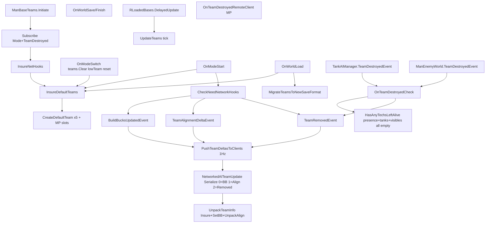
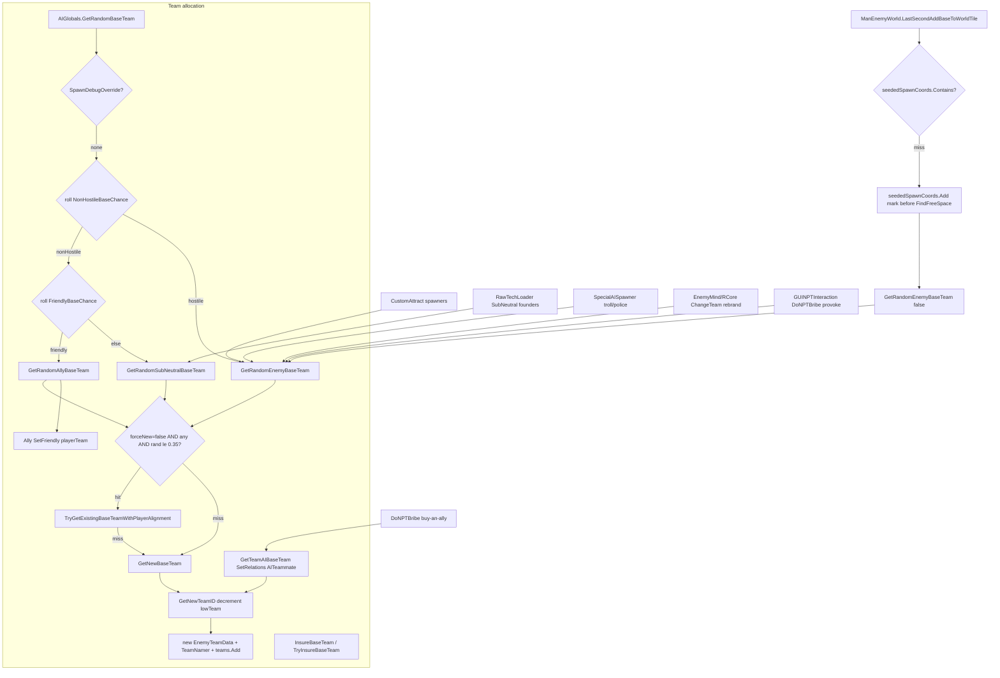
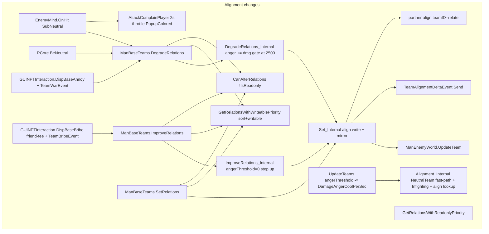
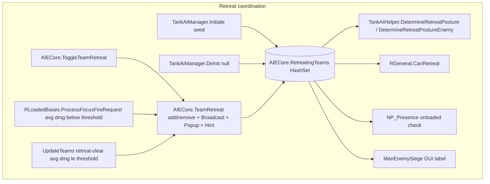
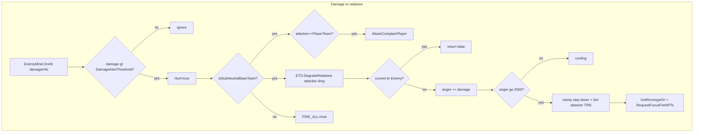

# 14 - Team Management Pipeline (ManBaseTeams)

> **Category:** World & Team
> **Timing:** runs on the 6s BaseFunderManager economy clock (anger decay, retreat clear, build gates) — catalogued in [21 Timing & Cadence Register](21_timing-cadence.md).

## Summary

`ManBaseTeams` is the central registry for every non-player faction tracked by TAC AI. Each `EnemyTeamData` entry owns a team ID (drawn from a monotonically decreasing pool, `lowTeam` seeded at `AIGlobals.EnemyTeamsRangeStart = -1073741828`), a `defaultRelations` enum (`Enemy` / `SubNeutral` / `Neutral` / `Friendly` / `AITeammate`), an `align` dictionary of per-team relation overrides, `buildBucks` plus a `bankrupt` flag, an `angerThreshold` cooldown, an `Infighting` flag (flips same-team behaviour to `Enemy`), and an optional HQ `TeamBasePointer` discovered via `SetHQToStrongestOrRandomBase` (largest-block-count base wins).

`ManBaseTeams` is decorated `[AutoSaveManager]`, so its `[SSaveField]` members (`teams`, `TradingSellOffers`, `HiddenVisibles`, `seededSpawnCoords`, `lowTeam`) ride along with SafeSaves. Five default teams are always re-created on boot (`InsureDefaultTeams`) and four MP placeholder teams `1073741824..1073741827` join when networked. The instance is wired to mode events (`ModeStartEvent`, `ModeSwitchEvent`) and two team-destroyed signals (`TankAIManager.TeamDestroyedEvent` for loaded techs, `ManEnemyWorld.TeamDestroyedEvent` for unloaded presences). Three local events (`BuildBucksUpdatedEvent`, `TeamAlignmentDeltaEvent`, `TeamRemovedEvent`) fan out to a multiplayer broadcaster (`NetworkedAITeamUpdate`).

Allocation funnels through `AIGlobals.GetRandomEnemyBaseTeam` / `GetRandomSubNeutralBaseTeam` / `GetRandomAllyBaseTeam`. Each accepts `forceNew`; when `forceNew == false` they roll against `ManBaseTeams.PercentChanceExisting` (default 0.35) and reuse via `TryGetExistingBaseTeamWithPlayerAlignment` before falling back to `GetNewBaseTeam`. The reuse path prevents tile-recycle spawns (`LastSecondAddBaseToWorldTile`) and `RawTechLoader` sub-neutral spawns from fragmenting the faction list. `GetRandomAllyBaseTeam` allocates with `defaultRelations = Enemy` then `SetFriendly(playerTeam)`: an ally is intentionally hostile-by-default to other NPT factions while reading Friendly toward the player. Relations mutate through per-instance helpers (`Set`/`ImproveRelations`/`DegradeRelations`) which forward to static methods that resolve the writable team of a pair (read-only default teams are never the source of a write). `DegradeRelations` only steps down once `angerThreshold` crosses `AIGlobals.DamageAngerDropRelations` (2500), decaying inside `UpdateTeams`. `AttackComplainPlayer` is a throttled UI popup fired when the player smacks a SubNeutral.

Retreat coordination piggybacks on a transient `HashSet<int> AIECore.RetreatingTeams` (allocated in `TankAIManager.Initiate`, nulled in `DeInit`; not serialized). `AIECore.TeamRetreat(team, retreat, sending)` toggles membership, optionally broadcasts over the network, plays a "Fall back!" / "Engage!" popup over every team mobile, and calls `AIWiki.hintNPTRetreat.Show()` on both the retreat and the un-retreat branch. Disposal is event-driven: both destroyed events route to `OnTeamDestroyedCheck` which only erases a team after `HasAnyTechsLeftAlive` returns false (requires NP_Presence units, live tanks, and tracked visibles to all be empty). MP clients receive removals via `OnTeamDestroyedRemoteClient`. The network broadcaster (`NetworkedAITeamUpdate`) slices each per-tick drain into multiple packets of up to `MaxPerPacket = 200` entries.

## Entry points

| Entry point | Purpose | File:line |
| --- | --- | --- |
| `ManBaseTeams.Initiate` | Boot wiring, default-team seed | [ManBaseTeams.cs:579](../Modified/TACtical_AI-master/TACtical_AI-master/TAC_AI/World/ManBaseTeams.cs) |
| `ManBaseTeams.DeInit` | Tear down, unsubscribe | [ManBaseTeams.cs:693](../Modified/TACtical_AI-master/TACtical_AI-master/TAC_AI/World/ManBaseTeams.cs) |
| `ManBaseTeams.InsureDefaultTeams(fixup)` | Read-only seed of canonical + MP teams | [ManBaseTeams.cs:660](../Modified/TACtical_AI-master/TACtical_AI-master/TAC_AI/World/ManBaseTeams.cs) |
| `OnModeStart` / `OnModeSwitch` | Mode lifecycle | [ManBaseTeams.cs:730](../Modified/TACtical_AI-master/TACtical_AI-master/TAC_AI/World/ManBaseTeams.cs) / [:725](../Modified/TACtical_AI-master/TACtical_AI-master/TAC_AI/World/ManBaseTeams.cs) |
| `OnWorldLoad` / `OnWorldSave` | Save/load, migration trigger | [ManBaseTeams.cs:1350](../Modified/TACtical_AI-master/TACtical_AI-master/TAC_AI/World/ManBaseTeams.cs) / [:1309](../Modified/TACtical_AI-master/TACtical_AI-master/TAC_AI/World/ManBaseTeams.cs) |
| `ManBaseTeams.GetNewBaseTeam(defaultRelations)` | Allocate new team via `GetNewTeamID` | [ManBaseTeams.cs:832](../Modified/TACtical_AI-master/TACtical_AI-master/TAC_AI/World/ManBaseTeams.cs) |
| `ManBaseTeams.InsureBaseTeam` / `TryInsureBaseTeam` | Attach existing-ID record | [ManBaseTeams.cs:866](../Modified/TACtical_AI-master/TACtical_AI-master/TAC_AI/World/ManBaseTeams.cs) / [:881](../Modified/TACtical_AI-master/TACtical_AI-master/TAC_AI/World/ManBaseTeams.cs) |
| `ManBaseTeams.GetTeamAIBaseTeam(team)` | Create/find player-owned `AITeammate` shadow team | [ManBaseTeams.cs:839](../Modified/TACtical_AI-master/TACtical_AI-master/TAC_AI/World/ManBaseTeams.cs) |
| `AIGlobals.GetRandomBaseTeam(debugSpawned, force)` | Umbrella allocator (Enemy/SubNeutral/Ally) | [AIGlobals.cs:859](../Modified/TACtical_AI-master/TACtical_AI-master/TAC_AI/AIGlobals.cs) |
| `AIGlobals.GetRandomEnemyBaseTeam` | Enemy allocator (reuse-or-new) | [AIGlobals.cs:888](../Modified/TACtical_AI-master/TACtical_AI-master/TAC_AI/AIGlobals.cs) |
| `AIGlobals.GetRandomSubNeutralBaseTeam` | SubNeutral allocator | [AIGlobals.cs:896](../Modified/TACtical_AI-master/TACtical_AI-master/TAC_AI/AIGlobals.cs) |
| `AIGlobals.GetRandomAllyBaseTeam` | Ally allocator (Enemy default + SetFriendly) | [AIGlobals.cs:912](../Modified/TACtical_AI-master/TACtical_AI-master/TAC_AI/AIGlobals.cs) |
| `EnemyTeamData.Set` / `SetEnemy` / `SetFriendly` / `SetNeutral` / `SetHoldFire` / `SetInfighting` | Per-team alignment writes | [ManBaseTeams.cs:413](../Modified/TACtical_AI-master/TACtical_AI-master/TAC_AI/World/ManBaseTeams.cs) |
| `EnemyTeamData.ImproveRelations` / `DegradeRelations` | Step relations up/down | [ManBaseTeams.cs:311](../Modified/TACtical_AI-master/TACtical_AI-master/TAC_AI/World/ManBaseTeams.cs) / [:350](../Modified/TACtical_AI-master/TACtical_AI-master/TAC_AI/World/ManBaseTeams.cs) |
| `ManBaseTeams.AttackComplainPlayer(scenePos, team)` | Throttled SubNeutral hit popup | [ManBaseTeams.cs:1208](../Modified/TACtical_AI-master/TACtical_AI-master/TAC_AI/World/ManBaseTeams.cs) |
| `ManEnemyWorld.ChangeTeam(team, newTeam)` | Mass-reassign techs + rebind NP_Presence | [ManEnemyWorld.cs:1398](../Modified/TACtical_AI-master/TACtical_AI-master/TAC_AI/World/ManEnemyWorld.cs) |
| `ManEnemyWorld.LastSecondAddBaseToWorldTile` | Per-tile spawn gated by `seededSpawnCoords` | [ManEnemyWorld.cs:570](../Modified/TACtical_AI-master/TACtical_AI-master/TAC_AI/World/ManEnemyWorld.cs) |
| `AIECore.TeamRetreat` / `ToggleTeamRetreat` | Mutate `RetreatingTeams` | [AIECore.cs:389](../Modified/TACtical_AI-master/TACtical_AI-master/TAC_AI/AI/AIECore.cs) / [:425](../Modified/TACtical_AI-master/TACtical_AI-master/TAC_AI/AI/AIECore.cs) |
| `OnTeamDestroyedCheck` / `OnTeamDestroyedRemoteClient` | Lifecycle removal | [ManBaseTeams.cs:740](../Modified/TACtical_AI-master/TACtical_AI-master/TAC_AI/World/ManBaseTeams.cs) / [:749](../Modified/TACtical_AI-master/TACtical_AI-master/TAC_AI/World/ManBaseTeams.cs) |
| `EnemyMind.OnHit` | SubNeutral self -> AttackComplain + DegradeRelations | [EnemyMind.cs:196](../Modified/TACtical_AI-master/TACtical_AI-master/TAC_AI/Enemy/EnemyMind.cs) |
| `RCore.BeNeutral` | Loaded retaliation -> DegradeRelations | [RCore.cs:859](../Modified/TACtical_AI-master/TACtical_AI-master/TAC_AI/Enemy/RCore.cs) |
| `GUINPTInteraction.DispBaseBribe` / `DispBaseAnnoy` / `DoNPTBribe` | Friend-fee button / "Annoy" button / network bribe handler | [GUINPTInteraction.cs:308](../Modified/TACtical_AI-master/TACtical_AI-master/TAC_AI/GUINPTInteraction.cs) / [:391](../Modified/TACtical_AI-master/TACtical_AI-master/TAC_AI/GUINPTInteraction.cs) / [:614](../Modified/TACtical_AI-master/TACtical_AI-master/TAC_AI/GUINPTInteraction.cs) |

## Flow

### Lifecycle: boot, world load, networked deltas, teardown

### Team allocation (reuse-or-new) + spawn sources

### Alignment changes

### Retreat coordination

### Damage to relations

## Node reference

| Node | Role | File:line |
| --- | --- | --- |
| `ManBaseTeams.Initiate` | Subscribe events, seed defaults | [ManBaseTeams.cs:579](../Modified/TACtical_AI-master/TACtical_AI-master/TAC_AI/World/ManBaseTeams.cs) |
| `ManBaseTeams.DeInit` | Tear down | [ManBaseTeams.cs:693](../Modified/TACtical_AI-master/TACtical_AI-master/TAC_AI/World/ManBaseTeams.cs) |
| `InsureDefaultTeams(fixup)` | Seed five canonical + MP teams | [ManBaseTeams.cs:660](../Modified/TACtical_AI-master/TACtical_AI-master/TAC_AI/World/ManBaseTeams.cs) |
| `CreateDefaultTeam` / `SetDefaultTeam` | Construct read-only default rows; `SetDefaultTeam` scrubs a read-only team's `align` unconditionally | [ManBaseTeams.cs:591](../Modified/TACtical_AI-master/TACtical_AI-master/TAC_AI/World/ManBaseTeams.cs) / [:602](../Modified/TACtical_AI-master/TACtical_AI-master/TAC_AI/World/ManBaseTeams.cs) |
| `SanityCheckTeam` | Strip default rows from a team's `align` | [ManBaseTeams.cs:631](../Modified/TACtical_AI-master/TACtical_AI-master/TAC_AI/World/ManBaseTeams.cs) |
| `OnModeSwitch` / `OnModeStart` | Mode lifecycle | [ManBaseTeams.cs:725](../Modified/TACtical_AI-master/TACtical_AI-master/TAC_AI/World/ManBaseTeams.cs) / [:730](../Modified/TACtical_AI-master/TACtical_AI-master/TAC_AI/World/ManBaseTeams.cs) |
| `OnWorldSave` / `OnWorldFinishSave` | SafeSaves push | [ManBaseTeams.cs:1309](../Modified/TACtical_AI-master/TACtical_AI-master/TAC_AI/World/ManBaseTeams.cs) / [:1330](../Modified/TACtical_AI-master/TACtical_AI-master/TAC_AI/World/ManBaseTeams.cs) |
| `OnWorldPreLoad` / `OnWorldLoad` | Load + migrate legacy | [ManBaseTeams.cs:1339](../Modified/TACtical_AI-master/TACtical_AI-master/TAC_AI/World/ManBaseTeams.cs) / [:1350](../Modified/TACtical_AI-master/TACtical_AI-master/TAC_AI/World/ManBaseTeams.cs) |
| `MigrateTeamsToNewSaveFormat` | Walk StoredTiles + StoredTilesJSON, map legacy ranges | [ManBaseTeams.cs:1217](../Modified/TACtical_AI-master/TACtical_AI-master/TAC_AI/World/ManBaseTeams.cs) |
| `GetNewTeamID` | Advance `lowTeam` to floor; GC-reclaim via `TryReclaimDeadTeamID`; throw on exhaustion | [ManBaseTeams.cs:808](../Modified/TACtical_AI-master/TACtical_AI-master/TAC_AI/World/ManBaseTeams.cs) |
| `TryReclaimDeadTeamID` | Sweep dead dynamic teams, recycle highest free ID | [ManBaseTeams.cs:783](../Modified/TACtical_AI-master/TACtical_AI-master/TAC_AI/World/ManBaseTeams.cs) |
| `GetNewBaseTeam(defaultRelations)` | Construct + add | [ManBaseTeams.cs:832](../Modified/TACtical_AI-master/TACtical_AI-master/TAC_AI/World/ManBaseTeams.cs) |
| `GetTeamAIBaseTeam(team)` | Player-owned `AITeammate` shadow; verifies against `team` | [ManBaseTeams.cs:839](../Modified/TACtical_AI-master/TACtical_AI-master/TAC_AI/World/ManBaseTeams.cs) |
| `InsureBaseTeam` / `TryInsureBaseTeam` | Attach existing-ID record | [ManBaseTeams.cs:866](../Modified/TACtical_AI-master/TACtical_AI-master/TAC_AI/World/ManBaseTeams.cs) / [:881](../Modified/TACtical_AI-master/TACtical_AI-master/TAC_AI/World/ManBaseTeams.cs) |
| `TryGetBaseTeamAny / DynamicOnly / StaticOnly` | Typed lookups | [ManBaseTeams.cs:892-906](../Modified/TACtical_AI-master/TACtical_AI-master/TAC_AI/World/ManBaseTeams.cs) |
| `GetRandomExistingBaseTeam` | Snapshot `IterateBaseTeams().ToList()`, index `Random.Range(0, Count)` | [ManBaseTeams.cs:907](../Modified/TACtical_AI-master/TACtical_AI-master/TAC_AI/World/ManBaseTeams.cs) |
| `TryGetExistingBaseTeamWithPlayerAlignment` | Filtered reuse picker, same single-snapshot pick | [ManBaseTeams.cs:918](../Modified/TACtical_AI-master/TACtical_AI-master/TAC_AI/World/ManBaseTeams.cs) |
| `IterateALLTeams` / `IterateBaseTeams` helpers | Iterators over `teams.Values` (dynamic-only for `IterateBaseTeams`) | [ManBaseTeams.cs:756-779](../Modified/TACtical_AI-master/TACtical_AI-master/TAC_AI/World/ManBaseTeams.cs) |
| `IsBaseTeamAny / Dynamic / DynamicOrUnregistered / Static` | Classification | [ManBaseTeams.cs:931-950](../Modified/TACtical_AI-master/TACtical_AI-master/TAC_AI/World/ManBaseTeams.cs) |
| `IsTeamHQ`, `GetTeamMoney` | Quick lookups | [ManBaseTeams.cs:952-963](../Modified/TACtical_AI-master/TACtical_AI-master/TAC_AI/World/ManBaseTeams.cs) |
| `IsEnemyBaseTeam / SubNeutralBaseTeam / NeutralBaseTeam / FriendlyBaseTeam` | Player-aligned predicates | [ManBaseTeams.cs:1130-1149](../Modified/TACtical_AI-master/TACtical_AI-master/TAC_AI/World/ManBaseTeams.cs) |
| `IsAlliedPlayerAIBaseTeam / IsPlayerOwnedAIBaseTeam` | Player AI predicates | [ManBaseTeams.cs:1150-1159](../Modified/TACtical_AI-master/TACtical_AI-master/TAC_AI/World/ManBaseTeams.cs) |
| `EnemyTeamData` ctors | Construct row | [ManBaseTeams.cs:174](../Modified/TACtical_AI-master/TACtical_AI-master/TAC_AI/World/ManBaseTeams.cs) / [:184](../Modified/TACtical_AI-master/TACtical_AI-master/TAC_AI/World/ManBaseTeams.cs) |
| `Alignment_Internal` | NeutralTeam fast-path + Infighting + `align` lookup + `defaultRelations` | [ManBaseTeams.cs:196](../Modified/TACtical_AI-master/TACtical_AI-master/TAC_AI/World/ManBaseTeams.cs) |
| `EnemyMindAlignment` | Maps to `EnemyStanding` (AITeammate -> Friendly) | [ManBaseTeams.cs:218](../Modified/TACtical_AI-master/TACtical_AI-master/TAC_AI/World/ManBaseTeams.cs) |
| `ImproveRelations_Internal` | `anger=0`, step up, popup, `Set(team,TRN)`, clamp `[Enemy, AITeammate]` | [ManBaseTeams.cs:312](../Modified/TACtical_AI-master/TACtical_AI-master/TAC_AI/World/ManBaseTeams.cs) |
| `DegradeRelations_Internal` | `anger += damage`, gate at 2500, step down, clamp `[Enemy, AITeammate]` | [ManBaseTeams.cs:351](../Modified/TACtical_AI-master/TACtical_AI-master/TAC_AI/World/ManBaseTeams.cs) |
| `SetInfighting` / `SetInfighting_Internal` | Public guards `IsReadonly`; internal does the unguarded set | [ManBaseTeams.cs:400](../Modified/TACtical_AI-master/TACtical_AI-master/TAC_AI/World/ManBaseTeams.cs) / [:409](../Modified/TACtical_AI-master/TACtical_AI-master/TAC_AI/World/ManBaseTeams.cs) |
| `Set / SetEnemy / SetNeutral / SetHoldFire / SetFriendly` | Alignment write helpers | [ManBaseTeams.cs:413-446](../Modified/TACtical_AI-master/TACtical_AI-master/TAC_AI/World/ManBaseTeams.cs) |
| `Set_Internal` (mirror + events) | `align[other]=relate`, mirror only when partner is `!IsReadonly`, raise events, `UpdateTeam` | [ManBaseTeams.cs:414](../Modified/TACtical_AI-master/TACtical_AI-master/TAC_AI/World/ManBaseTeams.cs) |
| `GetRelationsWithWriteablePriority` | Sort IDs, prefer non-readonly | [ManBaseTeams.cs:967](../Modified/TACtical_AI-master/TACtical_AI-master/TAC_AI/World/ManBaseTeams.cs) |
| `GetRelationsWithReadonlyPriority` | Readonly-first read | [ManBaseTeams.cs:984](../Modified/TACtical_AI-master/TACtical_AI-master/TAC_AI/World/ManBaseTeams.cs) |
| `GetRelationsWritablePriority` / `GetRelationsReadonlyPriority` | Public relation reads (resolve `PlayerTeam` shadow) | [ManBaseTeams.cs:1002](../Modified/TACtical_AI-master/TACtical_AI-master/TAC_AI/World/ManBaseTeams.cs) / [:1012](../Modified/TACtical_AI-master/TACtical_AI-master/TAC_AI/World/ManBaseTeams.cs) |
| `CanAlterRelations` | `!ETD.IsReadonly` | [ManBaseTeams.cs:1030](../Modified/TACtical_AI-master/TACtical_AI-master/TAC_AI/World/ManBaseTeams.cs) |
| `SetRelations` / `ImproveRelations` / `DegradeRelations` (static) | Dispatch + write | [ManBaseTeams.cs:1036](../Modified/TACtical_AI-master/TACtical_AI-master/TAC_AI/World/ManBaseTeams.cs) / [:1050](../Modified/TACtical_AI-master/TACtical_AI-master/TAC_AI/World/ManBaseTeams.cs) / [:1064](../Modified/TACtical_AI-master/TACtical_AI-master/TAC_AI/World/ManBaseTeams.cs) |
| `IsEnemy / IsFriendly / ShouldNotAttack / IsUnattackable / IsTeammate / IsNonAggressiveTeam` | Combat-side predicates | [ManBaseTeams.cs:1089-1127](../Modified/TACtical_AI-master/TACtical_AI-master/TAC_AI/World/ManBaseTeams.cs) |
| `UpdateTeams` | Per-tick: anger decay + retreat clear + `ManageBases` | [ManBaseTeams.cs:1163](../Modified/TACtical_AI-master/TACtical_AI-master/TAC_AI/World/ManBaseTeams.cs) |
| `ManageBases` | HQ pick + base ops | [ManBaseTeams.cs:483](../Modified/TACtical_AI-master/TACtical_AI-master/TAC_AI/World/ManBaseTeams.cs) |
| `AttackComplainPlayer` | 2s-throttled `PopupColored` | [ManBaseTeams.cs:1208](../Modified/TACtical_AI-master/TACtical_AI-master/TAC_AI/World/ManBaseTeams.cs) |
| `OnTeamDestroyedCheck` | Gate by `HasAnyTechsLeftAlive`, then remove | [ManBaseTeams.cs:740](../Modified/TACtical_AI-master/TACtical_AI-master/TAC_AI/World/ManBaseTeams.cs) |
| `OnTeamDestroyedRemoteClient` | MP host-authoritative remove (obeys host; no local re-gate by design) | [ManBaseTeams.cs:749](../Modified/TACtical_AI-master/TACtical_AI-master/TAC_AI/World/ManBaseTeams.cs) |
| `HasAnyTechsLeftAlive` | Presence + tanks + visibles all empty | [ManBaseTeams.cs:154](../Modified/TACtical_AI-master/TACtical_AI-master/TAC_AI/World/ManBaseTeams.cs) |
| `CheckNeedNetworkHooks(mode)` | Subscribe BB/Align/Removed, start 1Hz push | [ManBaseTeams.cs:1450](../Modified/TACtical_AI-master/TACtical_AI-master/TAC_AI/World/ManBaseTeams.cs) |
| `OnNetTeamBBChange / OnNetTeamAlignChange / OnNetTeamDestroyed` | Queue dirty into `ToSend` | [ManBaseTeams.cs:1477-1492](../Modified/TACtical_AI-master/TACtical_AI-master/TAC_AI/World/ManBaseTeams.cs) |
| `PushTeamDeltasToClients` | 1Hz priority-drain, slice into packets of `MaxPerPacket` | [ManBaseTeams.cs:1498](../Modified/TACtical_AI-master/TACtical_AI-master/TAC_AI/World/ManBaseTeams.cs) |
| `NetworkedAITeamUpdate` Serialize/Deserialize | `0=BB`, `1=Align+BB`, `2=Removed`; one packet carries up to `MaxPerPacket = 200` entries (byte count prefix) | [ManBaseTeams.cs:1519-1633](../Modified/TACtical_AI-master/TACtical_AI-master/TAC_AI/World/ManBaseTeams.cs) |
| `OnReceiveTeamUpdate` | Registered no-op client handler (always returns `true`) | [ManBaseTeams.cs:1641](../Modified/TACtical_AI-master/TACtical_AI-master/TAC_AI/World/ManBaseTeams.cs) |
| `AIGlobals.GetRandomBaseTeam` | Umbrella selector | [AIGlobals.cs:859](../Modified/TACtical_AI-master/TACtical_AI-master/TAC_AI/AIGlobals.cs) |
| `AIGlobals.GetRandomEnemyBaseTeam` | Enemy allocator | [AIGlobals.cs:888](../Modified/TACtical_AI-master/TACtical_AI-master/TAC_AI/AIGlobals.cs) |
| `AIGlobals.GetRandomSubNeutralBaseTeam` | SubNeutral allocator | [AIGlobals.cs:896](../Modified/TACtical_AI-master/TACtical_AI-master/TAC_AI/AIGlobals.cs) |
| `AIGlobals.GetRandomAllyBaseTeam` | Ally allocator with `SetFriendly(playerTeam)` | [AIGlobals.cs:912](../Modified/TACtical_AI-master/TACtical_AI-master/TAC_AI/AIGlobals.cs) |
| `AIECore.RetreatingTeams` field | Transient `HashSet<int>` | [AIECore.cs:87](../Modified/TACtical_AI-master/TACtical_AI-master/TAC_AI/AI/AIECore.cs) |
| `AIECore.TeamRetreat(team,retreat,sending)` | Toggle + broadcast + popup + hint (both branches) | [AIECore.cs:389](../Modified/TACtical_AI-master/TACtical_AI-master/TAC_AI/AI/AIECore.cs) |
| `AIECore.ToggleTeamRetreat` | Wrapper toggle | [AIECore.cs:425](../Modified/TACtical_AI-master/TACtical_AI-master/TAC_AI/AI/AIECore.cs) |
| `TankAIManager.Initiate` seed / `DeInit` clear | `RetreatingTeams = new`/`null` | [TankAIManager.cs:64](../Modified/TACtical_AI-master/TACtical_AI-master/TAC_AI/AI/TankAIManager.cs) / [:124](../Modified/TACtical_AI-master/TACtical_AI-master/TAC_AI/AI/TankAIManager.cs) |
| `TankAIHelper.DetermineRetreatPosture` / `DetermineRetreatPostureEnemy` | Read `AIECore.RetreatingTeams` | [TankAIHelper.cs:4821](../Modified/TACtical_AI-master/TACtical_AI-master/TAC_AI/AI/TankAIHelper.cs) / [:4887](../Modified/TACtical_AI-master/TACtical_AI-master/TAC_AI/AI/TankAIHelper.cs) |
| `RGeneral.CanRetreat` | Per-tech retreat decision; falls back to `RetreatingTeams.Contains(tank.Team)` | [RGeneral.cs:15](../Modified/TACtical_AI-master/TACtical_AI-master/TAC_AI/Enemy/RGeneral.cs) |
| `NP_Presence` unloaded-tile retreat check | Unloaded combat tick | [NP_Presence.cs:331](../Modified/TACtical_AI-master/TACtical_AI-master/TAC_AI/World/NP_Presence.cs) |
| `ManEnemySiege` GUI label | Debug "Retreating:" label | [ManEnemySiege.cs:445](../Modified/TACtical_AI-master/TACtical_AI-master/TAC_AI/World/ManEnemySiege.cs) |
| `RLoadedBases.ProcessFocusFireRequest` | Escalate to `TeamRetreat(true)` | [RLoadedBases.cs:413](../Modified/TACtical_AI-master/TACtical_AI-master/TAC_AI/Enemy/RLoadedBases.cs) |
| `EnemyMind.OnHit` | SubNeutral path + complain + degrade | [EnemyMind.cs:196](../Modified/TACtical_AI-master/TACtical_AI-master/TAC_AI/Enemy/EnemyMind.cs) |
| `RCore.BeNeutral` | Loaded retaliation degrade | [RCore.cs:859](../Modified/TACtical_AI-master/TACtical_AI-master/TAC_AI/Enemy/RCore.cs) |
| `GUINPTInteraction.DispBaseBribe` / `DispBaseAnnoy` / `DoNPTBribe` | Friend-fee `ImproveRelations` / insult `DegradeRelations` / network bribe handler | [GUINPTInteraction.cs:308](../Modified/TACtical_AI-master/TACtical_AI-master/TAC_AI/GUINPTInteraction.cs) / [:391](../Modified/TACtical_AI-master/TACtical_AI-master/TAC_AI/GUINPTInteraction.cs) / [:614](../Modified/TACtical_AI-master/TACtical_AI-master/TAC_AI/GUINPTInteraction.cs) |
| `seededSpawnCoords` field | Per-coord seed dedup | [ManBaseTeams.cs:540](../Modified/TACtical_AI-master/TACtical_AI-master/TAC_AI/World/ManBaseTeams.cs) |
| `lowTeam` field + start constant | Allocation pool cursor + `EnemyTeamsRangeStart` | [ManBaseTeams.cs:574](../Modified/TACtical_AI-master/TACtical_AI-master/TAC_AI/World/ManBaseTeams.cs) / [AIGlobals.cs:504](../Modified/TACtical_AI-master/TACtical_AI-master/TAC_AI/AIGlobals.cs) |
| `PercentChanceExisting` | Reuse-vs-new roll (0.35) | [ManBaseTeams.cs:526](../Modified/TACtical_AI-master/TACtical_AI-master/TAC_AI/World/ManBaseTeams.cs) |
| `AIGlobals.RetreatBelowTeamDamageThreshold` | Retreat-clear threshold (=30) | [AIGlobals.cs:481](../Modified/TACtical_AI-master/TACtical_AI-master/TAC_AI/AIGlobals.cs) |
| `AIGlobals.DamageAngerDropRelations` / `DamageAngerCoolPerSec` | Anger trigger (=2500) + decay | [AIGlobals.cs:415](../Modified/TACtical_AI-master/TACtical_AI-master/TAC_AI/AIGlobals.cs) / [:416](../Modified/TACtical_AI-master/TACtical_AI-master/TAC_AI/AIGlobals.cs) |

## Key data / state

- **`EnemyTeamData`** ([ManBaseTeams.cs:43](../Modified/TACtical_AI-master/TACtical_AI-master/TAC_AI/World/ManBaseTeams.cs)) - the per-team record. Fields: `teamID`, `teamName` (from `TeamNamer.GetTeamName(id)`), `buildBucks` + `bankrupt`, `Infighting`, `IsReadonly` (true for the read-only default teams), `align: Dictionary<int, TeamRelations>` (per-team overrides), `hqVisibleID` + lazily-resolved `_HQ: TeamBasePointer`, `angerThreshold`, `PlayerTeam` (`int.MinValue` if not a player-owned AI team), `relationInt`/`defaultRelations` (fallback when `align` lookup misses).
- **`TeamRelations` enum** - `Enemy=0`, `SubNeutral=1` (hold-fire bystander), `Neutral=2`, `Friendly=3`, `AITeammate=4` (player-allied AI base), `SameTeam=9001` (returned for self when not `Infighting`).
- **`ManBaseTeams.teams: Dictionary<int, EnemyTeamData>`** - the registry, `[SSaveField]`.
- **`AIECore.RetreatingTeams: HashSet<int>`** ([AIECore.cs:87](../Modified/TACtical_AI-master/TACtical_AI-master/TAC_AI/AI/AIECore.cs)) - transient runtime set (NOT serialized). Allocated in `TankAIManager.Initiate` (line 64), nulled in `DeInit` (line 124).
- **`seededSpawnCoords: HashSet<IntVector2>`** - `[SSaveField]` per-coord dedup of `LastSecondAddBaseToWorldTile` spawns. Marked BEFORE `FindFreeSpaceOnTile` so a bail still locks the coord (prevents recycled-tile re-spawn under fresh team ID).
- **`angerThreshold` per team** - increments by `damage` in `DegradeRelations_Internal`, must reach `AIGlobals.DamageAngerDropRelations` (2500) before a relation step-down fires. Decays by `AIGlobals.DamageAngerCoolPerSec` each `UpdateTeams` tick; reset to `0` on `ImproveRelations`. (`[JsonIgnore]`, not persisted.)
- **`buildBucks` per team + `BuildBucksUpdatedEvent`** - mutated via `AddBuildBucks`/`SpendBuildBucks`/`StealBuildBucks` (`StealBuildBucks(severity=0.2)` = `ceil(BB * Random(0, severity))`). `AddBuildBucks_Internal` is `checked` and try/catches `OverflowException` (saturates at `int.MaxValue`). `bankrupt` flag flips when `buildBucks <= 0`. `TryMakePurchase` gates on `PurchasePossible(BBcost)`.
- **`PercentChanceExisting`** (default `0.35f`) - reuse-roll for non-forced allocations.
- **`lowTeam`** seeded at `AIGlobals.EnemyTeamsRangeStart = -1073741828`. `GetNewTeamID` advances `lowTeam` downward past occupied IDs, bounded by `LowTeamFloor = int.MinValue + 1`. When the pool is exhausted it calls `TryReclaimDeadTeamID` (a GC sweep that reaps dynamic teams whose `HasAnyTechsLeftAlive()` is false and recycles the highest freed ID); if no slot can be reclaimed it throws `InvalidOperationException`.
- **`DamageAlertThreshold = 45`** ([AIGlobals.cs:385](../Modified/TACtical_AI-master/TACtical_AI-master/TAC_AI/AIGlobals.cs)) - `EnemyMind.OnHit` trips on a single hit above this, or on sustained sub-threshold DPS via `AccumulateAndCheckThreat`.
- **Default + MP team IDs**: `DefaultPlayerTeam`, `DefaultEnemyTeam = ManSpawn.FirstEnemyTeam`, `LonerEnemyTeam = ManSpawn.NewEnemyTeam` (seeded `Infighting=true`), `NeutralTeam = ManSpawn.NeutralTeam`, `trollTeam = SpecialAISpawner.trollTeam`; plus four MP slots `1073741824..1073741827` and `ModeCoOpCreative.NeutralTeam`. Legacy positive ranges (used only by `MigrateTeamsToNewSaveFormat`): Enemy `[256..356]`, SubNeutral `[357..406]`, Neutral `[407..456]`, Friendly `[457..506]`.

## Exit points

| Exit | Target | Notes |
| --- | --- | --- |
| `Set_Internal` | `TeamAlignmentDeltaEvent.Send(teamID)` -> `ManEnemyWorld.UpdateTeam` -> `TankAIManager.UpdateEntireTeam` | Re-evaluates `EnemyMindAlignment` + resets combat state on every loaded tech |
| `AttackComplainPlayer` | `AIGlobals.PopupColored` (UI floating text) | 2s throttle via `lastComplainTime`, lines like "Rude!"/"Watch it!"/"Ouch!" |
| `AIECore.TeamRetreat(true)` | `AIWiki.hintNPTRetreat.Show()`, `PopupColored("Fall back!")` over every team mobile, `NetworkHandler.TryBroadcastNewRetreatState` when `sending` | Adds to `RetreatingTeams` |
| `AIECore.TeamRetreat(false)` | `AIWiki.hintNPTRetreat.Show()`, `PopupColored("Engage!")`, same broadcast | Removes from `RetreatingTeams` (hint fires on this branch too) |
| `OnTeamDestroyedCheck` | `TeamRemovedEvent.Send(team)` -> `teams.Remove` | Gated by `HasAnyTechsLeftAlive` returning false |
| `OnNetTeamDestroyed` -> `PushTeamDeltasToClients` | `NetworkedAITeamUpdate.Serialize` (`0=BB`, `1=Align+BB`, `2=Removed`) | 1Hz priority drain (removals, then BB, then align), sliced into packets of up to `MaxPerPacket = 200` |
| `BuildBucksUpdatedEvent` | Per-team funds UI (KickStartExtras slider, HUD) + `OnNetTeamBBChange` (`ToSend[team]=0`) | |
| `ManEnemyWorld.UpdateTeam(team)` | `EnemyMindAlignment` + `ResetOnSwitchAlignments` + `TankAIManager.UpdateEntireTeam` | Forces target re-acquisition after relation flip |
| `ManageBases` (per team, every tick) | If HQ is loaded `EnemyBaseFunder` -> `RLoadedBases.UpdateBaseOperations(mind)`; else `SetHQToStrongestOrRandomBase` via `IterateTeamBaseFunders` + `NP_Presence.EBUs` | |
| `GetRandomAllyBaseTeam` | After allocation, `SetFriendly(playerTeam)` mirrors into player's `align` via `Set_Internal` | |
| `EnemyMind.OnHit` SubNeutral path | `AttackComplainPlayer` + `ETD.DegradeRelations(attacker, damage)` | If non-SubNeutral, sets `AIControl.FIRE_ALL = true` |

## Cross-pipeline integration

- **Spawning** ([13](13_spawning.md)): `LastSecondAddBaseToWorldTile` ([ManEnemyWorld.cs:570](../Modified/TACtical_AI-master/TACtical_AI-master/TAC_AI/World/ManEnemyWorld.cs)) calls `GetRandomEnemyBaseTeam(false)` so dynamically-recycled tiles reuse an existing dynamic team via `PercentChanceExisting`. `RawTechLoader.SpawnAttract*` / `SpawnFromTemplate` paths feed `GetRandomSubNeutralBaseTeam` for founder spawns. `SpecialAISpawner` and `CustomAttract` go through `GetRandomEnemyBaseTeam`.
- **Tech reassign** ([12](12_unloaded-presence.md)): `ManEnemyWorld.ChangeTeam(team, newTeam)` ([ManEnemyWorld.cs:1398](../Modified/TACtical_AI-master/TACtical_AI-master/TAC_AI/World/ManEnemyWorld.cs)) rebinds every loaded tech and the `NP_Presence` to the new team in one pass. Called from `EnemyMind` and `RCore` after a successful provoke/rebrand.
- **Combat AI** ([3](03_combat-ai.md)): `TankAIHelper.DetermineRetreatPosture` / `DetermineRetreatPostureEnemy` ([TankAIHelper.cs:4821](../Modified/TACtical_AI-master/TACtical_AI-master/TAC_AI/AI/TankAIHelper.cs) / [:4887](../Modified/TACtical_AI-master/TACtical_AI-master/TAC_AI/AI/TankAIHelper.cs)) and `RGeneral.CanRetreat` ([RGeneral.cs:15](../Modified/TACtical_AI-master/TACtical_AI-master/TAC_AI/Enemy/RGeneral.cs), fallback `RetreatingTeams.Contains(tank.Team)` at :35) read `AIECore.RetreatingTeams` every combat tick; `NP_Presence` ([NP_Presence.cs:331](../Modified/TACtical_AI-master/TACtical_AI-master/TAC_AI/World/NP_Presence.cs)) consults it on the unloaded path.
- **Retreat escalation** ([8](08_retreat.md)): `RLoadedBases.ProcessFocusFireRequest` ([RLoadedBases.cs:413](../Modified/TACtical_AI-master/TACtical_AI-master/TAC_AI/Enemy/RLoadedBases.cs)) escalates to `TeamRetreat(true)` when team average damage is `< AIGlobals.RetreatBelowTeamDamageThreshold = 30` (line 430); `ManBaseTeams.UpdateTeams` clears retreat (`TeamRetreat(false)`) once that average is `<=` the threshold again. The `<` / `<=` pair is boundary-consistent.
- **Damage/relations** ([7](07_damage-relations.md)): `EnemyMind.OnHit` (SubNeutral self, [EnemyMind.cs:217](../Modified/TACtical_AI-master/TACtical_AI-master/TAC_AI/Enemy/EnemyMind.cs)), `RCore.BeNeutral` (loaded retaliation, [RCore.cs:869](../Modified/TACtical_AI-master/TACtical_AI-master/TAC_AI/Enemy/RCore.cs)), and `GUINPTInteraction.DispBaseAnnoy` (player insult, [GUINPTInteraction.cs:411](../Modified/TACtical_AI-master/TACtical_AI-master/TAC_AI/GUINPTInteraction.cs)) are the three `DegradeRelations` call sites. The single `ImproveRelations` call site is the friend-fee path in `GUINPTInteraction.DispBaseBribe` ([GUINPTInteraction.cs:371](../Modified/TACtical_AI-master/TACtical_AI-master/TAC_AI/GUINPTInteraction.cs)). `GUINPTInteraction.DoNPTBribe` ([GUINPTInteraction.cs:614](../Modified/TACtical_AI-master/TACtical_AI-master/TAC_AI/GUINPTInteraction.cs)) does not touch relations: it routes the buy-an-ally path through `GetTeamAIBaseTeam` (line 618) and the `AddBuildBucks` / provoke (`GetRandomEnemyBaseTeam`, line 660) paths.
- **Multiplayer**: `NetworkedAITeamUpdate` packs/unpacks via `UnpackTeamInfo` -> `InsureBaseTeam` + `SetBuildBucks` + `UnpackTeamAlignmentInfo`, then `TankAIManager.UpdateEntireTeam(team)`. `PushTeamDeltasToClients` priority-drains `ToSend` (removals, then BB, then align) and slices it into multiple packets of up to `MaxPerPacket = 200` entries each (a single `byte` count prefix per packet); large drains simply emit more packets. `OnReceiveTeamUpdate` is a registered no-op client handler. `OnTeamDestroyedRemoteClient` removes from `inst.teams` unconditionally by design — the host already applied the `HasAnyTechsLeftAlive` gate before broadcasting (`ToClientsOnly`), so the client obeys the authoritative removal rather than re-deriving it against lagging local state.
- **Save/load**: `[AutoSaveManager]` + `[SSaveField]` on `teams`, `TradingSellOffers`, `HiddenVisibles`, `seededSpawnCoords`, `lowTeam`. `OnWorldLoad` null-guards `HiddenVisibles`/`seededSpawnCoords` for legacy saves and runs `MigrateTeamsToNewSaveFormat` only when `inst.teams == null` (legacy team-range constants are otherwise unused).
- **Debug shortcuts**: `DebugRawTechSpawner.AINoAttackPlayer` forces every `IsEnemy/IsFriendly` query touching `PlayerTeam` to non-hostile, regardless of stored relations; `AllowPlayerBuildEnemies` likewise toggles a subset of predicates.

## Issues

**NONE.**

If a new issue is found in this pipeline, replace `NONE.` above and add it under the matching heading,
using a stable ID (BUG-N, DEAD-N, or TD-N) and a clickable file.cs:line link.

### Bugs
- **BUG-1 (High | Medium | Low)** - [File.cs:line](path) - what is wrong, and the intended fix.
### Dead code
- **DEAD-1** - [File.cs:line](path) - what is orphaned or unreachable, and why.
### Tech debt
- **TD-1** - [File.cs:line](path) - the smell, and the cleaner shape.
