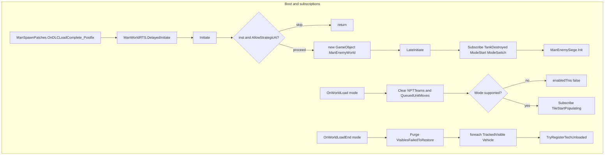
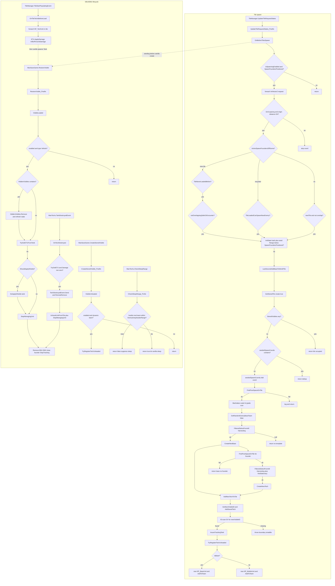
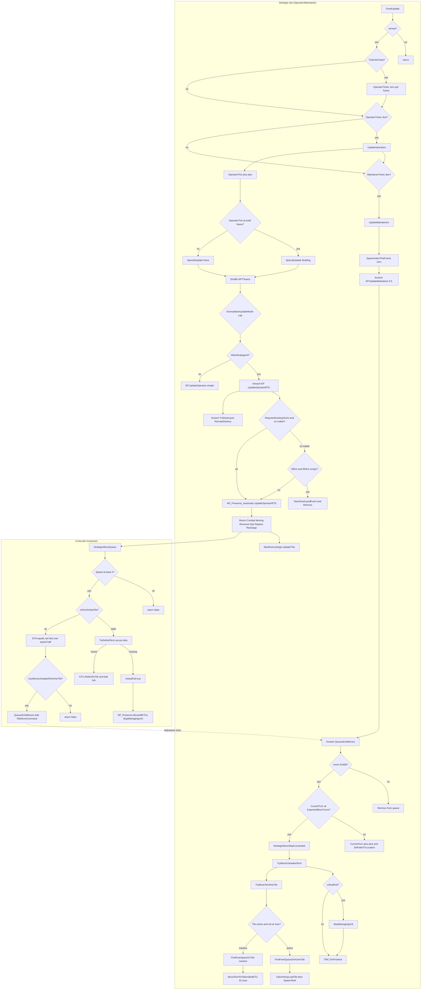

# 15 - Enemy World / Tile Management Pipeline

> **Category:** World & Team
> **Timing:** ManEnemyWorld is its OWN scheduler (OperatorTickDelay 4s / MaintainerTickDelay 0.5s) — catalogued in [21 Timing & Cadence Register](21_timing-cadence.md).

## Summary

The enemy-world tile pipeline is the bridge between TerraTech's vanilla `TileManager`
streaming and TAC AI's unloaded strategic simulation. It runs entirely server-side
(`ManNetwork.IsHost`) and operates over a partial-online model: when the player is
inside the loaded fringe of a tile, enemy techs are in-scene `Tank`s; once a tile
demotes below `LevelToAttemptTechEntry = WorldTile.LoadStep.Loaded`, the
`ManSaveGame.StoredTech` records persist and a wrapper class
(`NP_BaseUnit` for anchored bases / `NP_MobileUnit` for mobile techs, both
inheriting `NP_TechUnit`) takes over to fake combat, repair, recharge, expansion,
and tile-to-tile movement without the heavy `Rigidbody` cost.

The `ManEnemyWorld` MonoBehaviour singleton is the orchestrator: it holds
`NPTTeams` (`int teamID -> NP_Presence_Automatic`) and `QueuedUnitMoves`
(`NP_TechUnit -> TileMoveCommand`), runs two coupled `FixedUpdate` heartbeats
(`OperatorTickDelay=4s` for per-team strategic AI, `MaintainerTickDelay=0.5s`
for per-tech micromotion and queued-move stepping), and exposes the chokepoints
the rest of the mod hooks into. Three Harmony patches in `ManagerPatches.cs`
feed the system: `TileManager.UpdateTileRequestStates_Postfix` calls
`OnBeforeTilesSpawn` (natural-base seeding when the player crosses into virgin
tiles), and `ManSaveGame.RestoreVisible_Postfix` / `CreateStoredVisible_Postfix`
call `VisibleLoaded` / `VisibleUnloaded` to flip techs between in-scene and
NP_TechUnit form. A subscription to `TileStartPopulatingEvent` (set up at
`OnWorldLoad`) calls `OnTileTechsBeforeLoad` which applies accumulated unloaded
damage to NP_* records just before the vanilla tile populator instantiates the
actual `Tank`.

The whole system gates on `KickStart.AllowStrategicAI`, `KickStart.EnableBetterAI`,
and `Singleton.Manager<ManPop>.inst.IsSpawningEnabled`. When `OperatorTick`
overflows `MinimumTicksUntilBuild`, `SpecialUpdate` flips to
`SpecialUpdateType.Building` for one tick - the global signal `UnloadedBases`
watches to gate `ImTakingThatExpansion` (expansion + new mobile-tech construction
inside a base's tile).

Core wrapper concepts:

- **ETU** (`NP_TechUnit`) - base class for any unloaded enemy unit owned by `ManEnemyWorld`. Wraps a `ManSaveGame.StoredTech` plus a `TrackedVisible` so it shows on radar even while its tile is unloaded.
- **EMU** (`NP_MobileUnit : NP_TechUnit`) - unloaded mobile vehicle. Holds `MoveSpeed`, `IsAirborne`, `isFounder`.
- **EBU** (`NP_BaseUnit : NP_TechUnit`) - unloaded stationary base. Holds `revenue`, `RechargeRateDay` (the always-on shield recharge applied every tick day and night), `RechargeRate` (the day-only solar bonus added on top during daytime), `isDefense`, `isTechBuilder`, `IsHQ`. Funds live in `ManBaseTeams` (`BuildBucks`).
- **NP_Presence / NP_Presence_Automatic** - per-team controller. Owns `HashSet<NP_BaseUnit> EBUs`, `HashSet<NP_MobileUnit> EMUs`, plus `MainBase`, `teamFounder`, `teamMode` (Idle/Defending/Attacking/Retreating/SiegingPlayer) and `founderMode`.

Primary source files:

- [ManEnemyWorld.cs](../Modified/TACtical_AI-master/TACtical_AI-master/TAC_AI/World/ManEnemyWorld.cs) (2629 lines, the orchestrator)
- [NP_Presence.cs](../Modified/TACtical_AI-master/TACtical_AI-master/TAC_AI/World/NP_Presence.cs) (1022 lines, per-team strategic FSM)
- [NP_TechUnit.cs](../Modified/TACtical_AI-master/TACtical_AI-master/TAC_AI/World/NP_TechUnit.cs) (213 lines, base wrapper for unloaded tech)
- [NP_BaseUnit.cs](../Modified/TACtical_AI-master/TACtical_AI-master/TAC_AI/World/NP_BaseUnit.cs) (117 lines, anchored-base subclass)
- [NP_MobileUnit.cs](../Modified/TACtical_AI-master/TACtical_AI-master/TAC_AI/World/NP_MobileUnit.cs) (83 lines, mobile-tech subclass)
- [TileMoveCommand.cs](../Modified/TACtical_AI-master/TACtical_AI-master/TAC_AI/World/TileMoveCommand.cs) (67 lines, queued cross-tile move data)
- [UnloadedBases.cs](../Modified/TACtical_AI-master/TACtical_AI-master/TAC_AI/World/UnloadedBases.cs) (896 lines, expansion + per-team service ops)
- [ManBaseTeams.cs](../Modified/TACtical_AI-master/TACtical_AI-master/TAC_AI/World/ManBaseTeams.cs) (`seededSpawnCoords` line 540, `HiddenVisibles` line 535)
- [ManagerPatches.cs](../Modified/TACtical_AI-master/TACtical_AI-master/TAC_AI/PatchBatch/ManagerPatches.cs) (Harmony hooks)
- [AIGlobals.cs](../Modified/TACtical_AI-master/TACtical_AI-master/TAC_AI/AIGlobals.cs) (constants + tile predicates)

---

## Entry points

| Entry | Caller | Purpose |
| --- | --- | --- |
| `ManEnemyWorld.Initiate()` ([ManEnemyWorld.cs:272](../Modified/TACtical_AI-master/TACtical_AI-master/TAC_AI/World/ManEnemyWorld.cs)) | `ManagerPatches.ManSpawnPatches.OnDLCLoadComplete_Postfix` -> `ManWorldRTS.DelayedInitiate` chain (post-DLC) | Singleton spawn - creates `GameObject "ManEnemyWorld"`, subscribes `ManPauseGame.PauseEvent`. Gated by `KickStart.AllowStrategicAI`. |
| `ManEnemyWorld.LateInitiate()` ([ManEnemyWorld.cs:317](../Modified/TACtical_AI-master/TACtical_AI-master/TAC_AI/World/ManEnemyWorld.cs)) | `Initiate` (Steam build inline) or external mode-start | Subscribes `ManTechs.TankDestroyedEvent` -> `OnTechDestroyed`, `ManGameMode.ModeStartEvent` -> `OnWorldLoad`, `ManGameMode.ModeSwitchEvent` -> `OnWorldReset`. Starts `ManWorldRTS` + `ManEnemySiege`. |
| `ManEnemyWorld.OnWorldLoad(Mode)` ([ManEnemyWorld.cs:330](../Modified/TACtical_AI-master/TACtical_AI-master/TAC_AI/World/ManEnemyWorld.cs)) | `ManGameMode.ModeStartEvent` | Per mode-load - clears `NPTTeams`/`RegisteredByID`/`QueuedUnitMoves`, gates by mode (`ModeMain`/`ModeMisc`/`ModeCoOpCreative`/`ModeCoOpCampaign`), subscribes `TileManager.TileStartPopulatingEvent` -> `OnTileTechsBeforeLoad`, sets `enabledThis=true` (which drains any `pendingUnloaded`/`pendingLoaded` events buffered before readiness). |
| `ManEnemyWorld.OnWorldLoadEnd(Mode)` ([ManEnemyWorld.cs:358](../Modified/TACtical_AI-master/TACtical_AI-master/TAC_AI/World/ManEnemyWorld.cs)) | `ModeStartEvent` (added in `OnWorldLoad` once) | After save restore - iterates `ManVisible.AllTrackedVisibles` of `ObjectTypes.Vehicle`, picks up StoredTechs already in tile snapshots, calls `TryRegisterTechUnloaded` to populate `NP_BaseUnit`/`NP_MobileUnit` records. Also auto-purges StoredTechs in `m_VisiblesFailedToRestore` that belong to dynamic enemy teams (missing-mod-block recovery). |
| `TileManagerPatches.UpdateTileRequestStates_Postfix` ([ManagerPatches.cs:146](../Modified/TACtical_AI-master/TACtical_AI-master/TAC_AI/PatchBatch/ManagerPatches.cs)) | Harmony `TileManager.UpdateTileRequestStates` Postfix | Bridges every queued tile-create request into `ManEnemyWorld.OnBeforeTilesSpawn` - the natural-base seeding entry. |
| `ManEnemyWorld.OnBeforeTilesSpawn(List<IntVector2>)` ([ManEnemyWorld.cs:491](../Modified/TACtical_AI-master/TACtical_AI-master/TAC_AI/World/ManEnemyWorld.cs)) | TileManagerPatches harness | Tests each requested coord against `NaturalBaseSpacingTiles=2` grid + `NaturalBaseSpacingFromOriginTiles=2` minimum, calls `LastSecondAddBaseToWorldTile` deterministically per-coord (`InitState(hash + SeedValue)`) at probability `KickStart.SpawnFoundersPositional`. |
| `ManSaveGamePatches.RestoreVisible_Postfix` ([ManagerPatches.cs:128](../Modified/TACtical_AI-master/TACtical_AI-master/TAC_AI/PatchBatch/ManagerPatches.cs)) | Harmony `ManSaveGame.StoredTile.RestoreVisible` Postfix | Calls `ManEnemyWorld.VisibleLoaded(Visible)` - flips a tech FROM unloaded NP_TechUnit TO in-scene Tank (calls `StopManagingUnit`). |
| `ManSaveGamePatches.CreateStoredVisible_Postfix` ([ManagerPatches.cs:134](../Modified/TACtical_AI-master/TACtical_AI-master/TAC_AI/PatchBatch/ManagerPatches.cs)) | Harmony `ManSaveGame.CreateStoredVisible` Postfix | Calls `ManEnemyWorld.VisibleUnloaded(StoredVisible)` - flips a tech FROM in-scene Tank TO unloaded NP_TechUnit (calls `TryRegisterTechUnloaded`) if its team is dynamic-enemy. |
| `ManEnemyWorld.OnTileTechsBeforeLoad(WorldTile)` ([ManEnemyWorld.cs:545](../Modified/TACtical_AI-master/TACtical_AI-master/TAC_AI/World/ManEnemyWorld.cs)) | `TileManager.TileStartPopulatingEvent` (subscribed in `OnWorldLoad`) | Iterates `GetUnloadedTechsInTile(WT.Coord)` and calls `ETU.ApplyDamage()` to bake any accumulated unloaded combat damage into the StoredTech's TechData before vanilla respawns it. |
| `ManEnemyWorld.OnTechDestroyed(Tank, DamageInfo)` ([ManEnemyWorld.cs:554](../Modified/TACtical_AI-master/TACtical_AI-master/TAC_AI/World/ManEnemyWorld.cs)) | `ManTechs.TankDestroyedEvent` | If the destroyed Tank maps to an existing NP_TechUnit (`TryGetETUFromTank`) and `poof.Damage != 0`, fires `TechDestroyedEvent` and `UnloadedBases.RemoteRemove` to clean up. |
| `ManEnemyWorld.FixedUpdate()` ([ManEnemyWorld.cs:1648](../Modified/TACtical_AI-master/TACtical_AI-master/TAC_AI/World/ManEnemyWorld.cs)) | Unity engine (driven on the singleton) | Server-only (`ManNetwork.IsHost`). Throttles two ticks: `UpdateOperators` every `OperatorTickDelay=4s` (`TurboAICheat` clamps to per-frame), `UpdateMaintainers` every `MaintainerTickDelay=0.5s`. |
| `ManTechsSleepPatches.CheckSleepRange_Prefix` ([ManagerPatches.cs:110](../Modified/TACtical_AI-master/TACtical_AI-master/TAC_AI/PatchBatch/ManagerPatches.cs)) | Harmony `ManTechs.CheckSleepRange` Prefix | Vanilla sleep suppression: hostile-team techs within `EnemyKeepAwakeRange=700` stay awake (so distant enemies keep moving instead of going kinematic). Beyond the cap, vanilla puts them to sleep and the unloaded NP_* sim takes over. |

---

## Flow

### Boot and subscriptions

### Tile spawn + EBU/EMU lifecycle

### Strategic tick + cross-tile movement

---

## Node reference

| Node | File:Line | Notes |
| --- | --- | --- |
| `Initiate` | [ManEnemyWorld.cs:272](../Modified/TACtical_AI-master/TACtical_AI-master/TAC_AI/World/ManEnemyWorld.cs) | Singleton spawn; gated on `KickStart.AllowStrategicAI` |
| `LateInitiate` | [ManEnemyWorld.cs:317](../Modified/TACtical_AI-master/TACtical_AI-master/TAC_AI/World/ManEnemyWorld.cs) | Subscribes events, inits `ManWorldRTS` + `ManEnemySiege` |
| `OnWorldLoad` | [ManEnemyWorld.cs:330](../Modified/TACtical_AI-master/TACtical_AI-master/TAC_AI/World/ManEnemyWorld.cs) | Mode gate + tile event subscribe; `enabledThis=true` (drains buffered visible events) |
| `OnWorldLoadEnd` | [ManEnemyWorld.cs:358](../Modified/TACtical_AI-master/TACtical_AI-master/TAC_AI/World/ManEnemyWorld.cs) | Iterates `AllTrackedVisibles` to register unloaded NP_* records after restore |
| `OnBeforeTilesSpawn` | [ManEnemyWorld.cs:491](../Modified/TACtical_AI-master/TACtical_AI-master/TAC_AI/World/ManEnemyWorld.cs) | Per-coord natural-base seeding, gated on `ManPop.IsSpawningEnabled` and `SpawnFoundersPositional` |
| `LastSecondAddBaseToWorldTile` | [ManEnemyWorld.cs:567](../Modified/TACtical_AI-master/TACtical_AI-master/TAC_AI/World/ManEnemyWorld.cs) | Deterministic per-coord spawn with `seededSpawnCoords` dedup |
| `CreateNewTech` | [ManEnemyWorld.cs:1543](../Modified/TACtical_AI-master/TACtical_AI-master/TAC_AI/World/ManEnemyWorld.cs) | `GetUnloadedTech` + `AddNewTechToTile` |
| `CreateNewBase` | [ManEnemyWorld.cs:1552](../Modified/TACtical_AI-master/TACtical_AI-master/TAC_AI/World/ManEnemyWorld.cs) | `GetUnloadedBase` + `AddNewTechToTile` |
| `AddNewTechToTile` | [ManEnemyWorld.cs:1159](../Modified/TACtical_AI-master/TACtical_AI-master/TAC_AI/World/ManEnemyWorld.cs) | New visible ID allocation, ID-scan find by `newVisibleID`, `TryRegisterTechUnloaded` |
| `VisibleLoaded` / `VisibleLoadedCore` | [ManEnemyWorld.cs:456](../Modified/TACtical_AI-master/TACtical_AI-master/TAC_AI/World/ManEnemyWorld.cs) / [467](../Modified/TACtical_AI-master/TACtical_AI-master/TAC_AI/World/ManEnemyWorld.cs) | Harmony `RestoreVisible_Postfix` callback: tech becomes loaded -> `StopManagingUnit`. Buffers into `pendingLoaded` if not yet enabled |
| `VisibleUnloaded` / `VisibleUnloadedCore` | [ManEnemyWorld.cs:428](../Modified/TACtical_AI-master/TACtical_AI-master/TAC_AI/World/ManEnemyWorld.cs) / [439](../Modified/TACtical_AI-master/TACtical_AI-master/TAC_AI/World/ManEnemyWorld.cs) | Harmony `CreateStoredVisible_Postfix` callback: tech becomes unloaded -> `TryRegisterTechUnloaded`. Buffers into `pendingUnloaded` if not yet enabled |
| `OnTileTechsBeforeLoad` | [ManEnemyWorld.cs:545](../Modified/TACtical_AI-master/TACtical_AI-master/TAC_AI/World/ManEnemyWorld.cs) | Bakes accumulated unloaded damage into TechData before vanilla spawns the Tank |
| `OnTechDestroyed` | [ManEnemyWorld.cs:554](../Modified/TACtical_AI-master/TACtical_AI-master/TAC_AI/World/ManEnemyWorld.cs) | Cleanup hook; calls `RemoteRemove` for NP_TechUnit-bound destroyed tanks (only when `poof.Damage != 0`) |
| `TryRegisterTechUnloaded` | [ManEnemyWorld.cs:732](../Modified/TACtical_AI-master/TACtical_AI-master/TAC_AI/World/ManEnemyWorld.cs) | Allocates `NP_BaseUnit` or `NP_MobileUnit` based on `IsBase()`; fast-path-skips via the `RegisteredByID` O(1) index; calls `AddToTeam` + `GetStatsAsync` |
| `RegisteredByID` | [ManEnemyWorld.cs:730](../Modified/TACtical_AI-master/TACtical_AI-master/TAC_AI/World/ManEnemyWorld.cs) | `Dictionary<int, NP_TechUnit>` O(1) dedup index; lets `TryRegisterTechUnloaded` skip rebuilding an already-registered same-team unit. Kept in lockstep with `NPTTeams` (cleared in `OnWorldLoad`/`OnWorldReset`/`DeInit`, removed in `StopManagingUnit`) |
| `InsureTeam` / `GetTeam` | [ManEnemyWorld.cs:1276](../Modified/TACtical_AI-master/TACtical_AI-master/TAC_AI/World/ManEnemyWorld.cs) / [1290](../Modified/TACtical_AI-master/TACtical_AI-master/TAC_AI/World/ManEnemyWorld.cs) | `NPTTeams` lookup + `NP_Presence_Automatic` allocator |
| `AddToTeam` | [ManEnemyWorld.cs:1296](../Modified/TACtical_AI-master/TACtical_AI-master/TAC_AI/World/ManEnemyWorld.cs) | Adds wrapper into `EP.EBUs` or `EP.EMUs` and the `RegisteredByID` index; sets `teamFounder` if applicable |
| `StopManagingUnit` | [ManEnemyWorld.cs:1233](../Modified/TACtical_AI-master/TACtical_AI-master/TAC_AI/World/ManEnemyWorld.cs) | Removes from `EP.EBUs/EMUs` + `RegisteredByID`, clears `teamFounder`, `ManVisible.StopTrackingVisible` |
| `UnhookUnitFromTile` | [ManEnemyWorld.cs:1254](../Modified/TACtical_AI-master/TACtical_AI-master/TAC_AI/World/ManEnemyWorld.cs) | `AIGlobals.RemoveStoredTech` from the StoredTile's m_StoredVisibles |
| `StrategicMoveQueue` | [ManEnemyWorld.cs:1417](../Modified/TACtical_AI-master/TACtical_AI-master/TAC_AI/World/ManEnemyWorld.cs) | Creates `TileMoveCommand`, drift-detection + rebind, fail propagates via `criticalFail` |
| `StrategicMoveStepConcluded` | [ManEnemyWorld.cs:1481](../Modified/TACtical_AI-master/TACtical_AI-master/TAC_AI/World/ManEnemyWorld.cs) | Calls `TryMoveUnloadedTech`, evicts on `criticalFail`, then fires `TMC.OnFinished` |
| `TryMoveUnloadedTech` | [ManEnemyWorld.cs:1501](../Modified/TACtical_AI-master/TACtical_AI-master/TAC_AI/World/ManEnemyWorld.cs) | Mid-move drift recovery, routes through `TryMoveTechIntoTile` |
| `TryMoveTechIntoTile` | [ManEnemyWorld.cs:877](../Modified/TACtical_AI-master/TACtical_AI-master/TAC_AI/World/ManEnemyWorld.cs) | Branches active-tile (spawn `Tank` at ManEnemyWorld.cs:918) vs inactive-tile (move StoredTech); tracks `spawnAttemptCount`/`spawnSuccessCount`/`spawnFailNoSpotCount` |
| `MoveTechToTileAndSetETU` | [ManEnemyWorld.cs:1189](../Modified/TACtical_AI-master/TACtical_AI-master/TAC_AI/World/ManEnemyWorld.cs) | ID-scan by `ETU.ID` rather than `SV.Last()`; `UnhookUnitFromTile` then re-bind |
| `FindFreeSpaceOnTile` | [ManEnemyWorld.cs:1001](../Modified/TACtical_AI-master/TACtical_AI-master/TAC_AI/World/ManEnemyWorld.cs) | Grid partition `(TileSize/64)`, ordered-by-distance |
| `FindFreeSpaceOnTileCircle` | [ManEnemyWorld.cs:1039](../Modified/TACtical_AI-master/TACtical_AI-master/TAC_AI/World/ManEnemyWorld.cs) | Used by the `ConstructNew*` paths for tech-extension placement around an EBU |
| `FindFreeSpaceOnActiveTile` | [ManEnemyWorld.cs:1080](../Modified/TACtical_AI-master/TACtical_AI-master/TAC_AI/World/ManEnemyWorld.cs) | Grid partition `(TileSize/80)` with `RaidMinSpawnDistance` (96) or `EnemyExtendActionRangeShort-48` (452) min distance, `IsRadiusClearOfTechObst` test |
| `FixedUpdate` | [ManEnemyWorld.cs:1648](../Modified/TACtical_AI-master/TACtical_AI-master/TAC_AI/World/ManEnemyWorld.cs) | Server-only dual-tick scheduler |
| `UpdateOperators` | [ManEnemyWorld.cs:1668](../Modified/TACtical_AI-master/TACtical_AI-master/TAC_AI/World/ManEnemyWorld.cs) | Per-team strategic tick; sets `SpecialUpdate=Building`; iterates a windowed shuffled subset (`EnemyBaseUpdateMode`-controlled) |
| `UpdateMaintainers` | [ManEnemyWorld.cs:1792](../Modified/TACtical_AI-master/TACtical_AI-master/TAC_AI/World/ManEnemyWorld.cs) | Per-team `UpdateMaintainer` + steps every `QueuedUnitMoves` |
| `GetUnloadedTechsInTile` | [ManEnemyWorld.cs:1913](../Modified/TACtical_AI-master/TACtical_AI-master/TAC_AI/World/ManEnemyWorld.cs) | Returns NP_TechUnits whose StoredTech sits in the tile's `m_StoredVisibles[1]` |
| `TryGetConflict` | [ManEnemyWorld.cs:1889](../Modified/TACtical_AI-master/TACtical_AI-master/TAC_AI/World/ManEnemyWorld.cs) | Splits same-tile NP_TechUnits into `Allied` + `Enemy` for `HandleCombat` |
| `GetStatsAsync` / `CollectExpectedSpeedAsync` | [ManEnemyWorld.cs:2085](../Modified/TACtical_AI-master/TACtical_AI-master/TAC_AI/World/ManEnemyWorld.cs) / [2149](../Modified/TACtical_AI-master/TACtical_AI-master/TAC_AI/World/ManEnemyWorld.cs) | Async block-iteration calc for `MaxHealth`/`MaxShield`/`MoveSpeed`/`AttackPower` over a coroutine |
| `NP_TechUnit.ApplyDamage` | [NP_TechUnit.cs:176](../Modified/TACtical_AI-master/TACtical_AI-master/TAC_AI/World/NP_TechUnit.cs) | `InflictPercentDamage(TechData, 1 - %)` on accumulated unloaded damage |
| `NP_TechUnit.RebindToTile` | [NP_TechUnit.cs:126](../Modified/TACtical_AI-master/TACtical_AI-master/TAC_AI/World/NP_TechUnit.cs) | Drift-fix: rebinds StoredTech's `m_WorldPosition` to `newTile` (uses `posHint` if its TileCoord matches, else tile-center while preserving Y) |
| `NP_TechUnit.MovementSceneDelta` | [NP_TechUnit.cs:115](../Modified/TACtical_AI-master/TACtical_AI-master/TAC_AI/World/NP_TechUnit.cs) | Override hook for `Fighting` jitter; `NP_MobileUnit` randomizes position by speed |
| `NP_MobileUnit.GetSpeed` | [NP_MobileUnit.cs:39](../Modified/TACtical_AI-master/TACtical_AI-master/TAC_AI/World/NP_MobileUnit.cs) | Returns calc'd `MoveSpeed` (from `GetStatsAsync`); `GetSpeedLegacy` ([NP_MobileUnit.cs:22](../Modified/TACtical_AI-master/TACtical_AI-master/TAC_AI/World/NP_MobileUnit.cs)) uses the `corpSpeeds` table |
| `NP_BaseUnit.Generate` | [NP_BaseUnit.cs:79](../Modified/TACtical_AI-master/TACtical_AI-master/TAC_AI/World/NP_BaseUnit.cs) | Per-tick shield recharge; adds `RechargeRateDay` every tick (day and night), plus `RechargeRate` as an additional daytime/solar bonus |
| `NP_BaseUnit.RecieveDamage` | [NP_BaseUnit.cs:94](../Modified/TACtical_AI-master/TACtical_AI-master/TAC_AI/World/NP_BaseUnit.cs) | Calls `SetDefendMode(tilePos)` to alert the team |
| `NP_Presence.UpdateOperatorRTS` | [NP_Presence.cs:148](../Modified/TACtical_AI-master/TACtical_AI-master/TAC_AI/World/NP_Presence.cs) / [740](../Modified/TACtical_AI-master/TACtical_AI-master/TAC_AI/World/NP_Presence.cs) (Auto override) | The full per-team strategic chain |
| `NP_Presence_Automatic.UpdateOperatorRTS` | [NP_Presence.cs:740](../Modified/TACtical_AI-master/TACtical_AI-master/TAC_AI/World/NP_Presence.cs) | Adds `teamFounder` resolution + bypasses for `trollTeam` and `GlobalMakerBaseCount==0` |
| `NP_Presence.MoveAllETUs` / `MoveAllETUsNoMainBase` | [NP_Presence.cs:497](../Modified/TACtical_AI-master/TACtical_AI-master/TAC_AI/World/NP_Presence.cs) / [465](../Modified/TACtical_AI-master/TACtical_AI-master/TAC_AI/World/NP_Presence.cs) | Iterates `EMUs`, routes through `StrategicMoveQueue`; evicts orphan-failed units via `StopManagingUnit` |
| `TileMoveCommand` | [TileMoveCommand.cs](../Modified/TACtical_AI-master/TACtical_AI-master/TAC_AI/World/TileMoveCommand.cs) | Carries `PrevTileCoord`/`TargetTileCoord`/`ExpectedMoveTurns`/`CurrentTurn`; `PosSceneCurTime` lerps for `SetFakeTVLocation` |
| `UnloadedBases.RemoteRemove` | [UnloadedBases.cs:227](../Modified/TACtical_AI-master/TACtical_AI-master/TAC_AI/World/UnloadedBases.cs) | `UnhookUnitFromTile + StopManagingUnit` |
| `UnloadedBases.RemoteRecycle` | [UnloadedBases.cs](../Modified/TACtical_AI-master/TACtical_AI-master/TAC_AI/World/UnloadedBases.cs) | `EP.AddBuildBucks(GetBBCost)` then `RemoteRemove` |
| `UnloadedBases.RemoteDestroy` | [UnloadedBases.cs:243](../Modified/TACtical_AI-master/TACtical_AI-master/TAC_AI/World/UnloadedBases.cs) | Fires `TechDestroyedEvent` then `RemoteRemove` |
| `UnloadedBases.TryUnloadedBaseOperations` | [UnloadedBases.cs:319](../Modified/TACtical_AI-master/TACtical_AI-master/TAC_AI/World/UnloadedBases.cs) | Per-tick MainBase ops: `PurgeIfNeeded`, `ImTakingThatExpansion` gated on `SpecialUpdate==Building && BB >= MinimumBBToTryExpand=10000` |
| `UnloadedBases.PurgeIfNeeded` | [UnloadedBases.cs:296](../Modified/TACtical_AI-master/TACtical_AI-master/TAC_AI/World/UnloadedBases.cs) | `CullFarEnemyBases` distance check from player; calls `PurgeAllUnder` to evict the whole team |
| `TileManagerPatches.UpdateTileRequestStates_Postfix` | [ManagerPatches.cs:146](../Modified/TACtical_AI-master/TACtical_AI-master/TAC_AI/PatchBatch/ManagerPatches.cs) | Bridges TileManager to `OnBeforeTilesSpawn` |
| `ManSaveGamePatches.RestoreVisible_Postfix` | [ManagerPatches.cs:128](../Modified/TACtical_AI-master/TACtical_AI-master/TAC_AI/PatchBatch/ManagerPatches.cs) | `VisibleLoaded` bridge |
| `ManSaveGamePatches.CreateStoredVisible_Postfix` | [ManagerPatches.cs:134](../Modified/TACtical_AI-master/TACtical_AI-master/TAC_AI/PatchBatch/ManagerPatches.cs) | `VisibleUnloaded` bridge |
| `ManTechsSleepPatches.CheckSleepRange_Prefix` | [ManagerPatches.cs:110](../Modified/TACtical_AI-master/TACtical_AI-master/TAC_AI/PatchBatch/ManagerPatches.cs) | Suppress vanilla sleep for hostile-mod-team techs within `EnemyKeepAwakeRange=700` |
| `AIGlobals.PlayerCanDetectTile` | [AIGlobals.cs:732](../Modified/TACtical_AI-master/TACtical_AI-master/TAC_AI/AIGlobals.cs) | Returns `KickStart.DisableEnemyFogOfWar`; controls `hide` parameter on natural+expansion spawns |
| `AIGlobals.TileNeverLoadedBefore` | [AIGlobals.cs:1053](../Modified/TACtical_AI-master/TACtical_AI-master/TAC_AI/AIGlobals.cs) | `ManWorld.IsTileUsableForNewSetPiece` |
| `AIGlobals.TileLoadedCanSpawnNewEnemy` | [AIGlobals.cs:1054](../Modified/TACtical_AI-master/TACtical_AI-master/TAC_AI/AIGlobals.cs) | Scenery-blocker test for vendor + landmark overlap |
| `ManBaseTeams.seededSpawnCoords` | [ManBaseTeams.cs:540](../Modified/TACtical_AI-master/TACtical_AI-master/TAC_AI/World/ManBaseTeams.cs) | `[SSaveField] HashSet<IntVector2>` - survives save/load; prevents respawn-on-recycle |
| `ManBaseTeams.HiddenVisibles` | [ManBaseTeams.cs:535](../Modified/TACtical_AI-master/TACtical_AI-master/TAC_AI/World/ManBaseTeams.cs) | `[SSaveField] HashSet<int>` - IDs flagged `PlayerCanDetectTile=false` at spawn; cleared in `VisibleLoaded` |

---

## Key data / state

| Field | Owner | Notes |
| --- | --- | --- |
| `NP_Presence` (and `NP_Presence_Automatic`) | [NP_Presence.cs](../Modified/TACtical_AI-master/TACtical_AI-master/TAC_AI/World/NP_Presence.cs) | Per-team controller. Owns `HashSet<NP_BaseUnit> EBUs`, `HashSet<NP_MobileUnit> EMUs`, plus `MainBase`, `teamFounder`, `teamMode` (Idle/Defending/Attacking/Retreating/SiegingPlayer) and `founderMode`. |
| `NP_BaseUnit` (EBU) | [NP_BaseUnit.cs](../Modified/TACtical_AI-master/TACtical_AI-master/TAC_AI/World/NP_BaseUnit.cs) | Unloaded stationary base wrapper. Holds `revenue`, `RechargeRateDay` (always-on shield recharge applied every tick), `RechargeRate` (additional day-only/solar bonus), `isDefense`, `isTechBuilder`, `IsHQ`. Funds live in `ManBaseTeams` (`BuildBucks`). |
| `NP_MobileUnit` (EMU) | [NP_MobileUnit.cs](../Modified/TACtical_AI-master/TACtical_AI-master/TAC_AI/World/NP_MobileUnit.cs) | Unloaded mobile vehicle wrapper. Holds `MoveSpeed`, `IsAirborne`, `isFounder`. |
| `NP_TechUnit` (ETU base) | [NP_TechUnit.cs](../Modified/TACtical_AI-master/TACtical_AI-master/TAC_AI/World/NP_TechUnit.cs) | Base class - wraps a `ManSaveGame.StoredTech` plus a `TrackedVisible`. Carries unloaded damage / shield accumulators that `ApplyDamage` consumes on tile load. |
| `NPTTeams` | [ManEnemyWorld.cs](../Modified/TACtical_AI-master/TACtical_AI-master/TAC_AI/World/ManEnemyWorld.cs) | `Dictionary<int, NP_Presence_Automatic>` - global registry keyed by team ID; only top-level state besides `QueuedUnitMoves`. |
| `QueuedUnitMoves` | [ManEnemyWorld.cs](../Modified/TACtical_AI-master/TACtical_AI-master/TAC_AI/World/ManEnemyWorld.cs) | `Dictionary<NP_TechUnit, TileMoveCommand>` - in-flight tile-to-tile movement commands; ticked by `UpdateMaintainers`. |
| `RegisteredByID` | [ManEnemyWorld.cs:730](../Modified/TACtical_AI-master/TACtical_AI-master/TAC_AI/World/ManEnemyWorld.cs) | `Dictionary<int, NP_TechUnit>` - O(1) ID -> registered wrapper index. `TryRegisterTechUnloaded` consults it to skip re-allocating an already-registered same-team unit. Mutated alongside `NPTTeams` and the `EBUs`/`EMUs` sets. |
| `pendingUnloaded` / `pendingLoaded` | [ManEnemyWorld.cs:107-108](../Modified/TACtical_AI-master/TACtical_AI-master/TAC_AI/World/ManEnemyWorld.cs) | `Queue<StoredVisible>` / `Queue<Visible>` - buffer `VisibleUnloaded`/`VisibleLoaded` events that fire during save restore before `enabledThis` is set; drained by `DrainPendingVisibles` on the readiness transition (the `enabledThis` setter, [line 110](../Modified/TACtical_AI-master/TACtical_AI-master/TAC_AI/World/ManEnemyWorld.cs)). |
| `seededSpawnCoords` | [ManBaseTeams.cs:540](../Modified/TACtical_AI-master/TACtical_AI-master/TAC_AI/World/ManBaseTeams.cs) | `[SSaveField] HashSet<IntVector2>` - per-coord dedup for natural-base seeding; marked before any spawn fails so a `FindFreeSpace` bail still prevents re-roll across tile recycles. |
| `HiddenVisibles` | [ManBaseTeams.cs:535](../Modified/TACtical_AI-master/TACtical_AI-master/TAC_AI/World/ManBaseTeams.cs) | `[SSaveField] HashSet<int>` - IDs flagged "PlayerCanDetectTile=false" at spawn; cleared in `VisibleLoaded`. |
| `OperatorTickDelay` | [ManEnemyWorld.cs:35](../Modified/TACtical_AI-master/TACtical_AI-master/TAC_AI/World/ManEnemyWorld.cs) | `const int = 4`; seconds between strategic per-team ticks. `TurboAICheat` clamps to per-frame. |
| `MaintainerTickDelay` | [ManEnemyWorld.cs:41](../Modified/TACtical_AI-master/TACtical_AI-master/TAC_AI/World/ManEnemyWorld.cs) | `const float = 0.5f`; seconds between maintainer / queued-move stepping ticks. |
| `OperatorTicker` / `MaintainerTicker` | [ManEnemyWorld.cs](../Modified/TACtical_AI-master/TACtical_AI-master/TAC_AI/World/ManEnemyWorld.cs) | `float` accumulators (Time.time-relative) - set in `FixedUpdate`. |
| `OperatorTick` | [ManEnemyWorld.cs](../Modified/TACtical_AI-master/TACtical_AI-master/TAC_AI/World/ManEnemyWorld.cs) | `int` counter incremented every operator tick; gates `SpecialUpdate=Building` via `LastTechBuildFrame`. |
| `SpecialUpdate` | [ManEnemyWorld.cs](../Modified/TACtical_AI-master/TACtical_AI-master/TAC_AI/World/ManEnemyWorld.cs) | `SpecialUpdateType` flag. Set to `Building` every `DelayBetweenBuilding` operator ticks - the only window for `ImTakingThatExpansion`. |
| `StrategicMoveQueue` | [ManEnemyWorld.cs:1417](../Modified/TACtical_AI-master/TACtical_AI-master/TAC_AI/World/ManEnemyWorld.cs) | Function that enqueues `TileMoveCommand` into `QueuedUnitMoves`. Drift-detected; on missing-everywhere returns `criticalFail=true` so caller can `StopManagingUnit`. |
| `TileMoveCommand` | [TileMoveCommand.cs](../Modified/TACtical_AI-master/TACtical_AI-master/TAC_AI/World/TileMoveCommand.cs) | Carries `PrevTileCoord`/`TargetTileCoord`/`ExpectedMoveTurns`/`CurrentTurn`; `PosSceneCurTime` lerps for `SetFakeTVLocation`. |
| `SpawnIndexThisFrame` | [ManEnemyWorld.cs:1079](../Modified/TACtical_AI-master/TACtical_AI-master/TAC_AI/World/ManEnemyWorld.cs) | Reset every maintainer tick ([line 1794](../Modified/TACtical_AI-master/TACtical_AI-master/TAC_AI/World/ManEnemyWorld.cs)); `FindFreeSpaceOnActiveTile` walks `ElementAt(SpawnIndexThisFrame++)` so multiple spawns fan out across distinct ordered slots. |

Tick constants of interest ([ManEnemyWorld.cs:35-67](../Modified/TACtical_AI-master/TACtical_AI-master/TAC_AI/World/ManEnemyWorld.cs)):

- `OperatorTickDelay = 4` (seconds between strategic ticks)
- `MaintainerTickDelay = 0.5` (seconds between maintainer / queued-move ticks)
- `OperatorTicksKeepTarget = 4` (counter on `lastTarget` validity)
- `UnitSightRadius = 2` tiles, `BaseSightRadius = 4` tiles
- `EnemyRaidProvokeExtents = 4` tiles
- `MinimumTicksUntilBuild = SLDBeforeBuilding/OperatorTickDelay + 1`
- `DelayBetweenBuilding = AIGlobals.DelayBetweenBuilding/OperatorTickDelay + 1`
- `BaseHealthMulti = 0.1`, `MobileHealthMulti = 0.05` (unloaded combat scaling)
- `BaseAccuraccy = 75`, `MobileAccuraccy = 50`
- `LevelToAttemptTechEntry = WorldTile.LoadStep.Loaded`
- `EnemyKeepAwakeRange = 700` ([AIGlobals.cs:462](../Modified/TACtical_AI-master/TACtical_AI-master/TAC_AI/AIGlobals.cs))
- `NaturalBaseSpacingFromOriginTiles = 2`, `NaturalBaseSpacingTiles = 2` ([AIGlobals.cs:158-159](../Modified/TACtical_AI-master/TACtical_AI-master/TAC_AI/AIGlobals.cs))
- `NaturalBaseCostBase = 250000`, `NaturalBaseCostScalingWithCoordDist = 27500` ([AIGlobals.cs:160-161](../Modified/TACtical_AI-master/TACtical_AI-master/TAC_AI/AIGlobals.cs))
- `NaturalBaseDifficultyScalingWithCoordDist = 0.135` ([AIGlobals.cs:162](../Modified/TACtical_AI-master/TACtical_AI-master/TAC_AI/AIGlobals.cs))
- `NaturalBaseFactionDifficultyScalingWithCoordDist = 0.2` ([AIGlobals.cs:163](../Modified/TACtical_AI-master/TACtical_AI-master/TAC_AI/AIGlobals.cs))
- `EnemyExtendActionRangeShort = 500` ([AIGlobals.cs:457](../Modified/TACtical_AI-master/TACtical_AI-master/TAC_AI/AIGlobals.cs)), `RaidMinSpawnDistance = 96` ([AIGlobals.cs:479](../Modified/TACtical_AI-master/TACtical_AI-master/TAC_AI/AIGlobals.cs))

---

## Exit points

| Exit | File:Line | Where it lands |
| --- | --- | --- |
| `CreateNewTech` / `CreateNewBase` -> `AddNewTechToTile` -> `RawTechLoader.GetUnloadedTech` / `GetUnloadedBase` / `InsureTrackingTank` | [ManEnemyWorld.cs:1543](../Modified/TACtical_AI-master/TACtical_AI-master/TAC_AI/World/ManEnemyWorld.cs) / [1552](../Modified/TACtical_AI-master/TACtical_AI-master/TAC_AI/World/ManEnemyWorld.cs) / [1159](../Modified/TACtical_AI-master/TACtical_AI-master/TAC_AI/World/ManEnemyWorld.cs) | Templates pipeline (`RawTechLoader`) - produces the saved TechData + block IDs |
| `TryRegisterTechUnloaded` -> `InsureTeam` -> `TeamCreatedEvent.Send` | [ManEnemyWorld.cs:1285](../Modified/TACtical_AI-master/TACtical_AI-master/TAC_AI/World/ManEnemyWorld.cs) | `ManBaseTeams` and team-presence listeners |
| `TryMoveTechIntoTile` (active path) -> `ManSpawn.SpawnTank` | [ManEnemyWorld.cs:918](../Modified/TACtical_AI-master/TACtical_AI-master/TAC_AI/World/ManEnemyWorld.cs) | Vanilla `ManSpawn` instantiation; once the Tank exists `VisibleLoaded` will fire via the save-restore patch on subsequent re-loads, calling `StopManagingUnit` |
| `UpdateOperators` -> `UnloadedBases.TryUnloadedBaseOperations` -> `ImTakingThatExpansion` | [UnloadedBases.cs:343](../Modified/TACtical_AI-master/TACtical_AI-master/TAC_AI/World/UnloadedBases.cs) | Base operations pipeline - calls back into `ManEnemyWorld.ConstructNewBase/Tech` / `ConstructNewBaseExt/TechExt` |
| `UpdateOperators` -> `EP.UpdateOperatorRTS` -> `HandleCombat` -> `RecieveDamage` -> `TUDestroyed.Add` -> `UnloadedBases.RemoteDestroy` | [NP_Presence.cs:398-414](../Modified/TACtical_AI-master/TACtical_AI-master/TAC_AI/World/NP_Presence.cs), [ManEnemyWorld.cs:1741](../Modified/TACtical_AI-master/TACtical_AI-master/TAC_AI/World/ManEnemyWorld.cs) | The unloaded-combat death path |
| `UpdateOperators` -> `ManEnemySiege.UpdateThis` | [ManEnemyWorld.cs:1744](../Modified/TACtical_AI-master/TACtical_AI-master/TAC_AI/World/ManEnemyWorld.cs) | Siege pipeline (separate doc) |
| `StrategicMoveQueue` (criticalFail) -> caller's `StopManagingUnit` | [NP_Presence.cs:484](../Modified/TACtical_AI-master/TACtical_AI-master/TAC_AI/World/NP_Presence.cs)/[516](../Modified/TACtical_AI-master/TACtical_AI-master/TAC_AI/World/NP_Presence.cs)/[556](../Modified/TACtical_AI-master/TACtical_AI-master/TAC_AI/World/NP_Presence.cs), [NP_Presence.cs:872-878](../Modified/TACtical_AI-master/TACtical_AI-master/TAC_AI/World/NP_Presence.cs) (founder), [NP_Presence.cs:887-922](../Modified/TACtical_AI-master/TACtical_AI-master/TAC_AI/World/NP_Presence.cs) (vendor) | Orphan-tech eviction path - the unit's StoredVisible is gone from every tile |
| `OnTechDestroyed` / `VisibleLoaded` -> `StopManagingUnit` -> `ManVisible.StopTrackingVisible(ID)` | [ManEnemyWorld.cs:1249](../Modified/TACtical_AI-master/TACtical_AI-master/TAC_AI/World/ManEnemyWorld.cs) | `ManVisible` reference release |
| `UpdateOperators` (team-empty eviction) -> `TeamDestroyedEvent.Send` | [ManEnemyWorld.cs:1721](../Modified/TACtical_AI-master/TACtical_AI-master/TAC_AI/World/ManEnemyWorld.cs)/[1735](../Modified/TACtical_AI-master/TACtical_AI-master/TAC_AI/World/ManEnemyWorld.cs)/[1759](../Modified/TACtical_AI-master/TACtical_AI-master/TAC_AI/World/ManEnemyWorld.cs)/[1773](../Modified/TACtical_AI-master/TACtical_AI-master/TAC_AI/World/ManEnemyWorld.cs) | Raised AFTER `NPTTeams.Remove`; listener-side (`ManBaseTeams.OnTeamDestroyedCheck`) |
| `OnPaused(state)` -> `inst.enabled = !state` | [ManEnemyWorld.cs:1644](../Modified/TACtical_AI-master/TACtical_AI-master/TAC_AI/World/ManEnemyWorld.cs) | Hard-stops `FixedUpdate` during vanilla pause |
| `DeInit` -> `Destroy(inst.gameObject)` | [ManEnemyWorld.cs:283](../Modified/TACtical_AI-master/TACtical_AI-master/TAC_AI/World/ManEnemyWorld.cs) | Mod-unload; clears `NPTTeams`, `RegisteredByID`, `QueuedUnitMoves`, `pendingUnloaded`/`pendingLoaded`, `logEntries` |

---

## Cross-pipeline integration

- **Templates pipeline (RawTechLoader)** - All `CreateNewBase` / `CreateNewTech` / `ConstructNewTech*` / `ConstructNewBase*` exits route through `RawTechLoader.FilteredSelectFromAll(BasePurpose...)` and `InsureTrackingTank`. The natural-founder seeding is the *only* path that creates a brand-new dynamic team out of nothing (via `GetRandomEnemyBaseTeam(false)` + the ~35% existing-team-reuse). All other create paths inherit `BuilderTech.tech.m_TeamID`.
- **ManBaseTeams (team-presence)** - `InsureTeam` fires `TeamCreatedEvent` when allocating a new `NP_Presence_Automatic`. `UpdateOperators` fires `TeamDestroyedEvent` (after `NPTTeams.Remove`) when a team has no production base and no remaining units. `seededSpawnCoords` and `HiddenVisibles` are `[SSaveField]` HashSets persisted by `ManBaseTeams` save logic.
- **UnloadedBases (per-team service ops)** - `UpdateOperatorRTS` calls `TryUnloadedBaseOperations` -> `PurgeIfNeeded` + (when `SpecialUpdate==Building && BB >= MinimumBBToTryExpand`) `ImTakingThatExpansion`. `ImTakingThatExpansion` randomly picks defense / harvesting / producer / autominer and calls back into `ManEnemyWorld.ConstructNewBase / ConstructNewTech` (or `Ext` variants).
- **ManEnemySiege** - Called once per operator tick after the team loop (`UpdateThis`). Combat from `MoveAllETUs` plus player within `EnemyRaidProvokeExtents=4` tiles -> `CheckShouldLaunchSiege` -> `SetSiegeMode`.
- **ManSpawn (active-tile path)** - `TryMoveTechIntoTile` on a `Loaded` tile calls `ClientTempLoadTile` then `ManSpawn.SpawnTank(TankSpawnParams{forceSpawn=true})`, then `UnhookUnitFromTile` + `StopManagingUnit` so the unit transitions back to vanilla-managed.
- **ManVisible / TrackedVisible** - Every `NP_TechUnit` keeps a `TrackedVisible` even while unloaded, with `RadarType = DetermineRadarType()`. `SetFakeTVLocation` lerps mid-move. `StopManagingUnit` calls `StopTrackingVisible(ID)` on the loaded transition.
- **ManSaveGame** - Three boundaries: `RestoreVisible` (unloaded->loaded) and `CreateStoredVisible` (loaded->unloaded) via the patches; `OnTileTechsBeforeLoad` ahead of vanilla `RestoreVisible` so accumulated `ApplyDamage` is baked in. The `RestoreVisible`/`CreateStoredVisible` postfixes can fire DURING save restoration, before `OnWorldLoad` flips `enabledThis` on; `VisibleUnloaded`/`VisibleLoaded` enqueue into `pendingUnloaded`/`pendingLoaded` while not ready (ManEnemyWorld.cs:107-129) and `DrainPendingVisibles` replays them on the readiness transition, so no visible is silently un-tracked.
- **Registration dedup (`RegisteredByID`)** - `TryRegisterTechUnloaded` consults the `RegisteredByID` O(1) index ([ManEnemyWorld.cs:730](../Modified/TACtical_AI-master/TACtical_AI-master/TAC_AI/World/ManEnemyWorld.cs)) and returns early when a tech is already registered on the same team, skipping the full `NP_BaseUnit`/`NP_MobileUnit` construction, `SetTracked`, and radar-type resolution on repeated loads. `AddToTeam` populates the index, `StopManagingUnit` removes from it, and it is cleared in lockstep with `NPTTeams` (`OnWorldLoad`, `OnWorldReset`, `DeInit`).
- **AIGlobals tile predicates** - `TileNeverLoadedBefore` (`IsTileUsableForNewSetPiece`), `TileLoadedCanSpawnNewEnemy` (scenery-blocker overlap), `PlayerCanDetectTile` (controls `hide` parameter for HiddenVisibles).

### Design safeguards / robustness

The unloaded path crosses several vanilla boundaries where state can desync; the following are intentional, currently-present defenses, not defects:

- **Per-coord seeding dedup** ([ManEnemyWorld.cs:567-579](../Modified/TACtical_AI-master/TACtical_AI-master/TAC_AI/World/ManEnemyWorld.cs)) - `LastSecondAddBaseToWorldTile` records the coord in the `[SSaveField] seededSpawnCoords` set *before* any `FindFreeSpace` / `FilteredSelectFromAll` can fail, and returns early on a hit. The vanilla tile-recycle predicate returns true again whenever a tile cycles back to Empty, so this dedup is what keeps the same deterministic base from re-spawning under a fresh team ID on every revisit. It persists across save/load.
- **ID-scan instead of `SV.Last()`** ([ManEnemyWorld.cs:1163-1187](../Modified/TACtical_AI-master/TACtical_AI-master/TAC_AI/World/ManEnemyWorld.cs), [1192-1214](../Modified/TACtical_AI-master/TACtical_AI-master/TAC_AI/World/ManEnemyWorld.cs)) - `AddNewTechToTile` and `MoveTechToTileAndSetETU` locate the just-added `StoredTech` by scanning `m_StoredVisibles` for the known visible ID rather than assuming the vanilla `AddSavedTech` appended it last. If `AddSavedTech` ever routes a tech to a different tile (e.g. `posScene` straddles a tile boundary), `SV.Last()` would return a stranger and swap the unit's identity; the scan avoids that. A miss throws in `AddNewTechToTile` (fresh ID, improbable) and logs+`return false` in `MoveTechToTileAndSetETU`.
- **Strategic-move drift detection** ([ManEnemyWorld.cs:1428-1453](../Modified/TACtical_AI-master/TACtical_AI-master/TAC_AI/World/ManEnemyWorld.cs), [1505-1522](../Modified/TACtical_AI-master/TACtical_AI-master/TAC_AI/World/ManEnemyWorld.cs)) - When `IsTechOnSetTile` finds the stored position disagrees with the StoredVisible's actual tile, `TryRefindTech` ID-scans for the true tile. Missing everywhere sets `criticalFail`, which `MoveAllETUs` / `MoveAllETUsNoMainBase` / `DoFounderMovement` / `SetFounderDestination` propagate up to `StopManagingUnit` (orphan eviction). Found-elsewhere triggers `RebindToTile` and bails the tick rather than continuing, so a multi-tile jump doesn't issue a move along a stale direction vector.
- **Mid-step eviction ordering** ([ManEnemyWorld.cs:1481-1499](../Modified/TACtical_AI-master/TACtical_AI-master/TAC_AI/World/ManEnemyWorld.cs)) - `StrategicMoveStepConcluded` calls `StopManagingUnit` *before* the `TMC.OnFinished` callback, so the callback's `stillRegistered` flag (from `TMC.ETU.Exists()`) accurately reflects a now-orphaned unit and no caller re-queues a move on a dead reference.
- **Zero-damage destroy guard** ([ManEnemyWorld.cs:554-565](../Modified/TACtical_AI-master/TACtical_AI-master/TAC_AI/World/ManEnemyWorld.cs)) - `OnTechDestroyed` fires `TechDestroyedEvent` / `RemoteRemove` only when `poof.Damage != 0`, so a zero-damage destruction (recycle, world unload) doesn't double-clean a unit the unload path is already removing.
- **`RebindToTile` tile-center fallback** ([NP_TechUnit.cs:131-145](../Modified/TACtical_AI-master/TACtical_AI-master/TAC_AI/World/NP_TechUnit.cs)) - When the position hint is absent or its own `m_WorldPosition` is also drifted, the rebind falls back to tile-center while preserving the prior Y so flyer altitude isn't lost; otherwise it adopts the hint's precise XZ.

### Design notes (intentional behavior)

- **`NP_BaseUnit.tank => null`** ([NP_BaseUnit.cs:39](../Modified/TACtical_AI-master/TACtical_AI-master/TAC_AI/World/NP_BaseUnit.cs)) - The `TeamBasePointer` interface requires a `Tank tank` accessor, but an unloaded base has no in-scene `Tank`; this is the documented stub for the unloaded side. `RLoadedBases.EnemyBaseFunder` is the loaded counterpart that supplies a live `Tank`.
- **Simple-mode `UpdateOperator`** ([ManEnemyWorld.cs:1746-1777](../Modified/TACtical_AI-master/TACtical_AI-master/TAC_AI/World/ManEnemyWorld.cs), [NP_Presence.cs:167](../Modified/TACtical_AI-master/TACtical_AI-master/TAC_AI/World/NP_Presence.cs)) - When `KickStart.AllowStrategicAI` is OFF, `UpdateOperators` runs the simple branch where `UpdateOperator()` only refreshes the MainBase pointer and calls `PurgeIfNeeded`. The full RTS chain (recon, combat, moving, revenue, expansion, repair, recharge) is gated behind `AllowStrategicAI` on purpose - it is the principal switch for whether the strategic AI does anything.
- **`OnWorldLoadEnd` auto-purge** ([ManEnemyWorld.cs:373-384](../Modified/TACtical_AI-master/TACtical_AI-master/TAC_AI/World/ManEnemyWorld.cs)) - Auto-purges `m_VisiblesFailedToRestore` entries that are dynamic-enemy StoredTechs or `canpurge` trading-station bases, with a recovery log, then taints `m_FileHasBeenTamperedWith` only when persisted state was actually changed. Intentional recovery for missing mod blocks across save sessions.

---

## Issues

### Bugs
**NONE.**

### Dead code
**NONE.**

### Tech debt

- **TD-1** - [ManEnemyWorld.cs:1886](../Modified/TACtical_AI-master/TACtical_AI-master/TAC_AI/World/ManEnemyWorld.cs) - `GetUnloadedTechsInTile`, `GetUnloadedTechsInTileFast`, `TryGetConflict`, and the radius-scan overloads all share one static `ETUsInRange` list (plus `ETUsAlly`/`ETUsEnemy`). The buffer is `Clear()`ed and returned by reference, so calling one of these methods while iterating another's result corrupts the in-flight list. It is safe only because everything runs on the single-threaded operator/maintainer tick. Cleaner shape: return a freshly-allocated list (or have each caller pass in its own buffer) so the methods are reentrant.
- **TD-2** - [ManEnemyWorld.cs:1138-1141](../Modified/TACtical_AI-master/TACtical_AI-master/TAC_AI/World/ManEnemyWorld.cs) - `FindFreeSpaceOnActiveTile` selects `OrderBy(...).ElementAt(SpawnIndexThisFrame)` then `SpawnIndexThisFrame++`, with `SpawnIndexThisFrame` reset once per maintainer tick ([line 1794](../Modified/TACtical_AI-master/TACtical_AI-master/TAC_AI/World/ManEnemyWorld.cs)). This fans multiple same-tick spawns across distinct slots but walks them to progressively-less-ideal positions and re-sorts the candidate list per call. A cleaner shape would compute the ordered candidate set once per tile per tick and hand out successive slots, or track per-tile occupancy directly.
