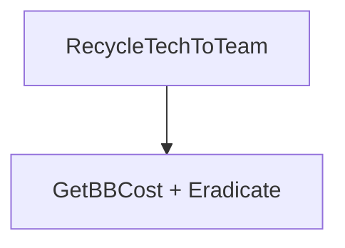

# 16 - Base Operations

> **Category:** World & Team
> **Timing:** spans the 6s team-economy clock and the 4s strategic clock (build/expand/harvester gates) — catalogued in [21 Timing & Cadence Register](21_timing-cadence.md).

## Summary

The base-operations pipeline runs each enemy team's economy and base-expansion lifecycle. The singleton MonoBehaviour `BaseFunderManager` (a unique GameObject `BaseFunderManagerMain` created at mod load) drives `FixedUpdate` and throttles to a `DelayedUpdate` every `EnemyTeamAwarenessUpdateDelay = 6s` (clamped to 1s under `TurboAICheat`). `DelayedUpdate` calls `ManBaseTeams.UpdateTeams()`, which flips a global `SpecialUpdate` flag to `SpecialUpdateType.Building` every `DelayBetweenBuilding = 30s` and iterates each dynamic team's `EnemyTeamData.ManageBases()`.

`ManageBases` routes the team's HQ funder into `RLoadedBases.UpdateBaseOperations(mind)`, which decides between three mutually-exclusive outcomes per HQ tick:

1. **Cull** via `RemoveAllBases` (when `AllowEnemyBaseExpand == false`).
2. **Construct mobile** via `BaseConstructTech` / `BaseUpgradeTechs` (when at or over the `MakerBaseCount` cap).
3. **Expand** via `ImTakingThatExpansion` (combat / `lastEnemyGet` path) which can fall through to `ExpandBasePeaceful` (idle path), itself calling `InsureHarvester` first.

All four expansion entry points pass through an `IsFallback` template guard. The recently-fixed `InsureHarvester` race adds three coupled guards: a per-team `lastHarvesterBuildTime` cooldown (60s = `DelayBetweenBuilding * 2`), a final `IsFallback` abort after the 3-tier faction cascade, and a `funds.TryMakePurchase(template.baseCost)` BB drain so repeated calls self-throttle through the upstream `MinimumBBToTryExpand` gate.

The economy layer (`EnemyTeamData.AddBuildBucks` / `SpendBuildBucks` / `TryMakePurchase`) holds all funds on the team object itself; `EnemyBaseFunder` only delegates to the per-team `ETD`. `BaseFunderManager` separately drives `RunBuildRequests` (drains `TeamsBuildRequested`, flips `PendingDamageCheck` per tech) and `RunFocusFireRequests` (drains `targetingRequestsNPT`, dispatches per `RequestSeverity`).

---

## Entry points

All file paths are under `Modified/TACtical_AI-master/TACtical_AI-master/TAC_AI/`.

### Singleton lifecycle

| Caller | File:Line | Purpose |
|---|---|---|
| `KickStart.PatchMod` | [KickStart.cs:581](../Modified/TACtical_AI-master/TACtical_AI-master/TAC_AI/KickStart.cs) | First-time mod init -> `BaseFunderManager.Initiate()` |
| `KickStart` mode-restart | [KickStart.cs:656](../Modified/TACtical_AI-master/TACtical_AI-master/TAC_AI/KickStart.cs) | Re-init on game-mode change |
| `RBases.BaseFunderManager.Initiate` (legacy shim) | [KickStart.cs:925](../Modified/TACtical_AI-master/TACtical_AI-master/TAC_AI/KickStart.cs) | Legacy alias still wired in boot |
| `KickStart.DeInit` | [KickStart.cs:882](../Modified/TACtical_AI-master/TACtical_AI-master/TAC_AI/KickStart.cs) | Tear-down -> `BaseFunderManager.DeInit()` |

### Periodic tick

| Caller | File:Line | Purpose |
|---|---|---|
| Unity engine | [RLoadedBases.cs:366](../Modified/TACtical_AI-master/TACtical_AI-master/TAC_AI/Enemy/RLoadedBases.cs) | `BaseFunderManager.FixedUpdate` per Unity tick |
| `BaseFunderManager.DelayedUpdate` | [RLoadedBases.cs:380](../Modified/TACtical_AI-master/TACtical_AI-master/TAC_AI/Enemy/RLoadedBases.cs) | Throttled 6s wrapper -> `ManBaseTeams.UpdateTeams` + `PeriodicBuildRequest` |
| `ManBaseTeams.UpdateTeams` | [ManBaseTeams.cs:1097](../Modified/TACtical_AI-master/TACtical_AI-master/TAC_AI/World/ManBaseTeams.cs) | Flips `SpecialUpdate` once per 30s, iterates teams |
| `EnemyTeamData.ManageBases` | [ManBaseTeams.cs:439](../Modified/TACtical_AI-master/TACtical_AI-master/TAC_AI/World/ManBaseTeams.cs) | Per-team router, calls `UpdateBaseOperations` for loaded HQ |

### Per-tech setup and team requests

| Caller | File:Line | Purpose |
|---|---|---|
| `RCore.AssignAI` | [RCore.cs:1143](../Modified/TACtical_AI-master/TACtical_AI-master/TAC_AI/Enemy/RCore.cs) | First-time AI activation -> `SetupBaseAI` |
| `RMission` setup | [RMission.cs:156](../Modified/TACtical_AI-master/TACtical_AI-master/TAC_AI/Enemy/RMission.cs) | Mission-spawn -> `SetupBaseAI` |
| `SetupBaseAI` post-register | [RLoadedBases.cs:866](../Modified/TACtical_AI-master/TACtical_AI-master/TAC_AI/Enemy/RLoadedBases.cs) | -> `AllTeamTechsBuildRequest(Team)` |
| `EnemyMind.OnHit` / combat handlers | [RLoadedBases.cs:290](../Modified/TACtical_AI-master/TACtical_AI-master/TAC_AI/Enemy/RLoadedBases.cs) | -> `RequestFocusFireNPTs(mind, target, sev)` |
| `Tank.TankRecycledEvent` | [RLoadedBases.cs:663](../Modified/TACtical_AI-master/TACtical_AI-master/TAC_AI/Enemy/RLoadedBases.cs) | `EnemyBaseFunder.OnRecycle` self-deregister |

---

## Flow

### Base funder tick, expansion, harvester & BB economy

```mermaid
graph TD
    Start((BaseFunderManager.Initiate))
    Start -->|inst != null| NoOp[return no-op]
    Start -->|inst == null| NewGO[Create BaseFunderManagerMain GO]
    NewGO --> SubPause[Subscribe PauseEvent]
    SubPause --> Tick

    subgraph Funder["Funder lifecycle"]
        Tick[FixedUpdate]
        Tick --> TurboClamp{TurboAICheat clamp?}
        TurboClamp -->|yes| ClampNext[Next = t+1]
        TurboClamp -->|no| DelayCheck
        ClampNext --> DelayCheck{Next leq Time.time?}
        DelayCheck -->|yes| DUpdate[DelayedUpdate]
        DelayCheck -->|no| RBR
        DUpdate --> UT[ManBaseTeams.UpdateTeams]
        DUpdate --> PBR[PeriodicBuildRequest]
        UT --> BuildFlag{Time geq LastTechBuildTime?}
        BuildFlag -->|yes| FlagSet[SpecialUpdate = Building]
        BuildFlag -->|no| FlagClear[SpecialUpdate = None]
        FlagSet --> IterTeams[foreach ETD ManageBases]
        FlagClear --> IterTeams
        IterTeams --> MB[ManageBases]
        MB --> HQType{HQ kind?}
        HQType -->|EnemyBaseFunder| UBO[UpdateBaseOperations]
        HQType -->|NP_BaseUnit| Unloaded[external unloaded path]
        Tick --> RBR[RunBuildRequests drains TeamsBuildRequested]
        Tick --> RFR[RunFocusFireRequests drains targetingRequestsNPT]
        PBR --> ScanBR[scan bankrupt funders flag PendingDamageCheck]
    end

    subgraph UBOFlow["UpdateBaseOperations decision tree"]
        UBO --> EBFCheck{funder and TechMemor?}
        EBFCheck -->|no| Ret1[return]
        EBFCheck -->|yes| StartGate{AllowEnemiesToStartBases or FirstUpdate?}
        StartGate -->|no| Erad[Eradicate tank]
        StartGate -->|yes| MP{IsNetworked?}
        MP -->|yes| MPDrip[addBucks per funder]
        MP -->|no| LastEnemy
        MPDrip --> LastEnemy{lastEnemyGet IsPopulation?}
        LastEnemy -->|yes| Bribe[TryBribeTech]
        Bribe -->|ok| ChangeTeam[SetTeam to myTeam]
        Bribe -->|fail| Expand
        ChangeTeam --> Expand
        LastEnemy -->|no| Expand
        Expand{AllowEnemyBaseExpand or FirstUpdate?}
        Expand -->|no| RemAll[RemoveAllBases]
        Expand -->|yes| Turbo{TurboAICheat and BB low?}
        Turbo -->|yes| TGift[AddBuildBucks MinimumBBToTryExpand]
        Turbo -->|no| Gate
        TGift --> Gate
        Gate{SpecialUpdate Building and BB geq 10000?}
        Gate -->|no| Ret2[return reduce lag]
        Gate -->|yes| Roll{rand leq 65 plus funds/10000?}
        Roll -->|no| Ret3[skip tick]
        Roll -->|yes| ITTE[ImTakingThatExpansion]
    end

    subgraph Expansion["Expansion ImTakingThatExpansion + ExpandBasePeaceful"]
        ITTE --> Attract{IsAttract?}
        Attract -->|yes| ExpRetF[return false]
        Attract -->|no| Cap{TeamGlobalMakerBaseCount geq MaxBasesPerTeam?}
        Cap -->|yes| FreeUp[TryFreeUpBaseSlots]
        FreeUp --> MobCap1{Mobile under EnemyTeamTechLimit?}
        MobCap1 -->|yes| BCT1[BaseConstructTech]
        MobCap1 -->|no| NoCombat{NoBuildWhileInCombat?}
        NoCombat -->|yes| BUT1[BaseUpgradeTechs]
        NoCombat -->|no| ExpRetF2[return false freeing cap]
        Cap -->|no| HasE{lastEnemySet?}
        HasE -->|no| EBP[ExpandBasePeaceful]
        HasE -->|yes| FindLoc{TryFindOpenBuildLocation around enemy?}
        FindLoc -->|yes| PDef[PriorityDefense]
        PDef --> CustC{ShouldUseCustomTechs?}
        CustC -->|yes| SpawnC[SpawnBaseExpansion custom]
        CustC -->|no| GetTC[GetEnemyBaseType]
        GetTC --> IsFC{IsFallback?}
        IsFC -->|yes| ExpRetF3[return false Expand Fail2]
        IsFC -->|no| SpawnH1[SpawnBaseExpansion GetBaseTemplate]
        FindLoc -->|no| ReHQ[SetHQToStrongestOrRandomBase]
        ReHQ --> MobCap2{Mobile under limit?}
        MobCap2 -->|yes| BCT2[BaseConstructTech]
        MobCap2 -->|no| BUT2[BaseUpgradeTechs]
        EBP --> Mine{AllowEnemiesToMine?}
        Mine -->|yes| IH[InsureHarvester]
        Mine -->|no| FindGrid[TryFindOpenLocationGrid]
        IH --> FindGrid
        FindGrid --> PickP[PickBuildBasedOnPriorities]
        PickP --> CustP{ShouldUseCustomTechs?}
        CustP -->|yes| SpawnP1[SpawnBaseExpansion custom]
        CustP -->|no| GetTP[GetEnemyBaseType]
        GetTP --> IsFP{IsFallback?}
        IsFP -->|yes| EBPF[return false]
        IsFP -->|no| SpawnP2[SpawnBaseExpansion peaceful]
    end

    subgraph Harv["Harvester insurance with 3 guards"]
        IH --> CD{lastHarvesterBuildTime within 60s?}
        CD -->|yes| HRet1[return false GUARD 1 cooldown]
        CD -->|no| HBases[harvestBases = GetCountOfPurpose HasReceivers]
        HBases --> HasRecv{harvestBases gt 0?}
        HasRecv -->|no| HRet2[return false]
        HasRecv -->|yes| CountM[decrement per Miner mobile tech]
        CountM --> Enough{harvestBases == 0?}
        Enough -->|yes| HRet3[return false]
        Enough -->|no| Grid{TryFindOpenLocationGrid?}
        Grid -->|no| HRet4[return false]
        Grid -->|yes| Tier1[GetEnemyBaseType MainFaction]
        Tier1 --> Fb1{IsFallback?}
        Fb1 -->|no| Spawn
        Fb1 -->|yes| Tier2[retry same FTE]
        Tier2 --> Fb2{IsFallback?}
        Fb2 -->|no| Spawn
        Fb2 -->|yes| Tier3[retry GSO hard fallback]
        Tier3 --> Fb3{IsFallback FINAL GUARD 2?}
        Fb3 -->|yes| Abort[abort log return false]
        Fb3 -->|no| Spawn[SpawnTechFragment]
        Spawn --> Drain[funds.TryMakePurchase template.baseCost GUARD 3 BB drain]
        Drain --> Stamp[lastHarvesterBuildTime team = Time.time]
        Stamp --> HTrue[return true]
    end

    subgraph Econ["BB economy"]
        EBFAdd[EnemyBaseFunder.AddBuildBucks]
        EBFAdd --> ETDLookup[TryGetBaseTeamDynamicOnly]
        ETDLookup --> ETDAdd[ETD.AddBuildBucks]
        EBFTry[EnemyBaseFunder.TryMakePurchase]
        EBFTry --> ETDLookup2[TryGetBaseTeamDynamicOnly]
        ETDLookup2 --> ETDTry[ETD.TryMakePurchase]
        ETDTry --> POK{BB geq Pay?}
        POK -->|yes| ETDSpend[SpendBuildBucks]
        ETDSpend --> Evt[BuildBucksUpdatedEvent flips bankrupt]
        POK -->|no| TryFalse[return false]
        MPDrip --> EBFAdd
        TGift --> EBFAdd
        Drain --> EBFTry
    end

    Exit1((return UBO))
    Exit2((return ITTE))
    Exit3((return EBP))
    Ret1 --> Exit1
    Erad --> Exit1
    RemAll --> Exit1
    Ret2 --> Exit1
    Ret3 --> Exit1
    BCT1 --> Exit2
    BUT1 --> Exit2
    SpawnH1 --> Exit2
    SpawnP2 --> Exit3
    Abort --> Exit3
    HTrue --> Exit3
```



### RecycleTechToTeam (BB refund + eradicate)



---

## Node reference

### Singleton and tick driver

| Node | File:Line | Notes |
|---|---|---|
| `BaseFunderManager.Initiate` | [RLoadedBases.cs:345](../Modified/TACtical_AI-master/TACtical_AI-master/TAC_AI/Enemy/RLoadedBases.cs) | Self-no-ops if `inst` already set; creates GO, subs `PauseEvent` |
| `BaseFunderManager.DeInit` | [RLoadedBases.cs:353](../Modified/TACtical_AI-master/TACtical_AI-master/TAC_AI/Enemy/RLoadedBases.cs) | Unsubscribes pause, `Destroy(inst.gameObject)` |
| `BaseFunderManager.OnPaused` | [RLoadedBases.cs:362](../Modified/TACtical_AI-master/TACtical_AI-master/TAC_AI/Enemy/RLoadedBases.cs) | Toggles `enabled` flag |
| `BaseFunderManager.FixedUpdate` | [RLoadedBases.cs:366](../Modified/TACtical_AI-master/TACtical_AI-master/TAC_AI/Enemy/RLoadedBases.cs) | Per-tick: throttled `DelayedUpdate`, `RunBuildRequests`, `RunFocusFireRequests` |
| `BaseFunderManager.DelayedUpdate` | [RLoadedBases.cs:380](../Modified/TACtical_AI-master/TACtical_AI-master/TAC_AI/Enemy/RLoadedBases.cs) | `ManBaseTeams.UpdateTeams` + `PeriodicBuildRequest` |
| `BaseFunderManager.RunBuildRequests` | [RLoadedBases.cs:385](../Modified/TACtical_AI-master/TACtical_AI-master/TAC_AI/Enemy/RLoadedBases.cs) | Drains `TeamsBuildRequested`, flips `PendingDamageCheck` per tech |
| `BaseFunderManager.RunFocusFireRequests` | [RLoadedBases.cs:558](../Modified/TACtical_AI-master/TACtical_AI-master/TAC_AI/Enemy/RLoadedBases.cs) | Drains `targetingRequestsNPT`, dispatches per severity |
| `BaseFunderManager.PeriodicBuildRequest` | [RLoadedBases.cs:567](../Modified/TACtical_AI-master/TACtical_AI-master/TAC_AI/Enemy/RLoadedBases.cs) | Picks one bankrupt funder per team, flags every team tech |
| `BaseFunderManager.ProcessFocusFireRequest` | [RLoadedBases.cs:413](../Modified/TACtical_AI-master/TACtical_AI-master/TAC_AI/Enemy/RLoadedBases.cs) | `ThinkMcFly` / `Warn` / `SameTeam` / `AllHandsOnDeck` severities |
| `ManBaseTeams.UpdateTeams` | [ManBaseTeams.cs:1097](../Modified/TACtical_AI-master/TACtical_AI-master/TAC_AI/World/ManBaseTeams.cs) | Flips `SpecialUpdate=Building` every 30s, iterates `EnemyTeamData` |
| `EnemyTeamData.ManageBases` | [ManBaseTeams.cs:439](../Modified/TACtical_AI-master/TACtical_AI-master/TAC_AI/World/ManBaseTeams.cs) | Routes loaded HQ to `UpdateBaseOperations` (line 462) |

### Per-tech setup / funder lifecycle

| Node | File:Line | Notes |
|---|---|---|
| `RLoadedBases.SetupBaseAI` | [RLoadedBases.cs:866](../Modified/TACtical_AI-master/TACtical_AI-master/TAC_AI/Enemy/RLoadedBases.cs) | Adds `EnemyBaseFunder`, parses anchor & mind, request build |
| `EnemyBaseFunder.Initiate(tank)` | [RLoadedBases.cs:640](../Modified/TACtical_AI-master/TACtical_AI-master/TAC_AI/Enemy/RLoadedBases.cs) | Subs `TankRecycledEvent`, calls `UpdateToNewer`, registers in `AllEnemyBases` |
| `EnemyBaseFunder.OnRecycle(tank)` | [RLoadedBases.cs:663](../Modified/TACtical_AI-master/TACtical_AI-master/TAC_AI/Enemy/RLoadedBases.cs) | Removes from `AllEnemyBases`, `Destroy(this)` |
| `EnemyBaseFunder.UpdateToNewer(name)` | [RLoadedBases.cs:725](../Modified/TACtical_AI-master/TACtical_AI-master/TAC_AI/Enemy/RLoadedBases.cs) | Parses `¥¥<n>¥¥` saved BB suffix, hands to ETD, renames tank |
| `EnemyBaseFunder.GetActualName(name)` | [RLoadedBases.cs:775](../Modified/TACtical_AI-master/TACtical_AI-master/TAC_AI/Enemy/RLoadedBases.cs) | Strips the `¥¥...¥¥` suffix |
| `RLoadedBases.SetupBaseType(BT, mind)` | [RLoadedBases.cs:1021](../Modified/TACtical_AI-master/TACtical_AI-master/TAC_AI/Enemy/RLoadedBases.cs) | HQ / Harvesting / TechProduction / default mind presets |
| `RLoadedBases.AllTeamTechsBuildRequest(Team)` | [RLoadedBases.cs:285](../Modified/TACtical_AI-master/TACtical_AI-master/TAC_AI/Enemy/RLoadedBases.cs) | Enqueues team into `TeamsBuildRequested` |
| `RLoadedBases.RequestFocusFireNPTs(mind, target, sev)` | [RLoadedBases.cs:290](../Modified/TACtical_AI-master/TACtical_AI-master/TAC_AI/Enemy/RLoadedBases.cs) | Enqueues a `TargetingRequest` (highest-severity wins, lines 302-308) |

### Counters / introspection (line 16-65)

| Node | File:Line | Notes |
|---|---|---|
| `MaxSingleBaseType` | [RLoadedBases.cs:16](../Modified/TACtical_AI-master/TACtical_AI-master/TAC_AI/Enemy/RLoadedBases.cs) | `MaxBasesPerTeam / 3` |
| `MaxDefenses` | [RLoadedBases.cs:17](../Modified/TACtical_AI-master/TACtical_AI-master/TAC_AI/Enemy/RLoadedBases.cs) | `MaxBasesPerTeam * 2/3` |
| `MaxAutominers` | [RLoadedBases.cs:18](../Modified/TACtical_AI-master/TACtical_AI-master/TAC_AI/Enemy/RLoadedBases.cs) | `MaxBasesPerTeam / 2` |
| `AllEnemyBases` | [RLoadedBases.cs:20](../Modified/TACtical_AI-master/TACtical_AI-master/TAC_AI/Enemy/RLoadedBases.cs) | Global `List<EnemyBaseFunder>` |
| `lastHarvesterBuildTime` | [RLoadedBases.cs:27](../Modified/TACtical_AI-master/TACtical_AI-master/TAC_AI/Enemy/RLoadedBases.cs) | Per-team cooldown dictionary (recent fix) |
| `TeamActiveMobileTechCount` | [RLoadedBases.cs:29](../Modified/TACtical_AI-master/TACtical_AI-master/TAC_AI/Enemy/RLoadedBases.cs) | Scene-active mobile count |
| `TeamActiveAnyBaseCount` | [RLoadedBases.cs:39](../Modified/TACtical_AI-master/TACtical_AI-master/TAC_AI/Enemy/RLoadedBases.cs) | Scene-active base count |
| `TeamActiveMakerBaseCount` | [RLoadedBases.cs:49](../Modified/TACtical_AI-master/TACtical_AI-master/TAC_AI/Enemy/RLoadedBases.cs) | `IterateTeamBaseFunders(Team).Count()` |
| `TeamGlobalMobileTechCount` | [RLoadedBases.cs:54](../Modified/TACtical_AI-master/TACtical_AI-master/TAC_AI/Enemy/RLoadedBases.cs) | Active + `ManEnemyWorld.UnloadedMobileTechCount` |
| `TeamGlobalMakerBaseCount` | [RLoadedBases.cs:58](../Modified/TACtical_AI-master/TACtical_AI-master/TAC_AI/Enemy/RLoadedBases.cs) | Active + `ManEnemyWorld.UnloadedBaseCount` — used by cap check |
| `TeamGlobalAnyBaseCount` | [RLoadedBases.cs:62](../Modified/TACtical_AI-master/TACtical_AI-master/TAC_AI/Enemy/RLoadedBases.cs) | Active + unloaded |
| `GetTeamHQ(Team)` | [RLoadedBases.cs:67](../Modified/TACtical_AI-master/TACtical_AI-master/TAC_AI/Enemy/RLoadedBases.cs) | Auto-elects HQ if null |
| `IterateTeamBaseFunders(Team)` | [RLoadedBases.cs:78](../Modified/TACtical_AI-master/TACtical_AI-master/TAC_AI/Enemy/RLoadedBases.cs) | Filters `AllEnemyBases` by team + `blockCount > 0` |
| `GetCountOfPurpose(BasePurpose, funders)` | [RLoadedBases.cs:84](../Modified/TACtical_AI-master/TACtical_AI-master/TAC_AI/Enemy/RLoadedBases.cs) | |
| `HasTooMuchOfType(Team, purpose, funders)` | [RLoadedBases.cs:101](../Modified/TACtical_AI-master/TACtical_AI-master/TAC_AI/Enemy/RLoadedBases.cs) | Per-purpose caps + `MinResourcesReqToCollect` gate on `HasReceivers` |
| `FetchNearbyResourceCounts(Team)` | [RLoadedBases.cs:252](../Modified/TACtical_AI-master/TACtical_AI-master/TAC_AI/Enemy/RLoadedBases.cs) | |

### Expansion / construction

| Node | File:Line | Notes |
|---|---|---|
| `UpdateBaseOperations(mind)` | [RLoadedBases.cs:1070](../Modified/TACtical_AI-master/TACtical_AI-master/TAC_AI/Enemy/RLoadedBases.cs) | HQ heartbeat decision tree |
| `ImTakingThatExpansion(mind, funds)` | [RLoadedBases.cs:1153](../Modified/TACtical_AI-master/TACtical_AI-master/TAC_AI/Enemy/RLoadedBases.cs) | Combat-aware expansion |
| `ExpandBasePeaceful(mind, lvl, funds, grade, Cost)` | [RLoadedBases.cs:1280](../Modified/TACtical_AI-master/TACtical_AI-master/TAC_AI/Enemy/RLoadedBases.cs) | Idle path; calls `InsureHarvester` first |
| `BaseConstructTech(mind, tech, lvl, funds, grade, Cost)` | [RLoadedBases.cs:1348](../Modified/TACtical_AI-master/TACtical_AI-master/TAC_AI/Enemy/RLoadedBases.cs) | Spawns mobile `NotStationary` tech |
| `BaseUpgradeTechs(mind, tech, lvl, funds, funders, grade, Cost)` | [RLoadedBases.cs:1389](../Modified/TACtical_AI-master/TACtical_AI-master/TAC_AI/Enemy/RLoadedBases.cs) | Gated by `AISelfRepair`; `FindNextBest` cost gradient |
| `ExpandBaseLegacy(mind, lvl, funds, grade, Cost)` | [RLoadedBases.cs:1452](../Modified/TACtical_AI-master/TACtical_AI-master/TAC_AI/Enemy/RLoadedBases.cs) | DEAD — see Known issues |
| `InsureHarvester(mind, lvl, funds, funders)` | [RLoadedBases.cs:1535](../Modified/TACtical_AI-master/TACtical_AI-master/TAC_AI/Enemy/RLoadedBases.cs) | Recently-fixed (3 guards) |
| `TryFreeUpBaseSlots(mind, lvl, funds)` | [RLoadedBases.cs:1600](../Modified/TACtical_AI-master/TACtical_AI-master/TAC_AI/Enemy/RLoadedBases.cs) | Recycles weakest bases by `blockCount` |
| `RemoveAllBases(mind, funds)` | [RLoadedBases.cs:1655](../Modified/TACtical_AI-master/TACtical_AI-master/TAC_AI/Enemy/RLoadedBases.cs) | Cleanup when `AllowEnemyBaseExpand == false` |
| `PickBuildBasedOnPriorities` | [RLoadedBases.cs:1674](../Modified/TACtical_AI-master/TACtical_AI-master/TAC_AI/Enemy/RLoadedBases.cs) | |
| `PriorityDefense` | [RLoadedBases.cs:1694](../Modified/TACtical_AI-master/TACtical_AI-master/TAC_AI/Enemy/RLoadedBases.cs) | Picks the defense purpose for hostile expansion |
| `PickHarvestBase` | [RLoadedBases.cs:1704](../Modified/TACtical_AI-master/TACtical_AI-master/TAC_AI/Enemy/RLoadedBases.cs) | HasReceivers / Autominer / TechProduction by ore availability and MP |
| `PickBuildBasedOnPrioritiesLegacy` | [RLoadedBases.cs:1715](../Modified/TACtical_AI-master/TACtical_AI-master/TAC_AI/Enemy/RLoadedBases.cs) | Randomized cascade across Defense / Harvesting / HasReceivers / TechProduction / Autominer |
| `PickBuildNonDefense` | [RLoadedBases.cs:1781](../Modified/TACtical_AI-master/TACtical_AI-master/TAC_AI/Enemy/RLoadedBases.cs) | Only called from dead `ExpandBaseLegacy` |
| `RecycleTechToTeam(tank)` | [RLoadedBases.cs:145](../Modified/TACtical_AI-master/TACtical_AI-master/TAC_AI/Enemy/RLoadedBases.cs) | Refunds `GetBBCost` -> `Eradicate` |

### IsFallback guard pattern

| Call site | File:Line | Notes |
|---|---|---|
| Definition | [RawTechLoader.cs:3066](../Modified/TACtical_AI-master/TACtical_AI-master/TAC_AI/Templates/RawTechLoader.cs) | `purposes.Contains(BasePurpose.Fallback)` |
| `ImTakingThatExpansion` hostile path | [RLoadedBases.cs:1230](../Modified/TACtical_AI-master/TACtical_AI-master/TAC_AI/Enemy/RLoadedBases.cs) | |
| `ExpandBasePeaceful` | [RLoadedBases.cs:1314](../Modified/TACtical_AI-master/TACtical_AI-master/TAC_AI/Enemy/RLoadedBases.cs) | |
| `BaseConstructTech` | [RLoadedBases.cs:1377](../Modified/TACtical_AI-master/TACtical_AI-master/TAC_AI/Enemy/RLoadedBases.cs) | |
| `ExpandBaseLegacy` (dead) | [RLoadedBases.cs:1484](../Modified/TACtical_AI-master/TACtical_AI-master/TAC_AI/Enemy/RLoadedBases.cs) | |
| `InsureHarvester` cascade tier 1 | [RLoadedBases.cs:1564](../Modified/TACtical_AI-master/TACtical_AI-master/TAC_AI/Enemy/RLoadedBases.cs) | MainFaction try |
| `InsureHarvester` cascade tier 2 | [RLoadedBases.cs:1570](../Modified/TACtical_AI-master/TACtical_AI-master/TAC_AI/Enemy/RLoadedBases.cs) | Same FTE retry |
| `InsureHarvester` final abort guard | [RLoadedBases.cs:1579](../Modified/TACtical_AI-master/TACtical_AI-master/TAC_AI/Enemy/RLoadedBases.cs) | Added with fix — aborts if GSO also Fallback |

### BB economy

| Node | File:Line | Notes |
|---|---|---|
| `EnemyBaseFunder.BuildBucks` getter/setter | [RLoadedBases.cs:619](../Modified/TACtical_AI-master/TACtical_AI-master/TAC_AI/Enemy/RLoadedBases.cs) | Delegates to `ManBaseTeams.GetTeamMoney` / `ETD.SetBuildBucks` |
| `EnemyBaseFunder.AddBuildBucks(int)` | [RLoadedBases.cs:677](../Modified/TACtical_AI-master/TACtical_AI-master/TAC_AI/Enemy/RLoadedBases.cs) | |
| `EnemyBaseFunder.SetBuildBucks(int)` | [RLoadedBases.cs:682](../Modified/TACtical_AI-master/TACtical_AI-master/TAC_AI/Enemy/RLoadedBases.cs) | |
| `EnemyBaseFunder.PurchasePossible(int)` | [RLoadedBases.cs:803](../Modified/TACtical_AI-master/TACtical_AI-master/TAC_AI/Enemy/RLoadedBases.cs) | |
| `EnemyBaseFunder.TryMakePurchase(BlockTypes)` | [RLoadedBases.cs:812](../Modified/TACtical_AI-master/TACtical_AI-master/TAC_AI/Enemy/RLoadedBases.cs) | |
| `EnemyBaseFunder.TryMakePurchase(int)` | [RLoadedBases.cs:816](../Modified/TACtical_AI-master/TACtical_AI-master/TAC_AI/Enemy/RLoadedBases.cs) | Used by `InsureHarvester` BB drain |
| `RLoadedBases.PurchasePossible(int, Team)` | [RLoadedBases.cs:179](../Modified/TACtical_AI-master/TACtical_AI-master/TAC_AI/Enemy/RLoadedBases.cs) | |
| `RLoadedBases.PurchasePossible(BlockTypes, Team)` | [RLoadedBases.cs:185](../Modified/TACtical_AI-master/TACtical_AI-master/TAC_AI/Enemy/RLoadedBases.cs) | |
| `RLoadedBases.BribePossible(tank, Team)` | [RLoadedBases.cs:190](../Modified/TACtical_AI-master/TACtical_AI-master/TAC_AI/Enemy/RLoadedBases.cs) | `BBCost * BribeMulti + MinimumBBToTryBribe` |
| `RLoadedBases.TryAddMoney(amount, Team)` | [RLoadedBases.cs:195](../Modified/TACtical_AI-master/TACtical_AI-master/TAC_AI/Enemy/RLoadedBases.cs) | |
| `RLoadedBases.TryMakePurchase(BlockTypes, Team)` | [RLoadedBases.cs:200](../Modified/TACtical_AI-master/TACtical_AI-master/TAC_AI/Enemy/RLoadedBases.cs) | |
| `RLoadedBases.TryBribeTech(tank, bribingTeam)` | [RLoadedBases.cs:206](../Modified/TACtical_AI-master/TACtical_AI-master/TAC_AI/Enemy/RLoadedBases.cs) | Requires team under `EnemyTeamTechLimit` |
| `RLoadedBases.TryDeclareBankruptcy(Team)` | [RLoadedBases.cs:228](../Modified/TACtical_AI-master/TACtical_AI-master/TAC_AI/Enemy/RLoadedBases.cs) | `ETD.FlagBankrupt` |
| `EnemyTeamData.SetBuildBucks` setter | [ManBaseTeams.cs:50](../Modified/TACtical_AI-master/TACtical_AI-master/TAC_AI/World/ManBaseTeams.cs) | Fires `BuildBucksUpdatedEvent`, flips `bankrupt` flag |
| `EnemyTeamData.AddBuildBucks_Internal` | [ManBaseTeams.cs:62](../Modified/TACtical_AI-master/TACtical_AI-master/TAC_AI/World/ManBaseTeams.cs) | Checked arithmetic, clamps overflow to `int.MaxValue` |
| `EnemyTeamData.AddBuildBucks(int)` | [ManBaseTeams.cs:220](../Modified/TACtical_AI-master/TACtical_AI-master/TAC_AI/World/ManBaseTeams.cs) | `IsReadonly` guard |
| `EnemyTeamData.SpendBuildBucks(int)` | [ManBaseTeams.cs:229](../Modified/TACtical_AI-master/TACtical_AI-master/TAC_AI/World/ManBaseTeams.cs) | `IsReadonly` guard |
| `EnemyTeamData.StealBuildBucks(severity)` | [ManBaseTeams.cs:238](../Modified/TACtical_AI-master/TACtical_AI-master/TAC_AI/World/ManBaseTeams.cs) | |
| `EnemyTeamData.PurchasePossible(int)` | [ManBaseTeams.cs:249](../Modified/TACtical_AI-master/TACtical_AI-master/TAC_AI/World/ManBaseTeams.cs) | Readonly teams always `true` |
| `EnemyTeamData.TryMakePurchase(BlockTypes)` | [ManBaseTeams.cs:255](../Modified/TACtical_AI-master/TACtical_AI-master/TAC_AI/World/ManBaseTeams.cs) | |
| `EnemyTeamData.TryMakePurchase(int)` | [ManBaseTeams.cs:259](../Modified/TACtical_AI-master/TACtical_AI-master/TAC_AI/World/ManBaseTeams.cs) | The actual `PurchasePossible -> SpendBuildBucks` gate |
| `EnemyTeamData.FlagBankrupt` | [ManBaseTeams.cs:273](../Modified/TACtical_AI-master/TACtical_AI-master/TAC_AI/World/ManBaseTeams.cs) | |
| `ManBaseTeams.TryInsureBaseTeam` | [ManBaseTeams.cs:801](../Modified/TACtical_AI-master/TACtical_AI-master/TAC_AI/World/ManBaseTeams.cs) | Creates ETD if missing, refuses player/neutral |
| `ManBaseTeams.TryGetBaseTeamDynamicOnly` | [ManBaseTeams.cs:813](../Modified/TACtical_AI-master/TACtical_AI-master/TAC_AI/World/ManBaseTeams.cs) | Excludes readonly teams |
| `ManBaseTeams.GetTeamMoney` | [ManBaseTeams.cs:877](../Modified/TACtical_AI-master/TACtical_AI-master/TAC_AI/World/ManBaseTeams.cs) | |

---

## Key data / state

### Per-team cooldowns and gates

| Field | File:Line | Duration | Scope | Purpose |
|---|---|---|---|---|
| `lastHarvesterBuildTime` | [RLoadedBases.cs:27](../Modified/TACtical_AI-master/TACtical_AI-master/TAC_AI/Enemy/RLoadedBases.cs) | `DelayBetweenBuilding * 2 = 60s` | per-team `Dictionary<int,float>` | Stop re-issuing a harvester while a `BookmarkBuilder` is still assembling (not yet `Miner`) |
| `LastTechBuildTime` | [ManBaseTeams.cs:1095](../Modified/TACtical_AI-master/TACtical_AI-master/TAC_AI/World/ManBaseTeams.cs) | `DelayBetweenBuilding = 30s` | global static | Drives `SpecialUpdate=Building` window |
| `SpecialUpdate` | [ManBaseTeams.cs:1096](../Modified/TACtical_AI-master/TACtical_AI-master/TAC_AI/World/ManBaseTeams.cs) | one tick per 30s | global static | Throttle gate read at `RLoadedBases.cs:1136` |
| `EnemyTeamData.angerThreshold` | [ManBaseTeams.cs](../Modified/TACtical_AI-master/TACtical_AI-master/TAC_AI/World/ManBaseTeams.cs) | `DamageAngerCoolPerSec = 150/s` | per-team float | Decays drop-relations on aged damage |
| `EnemyBaseFunder.bankrupt` | [RLoadedBases.cs](../Modified/TACtical_AI-master/TACtical_AI-master/TAC_AI/Enemy/RLoadedBases.cs) | flag (`buildBucks <= 0`) | per-funder | Used by `PeriodicBuildRequest` to ping team techs |

### Counters

- **MakerBaseCount** family — three flavours (`TeamActiveMakerBaseCount`, `TeamGlobalMakerBaseCount`, `TeamGlobalAnyBaseCount`); the cap check uses `TeamGlobalMakerBaseCount` so unloaded `NP_BaseUnit` count toward team saturation.
- **MobileTech** — `TeamActiveMobileTechCount` + `ManEnemyWorld.UnloadedMobileTechCount` -> `TeamGlobalMobileTechCount`; the `EnemyTeamTechLimit` check selects between `BaseConstructTech` and `BaseUpgradeTechs`.

### BB inflows / outflows

| Inflow | File:Line | Notes |
|---|---|---|
| MP profits | [RLoadedBases.cs:1087](../Modified/TACtical_AI-master/TACtical_AI-master/TAC_AI/Enemy/RLoadedBases.cs) | `MPEachBaseProfits(250) * (40/AIClockPeriod)` per funder, per HQ tick |
| Tech recycle refund | [RLoadedBases.cs:145](../Modified/TACtical_AI-master/TACtical_AI-master/TAC_AI/Enemy/RLoadedBases.cs) | `RawTechBase.GetBBCost(tank) -> ETD.AddBuildBucks` |
| Turbo cheat | [RLoadedBases.cs:1133](../Modified/TACtical_AI-master/TACtical_AI-master/TAC_AI/Enemy/RLoadedBases.cs) | `+MinimumBBToTryExpand` when BB < 50x threshold |
| Saved per-base | [RLoadedBases.cs:725](../Modified/TACtical_AI-master/TACtical_AI-master/TAC_AI/Enemy/RLoadedBases.cs) | `UpdateToNewer` parses `¥¥<n>¥¥` suffix, adds to ETD |
| Per-base direct | [RLoadedBases.cs:677](../Modified/TACtical_AI-master/TACtical_AI-master/TAC_AI/Enemy/RLoadedBases.cs) | `AddBuildBucks` delegates to ETD |

| Outflow | File:Line | Notes |
|---|---|---|
| Block purchase | [RLoadedBases.cs:200](../Modified/TACtical_AI-master/TACtical_AI-master/TAC_AI/Enemy/RLoadedBases.cs) | via `RecipeManager.GetBlockBuyPrice` |
| Tech bribery | [RLoadedBases.cs:206](../Modified/TACtical_AI-master/TACtical_AI-master/TAC_AI/Enemy/RLoadedBases.cs) | `BBCost * BribeMulti(1.5) + MinimumBBToTryBribe(100000)` |
| Harvester spawn (self-throttle) | [RLoadedBases.cs:1588](../Modified/TACtical_AI-master/TACtical_AI-master/TAC_AI/Enemy/RLoadedBases.cs) | `template.baseCost` — the fix |
| Bankruptcy flag | [RLoadedBases.cs:228](../Modified/TACtical_AI-master/TACtical_AI-master/TAC_AI/Enemy/RLoadedBases.cs) | `ETD.FlagBankrupt` -> picked up by `PeriodicBuildRequest` |

### Constants

| Constant | Value | File:Line |
|---|---|---|
| `KickStart.MaxBasesPerTeam` | 6 (default) | [KickStart.cs:110](../Modified/TACtical_AI-master/TACtical_AI-master/TAC_AI/KickStart.cs) |
| `KickStart.AllowEnemyBaseExpand` | `MaxBasesPerTeam != 0` | [KickStart.cs:181](../Modified/TACtical_AI-master/TACtical_AI-master/TAC_AI/KickStart.cs) |
| `KickStart.AllowEnemiesToMine` | runtime | [KickStart.cs:196](../Modified/TACtical_AI-master/TACtical_AI-master/TAC_AI/KickStart.cs) |
| `AIGlobals.MinimumBBToTryExpand` | 10000 | [AIGlobals.cs:397](../Modified/TACtical_AI-master/TACtical_AI-master/TAC_AI/AIGlobals.cs) |
| `AIGlobals.MinimumBBToTryBribe` | 100000 | [AIGlobals.cs:398](../Modified/TACtical_AI-master/TACtical_AI-master/TAC_AI/AIGlobals.cs) |
| `AIGlobals.BribeMulti` | 1.5f | [AIGlobals.cs:399](../Modified/TACtical_AI-master/TACtical_AI-master/TAC_AI/AIGlobals.cs) |
| `AIGlobals.BaseExpandChance` | 65 (was 18) | [AIGlobals.cs:400](../Modified/TACtical_AI-master/TACtical_AI-master/TAC_AI/AIGlobals.cs) |
| `AIGlobals.MinResourcesReqToCollect` | 12 | [AIGlobals.cs:401](../Modified/TACtical_AI-master/TACtical_AI-master/TAC_AI/AIGlobals.cs) |
| `AIGlobals.MPEachBaseProfits` | 250 | [AIGlobals.cs:420](../Modified/TACtical_AI-master/TACtical_AI-master/TAC_AI/AIGlobals.cs) |
| `AIGlobals.SLDBeforeBuilding` | 90s | [AIGlobals.cs:423](../Modified/TACtical_AI-master/TACtical_AI-master/TAC_AI/AIGlobals.cs) |
| `AIGlobals.DelayBetweenBuilding` | 30s | [AIGlobals.cs:424](../Modified/TACtical_AI-master/TACtical_AI-master/TAC_AI/AIGlobals.cs) |
| `AIGlobals.EnemyTeamAwarenessUpdateDelay` | 6s | [AIGlobals.cs:369](../Modified/TACtical_AI-master/TACtical_AI-master/TAC_AI/AIGlobals.cs) |
| `AIGlobals.defaultExpandRad` / `defaultExpandRadRange` | 24 / 192 | [AIGlobals.cs:260](../Modified/TACtical_AI-master/TACtical_AI-master/TAC_AI/AIGlobals.cs) |

---

## Exit points

| Exit | File:Line | Notes |
|---|---|---|
| `BaseFunderManager.DeInit` | [RLoadedBases.cs:353](../Modified/TACtical_AI-master/TACtical_AI-master/TAC_AI/Enemy/RLoadedBases.cs) | Unsubs pause, destroys singleton GO; called from `KickStart.cs:882` |
| `EnemyBaseFunder.OnRecycle(tank)` | [RLoadedBases.cs:663](../Modified/TACtical_AI-master/TACtical_AI-master/TAC_AI/Enemy/RLoadedBases.cs) | Tank recycled event -> removes from `AllEnemyBases`, `Destroy(this)` |
| `RemoveAllBases(mind, funder)` | [RLoadedBases.cs:1655](../Modified/TACtical_AI-master/TACtical_AI-master/TAC_AI/Enemy/RLoadedBases.cs) | When `AllowEnemyBaseExpand == false`, recycles every non-HQ base of team |
| `TryFreeUpBaseSlots` | [RLoadedBases.cs:1600](../Modified/TACtical_AI-master/TACtical_AI-master/TAC_AI/Enemy/RLoadedBases.cs) | When over `MaxBasesPerTeam`, recycles weakest by `blockCount`; `ForceRemove` if over cap |
| `RecycleTechToTeam(tank)` | [RLoadedBases.cs:145](../Modified/TACtical_AI-master/TACtical_AI-master/TAC_AI/Enemy/RLoadedBases.cs) | Refunds `GetBBCost` -> `AIGlobals.Eradicate` |
| `UpdateBaseOperations` early returns | [RLoadedBases.cs:1075, 1079, 1129, 1138](../Modified/TACtical_AI-master/TACtical_AI-master/TAC_AI/Enemy/RLoadedBases.cs) | Funder missing / not allowed / cleanup / sub-threshold |
| `UpdateBaseOperations` throw | [RLoadedBases.cs:1150](../Modified/TACtical_AI-master/TACtical_AI-master/TAC_AI/Enemy/RLoadedBases.cs) | `"UpdateBaseOperations FAILED ~ "` wraps inner exception |
| `ImTakingThatExpansion` returns | [RLoadedBases.cs:1161, 1193, 1234, 1248, 1277](../Modified/TACtical_AI-master/TACtical_AI-master/TAC_AI/Enemy/RLoadedBases.cs) | true on success; false on `IsAttract` / fallback / no-location / inner exception |
| `ExpandBasePeaceful` returns | [RLoadedBases.cs:1314, 1338, 1344](../Modified/TACtical_AI-master/TACtical_AI-master/TAC_AI/Enemy/RLoadedBases.cs) | true on success / HQ-pick, false on fallback / inner exception |
| `InsureHarvester` true return | [RLoadedBases.cs:1590](../Modified/TACtical_AI-master/TACtical_AI-master/TAC_AI/Enemy/RLoadedBases.cs) | After spawn + BB drain + cooldown stamp |
| `InsureHarvester` false returns | [RLoadedBases.cs:1543, 1557, 1582, 1598](../Modified/TACtical_AI-master/TACtical_AI-master/TAC_AI/Enemy/RLoadedBases.cs) | Cooldown / already-mining / final-Fallback abort / no location / inner exception |

---

## Cross-pipeline integration

- **05 - Enemy AI tick / EnemyMind**: `UpdateBaseOperations` consumes `mind.AIControl.lastEnemyGet` (set in target-acquisition / `OnHit`) for both bribery and the hostile-vs-peaceful expansion branch. `PendingDamageCheck` (per-tank flag set by `RunBuildRequests` and `PeriodicBuildRequest`) suppresses the expansion roll at `RLoadedBases.cs:1140`.
- **06 - Target Acquisition / 07 - Combat FSM**: `RequestFocusFireNPTs` enqueues a per-team severity which `RunFocusFireRequests` -> `ProcessFocusFireRequest` dispatches into `Provoke + GetRevengeOn`, `TeamRetreat`, and `SetAttackMode` calls.
- **14 - Team Management**: `EnemyTeamData` owns the BB pool, the `bankrupt` event, the `IsReadonly` guard for player/neutral teams, and the `HQ` pointer used by `ManageBases`.
- **15 - Enemy World Tile**: `TeamGlobalMakerBaseCount` adds `ManEnemyWorld.UnloadedBaseCount`, so unloaded `NP_BaseUnit` counts toward the cap; the `else if (HQ is NP_BaseUnit)` branch in `ManageBases` is the unloaded routing point.
- **17 - RawTech Spawn**: `RawTechLoader.SpawnBaseExpansion` and `SpawnTechFragment` are the spawn entry points; `GetBaseTemplate`, `GetEnemyBaseType`, and `IsFallback` provide the template lookup + Fallback guard.
- **18 - Harmony Patches**: `BaseFunderManager.Initiate` is invoked from `KickStart.PatchMod` post-`Harmony.PatchAll`; the singleton lifecycle is wholly outside the patch graph.
- **19 - Multiplayer Sync**: Networked-mode BB drip at `RLoadedBases.cs:1082-1091` (`MPEachBaseProfits * (40/AIClockPeriod)`) is the only steady BB income for MP enemies because autominers are disabled there.
- **20 - Repair / Damage**: `BaseUpgradeTechs` is gated by `KickStart.AISelfRepair` (`RLoadedBases.cs:1396-1398`); when disabled the upgrade branch immediately logs and returns.

---

## Known issues

### Bugs

#### `TryFreeUpBaseSlots` step-counter is incoherent — Severity: LOW

At `RLoadedBases.cs:1608-1645`, `step` is incremented at the bottom of every iteration (line 1643) regardless of whether a recycle actually fired. The inner `if (step >= attempts) return;` checks inside `ForceRemove` / `RemoveReceivers` / `RemoveSpenders` branches read `step` *before* it was incremented for the current iteration. With `attempts = MaxBasesPerTeam - TeamBaseCount`, the counter is incoherent: on the `ForceRemove` path `attempts` is negative (`TeamBaseCount > MaxBasesPerTeam`), so `step (0) >= attempts` is true on the very first iteration and the function returns after recycling exactly **one** base instead of trimming down to the cap. Likely intent was to cap at `attempts` recycles; the counter should count recycles, not loop iterations.

#### `IsFallback` swallows missing templates — Severity: LOW (latent)

`RawTechLoader.IsFallback` at [RawTechLoader.cs:3069](../Modified/TACtical_AI-master/TACtical_AI-master/TAC_AI/Templates/RawTechLoader.cs) returns `false` when `InternalPopTechs.TryGetValue` fails AND the resulting `val` doesn't have `Fallback` in `purposes` — but `val` is a default-initialized `RawTech` with a `null` `purposes` set, so a `NullReferenceException` is thrown before the bool return. The assert `"Failed to find effective Tech, resorting to debug!"` is then eaten by surrounding `try`/`catch`.

```csharp
internal static bool IsFallback(SpawnBaseTypes type)
{
    ModTechsDatabase.InternalPopTechs.TryGetValue(type, out RawTech val);
    if (val.purposes.Contains(BasePurpose.Fallback))   // NRE if val.purposes is null
        return true;
    DebugTAC_AI.Assert("Failed to find effective Tech, resorting to debug!!!!");
    return false;
}
```

#### `BaseExpandChance` is additive with raw BB — Severity: LOW

`UpdateBaseOperations` at `RLoadedBases.cs:1140` uses `rand(1..100) <= BaseExpandChance + (GetTeamFunds(Team) / 10000)`. With `BaseExpandChance = 65` (`AIGlobals.cs:454`) and `GetTeamFunds = 350000` the right side is 100, so expansion fires every eligible tick. With `MaxBasesPerTeam = 6`, a wealthy team keeps trying to expand every 30s `SpecialUpdate=Building` window. `BaseExpandChance` was tripled from 18 to 65 (code comment `65;//18;`) — combined with the per-team cooldown this is now safe for harvesters specifically, but the general expansion roll is still saturating for wealthy teams.

### Dead code

#### `ExpandBaseLegacy` and `PickBuildNonDefense` — Severity: dead

`RLoadedBases.ExpandBaseLegacy(mind, lvl, funds, grade, Cost)` at [RLoadedBases.cs:1452](../Modified/TACtical_AI-master/TACtical_AI-master/TAC_AI/Enemy/RLoadedBases.cs) has no callers in the entire codebase. It still references `PickBuildBasedOnPriorities` and `PickBuildNonDefense`. Its only exclusive caller-side helper, `PickBuildNonDefense` at [RLoadedBases.cs:1781](../Modified/TACtical_AI-master/TACtical_AI-master/TAC_AI/Enemy/RLoadedBases.cs), is therefore also dead. The live path is `ImTakingThatExpansion` -> `ExpandBasePeaceful` split by the `lastEnemySet` ternary at `RLoadedBases.cs:1196-1203`. The two `IsFallback` calls inside `ExpandBaseLegacy` (lines 1484, 1515) are unreachable.

#### Commented `EmergencyMoveMoney` and `removeAll` — Severity: dead

- `OnRecycle` at `RLoadedBases.cs:666-667` has a commented-out reference to `EmergencyMoveMoney(this)`; no implementation exists anywhere. Money on tank loss flows through the team `ETD` regardless because BB lives on the team, not the tank.
- `TryFreeUpBaseSlots` at `RLoadedBases.cs:1646-1647` has a commented-out final `SpecialAISpawner.Eradicate(mind.Tank)` "final coffin nail"; the function never actually destroys the calling base.

### Tech debt

#### `PeriodicBuildRequest` only flags bankrupt teams

`BaseFunderManager.PeriodicBuildRequest` at `RLoadedBases.cs:567-599` only adds a team to `TeamsUpdatedMainBase` if at least one of its funders has `funds.bankrupt == true`. Solvent teams never get the periodic `PendingDamageCheck` ping — they only get one from `AllTeamTechsBuildRequest` fired during `SetupBaseAI` (one-shot on registration) or from `OnHit` / combat-driven retreat coordination. Likely intentional ("only prod bankrupt teams to look for income") but worth flagging since it surfaces an asymmetry between the two queues `BaseFunderManager` maintains.

#### `InsureHarvester` cascade has tier 1 and tier 2 identical

Lines 1563 and 1569 both call `GetEnemyBaseType(mind.MainFaction, ...)` with the same purposes and same `maxPrice`. The tier-2 reassignment to local `FTE` is identical to `mind.MainFaction`. Likely kept for log clarity / future faction-mapping divergence, but currently a redundant call that will always return the same `SBT` and trip the same `IsFallback` check. The functional fallback ladder is really 2-tier: MainFaction then GSO.

#### `BaseFunderManager` lacks an `OnDestroy` cleanup of static dictionaries

`TeamsBuildRequested`, `targetingRequestsNPT`, `TeamsUpdatedMainBase` are all `static`. `DeInit` destroys the GO but does not `Clear()` these — so a stale entry queued just before mod tear-down survives into the next session if the static field isn't reinitialized. Not currently observed because the lists are mostly drained per tick, but a long-tail risk in mode-restart flows.
