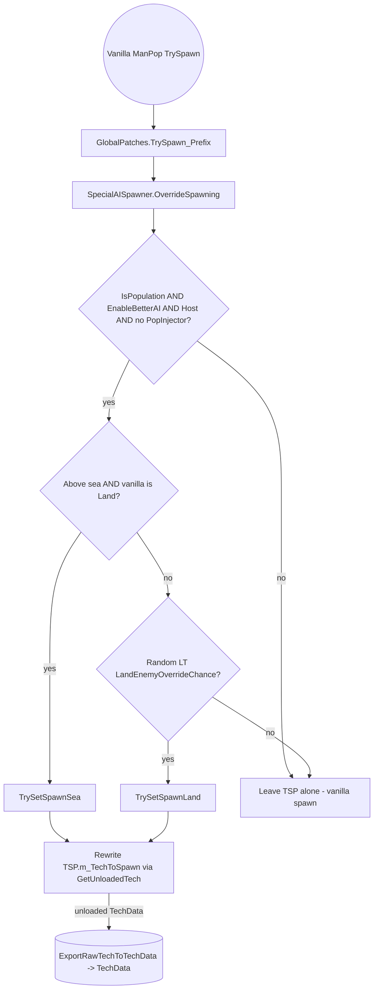

# RawTech Spawn Pipeline

> **Category:** Spawning
> **Timing:** AirSpawnInterval, RaidCooldownTimeSecs, and spawn-queue frame delays catalogued in [21 Timing & Cadence Register](21_timing-cadence.md).

## Summary

The RawTech spawn pipeline turns a `RawTechPopParams` filter (faction / terrain / progression / `BasePurpose` set / price cap / `IsPopulation` / `Disarmed`) into one of:

- a live `Tank` (loaded world, via `InstantTech` / `SpawnRawTech`),
- a single first-block "fragment" that the AI-driven self-repair builder grows into a full tech (`SpawnTechFragment` -> `BookmarkBuilder`),
- a `BombSpawnTech` delivery bomb (when starting bases are airdropped or `KickStart.AISelfRepair` is off),
- an unloaded `TechData` (`ExportRawTechToTechData` / `GetUnloadedTech` / `GetUnloadedBase` for the strategic world layer), or
- the `ErrorTech` (`SpawnBaseTypes.NotAvail`) red+black "shame block" when the cascade fails.

The pipeline lives almost entirely in [RawTechLoader.cs](../Modified/TACtical_AI-master/TACtical_AI-master/TAC_AI/Templates/RawTechLoader.cs) (3528 lines) and has three loosely independent layers:

1. **Template selection** - `FilterSelectAll` -> `ComparePurposes` plus `GetEnemyBaseTypes` (Prefab pool) and `GetExternalIndexes` (Local/Mod pool); combined by `FilteredSelectFromAll`, weighted by `ShouldUseCustomTechs`, honoring `KickStart.TryForceOnlyPlayerSpawns`.
2. **Spawn flow** - `SpawnRandomTechAtPosHead` / `SpawnMobileTechPrefab` for mobiles; `DoSpawnBaseAtPosition*` / `SpawnLandBase` / `SpawnBaseInstant` for anchored bases; `SpawnTechFragment` for AI-built minions; `InstantTech` / `SlowTech` / `QueueInstantTech` as the low-level builders; `BombSpawnTech` for delivery-bomb anchored starts.
3. **Fallback cascade** - `InternalFallbackHandler` -> `BasePurpose.Fallback`-tagged techs per faction -> `FallbackHandlerFailiure` -> `SpawnBaseTypes.NotAvail` -> `ErrorTech`.

Plus a **Harmony injection path** (`ObjectSpawnerPatches.TrySpawn_Prefix` -> `SpecialAISpawner.OverrideSpawning` -> `TrySetSpawnLand` / `TrySetSpawnSea`) that rewrites vanilla pop spawns by overwriting `TSP.m_TechToSpawn` with a `TechData` from `GetUnloadedTech`, so the vanilla pop pipeline does the actual instantiation.

Static templates (`GSO0Base` / Hoarder, `GCTotum` / F^bron Shrine, `VENPipperoni`, `HERelay`, `BFCyberFlote`, `RRSideswipe`, etc.) live as `RawTechTemplate` rows in 10 category-dictionaries in [TempStorage.cs](../Modified/TACtical_AI-master/TACtical_AI-master/TAC_AI/Templates/TempStorage.cs) (`techBasesFallback`, `techBasesHarvesting`, `techBasesProduction`, `techBasesHeadquarters`, `techBasesDefense`, `techBasesMobileAttract`, `techBasesMobileAir`, `techBasesMobileChopper`, `techBasesMobileNaval`, `techBasesMobileSpace`). `ModTechsDatabase.GetAllTemp()` (called via the `TempStorage.techBasesPrefab` lazy getter) iterates them through `ValidateAndAdd`, calls `RawTechTemplate.ToActive()` on each row, and accumulates the result into `ModTechsDatabase.InternalPopTechs` keyed by `SpawnBaseTypes`. The `ExtPopTechsAll` pool combines `ExtPopTechsLocal` (player JSON .RAWTECH files) + `ExtPopTechsMods` (mod-shipped RawTechs).

Post-spawn, every Tank passes through `RCore.GenerateEnemyAI` (`EnemyMind` add+init, mission detection, intelligence bucket, handling heuristics, `SetSmartAIStats`, `FinalInitialization`, MP broadcast).

## Entry points

| Caller | File:Line | Selection used | Result |
| --- | --- | --- | --- |
| Vanilla `ManPop.ObjectSpawner.TrySpawn` (Harmony prefix) | [GlobalPatches.cs:322](../Modified/TACtical_AI-master/TACtical_AI-master/TAC_AI/PatchBatch/GlobalPatches.cs) | `OverrideSpawning` -> `TrySetSpawnLand/Sea` -> `ShouldUseCustomTechs` + `GetEnemyBaseType` | Rewrites `TSP.m_TechToSpawn` (vanilla then spawns) |
| `RLoadedBases.BaseConstructTech` (by SpawnBaseTypes / external RawTech) | [RLoadedBases.cs:1372,1379](../Modified/TACtical_AI-master/TACtical_AI-master/TAC_AI/Enemy/RLoadedBases.cs) | `GetEnemyBaseType` + `IsFallback` gate | `SpawnTechFragment` |
| `RLoadedBases.BaseUpgradeTechs` (recycle-upgrade) | [RLoadedBases.cs:1439](../Modified/TACtical_AI-master/TACtical_AI-master/TAC_AI/Enemy/RLoadedBases.cs) | `FilteredSelectBatchFromAll` | `SpawnTechFragment` |
| `RLoadedBases` defender spawn | [RLoadedBases.cs:1585](../Modified/TACtical_AI-master/TACtical_AI-master/TAC_AI/Enemy/RLoadedBases.cs) | Named template lookup | `SpawnTechFragment` |
| `AIEBases` (turn in-hand `techData` into team fragment) | [AIEBases.cs:29](../Modified/TACtical_AI-master/TACtical_AI-master/TAC_AI/AI/AIEBases.cs) | Caller supplies `RawTech` | `SpawnTechFragment` |
| `ManEnemyWorld.LastSecondAddBaseToWorldTile` (natural seeded-tile base founder) | [ManEnemyWorld.cs:601,619](../Modified/TACtical_AI-master/TACtical_AI-master/TAC_AI/World/ManEnemyWorld.cs) | `FilteredSelectFromAll(handleFallback:false)` | Founder base + mobile (`Harvesting \| NotStationary`) |
| `SpecialAISpawner.TrySpawnAirborneAIInAir` / `SpawnPrefabAircraft` / `SpawnPrefabSpaceship` | [SpecialAISpawner.cs:438,444,513,536,552,583,607,625](../Modified/TACtical_AI-master/TACtical_AI-master/TAC_AI/Templates/SpecialAISpawner.cs) | `FilteredSelectFromAll` | `SpawnRandomTechAtPosHead` |
| `SpecialAISpawner.TrySpawnTraderTroll` (trader-troll pop spawn) | [SpecialAISpawner.cs:677,689,718](../Modified/TACtical_AI-master/TACtical_AI-master/TAC_AI/Templates/SpecialAISpawner.cs) | `FilteredSelectFromAll(handleFallback:false)` | `TrySpawnSpecificTechSafe` |
| `CustomAttract` (main-menu attract scene) | [CustomAttract.cs:36..235](../Modified/TACtical_AI-master/TACtical_AI-master/TAC_AI/CustomAttract.cs) | `FilteredSelectFromAll` | `SpawnAttractTech` / `TrySpawnSpecificTech` |
| `DebugRawTechSpawner` (in-game debug menu) | [DebugRawTechSpawner.cs:857,870,1140,1230](../Modified/TACtical_AI-master/TACtical_AI-master/TAC_AI/Templates/DebugRawTechSpawner.cs) | Various | `SpawnRandomTechAtPosHead` / `SpawnMobileTechPrefab` |
| `RawTechLoader.TryStartBase` (mid-game enemy founder) | [RawTechLoader.cs:79](../Modified/TACtical_AI-master/TACtical_AI-master/TAC_AI/Templates/RawTechLoader.cs) | `FilteredSelectFromAll(handleFallback:true)` | `DoSpawnBaseAtPosition` |
| `RawTechLoader.TrySpawnBaseAtPositionNoFounder` (scripted founderless) | [RawTechLoader.cs:153](../Modified/TACtical_AI-master/TACtical_AI-master/TAC_AI/Templates/RawTechLoader.cs) | `FilteredSelectFromAll(handleFallback:true)` | `DoSpawnBaseAtPositionNoFounder` |
| `RawTechLoader.SpawnBaseExpansion` (existing-base sub-base) | [RawTechLoader.cs:212](../Modified/TACtical_AI-master/TACtical_AI-master/TAC_AI/Templates/RawTechLoader.cs) | Caller supplies `RawTech` | `SpawnLandBase` / `SpawnSeaBase` / `SpawnAirBase` |
| `PlayerSpawnAid.TryBotePlayerSpawn` (FTUE GSO grade swap) | [PlayerSpawnAid.cs:11](../Modified/TACtical_AI-master/TACtical_AI-master/TAC_AI/Templates/PlayerSpawnAid.cs) | `IsBaseTemplateAvailable` direct lookup | `ReconstructPlayerTech` |

## Flow

### Spawn pipeline: template selection, fallback, spawn, AI handoff

```mermaid
graph TD
    %% Entry points
    ERLB((RLoadedBases construct/upgrade/defender))
    EAIE((AIEBases mobile fragment))
    EMEW((ManEnemyWorld tile founder))
    ESpec((SpecialAISpawner air/space/troll))
    EAtr((CustomAttract menu pool))
    ETSB((TryStartBase mid-game founder))
    ETSP((TrySpawnBaseAtPositionNoFounder))
    ESBE((SpawnBaseExpansion))
    EDbg((DebugRawTechSpawner))

    %% Template selection
    subgraph SEL [Template selection - GetEnemyBaseTypes / GetExternalIndexes / FilterSelectAll]
        FSFA[FilteredSelectFromAll filter handleFallback nullIfErrorTech]
        FSBFA[FilteredSelectBatchFromAll]
        SUCT[ShouldUseCustomTechs - ext vs prefab weighted]
        GEBT[GetEnemyBaseTypes - prefab pool]
        GEBT1[GetEnemyBaseType single result]
        GEXI[GetExternalIndexes - external pool]
        GEXI1[GetExternalIndex single random]
        FSA[FilterSelectAll per-tech predicate]
        CP[ComparePurposes set logic]
        IPT[(ModTechsDatabase.InternalPopTechs)]
        EPT[(ModTechsDatabase.ExtPopTechsAllLookup)]
        TSG[TempStorage.techBasesPrefab getter]
        TS[(10 TempStorage dictionaries)]

        TSG --> TS --> IPT
        SUCT --> GEXI
        SUCT --> GEBT
        FSFA --> GEXI
        FSFA --> GEBT
        FSBFA --> GEXI
        FSBFA --> GEBT
        GEXI --> FSA
        GEBT --> FSA
        FSA --> CP
        GEBT --> IPT
        GEXI --> EPT
        GEBT1 --> GEBT
    end

    %% Fallback cascade
    subgraph FB [Fallback cascade - IsFallback / InternalFallbackHandler / FallbackHandlerFailiure]
        FBEmpty{cache empty?}
        FBHand{handleFallback?}
        IFH[InternalFallbackHandler faction cache]
        IFHFilt[RemoveAll non-faction OR not Fallback OR MPUnsafe]
        IFHGo{any candidates?}
        FHF[FallbackHandlerFailiure - NotAvail singleton]
        ISF[IsFallback purposes contains Fallback]
        CSS[CanSpawnSafely - inverted]
        IBTA[IsBaseTemplateAvailable]
        NotAv[(SpawnBaseTypes.NotAvail -> ErrorTech)]
        FbList[(Fallback-tagged: Hoarder/F^bron Shrine/Pipperoni/Relay Post/Cyber Flote/Sideswipe)]
        FailS[(FailedSearch sentinel - -1)]

        GEBT --> FBEmpty
        FBEmpty -->|no| SHUF[Shuffle and return cache]
        FBEmpty -->|yes| FBHand
        FBHand -->|no| EMP[Return empty cache]
        FBHand -->|yes| IFH
        IFH --> IFHFilt --> IFHGo
        IFHGo -->|yes| FbList
        IFHGo -->|no| FHF --> NotAv
        GEXI -->|no matches AND handleFallback| FailS
        ISF --> IPT
        CSS --> IBTA
        CSS --> ISF
    end

    %% FilteredSelectFromAll mixing decision
    DEC{extTechs and PrefabTechs counts}
    DEX[Pick external - ExtPopTechsAllLookup]
    DPR[Pick prefab - GetBaseTemplate]
    DFB[Both empty -> handleFallback or null or NotAvail]
    DForce{TryForceOnlyPlayerSpawns?}

    FSFA --> DEC
    DEC -->|both nonzero| DForce
    DForce -->|yes| DEX
    DForce -->|no| DROLL[Random.Range 0 to CombinedVal weighted]
    DROLL --> DEX
    DROLL --> DPR
    DEC -->|extTechs only| DEX
    DEC -->|PrefabTechs only| DPR
    DEC -->|both zero| DFB
    DFB --> IFH

    %% Spawn flow
    subgraph SP [Spawn flow - SpawnTechFragment / SpawnRandomTechAtPosHead / InstantTech]
        SRTAPH[SpawnRandomTechAtPosHead]
        SMTP[SpawnMobileTechPrefab calls RT.SpawnRawTech ETU-lib]
        STF[SpawnTechFragment - first block plus BookmarkBuilder]
        STFBM[SpawnTechFromBaseMobile - bomb or fragment]
        SAT[SpawnAttractTech]
        STAD[SpawnTechAutoDetermine]
        TSST[TrySpawnSpecificTech / TrySpawnSpecificTechSafe]
        STE[SpawnTechExternal / SpawnTechExternalSafe]
        IT[InstantTech - heavyweight builder]
        ITS[InstantTechSafe enqueues]
        QIT[QueueInstantTech.PushSpawn - drained LateUpdate]
        ST[SlowTech failsafe]
        TFB[TechFromBlock - WrapSingleBlock]
        SBI[SpawnBaseInstant - InstantTech then FixupAnchors]
        SB[SpawnBase first-block stub]
        DSAP[DoSpawnBaseAtPosition founder]
        DSAPN[DoSpawnBaseAtPositionNoFounder]
        SLB[SpawnLandBase]
        SSB[SpawnSeaBase stub -> Land]
        SAB[SpawnAirBase stub -> Land]
        BST[BombSpawnTech delivery bomb]
        BB[BookmarkBuilder.Init - infBlocks faction unprovoked]
        SPB[SpawnBaseExpansion routes by terrain]
        FixCV[ReconstructConveyorSequencing]
        AddPop[AddToManPopIfLoner]

        SRTAPH --> SMTP --> BB
        SAT --> IT
        SAT --> ST
        STAD --> IT
        TSST --> IT
        TSST --> ITS
        STE --> IT
        STE --> ITS
        ITS --> QIT --> IT
        IT --> TFB
        IT --> FixCV
        IT --> AddPop
        ST --> TFB
        SBI --> IT
        SB --> TFB
        DSAP --> SLB
        DSAP --> SSB
        DSAP --> SAB
        DSAPN --> SLB
        DSAPN --> SSB
        DSAPN --> SAB
        SLB -->|Starting+Airdropped OR no AISelfRepair| BST
        BST --> SBI
        SLB --> TFB
        SPB --> SLB
        SPB --> SSB
        SPB --> SAB
        STFBM -->|no AISelfRepair| BST
        STFBM --> STF
        STF --> TFB
        STF --> BB
        SBI --> BB
        SLB --> BB
        SB --> BB
        ST --> BB
        SSB --> SLB
        SAB --> SLB
    end

    %% Selection feeds Spawn
    DPR --> SP
    DEX --> SP

    %% Caller wiring into spawn
    ERLB --> STF
    EAIE --> STF
    EMEW --> FSFA
    ESpec --> SRTAPH
    ESpec --> TSST
    EAtr --> SAT
    EAtr --> TSST
    ETSB --> DSAP
    ETSP --> DSAPN
    ESBE --> SPB
    EDbg --> SRTAPH
    EDbg --> SMTP

    %% AI handoff
    BB --> Repair[Self-repair finishes - strip arrow marker]
    Repair --> Gen[RCore.GenerateEnemyAI]
    IT --> Reset[TankAIHelper.OnTechReset - align NonPlayer]
    Reset --> Gen
    Gen --> Mind[EnemyMind init + Refresh + SetupBaseOrMissionAI]
    Mind --> Smart[AutoSetIntelligence + GetOrCalculateEnemyHandling + SetSmartAIStats]
    Smart --> Final[FinalInitialization + MP broadcast]
```



### Harmony pop-spawn injection (vanilla ManPop override)



## Node reference

### Template selection ([RawTechLoader.cs](../Modified/TACtical_AI-master/TACtical_AI-master/TAC_AI/Templates/RawTechLoader.cs))

| Node | Line | Role |
| --- | --- | --- |
| `FilterSelectAll(RawTech, RawTechPopParams)` | 2714 | Per-tech predicate. `ComparePurposes`, terrain switch (`Any` / `AnyNonSea` / `Land` / `Sea` / `Air` / `Chopper` / `Space`), `factionLim` vs `filter.Progression`, modded-vs-vanilla corp + grade check, `MaxPrice`, `SearchAttract` block-count cap (`AIGlobals.MaxBlockLimitAttract`). |
| `ComparePurposes(filter, techPurposes)` | 2660 | Three classes: **parity** on `NotStationary`/`NoWeapons`/`Fallback`; **opt-in** for `Sniper`/`NANI`/`AttractTech` (tech-side); per-purpose accept/reject for `AnyNonHQ`/`HarvestingNoHQ`/`Headquarters`/`Autominer`/`Defense`/`Harvesting`/`TechProduction`/`AttractTech` (filter-side). |
| `GetEnemyBaseTypes(filter, cache, fallbackHandling)` | 2814 | Iterates `InternalPopTechs`, calls `FilterSelectAll`, shuffles. On empty + `fallbackHandling==true`, returns `InternalFallbackHandler(filter.Faction, cache)`. |
| `GetEnemyBaseType(filter)` | 2905 | Single-result wrapper. Honors `ForceSpawn` (`forcedBaseSpawn = SpawnBaseTypes.GSOMidBase`, currently dead). Falls back to a hard-coded `SpawnBaseTypes` numeric range by `FactionSubTypes.GSO`/`GC`/`VEN`/`HE` on exception. |
| `GetEnemyBaseType(faction, lvl, purposes, terra, ...)` | 2953 | Convenience overload that builds a `RawTechPopParams` and calls the above. |
| `GetEnemyBaseTypesDebug` | 2794 | Pretty-print filter contents under `!DebugTAC_AI.NoLogSpawning`. Explicit assert at line 2811 on `filter.Faction == FactionSubTypes.SPE`. |
| `GetExternalIndexes(filter, cache, handleFallback)` | 1357 | Iterates `ExtPopTechsAllCount()` / `ExtPopTechsAllLookup(step)`, calls `FilterSelectAll`. On empty + `handleFallback`, returns the `FailedSearch = {-1}` sentinel (line 1356), NOT the `InternalFallbackHandler`. |
| `GetExternalIndex(filter)` | 1391 | Random-pick wrapper. |
| `ShouldUseCustomTechs(...)` | 1455 / 1472 / 1544 | Weighted random between external and prefab pools. Returns `true` when caller should use external (player JSON) pool. Honors `KickStart.TryForceOnlyPlayerSpawns`. |
| `FilteredSelectBatchFromAll(filter, rTechs, fallbackHandling)` | 1569 | Bulk selector. Fills `rTechs` with shuffled union of external + prefab. Forwards `fallbackHandling` to both `GetExternalIndexes` and `GetEnemyBaseTypes`. |
| `FilteredSelectFromAll(filter, handleFallback, nullIfErrorTech)` | 1600 | Master single-pick. `Random.Range(0, CombinedVal)` proportional roll between external/prefab. When both empty: `handleFallback==true` -> `InternalPopTechs[InternalFallbackHandler(...).GetRandomEntry()]`; else `nullIfErrorTech` -> null; else `GetBaseTemplate(SpawnBaseTypes.NotAvail)` (ErrorTech). |
| `IsBaseTemplateAvailable(SpawnBaseTypes)` | 2637 | `InternalPopTechs.ContainsKey`. |
| `GetBaseTemplate(SpawnBaseTypes)` | 2643 | `InternalPopTechs.TryGetValue` lookup. |
| `GetEnemyBaseTypeFromName` / `GetExtEnemyBaseFromName` / `TryGetRawTechFromName` / `GetRawTechFromName` | 2977-3035 | Name-keyed lookup helpers consumed by `GenerateEnemyAI`. |

### Fallback cascade ([RawTechLoader.cs](../Modified/TACtical_AI-master/TACtical_AI-master/TAC_AI/Templates/RawTechLoader.cs))

| Node | Line | Role |
| --- | --- | --- |
| `InternalFallbackHandler(faction, cache)` | 2859 | Adds every `InternalPopTechs` entry to `canidates`, then **only** if `faction != FactionSubTypes.NULL` filters to entries with `(curSessionFaction == faction) && purposes.Contains(Fallback) && !(IsNetworked && purposes.Contains(MPUnsafe))`. Returns shuffled keys, or `FallbackHandlerFailiure()` if empty. |
| `FallbackHandlerFailiure()` | 2898 | Returns the static singleton `fallback = { SpawnBaseTypes.NotAvail }` -> `ErrorTech`. |
| `IsFallback(SpawnBaseTypes)` | 3066 | Checks `InternalPopTechs[type].purposes.Contains(BasePurpose.Fallback)`. Logs an Assert on dict miss, **but** dereferences `.purposes` on the default (null) `RawTech val` first - see Known issues. |
| `CanSpawnSafely(SpawnBaseTypes)` | 3094 | `!IsBaseTemplateAvailable(type) || IsFallback(type)`. Inverted name/composition - see Known issues. No live callers. |
| Fallback-tagged templates ([TempStorage.cs](../Modified/TACtical_AI-master/TACtical_AI-master/TAC_AI/Templates/TempStorage.cs)) | 79-128 | `NotAvail` -> `ErrorTech` (line 79); `GSO0Base` -> "Hoarder" (88); `GCTotum` -> "F^bron Shrine" (96); `VENPipperoni` (104); `HERelay` -> "Relay Post" (112); `BFCyberFlote` -> "Cyber Flote" (120); `RRSideswipe` (128). |
| `NotAvailableTech` (the ErrorTech blueprint) | [TempStorage.cs:12](../Modified/TACtical_AI-master/TACtical_AI-master/TAC_AI/Templates/TempStorage.cs) | Hard-coded red+black `SPEColourBlock` block-list used to make the failure mode visually obvious. |

### Spawn flow ([RawTechLoader.cs](../Modified/TACtical_AI-master/TACtical_AI-master/TAC_AI/Templates/RawTechLoader.cs))

| Node | Line | Role |
| --- | --- | --- |
| `SpawnRandomTechAtPosHead` (two overloads) | 1026 / 1037 | Canonical mobile-population entry. Forces `filter.ForceAnchor = false`, swaps team to sub-neutral when `filter.Disarmed`, then `FilteredSelectFromAll(filter, true, ...)` -> `SpawnMobileTechPrefab`. |
| `SpawnMobileTechPrefab` | 1053 | Clamps `pos.y` to projected ground, calls `toSpawn.SpawnRawTech(...)` (ETU-lib extension, not in this codebase). On success: `AddToManPopIfLoner` when `filter.IsPopulation`, then `FixupAnchors(true)`. |
| `SpawnTechFragment(pos, Team, RawTech toSpawn)` | 684 | Spawns just `toSpawn.GetFirstBlock()` via `SpawnBlockS`, sets skin, builds a `Tank` via `TechFromBlock` with name `<techName> + ' ⟰'`, attaches `BookmarkBuilder` so the in-game self-repair AI grows it. Used by all AI-driven "build a tech at the base" paths. |
| `SpawnTechFromBaseMobile(pos, Team, RawTech)` | 261 | When `!KickStart.AISelfRepair`, swaps to `BombSpawnTech`. Otherwise delegates to `SpawnTechFragment`. |
| `SpawnAttractTech` | 1107 | Main-menu attract spawns. Sets `SearchAttract=true`, `ExcludeErad=true`, calls `FilteredSelectFromAll(RTF, false, true)`, then `InstantTech` with `SlowTech` as failsafe. |
| `SpawnTechAutoDetermine` | 1136 | Caller supplies blueprint. Routes between `InstantTech` (anchored Harvesting/TechProduction `storeBB` / Defense / mobile) and block-fallback path. |
| `TrySpawnSpecificTech` / `TrySpawnSpecificTechSafe` | 1235 / 1321 | Like `SpawnRandomTechAtPosHead` but with `handleFallback=false`. Disarmed + IsPopulation re-teams to sub-neutral. Safe variant enqueues `QueueInstantTech`. |
| `SpawnTechExternal` / `SpawnTechExternalSafe` | 1796 / 1854 | For `RawTechTemplateFast` blueprints from disk. Sets `filter.ForceAnchor = Blueprint.IsAnchored`, then `InstantTech`. Safe variant enqueues `QueueInstantTech`. |
| `InstantTech` (two overloads) | 2054 / 2151 | The heavyweight builder. Validates tile (`AIGlobals.CanPlaceSafelyInTile`), rebuilds `dataPrefabber.m_BlockSpecs` with skin selection from `filter.RandSkins` / `filter.TeamSkins` (2% `skinChaotic` jitter forces random skin), filters via `IsBlockAllowedInCurrentGameMode`, branches `ManSpawn.inst.SpawnNetworkedTechRef` (MP) vs `ManSpawn.inst.SpawnTank` (SP), calls `ForceAllBubblesUp`, `ReconstructConveyorSequencing`, `AddToManPopIfLoner`. Final position respects `filter.Offset` (`OnGround` / `RaycastTerrainAndScenery` / `Exact` / `OffGround60Meters`). |
| `InstantTechSafe` | 2048 | Wraps the call in a `QueueInstantTech` processed in `RawTechLoader.LateUpdate -> TryPushTechSpawn`. |
| `QueueInstantTech.PushSpawn()` | 3476 | Gates on `Attempts < DelayFrames=5`, `ManSpawn.inst.IsTechSpawning`, then calls `InstantTech` with up to `maxAttempts=30`. |
| `SlowTech(...)` | 2294 | Failsafe when `InstantTech` returns null (used by `SpawnAttractTech`'s fallback). Spawns first block, calls `BookmarkBuilder.Init`, `ForceAllBubblesUp`, `ReconstructConveyorSequencing`. |
| `TechFromBlock(block, Team, name)` | 2030 | Wraps a single `TankBlock` into a `Tank` via `ManSpawn.WrapSingleBlock`, calls `InsureTrackingTank`, then (in SP) `AddToManPopIfLoner`. |
| `SpawnBase(...)` | 722 / 726 / 730 / 735 | First-block-only base spawn for the existing-base team. Stamps `¥¥` or `⛨` (`turretChar`) into the tech name to mark has-BB vs defense-only. |
| `SpawnBaseInstant(pos, fwd, Team, toSpawn, storeBB, ExtraBB)` | 840 / 844 | Full instant build of an anchored base. `InstantTech` with `RawTechPopParams.Default + SpawnCharged=true`, then `FixupAnchors(true)`, `RequestAnchored`, `BookmarkBuilder.Init` (with `instant = true`). |
| `SpawnLandBase` | 870 | Founder-driven anchored-base spawner. `(Starting && AIGlobals.StartingBasesAreAirdropped) || !KickStart.AISelfRepair` -> `BombSpawnTech`. Else first-block + `BookmarkBuilder` path. |
| `SpawnSeaBase` / `SpawnAirBase` | 916 / 950 | **Stubs** that delegate to `SpawnLandBase` with swapped args - see Known issues. Real implementations commented out. |
| `BombSpawnTech(pos, fwd, Team, template, storeBB, BB)` | 3497 | Wraps `ManSpawn.SpawnDeliveryBombNew`. `OnImpact(outcome)` (line 3520) calls `RawTechLoader.SpawnBaseInstant(outcome, fwd, Team, blueprint, storeBB, BB - blueprint.startingFunds)`. |
| `DoSpawnBaseAtPosition(spawnerTank, pos, Team, purpose, grade)` | 273 | Main founder-base entry. Computes `haveBB` from purpose set, per-grade `extraBB`, calls `FilteredSelectFromAll(handleFallback=true, AIGlobals.CancelOnErrorTech)`. For `BasePurpose.Headquarters`, recursively spawns four Defense annexes at +/-64m on both axes (note: inner recursion uses `BasePurpose.Defense`, breaking the recursion). |
| `DoSpawnBaseAtPositionNoFounder(FTE, pos, Team, purpose, grade)` | 480 | Same as above, no spawner Tank (server-only / scripted). Same recursive Defense annex pattern. |
| `SpawnBaseExpansion(spawnerTank, pos, Team, RawTech)` | 212 | Caller supplies `RawTech`. Selects terrain by `AIControllerAir` presence + `AIEPathing.AboveTheSea`. Routes to `SpawnLandBase` / `SpawnSeaBase` / `SpawnAirBase`. |
| `TryStartBase(tank, helper, purpose)` | 79 | Gates on `KickStart.enablePainMode`, `AllowEnemiesToStartBases`, MP-host, base-limit, per-team base count, `IsRadiusClearOfTechObst`. On success: `DoSpawnBaseAtPosition`, `ManBaseTeams.TryInsureBaseTeam(...).AddBuildBucks`, `AIWiki.hintBase.Show`. |
| `TrySpawnBaseAtPositionNoFounder(FTE, pos, Team, purpose, grade)` / `FORCESpawnBaseAtPositionNoFounder(...)` | 153 / 210 | Same gates as above, no founder tank. |
| `LateUpdate` / `TryPushTechSpawn` | 60 | Drains `TechBacklog` queue of `QueueInstantTech` requests. |
| `AddToManPopIfLoner` / `RemoveFromManPopIfNotLoner` | 2565-2593 | Reflection-driven insert/remove on `ManPop.m_SpawnedTechs`. |
| `GetEnemyBaseSupplies(BT)` | 2610 | `BookmarkBuilder.infBlocks` flag: true for HQ or Harvesting. |
| `BookmarkBuilder.Init(theTech, BT/toSpawn)` | 3376 / 3393 | Sets `namesav.infBlocks`, `namesav.faction = CorpExtToCorp(BT.curSessionFaction)`, `namesav.unprovoked = filter.Disarmed`, `namesav.instant`. |
| `Initiate` | 26 | Creates `EnemyWorldManager` MonoBehaviour + `dataPrefabber` skeleton `TechData`. |
| `ExportRawTechToTechData` | 2338 | Builds unloaded `TechData` for the vanilla pop pipe. |
| `GetSkinIDSet*` / `GetSkinIDRand` / `GetSkinIDCase` | 2414-2513 | Per-faction skin caches keyed by team/faction. Honors `ManDLC.IsSkinLocked`. |
| `GetEnemyBaseCount*` | 3100-3136 | Count anchored enemy techs in scene / radius / per-team. |
| `IsHQ` / `ContainsPurpose` | 3042 / 3048 | Internal-pool purpose probes. |

### Harmony injection layer

| Node | Line | Role |
| --- | --- | --- |
| `ObjectSpawnerPatches.TrySpawn_Prefix` | [GlobalPatches.cs:322](../Modified/TACtical_AI-master/TACtical_AI-master/TAC_AI/PatchBatch/GlobalPatches.cs) | Harmony prefix on `ObjectSpawner.TrySpawn`. Routes through `SpecialAISpawner.OverrideSpawning`. |
| `SpecialAISpawner.OverrideSpawning` | [SpecialAISpawner.cs:206](../Modified/TACtical_AI-master/TACtical_AI-master/TAC_AI/Templates/SpecialAISpawner.cs) | Gates on `TSP.m_IsPopulation && EnableBetterAI && (IsHost \|\| !IsNetworked) && !isPopInjectorPresent`. Branches sea-floor recovery vs `LandEnemyOverrideChance` roll. |
| `SpecialAISpawner.TrySetSpawnLand` / `TrySetSpawnSea` | [SpecialAISpawner.cs:232 / 307](../Modified/TACtical_AI-master/TACtical_AI-master/TAC_AI/Templates/SpecialAISpawner.cs) | `ShouldUseCustomTechs` -> `GetUnloadedTech(ExtPopTechsAllLookup(...))`; else `GetEnemyBaseType(RTF)` -> `GetUnloadedTech(type, ...)`. Rewrites `TSP.m_TechToSpawn`. |
| `SpecialAISpawner.SpawnPrefabAircraft` / `SpawnPrefabSpaceship` / `TrySpawnAirborneAIInAir` | [SpecialAISpawner.cs:384-625](../Modified/TACtical_AI-master/TACtical_AI-master/TAC_AI/Templates/SpecialAISpawner.cs) | Airborne pool. `SpawnRandomTechAtPosHead` with `Terrain=Air/Space`, `Offset=OffGround60Meters`, `Disarmed=ShouldBePassive(faction)`. |

### AI handoff

| Node | Line | Role |
| --- | --- | --- |
| `RCore.GenerateEnemyAI(this TankAIHelper, Tank)` | [RCore.cs:22](../Modified/TACtical_AI-master/TACtical_AI-master/TAC_AI/Enemy/RCore.cs) | Post-spawn AI assembly. Adds/initializes `EnemyMind`, sets `sceneStationaryPos`, calls `Refresh`, `RMission.SetupBaseOrMissionAI`. Non-mission: `AutoSetIntelligence`, `GetOrCalculateEnemyHandling`, `SetSmartAIStats`, `RandomSetMindAttack`, `FinalInitialization`, (host) `NetworkHandler.TryBroadcastNewEnemyState`. |
| `RCore.AutoSetIntelligence` | [RCore.cs:69](../Modified/TACtical_AI-master/TACtical_AI-master/TAC_AI/Enemy/RCore.cs) | Random difficulty bucket (Default / Mild / Meh / Smrt / IntAIligent) between `LowerDifficulty` and `UpperDifficulty`. `>92` -> `AllowRepairsOnFly + InvertBullyPriority`. |
| `RCore.SetSmartAIStats` | [RCore.cs:91](../Modified/TACtical_AI-master/TACtical_AI-master/TAC_AI/Enemy/RCore.cs) | Heuristic combat preset (Sumo / Boss / Artillery / Collector / Over-armed / Defender / VEN / HE). `LethalTechSize` -> `Eradicators.Add`. |
| `RCore.GetOrCalculateEnemyHandling` | [RCore.cs:188](../Modified/TACtical_AI-master/TACtical_AI-master/TAC_AI/Enemy/RCore.cs) | If `TryGetRawTechFromName(tank.name, out RTT)` hits: `NotStationary` -> `EvilCommander` by `RTT.terrain`; else `StartedAnchored + Stationary + Bolts.AtFull`. GC/melee -> `LikelyMelee`. `NANI` or `blockCount >= FrameImpactingTechBlockCount` -> `Eradicators.Add`. Else `BlockSetEnemyHandling` counts modules (wheels/foils/boosters/gyros/AG) -> `EvilCommander`. |
| `RCore.BeEvil` | [RCore.cs:573](../Modified/TACtical_AI-master/TACtical_AI-master/TAC_AI/Enemy/RCore.cs) | Defensive fallback: recreates an `EnemyMind` mid-tick if it goes missing. |
| `TankAIHelper.OnTechReset` | [TankAIHelper.cs:3318, 3374, 3433](../Modified/TACtical_AI-master/TACtical_AI-master/TAC_AI/AI/TankAIHelper.cs) | Calls `RCore.GenerateEnemyAI` when alignment becomes `NonPlayer`. |
| `EnemyMind.OnFinishedRepair` | [EnemyMind.cs:278](../Modified/TACtical_AI-master/TACtical_AI-master/TAC_AI/Enemy/EnemyMind.cs) | Detects tech name containing `'⟰'` (`SpawnTechFragment` marker), strips it, then calls `RCore.GenerateEnemyAI`. |
| `AIESplitHandler` | [AIESplitHandler.cs:102](../Modified/TACtical_AI-master/TACtical_AI-master/TAC_AI/AI/AIESplitHandler.cs) | Re-runs `GenerateEnemyAI` on split-spawned "Minion" techs. |

## Key data / state

### `RawTechPopParams` ([RawTechPopParams.cs](../Modified/TACtical_AI-master/TACtical_AI-master/TAC_AI/Templates/RawTechPopParams.cs))

The request DTO. `Default` (line 17): `Faction=NULL`, `Progression=RawTechLoader.TryGetPlayerLicenceLevel()`, `Terrain=Any`, `Offset=Exact`, `TargetFactionGrade=99`, `MaxPrice=0`, skins on, `ForceAnchor=false`, `IsPopulation=true`, `SpawnCharged=true`, `BlockConveyors=false`, `SearchAttract=AIGlobals.IsAttract`, `ExcludeErad = !KickStart.EnemyEradicators || SpecialAISpawner.Eradicators.Count >= cap`, `Disarmed=false`, `ForceCompleted=false`.

Most boolean knobs are stored as Purposes-set membership (purpose-projection setters - changing one toggles a `BasePurpose` flag on `Purposes` and vice versa):

| Property | Toggles | Notes |
| --- | --- | --- |
| `ForceAnchor` | `BasePurpose.NotStationary` | Inverted: `true` removes `NotStationary` |
| `Disarmed` | `BasePurpose.NoWeapons` | |
| `SearchAttract` | `BasePurpose.AttractTech` | |
| `BlockConveyors` | `BasePurpose.MPUnsafe` | Inverted: `true` means "no `MPUnsafe` in set" |
| `AllowAutominers` | `BasePurpose.Autominer` | |
| `AllowSnipers` | `BasePurpose.Sniper` | |
| `ExcludeErad` | `BasePurpose.NANI` | Inverted |

`SnapTerrain` (line 101): true when `Offset == OnGround | RaycastTerrainAndScenery` or `ForceAnchor`.

### `BasePurpose` ([EBasePurpose.cs:30](../Modified/TACtical_AI-master/TACtical_AI-master/TAC_AI/Templates/EBasePurpose.cs))

Used three ways simultaneously: (1) request flag in `RawTechPopParams.Purposes`, (2) tagging on each `RawTech.purposes`, (3) overload channel via getter/setter projections. Values: `AnyNonHQ`, `HarvestingNoHQ`, `Defense`, `Harvesting`, `Autominer` (NEVER attach to HQs), `TechProduction` (1.8.3+ also treated as a Garrison), `Headquarters`, `MPUnsafe`, `HasReceivers`, `NotStationary`, `AttractTech`, `NoWeapons`, `Fallback`, `Sniper`, `NANI`.

`BaseTerrain` ([EBasePurpose.cs:20](../Modified/TACtical_AI-master/TACtical_AI-master/TAC_AI/Templates/EBasePurpose.cs)): `Any`, `AnyNonSea`, `Land`, `Sea`, `Air`, `Chopper`, `Space`.

`BaseTypeLevel` ([EBasePurpose.cs:12](../Modified/TACtical_AI-master/TACtical_AI-master/TAC_AI/Templates/EBasePurpose.cs)): `Basic`, `Advanced`, `Headquarters`, `Overkill`, `InvaderSpecific` (orphan - see Known issues).

### TempStorage pools ([TempStorage.cs](../Modified/TACtical_AI-master/TACtical_AI-master/TAC_AI/Templates/TempStorage.cs))

`TempStorage.techBasesPrefab` is lazy-evaluated through `GetAllTemp` (lines 14, 31), which appends `RawTechTemplate` dictionaries to `_techBasesPrefab` in order, calling `ModTechsDatabase.PreloadWrapper(...)` for each:

1. `techBasesFallback` (line 76) - every entry has `purposes = { BasePurpose.Fallback }`. Provides per-corp last-resort techs (`NotAvail` -> `ErrorTech`, `GSO0Base` -> "Hoarder", `GCTotum` -> "F^bron Shrine", `VENPipperoni`, `HERelay` -> "Relay Post", `BFCyberFlote` -> "Cyber Flote", `RRSideswipe` -> "Sideswipe").
2. `techBasesHarvesting` (138)
3. `techBasesProduction` (309)
4. `techBasesHeadquarters` (469)
5. `techBasesDefense` (514)
6. `techBasesMobileAttract` (599)
7. `techBasesMobileAir` (687)
8. `techBasesMobileChopper` (830)
9. `techBasesMobileNaval` (935)
10. `techBasesMobileSpace` (1071)

Each `RawTechTemplate` carries `techName`, `faction (FactionTypesExt)`, `purposes (HashSet<BasePurpose>)`, `IntendedGrade`, `startingFunds`, `savedTech` (`|`-delimited block JSON). After enumeration these are materialized into `ModTechsDatabase.InternalPopTechs : Dictionary<SpawnBaseTypes, RawTech>` via `PreloadWrapper`, then `CommunityCluster.Organize` is layered on top.

### `SpawnBaseTypes` (referenced via `ModTechsDatabase.InternalPopTechs`)

The dictionary keys back the enum referenced everywhere in `FilteredSelectFromAll` and the Harmony override. Examples: `NotAvail` (ErrorTech sentinel), `GSO0Base`, `GSOMidBase` (debug `forcedBaseSpawn`), `GCTotum`, `VENPipperoni`, `HERelay`, `BFCyberFlote`, `RRSideswipe`, plus per-grade entries.

### `ExtPopTechsAll` ([ModTechsDatabase.cs:75](../Modified/TACtical_AI-master/TACtical_AI-master/TAC_AI/Templates/ModTechsDatabase.cs))

`ExtPopTechsAll = ExtPopTechsLocal + ExtPopTechsMods` - the local (player .RAWTECH JSON) + mod-shipped RawTech list. Consulted by `GetExternalIndexes` for the "Local/Mod" fork. `BaseGamePopSpecials.SelectedSpawns` ([BaseGamePopSpecials.cs:8](../Modified/TACtical_AI-master/TACtical_AI-master/TAC_AI/Templates/BaseGamePopSpecials.cs)) is the whitelist of vanilla pop names eligible to be imported.

### Internal state

| Field | Purpose |
| --- | --- |
| `RawTechLoader.TechBacklog : Queue<QueueInstantTech>` (line 21) | Drained by `LateUpdate -> TryPushTechSpawn` next frame. Each entry retries up to 30 times. |
| `RawTechLoader.SearchSingleUse` / `ShufflerSingleUse` | Module-level `List<int>` / `List<SpawnBaseTypes>` re-used by `FilteredSelectFromAll`, `ShouldUseCustomTechs`, `GetExternalIndex`. Each entry guards re-entrancy with `if (... .Any()) throw`. Wrapped in `try/finally` that clear the cache - single-threaded by construction. |
| `RawTechLoader.canidates` | Re-used by `InternalFallbackHandler`. Same re-entrancy guard. |
| `RawTechLoader.fallback` (line 2858) | Static singleton `{ SpawnBaseTypes.NotAvail }` returned by `FallbackHandlerFailiure`. |
| `RawTechLoader.baseChar = '¥'` / `turretChar = '⛨'` (lines 23-24) | Name suffix markers stamped onto base techs (`¥¥<funds>` for storeBB, `⛨` for defense-only). `'⟰'` marker is stamped by `SpawnTechFragment`. |
| `RawTechLoader.ForceSpawn` / `forcedBaseSpawn` (lines 19-20) | Hard-coded `false` / `SpawnBaseTypes.GSOMidBase` debug toggle. Unreachable in shipping. |

### Pop governors

| Mechanism | File:Line | Role |
| --- | --- | --- |
| `OverrideManPop.ChangeToRagnarokPop` ("Ragnarok" pop-limit relaxation) | [OverrideManPop.cs:65](../Modified/TACtical_AI-master/TACtical_AI-master/TAC_AI/Templates/OverrideManPop.cs) | Reflection-grabs `TechSpawnFilter` caps (`m_DayFilter`/`m_NightFilter`/`m_NoExpFilter`). `OverridePop` writes `UnRestrainedSav` (109001/250000000 caps). `RecoverPop` restores snapshots. |
| `AddToManPopIfLoner` / `RemoveFromManPopIfNotLoner` | [RawTechLoader.cs:2565-2593](../Modified/TACtical_AI-master/TACtical_AI-master/TAC_AI/Templates/RawTechLoader.cs) | Reflection-driven insert/remove on `ManPop.m_SpawnedTechs`. |
| `GetEnemyBaseCount` / `*SearchRadius` / `*ForTeam` | [RawTechLoader.cs:3100-3136](../Modified/TACtical_AI-master/TACtical_AI-master/TAC_AI/Templates/RawTechLoader.cs) | Gate `TryStartBase` (`MaxEnemyBaseLimit`, `MinSpacing`). `TryStartBase` reassigns to existing team at `MaxEnemyBaseLimit`; refuses if team already has > 0 bases. |

## Exit points

| Exit | Reached when |
| --- | --- |
| Live `Tank` via `ManSpawn.inst.SpawnTank` or `SpawnNetworkedTechRef` ([RawTechLoader.cs:2098, 2128](../Modified/TACtical_AI-master/TACtical_AI-master/TAC_AI/Templates/RawTechLoader.cs)) | Successful `InstantTech` (both SP and MP). |
| Live `Tank` from `ManSpawn.WrapSingleBlock` ([RawTechLoader.cs:2035, 2041](../Modified/TACtical_AI-master/TACtical_AI-master/TAC_AI/Templates/RawTechLoader.cs)) | `TechFromBlock` path. Tank grown later by the self-repair AI when `BookmarkBuilder` is attached. Used by `SpawnTechFragment`, `SpawnBase`, `SlowTech`, slow-fallback of `SpawnTechAutoDetermine` / `TrySpawnSpecificTech`. |
| Queued tech in `RawTechLoader.TechBacklog` | `InstantTechSafe` / `SpawnTechExternalSafe` / `TrySpawnSpecificTechSafe`. Drained by `LateUpdate -> TryPushTechSpawn`. Each retries up to 30 times. |
| Unloaded `TechData` via `ExportRawTechToTechData` ([RawTechLoader.cs:2338](../Modified/TACtical_AI-master/TACtical_AI-master/TAC_AI/Templates/RawTechLoader.cs)) | Reached via `GetBaseExpansionUnloaded` (985), `GetUnloadedBase` (1002), `GetUnloadedTech` (1015). Feeds the unloaded-world strategic layer (`ManSaveGame.StoredTech`, `NP_Presence`). Also the Harmony pop-swap path's terminal write. |
| `BombSpawnTech` delivery bomb | `SpawnLandBase` / `SpawnTechFromBaseMobile` when `(Starting && AIGlobals.StartingBasesAreAirdropped) || !KickStart.AISelfRepair`. `OnImpact` ([line 3520](../Modified/TACtical_AI-master/TACtical_AI-master/TAC_AI/Templates/RawTechLoader.cs)) calls `SpawnBaseInstant`. |
| `null` Tank | `FilteredSelectFromAll` called with `handleFallback==false && nullIfErrorTech==true` (e.g. `ManEnemyWorld.LastSecondAddBaseToWorldTile`) - lets the caller drop cleanly without seeding ErrorTech. |
| `SpawnBaseTypes.NotAvail` -> `ErrorTech` ([TempStorage.cs:12 `NotAvailableTech`](../Modified/TACtical_AI-master/TACtical_AI-master/TAC_AI/Templates/TempStorage.cs)) | `FilteredSelectFromAll(handleFallback==false && nullIfErrorTech==false)` with empty pools, or `InternalFallbackHandler` -> `FallbackHandlerFailiure`. |
| AI handoff continuation | `TankAIHelper.OnTechReset` -> `RCore.GenerateEnemyAI` -> `EnemyMind` is the post-spawn exit for behavior. |
| `Eradicators.Add(tank)` (global "death to all" set) | Triggered by `NANI` purpose or `blockCount >= FrameImpactingTechBlockCount` in `GetOrCalculateEnemyHandling`, or `LethalTechSize` in `SetSmartAIStats`. Set is referenced by `RawTechPopParams.ExcludeErad`. |

## Cross-pipeline integration

- **Vanilla pop pipeline:** the Harmony prefix at [GlobalPatches.cs:322](../Modified/TACtical_AI-master/TACtical_AI-master/TAC_AI/PatchBatch/GlobalPatches.cs) on `ObjectSpawner.TrySpawn` is the only consumer of the unloaded `TechData` path. Vanilla then handles the actual instantiation; TAC_AI's `RCore.GenerateEnemyAI` still wraps it later via `TankAIHelper.OnTechReset` because vanilla goes through the standard `Tank` initialization.
- **Self-repair pipeline:** `SpawnTechFragment` / `SpawnLandBase` first-block path / `SlowTech` all deposit a `BookmarkBuilder` that the in-game self-repair AI uses to grow the tech. When the builder finishes, `EnemyMind.OnFinishedRepair` ([EnemyMind.cs:278](../Modified/TACtical_AI-master/TACtical_AI-master/TAC_AI/Enemy/EnemyMind.cs)) detects the `'⟰'` suffix, strips it, and triggers `RCore.GenerateEnemyAI`.
- **Enemy AI pipeline:** the post-spawn `RCore.GenerateEnemyAI` chain is consumed by `EnemyMind`, `EvilCommander`, `RMission`, `NetworkHandler`. `GetOrCalculateEnemyHandling` round-trips through `RawTechLoader.TryGetRawTechFromName(tank.name)` to recover the originating `RawTech` for terrain-driven `EvilCommander` setup - but the suffix-decorated names (`techName + " ⟰"`, `" ¥¥"`, `" " + turretChar`) do **not** round-trip cleanly, which is why a `BlockSetEnemyHandling` block-counting fallback exists.
- **Enemy base pipeline (`RLoadedBases`):** the three primary entries (`BaseConstructTech` x2, `BaseUpgradeTechs`, defender spawn) all route to `SpawnTechFragment`. `TryStartBase` calls back to `ManBaseTeams.TryInsureBaseTeam(...).AddBuildBucks` and `AIWiki.hintBase.Show` on success.
- **Special AI pipeline:** `SpecialAISpawner` air/space/troll paths use `SpawnRandomTechAtPosHead` directly (loaded-world spawn) AND `TrySetSpawnLand/Sea` via the Harmony prefix (unloaded pop swap). The `Eradicators` global set is shared between `RawTechPopParams.ExcludeErad` (caller) and `SetSmartAIStats` / `GetOrCalculateEnemyHandling` (writer).
- **Mission pipeline:** `RMission.SetupBaseOrMissionAI` is called from `RCore.GenerateEnemyAI` and short-circuits non-mission setup steps when the tech is a mission tech.
- **FTUE pipeline:** `PlayerSpawnAid.TryBotePlayerSpawn` ([PlayerSpawnAid.cs:11](../Modified/TACtical_AI-master/TACtical_AI-master/TAC_AI/Templates/PlayerSpawnAid.cs)) detects player tech name matching "My Tech" / "FTUE GSO grade N" and swaps via `RawTechLoader.ReconstructPlayerTech(BoteType, BoteFallback)`. `ReconstructPlayerTech` uses `IsBaseTemplateAvailable` to pick template or fallback, then `StripPlayerTechOfBlocks` + `AIERepair.TurboconstructExt(savedTech)`.
- **Disarmed/passive mob path:** `filter.Disarmed=true` sets `BasePurpose.NoWeapons`. Caller paths that exercise: `SpawnRandomTechAtPosHead` ([lines 1028, 1040](../Modified/TACtical_AI-master/TACtical_AI-master/TAC_AI/Templates/RawTechLoader.cs)) re-teams to `AIGlobals.GetRandomSubNeutralBaseTeam(false)`; `TrySpawnSpecificTech` / `TrySpawnSpecificTechSafe` ([lines 1243, 1327](../Modified/TACtical_AI-master/TACtical_AI-master/TAC_AI/Templates/RawTechLoader.cs)) do the same when `filter.IsPopulation` also true; `SpecialAISpawner` air/space paths set `Disarmed=unProvoked` based on `ShouldBePassive(faction)`. The resulting `BookmarkBuilder.unprovoked` flag ([RawTechLoader.cs:3382](../Modified/TACtical_AI-master/TACtical_AI-master/TAC_AI/Templates/RawTechLoader.cs)) is consumed by [RLoadedBases.cs:901](../Modified/TACtical_AI-master/TACtical_AI-master/TAC_AI/Enemy/RLoadedBases.cs) to keep the spawned tech sub-neutral.

## Known issues

### Bugs Severity

- **HIGH - `IsFallback` NRE ([RawTechLoader.cs:3069-3076](../Modified/TACtical_AI-master/TACtical_AI-master/TAC_AI/Templates/RawTechLoader.cs)):** `TryGetValue` is called, then `val.purposes.Contains(...)` is read **without checking the return value**. If `type` is not in `InternalPopTechs`, `val` is `null` and dereferencing `.purposes` will NRE before the "Failed to find" Assert at line 3074 can log. Body should be:
  ```cs
  if (ModTechsDatabase.InternalPopTechs.TryGetValue(type, out RawTech val) && val.purposes.Contains(BasePurpose.Fallback))
      return true;
  ```
- **HIGH - `InternalFallbackHandler` returns un-filtered tech list when `faction == NULL` ([RawTechLoader.cs:2871-2878](../Modified/TACtical_AI-master/TACtical_AI-master/TAC_AI/Templates/RawTechLoader.cs)):** the `RemoveAll` filter (faction match + `purposes.Contains(Fallback)` + MP-safety) is gated on `if (faction != FactionSubTypes.NULL)`. With `faction == NULL` the cache is the **entire** `InternalPopTechs` dictionary, including Headquarters, `NANI`, `MPUnsafe`, etc. The "fallback" set becomes "anything goes". Only the explicit `handleFallback==false` discipline at `ManEnemyWorld.cs:624/642` keeps the natural-base path safe.
- **HIGH - swapped args in `SpawnSeaBase` and `SpawnAirBase` ([RawTechLoader.cs:919, 953](../Modified/TACtical_AI-master/TACtical_AI-master/TAC_AI/Templates/RawTechLoader.cs)):** `SpawnLandBase` is declared `(spawnerForwards, pos, Team, toSpawn, bool Starting, bool storeBB, int SpawnBB=0)` (line 870), but both stubs call it as `SpawnLandBase(spawnerForwards, pos, Team, toSpawn, storeBB, Starting, SpawnBB)` - `Starting` and `storeBB` are swapped. A "starting + has-BB" sea/air base is treated as "not-starting + no-BB" by Land, including skipping the `BombSpawnTech` air-drop branch.
- **MEDIUM - `CanSpawnSafely` reads inverted ([RawTechLoader.cs:3097-3100](../Modified/TACtical_AI-master/TACtical_AI-master/TAC_AI/Templates/RawTechLoader.cs)):** returns `!IsBaseTemplateAvailable(type) || IsFallback(type)`, i.e. "safe" is true when the template does **not** exist or it **is** a Fallback. Name suggests the opposite reading. Given the `IsFallback` NRE risk, the body almost certainly should be `IsBaseTemplateAvailable(type) && !IsFallback(type)`. Has no live callers, so the bug currently has no effect.
- **MEDIUM - `BookmarkBuilder` mis-anchored on Sea/Air failsafe:** because the Sea/Air bodies are commented out and fall through to Land which builds via `BookmarkBuilder.Init`, a "sea base" will actually create a land-anchored tech named with sea-base parameters. Not a crash, but the resulting tech is mis-anchored.
- **MEDIUM - Headquarters Defense annex recursion ([RawTechLoader.cs:273, 480](../Modified/TACtical_AI-master/TACtical_AI-master/TAC_AI/Templates/RawTechLoader.cs)):** when `BasePurpose.Headquarters` is requested, `DoSpawnBaseAtPosition*` recursively triggers four Defense annexes at +/-64m on both axes. The inner recursion uses `BasePurpose.Defense` (not `Headquarters`), which terminates the recursion - but the design intent is unclear and the code reads like the four annexes should themselves trigger no further recursion. Currently benign because Defense doesn't recurse, but fragile.
- **LOW - `GetEnemyBaseTypesDebug` SPE Assert ([RawTechLoader.cs:2812-2814](../Modified/TACtical_AI-master/TACtical_AI-master/TAC_AI/Templates/RawTechLoader.cs)):** a defensive `DebugTAC_AI.Assert` on `filter.Faction == FactionSubTypes.SPE` ("WAIT - WHY THE HECK IS OUR FACTION SPE???"). It only logs (no crash) and no live caller was found passing the `SPE` "Special" pseudo-faction, so it is a diagnostic tripwire rather than an active fault.
- **LOW - `SpawnMobileTechPrefab` NRE risk ([RawTechLoader.cs:1062-1105](../Modified/TACtical_AI-master/TACtical_AI-master/TAC_AI/Templates/RawTechLoader.cs)):** the commented-out first-block-fallback path is gone, and the live path calls `toSpawn.SpawnRawTech(...)` with no null guard before `theTech.FixupAnchors(true)` (line 1105, outside the `if (theTech && filter.IsPopulation)` guard) - a null return from the external ETU lib will NRE.
- **LOW - `SpawnTechExternal` NRE risk ([RawTechLoader.cs:1809-1851](../Modified/TACtical_AI-master/TACtical_AI-master/TAC_AI/Templates/RawTechLoader.cs)):** no null guard before `theTech.AI.SetBehaviorType(...)` at line 1851 when `Team == -2`, so a failed `InstantTech` will NRE on the neutral-team branch.

### Dead code

- **`TryClearAreaForBase` ([RawTechLoader.cs:2598-2612](../Modified/TACtical_AI-master/TACtical_AI-master/TAC_AI/Templates/RawTechLoader.cs)):** body is `return;` followed by a commented-out tree-clearing implementation. Callers (`SpawnBaseExpansion`, `DoSpawnBaseAtPosition`, `DoSpawnBaseAtPositionNoFounder`, `GetBaseExpansionUnloaded`) invoke it but it does nothing. Original intent: remove trees/rocks in an 8m radius; disabled because it "does not compensate for bases that are 64x64 diagonally".
- **`SpawnSeaBase` / `SpawnAirBase` real bodies ([RawTechLoader.cs:920-948, 954-982](../Modified/TACtical_AI-master/TACtical_AI-master/TAC_AI/Templates/RawTechLoader.cs)):** the actual sea/air base implementations are entirely commented out. Live code path is the stub-and-delegate to Land. The log lines "There's no sea bases stored in the prefab pool. Consider suggesting one!" emit on every sea/air founder spawn. No sea or air entries exist in `TempStorage`'s base prefab pool - only mobile naval/air/chopper/space pools.
- **`SpawnMobileTechPrefab` failsafe ([RawTechLoader.cs:1064-1101](../Modified/TACtical_AI-master/TACtical_AI-master/TAC_AI/Templates/RawTechLoader.cs)):** complete first-block-fallback + `BookmarkBuilder.Init` path is commented out.
- **`SpawnTechExternal` failsafe ([RawTechLoader.cs:1810-1846](../Modified/TACtical_AI-master/TACtical_AI-master/TAC_AI/Templates/RawTechLoader.cs)):** commented-out `TurboconstructExt` failsafe; `SpawnTechExternal` now relies solely on `InstantTech`.
- **`BaseTypeLevel` enum ([EBasePurpose.cs:12](../Modified/TACtical_AI-master/TACtical_AI-master/TAC_AI/Templates/EBasePurpose.cs)):** declared `Basic`, `Advanced`, `Headquarters`, `Overkill`, `InvaderSpecific`, but no readers anywhere in the tree - live grade input is `IntendedGrade` (`int`) plus `FactionLevel` (`Progression`). Orphaned.
- **`dataPrefabber.m_SkinMapping` in `Initiate()` ([RawTechLoader.cs:37](../Modified/TACtical_AI-master/TACtical_AI-master/TAC_AI/Templates/RawTechLoader.cs)):** initialized once but never read from this class; skin assignment in `InstantTech` goes via the per-spec `m_SkinID` path.
- **`ForceSpawn` / `forcedBaseSpawn` debug toggle ([RawTechLoader.cs:19-20](../Modified/TACtical_AI-master/TACtical_AI-master/TAC_AI/Templates/RawTechLoader.cs)):** hard-coded `false` / `SpawnBaseTypes.GSOMidBase`. The `if (ForceSpawn && !filter.SearchAttract) return forcedBaseSpawn;` in both `GetEnemyBaseType` overloads is unreachable in shipping builds.
- **`CanSpawnSafely` ([RawTechLoader.cs:3097](../Modified/TACtical_AI-master/TACtical_AI-master/TAC_AI/Templates/RawTechLoader.cs)):** no live callers in this codebase.

### Tech debt

- **Heavy reflection in pop governors.** Both `OverrideManPop` and `AddToManPopIfLoner` / `RemoveFromManPopIfNotLoner` reach into `ManPop` private fields via `BindingFlags.NonPublic | BindingFlags.Instance`. Fragile against vanilla updates.
- **Single-use shufflers serialize the pipeline.** `SearchSingleUse` / `ShufflerSingleUse` / `canidates` are module-level lists re-used by `FilteredSelectFromAll`, `ShouldUseCustomTechs`, `GetExternalIndex`, `InternalFallbackHandler`. Re-entrancy guards throw `InvalidOperationException`. Wrapped in `try/finally` clears, but design is **single-threaded by construction** - relevant for any future MP race-condition work.
- **`BasePurpose` triple-use overload.** Used as request flag, tag, AND projection channel. Setting `RawTechPopParams.Disarmed=true` quietly adds `BasePurpose.NoWeapons` to the purposes set; setting `ForceAnchor=true` removes `BasePurpose.NotStationary` (inverted). Easy to introduce bugs by writing one and reading the other.
- **Suffix-decorated tank names don't round-trip cleanly.** `SpawnTechFragment` adds `'⟰'`, `SpawnLandBase` / `SpawnBaseInstant` add `' ¥¥'` or `' ' + turretChar`. `GetOrCalculateEnemyHandling` calls `TryGetRawTechFromName(tank.name)` which has to strip these suffixes. There's a `BlockSetEnemyHandling` block-counting fallback specifically because the round-trip fails.
- **`InstantTech` 2-overload split.** The simple overload (line 2057) ignores skin tinting and offset modes; the parametrized one (line 2154) honors `RandSkins / TeamSkins / Offset / IsPopulation / ForceAnchor`. Easy to call the wrong one and silently lose features. Both branch on `ManNetwork.IsNetworked` separately.
- **Two parallel injection paths sharing one core.** Vanilla pop swap (Harmony) vs direct spawn (`SpawnRandom*` / `DoSpawnBase*`) both consume `FilteredSelectFromAll` + `InternalPopTechs` / `ExtPopTechsAll`, but with different downstream paths (`TechData` rewrite vs `Tank` emission). Behavior is *intended* to be consistent but is wired in two places.
- **`SpawnSeaBase` / `SpawnAirBase` warn-log spam.** Every founder sea/air spawn emits "There's no sea/air bases stored in the prefab pool. Consider suggesting one!" - log noise.
- **`GetEnemyBaseType` exception-fallthrough to hardcoded ranges ([RawTechLoader.cs:2931-2954](../Modified/TACtical_AI-master/TACtical_AI-master/TAC_AI/Templates/RawTechLoader.cs)):** on exception, falls back to hardcoded `SpawnBaseTypes` numeric ranges by faction (`GSO=1-6`, `GC=7-10`, etc.). Fragile against enum reordering.
