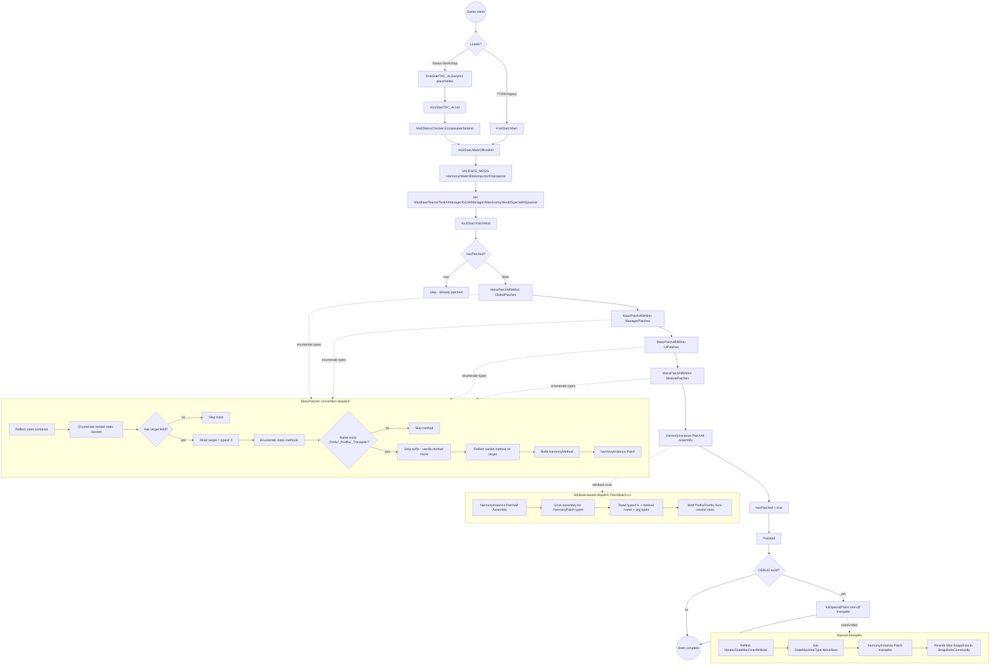
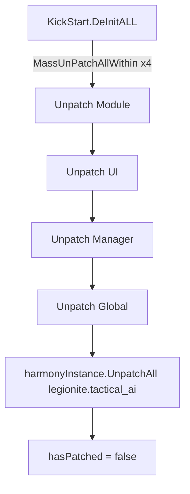

# Harmony Patch System

> **Category:** Infrastructure

## Summary

TAC AI rewires vanilla TerraTech through HarmonyX patches loaded at mod boot from a single shared `Harmony("legionite.tactical_ai")` instance. Three distinct binding mechanisms coexist:

1. **MassPatcher convention** (preferred) — a `TerraTechETCUtil` reflection helper used by the four big batches (`GlobalPatches`, `ManagerPatches`, `UIPatches`, `ModulePatches`). Each outer container holds nested `internal static class XPatches { internal static Type target = typeof(...); ... XYZ_Prefix / XYZ_Postfix ... }` classes. `MassPatcher.MassPatchAllWithin(harmony, typeof(OuterContainer), "TACtical_AI")` enumerates the nested types, reads each `target`, then binds every method named `<MethodName>_Prefix` / `<MethodName>_Postfix` to the matching vanilla method on `target`. No `[HarmonyPatch]` attributes are required, and the convention has no per-overload selector — for overload-specific binding the codebase falls back on the attribute system.
2. **Classic `[HarmonyPatch]` attributes** — used in `PatchBatch/PatchBatch.cs` for the half-dozen patches that need overload selectors or sit on `private` inner classes (`AdvancedMenuMusiks`, `AdvancedMenuMusiks2`, `TakeDetect`, `TankTeamPatch`, `TankTeamPatch2`, optional `StartupSpecialAISpawner`). These are picked up by the catch-all `harmonyInstance.PatchAll(Assembly.GetExecutingAssembly())` call right after the MassPatcher passes. The `PatchBatch` class itself is an empty placeholder; the real attribute patches sit beside it in the `Patches` static class within the same file.
3. **Manual transpiler** (`#if DEBUG` only) — `KickStart.InitSpecialPatch()` reflects the compiler-generated `MoveNext` of `SnapshotServiceDesktop.UpdateSnapshotCacheOnStartup` and patches it directly with `harmonyInstance.Patch(targetMethod, transpiler: ...)`. The IL rewrite replaces every `ldstr "/Snapshots"` with `"/SnapshotsCommunity"` so the dev build keeps its own snapshot cache. Neither MassPatcher's name convention nor `[HarmonyPatch]` attributes can name a compiler-generated iterator method, so this one has to be hand-rolled.

All three pipelines run from `KickStart.PatchMod()`, gated by a `hasPatched` latch so they only run once. Teardown happens inside `KickStart.DeInitALL()` (despite the misleading method name `DeInitCheck` which only schedules a check), which reverses the four MassPatcher batches in install order, then `harmonyInstance.UnpatchAll("legionite.tactical_ai")` to mop up the attribute patches + the debug transpiler.

## Entry points (boot loader chain)

| Symbol | File:line | Role |
|---|---|---|
| `KickStart.harmonyInstance` | [KickStart.cs:377](../Modified/TACtical_AI-master/TACtical_AI-master/TAC_AI/KickStart.cs) | Single shared `Harmony("legionite.tactical_ai")` instance reused by every patch op in the mod. |
| `KickStart.hasPatched` | [KickStart.cs:378](../Modified/TACtical_AI-master/TACtical_AI-master/TAC_AI/KickStart.cs) | Single boot latch that prevents double-patching. |
| `KickStart.PatchMod()` | [KickStart.cs:482](../Modified/TACtical_AI-master/TACtical_AI-master/TAC_AI/KickStart.cs) | Gate (`hasPatched`) + 4 `MassPatchAllWithin` calls + `PatchAll(Assembly)`. Logs `Patched` on success, `Error on patch` + error report on failure. |
| `KickStart.InitSpecialPatch()` | [KickStart.cs:526](../Modified/TACtical_AI-master/TACtical_AI-master/TAC_AI/KickStart.cs) | `#if DEBUG`-only one-off transpiler against `SnapshotServiceDesktop.UpdateSnapshotCacheOnStartup`'s iterator. Bypasses MassPatcher entirely; runs from `MainOfficialInit()` after `PatchMod()`. |
| `KickStart.SpecialPatchTranspiler` | [KickStart.cs:545](../Modified/TACtical_AI-master/TACtical_AI-master/TAC_AI/KickStart.cs) | Transpiler body that swaps `"/Snapshots"` to `"/SnapshotsCommunity"`. |
| `KickStart.MainOfficialInit()` | [KickStart.cs:556](../Modified/TACtical_AI-master/TACtical_AI-master/TAC_AI/KickStart.cs) | Non-iterator boot path. Calls `PatchMod()` at line 586, *after* singletons (`ManBaseTeams`, `TankAIManager`, `GUIAIManager`, `ManEnemyWorld`, `SpecialAISpawner`, ...) are initiated; then `InitSpecialPatch()` under `#if DEBUG` at line 615. |
| `KickStart.MainOfficialInitIterate()` | [KickStart.cs:634](../Modified/TACtical_AI-master/TACtical_AI-master/TAC_AI/KickStart.cs) | Steam-Workshop coroutine boot path. Calls `PatchMod()` at line 677 near the end of the yield chain. |
| `KickStart.DeInitCheck()` | [KickStart.cs:786](../Modified/TACtical_AI-master/TACtical_AI-master/TAC_AI/KickStart.cs) | NOT the unpatcher — only schedules `TankAIManager.CheckNextFrameNeedsDeInit()`. |
| `KickStart.DeInitALL()` | [KickStart.cs:794](../Modified/TACtical_AI-master/TACtical_AI-master/TAC_AI/KickStart.cs) | The actual unpatcher. Under `if (hasPatched)` (line 852) runs four `MassUnPatchAllWithin` calls in reverse install order + `UnpatchAll("legionite.tactical_ai")` at lines 864-869. Sets `hasPatched = false`. |
| `KickStart.Main()` | [KickStart.cs:900](../Modified/TACtical_AI-master/TACtical_AI-master/TAC_AI/KickStart.cs) | Legacy/0ModManager entry. Calls `PatchMod()` early at line 919 *before* singletons (older flow, kept for non-TTSMM users). |
| `KickStartTAC_AI.EarlyInit()` | [KickStartTAC_AI.cs:25](../Modified/TACtical_AI-master/TACtical_AI-master/TAC_AI/KickStartTAC_AI.cs) | `#if STEAM` ModBase shim — placeholder, patching is deferred. |
| `KickStartTAC_AI.InitIterator()` | [KickStartTAC_AI.cs:43](../Modified/TACtical_AI-master/TACtical_AI-master/TAC_AI/KickStartTAC_AI.cs) | Returns `KickStart.MainOfficialInitIterate()` for the Steam coroutine path. |
| `KickStartTAC_AI.Init()` | [KickStartTAC_AI.cs:47](../Modified/TACtical_AI-master/TACtical_AI-master/TAC_AI/KickStartTAC_AI.cs) | TTSMM lifecycle funnel into `ModStatusChecker.EncapsulateSafeInit(ModID, MainOfficialInit, DeInitALL)` at line 58. |
| `KickStartTAC_AI.DeInit()` | [KickStartTAC_AI.cs:71](../Modified/TACtical_AI-master/TACtical_AI-master/TAC_AI/KickStartTAC_AI.cs) | TTSMM teardown — calls `KickStart.DeInitCheck()` at line 76. |

## Flow

### Boot, patch install & dispatch conventions

### Teardown: DeInitALL reverse-order unpatch

## Node reference

| Node | Symbol | File:line | Notes |
|---|---|---|---|
| `Boot` | game start | n/a | TTSMM or Steam Workshop or legacy TTMM. |
| `Loader` | branch | n/a | Decides which entry path runs. |
| `KSEarly` | `KickStartTAC_AI.EarlyInit` | [KickStartTAC_AI.cs:25](../Modified/TACtical_AI-master/TACtical_AI-master/TAC_AI/KickStartTAC_AI.cs) | Steam shim — placeholder, patching deferred. |
| `KSMain` | `KickStart.Main` | [KickStart.cs:900](../Modified/TACtical_AI-master/TACtical_AI-master/TAC_AI/KickStart.cs) | Legacy entry. If `isSteamManaged`, defers to `MainOfficialInit`; otherwise calls `PatchMod` first. |
| `KSInit` | `KickStartTAC_AI.Init` | [KickStartTAC_AI.cs:47](../Modified/TACtical_AI-master/TACtical_AI-master/TAC_AI/KickStartTAC_AI.cs) | TTSMM lifecycle entry. |
| `Encap` | `ModStatusChecker.EncapsulateSafeInit` | TerraTechETCUtil | Wraps `MainOfficialInit` + `DeInitALL` for safe re-init. |
| `MainInit` | `KickStart.MainOfficialInit` | [KickStart.cs:556](../Modified/TACtical_AI-master/TACtical_AI-master/TAC_AI/KickStart.cs) | Non-iterator path. |
| `Validate` | `VALIDATE_MODS` | KickStart.cs | Verifies Harmony, Water, BlockInjector, PopInjector availability. |
| `Singletons` | various `Initiate()` | KickStart.cs:576-584 | Brings up mod managers before patching. |
| `Patch` | `KickStart.PatchMod` | [KickStart.cs:482](../Modified/TACtical_AI-master/TACtical_AI-master/TAC_AI/KickStart.cs) | Boot-time patcher. |
| `Gate` | `if (!hasPatched)` | [KickStart.cs:485](../Modified/TACtical_AI-master/TACtical_AI-master/TAC_AI/KickStart.cs) | Latch check. |
| `MPGlobal` | MassPatch GlobalPatches | [KickStart.cs:489](../Modified/TACtical_AI-master/TACtical_AI-master/TAC_AI/KickStart.cs) | 12 active containers. |
| `MPManager` | MassPatch ManagerPatches | [KickStart.cs:491](../Modified/TACtical_AI-master/TACtical_AI-master/TAC_AI/KickStart.cs) | 7 containers, 8 patches. |
| `MPUI` | MassPatch UIPatches | [KickStart.cs:493](../Modified/TACtical_AI-master/TACtical_AI-master/TAC_AI/KickStart.cs) | 5 containers, 6 patches. |
| `MPModule` | MassPatch ModulePatches | [KickStart.cs:495](../Modified/TACtical_AI-master/TACtical_AI-master/TAC_AI/KickStart.cs) | 8 containers, 16 patches. |
| `PatchAll` | `harmonyInstance.PatchAll` | [KickStart.cs:498](../Modified/TACtical_AI-master/TACtical_AI-master/TAC_AI/KickStart.cs) | Picks up `PatchBatch.cs` attribute patches. |
| `Latch` | `hasPatched = true` | [KickStart.cs:500](../Modified/TACtical_AI-master/TACtical_AI-master/TAC_AI/KickStart.cs) | Set inside `try`. |
| `Special` | `InitSpecialPatch` | [KickStart.cs:526](../Modified/TACtical_AI-master/TACtical_AI-master/TAC_AI/KickStart.cs) | DEBUG-only iterator MoveNext patch. |
| `Teardown` | `KickStart.DeInitALL` | [KickStart.cs:794](../Modified/TACtical_AI-master/TACtical_AI-master/TAC_AI/KickStart.cs) | The actual unpatcher (lines 852-869 inside it). |
| `UnAll` | `harmonyInstance.UnpatchAll` | [KickStart.cs:868](../Modified/TACtical_AI-master/TACtical_AI-master/TAC_AI/KickStart.cs) | Mops up everything tagged with the mod Harmony ID. |

## Key data / state

- **Harmony ID:** `"legionite.tactical_ai"` — single instance, single un-patch ID, used both as the `new Harmony(...)` constructor argument and as the `UnpatchAll(...)` filter.
- **Mod-name string** passed to MassPatcher: `"TACtical_AI"` — used for log prefixing and unpatch matching by `MassPatcher`.
- **`hasPatched` latch** — `private static bool` at [KickStart.cs:378](../Modified/TACtical_AI-master/TACtical_AI-master/TAC_AI/KickStart.cs). Set true at line 500 *inside the try*; reset to false at line 869 inside the un-patch try.
- **Patch counts (verified by source grep):**
  - MassPatcher active containers: **32** (Global 12 + Manager 7 + UI 5 + Module 8). Two GlobalPatches containers (`ManSpawnPatches`, `ModePatches`) are present but their only patch methods are wrapped in `/* */` comment blocks, so they bind zero methods at runtime.
  - MassPatcher active patch methods: **35** (Global 12 + Manager 8 + UI 6 + Module 16-Module 3 from one container = 16). Module 8 has six entries on `ResourceDispenser` alone.
  - Attribute-based active patches: **6** (`PatchBatch.cs`, inside the `Patches` static class).
  - Manual transpilers: **1** (DEBUG-only).
- **Total active patches:** **42** (35 MassPatcher + 6 attribute + 1 transpiler). The 49 count from Agent A's table double-counted some methods; verified head count is 42 active patch-method bindings.

## Patch catalog

Patches listed exactly as bound at runtime. The `Reference` column points to the static method that becomes the prefix/postfix delegate; the actual binding is to the vanilla method named in the `Method` column on the `Vanilla target` type.

### GlobalPatches.cs (MassPatcher)

File: [PatchBatch/GlobalPatches.cs](../Modified/TACtical_AI-master/TACtical_AI-master/TAC_AI/PatchBatch/GlobalPatches.cs)

| Class | Vanilla target | Method | Prefix/Postfix | Purpose | Reference |
|---|---|---|---|---|---|
| `SnapshotServiceDesktopPatches` (`#if DEBUG`) | `SnapshotServiceDesktop` | `GetFilePath` | Prefix | DEBUG-only: retargets `"Snapshots"` to `"SnapshotsCommunity"` so dev builds never overwrite real snapshots. | [GlobalPatches.cs:21](../Modified/TACtical_AI-master/TACtical_AI-master/TAC_AI/PatchBatch/GlobalPatches.cs) |
| `ManPlayerPatches` | `ManPlayer` | `SetPlayerHasEnabledCheatCommands` | Prefix | Sets `DebugRawTechSpawner.CanOpenDebugSpawnMenu = true` once the player enables cheats. | [GlobalPatches.cs:52](../Modified/TACtical_AI-master/TACtical_AI-master/TAC_AI/PatchBatch/GlobalPatches.cs) |
| `SpawnTechDataPatches` | `SpawnTechData` | `SpawnTechInEncounter` | Postfix | Registers the new encounter visible with `TankAIManager.RegisterMissionTechVisID` so mission techs are tracked. | [GlobalPatches.cs:63](../Modified/TACtical_AI-master/TACtical_AI-master/TAC_AI/PatchBatch/GlobalPatches.cs) |
| `ModeMainPatches` | `ModeMain` | `PlayerRespawned` | Postfix | If WaterMod is present and no Pop Injector, and the player respawned over water, calls `PlayerSpawnAid.TryBotePlayerSpawn` to retrofit a boat. | [GlobalPatches.cs:87](../Modified/TACtical_AI-master/TACtical_AI-master/TAC_AI/PatchBatch/GlobalPatches.cs) |
| `NetTechPatches` | `NetTech` | `SaveTechData` | Prefix | When `AIERepair.BulkAdding`, defers the save via `QueueSaveTechData` and short-circuits vanilla (returns `false`). | [GlobalPatches.cs:105](../Modified/TACtical_AI-master/TACtical_AI-master/TAC_AI/PatchBatch/GlobalPatches.cs) |
| `TankControlPatches` | `TankControl` | `CopySchemesFrom` | Prefix | Tech-split splice point: attaches a fresh `AIESplitHandler` wiring the fragment back to its parent helper. | [GlobalPatches.cs:127](../Modified/TACtical_AI-master/TACtical_AI-master/TAC_AI/PatchBatch/GlobalPatches.cs) |
| `TankBeamPatches` | `TankBeam` | `OnUpdate` | Postfix | Replaces the vanilla beam push (hardcoded world-east) with heading-aware AI push toward `lastDestinationCore`. Bug-fix replaces the old "random-direction" loop. | [GlobalPatches.cs:147](../Modified/TACtical_AI-master/TACtical_AI-master/TAC_AI/PatchBatch/GlobalPatches.cs) |
| `TankCameraPatches` | `TankCamera` | `TryKeepManualTargetInView` | Postfix | Forces `__result = false` when the AI helper has `lastLockOnTarget`, so manual-target keep-in-view doesn't fight the AI. | [GlobalPatches.cs:229](../Modified/TACtical_AI-master/TACtical_AI-master/TAC_AI/PatchBatch/GlobalPatches.cs) |
| `TechWeaponPatches` | `TechWeapon` | `GetManualTarget` | Postfix | Injects `AICommand.lastLockOnTarget` into the manual-target chain when vanilla returns null; clears the cache when vanilla has its own. | [GlobalPatches.cs:243](../Modified/TACtical_AI-master/TACtical_AI-master/TAC_AI/PatchBatch/GlobalPatches.cs) |
| `TechAIPatches` | `TechAI` | `ControlTech` | Prefix | Skips vanilla TechAI control whenever `TankAIHelper.RunState != Default` (mod fully takes over driving). | [GlobalPatches.cs:270](../Modified/TACtical_AI-master/TACtical_AI-master/TAC_AI/PatchBatch/GlobalPatches.cs) |
| `TechAIPatches` | `TechAI` | `UpdateAICategory` | Postfix | When `AnchorStateAIInsure && Player` alignment, re-asserts `AITreeType.Escort` so auto-anchor doesn't get stuck on Idle. | [GlobalPatches.cs:279](../Modified/TACtical_AI-master/TACtical_AI-master/TAC_AI/PatchBatch/GlobalPatches.cs) |
| `ObjectSpawnerPatches` | `ObjectSpawner` | `TrySpawn` | Prefix | Spawn override: intercepts vanilla `ManPop` choice and swaps `TechData` via `SpecialAISpawner.OverrideSpawning`. Falls back to vanilla on exception. | [GlobalPatches.cs:322](../Modified/TACtical_AI-master/TACtical_AI-master/TAC_AI/PatchBatch/GlobalPatches.cs) |

### ManagerPatches.cs (MassPatcher)

File: [PatchBatch/ManagerPatches.cs](../Modified/TACtical_AI-master/TACtical_AI-master/TAC_AI/PatchBatch/ManagerPatches.cs)

| Class | Vanilla target | Method | Prefix/Postfix | Purpose | Reference |
|---|---|---|---|---|---|
| `ManSpawnPatches` | `ManSpawn` | `OnDLCLoadComplete` | Postfix | After DLC finishes loading, schedules `ManWorldRTS.DelayedInitiate` via `ModStatusChecker.EncapsulateSafeInit` so the RTS layer comes up safely. | [ManagerPatches.cs:19](../Modified/TACtical_AI-master/TACtical_AI-master/TAC_AI/PatchBatch/ManagerPatches.cs) |
| `ManLooseBlocksPatches` | `ManLooseBlocks` | `OnServerAttachBlockRequest` | Prefix | NetTech-aware non-player attach override. When `AIERepair.NonPlayerAttachAllow` is on, hand-rolls the entire server-side attach so AI repair drones bypass the player-only vanilla gate. Returns `false` to skip vanilla. | [ManagerPatches.cs:33](../Modified/TACtical_AI-master/TACtical_AI-master/TAC_AI/PatchBatch/ManagerPatches.cs) |
| `ManTechsPatches` | `ManTechs` | `RegisterTank` | Postfix | Calls `tank.GetHelperInsured()` so every registered Tank gets a `TankAIHelper` (and `TimeTank`) attached on spawn. | [ManagerPatches.cs:90](../Modified/TACtical_AI-master/TACtical_AI-master/TAC_AI/PatchBatch/ManagerPatches.cs) |
| `ManTechsSleepPatches` | `ManTechs` | `CheckSleepRange` | Prefix | Suppresses vanilla camera-distance sleep for mod-managed hostile teams within `AIGlobals.EnemyKeepAwakeRange`, so distant enemies keep ticking. Beyond cap, falls through to vanilla. | [ManagerPatches.cs:104](../Modified/TACtical_AI-master/TACtical_AI-master/TAC_AI/PatchBatch/ManagerPatches.cs) |
| `ManSaveGamePatches` | `ManSaveGame.StoredTile` | `RestoreVisible` | Postfix | Notifies `ManEnemyWorld.VisibleLoaded` whenever a tile-loaded Visible re-materialises. | [ManagerPatches.cs:122](../Modified/TACtical_AI-master/TACtical_AI-master/TAC_AI/PatchBatch/ManagerPatches.cs) |
| `ManSaveGamePatches` | `ManSaveGame` | `CreateStoredVisible` | Postfix | Notifies `ManEnemyWorld.VisibleUnloaded` whenever a Visible is stored back to disk. | [ManagerPatches.cs:128](../Modified/TACtical_AI-master/TACtical_AI-master/TAC_AI/PatchBatch/ManagerPatches.cs) |
| `TileManagerPatches` | `TileManager` | `UpdateTileRequestStates` | Postfix | Lets `ManEnemyWorld.OnBeforeTilesSpawn` see the pending tile-create list before vanilla streams them in. | [ManagerPatches.cs:140](../Modified/TACtical_AI-master/TACtical_AI-master/TAC_AI/PatchBatch/ManagerPatches.cs) |
| `ManNetworkPatches` | `ManNetwork` | `AddPlayer` | Postfix | When the host adds a player in MP, schedules `TankAIManager.WarnPlayers` 16 s later (gated by `EnableBetterAI`). | [ManagerPatches.cs:151](../Modified/TACtical_AI-master/TACtical_AI-master/TAC_AI/PatchBatch/ManagerPatches.cs) |

### UIPatches.cs (MassPatcher)

File: [PatchBatch/UIPatches.cs](../Modified/TACtical_AI-master/TACtical_AI-master/TAC_AI/PatchBatch/UIPatches.cs)

| Class | Vanilla target | Method | Prefix/Postfix | Purpose | Reference |
|---|---|---|---|---|---|
| `CursorPatches` | `GameCursor` | `GetCursorState` | Postfix `[HarmonyPriority(-200)]` | RTS cursor swap (Attack/Move/Select/Fetch/Mine/Protect/Scout/...) based on `ManWorldRTS.cursorState`. Low priority so it runs after other cursor mods. | [UIPatches.cs:31](../Modified/TACtical_AI-master/TACtical_AI-master/TAC_AI/PatchBatch/UIPatches.cs) |
| `TankDescriptionOverlayPatches` | `TankDescriptionOverlay` | `RefreshMarker` | Postfix | Recolours marker pin + swaps faction icon via reflection (cached `FieldInfo`s on LocatorPanel/TankDescriptionOverlay) based on `ManBaseTeams` alignment + `DriverType` (allied) or `EnemyMind` driver/attitude (hostile). | [UIPatches.cs:113](../Modified/TACtical_AI-master/TACtical_AI-master/TAC_AI/PatchBatch/UIPatches.cs) |
| `UIMiniMapLayerTechPatches` | `UIMiniMapLayerTech` | `TryGetIconForTrackedVisible` | Postfix | Minimap icon recolour per `ManBaseTeams` (Allied/Friendly/Neutral/SubNeutral). | [UIPatches.cs:338](../Modified/TACtical_AI-master/TACtical_AI-master/TAC_AI/PatchBatch/UIPatches.cs) |
| `UIRadialTechControlMenuPatches` | `UIRadialTechControlMenu` | `Show` | Prefix | Preloads `GUIAIManager.GetTank` so the AI sub-menu has data when the player opens the radial. | [UIPatches.cs:372](../Modified/TACtical_AI-master/TACtical_AI-master/TAC_AI/PatchBatch/UIPatches.cs) |
| `UIRadialTechControlMenuPatches` | `UIRadialTechControlMenu` | `OnAIOptionSelected` | Prefix | On command `3`, opens the clickable AI sub-menu via `GUIAIManager.LaunchSubMenuClickable`. Re-fetches the tank if it went null. | [UIPatches.cs:387](../Modified/TACtical_AI-master/TACtical_AI-master/TAC_AI/PatchBatch/UIPatches.cs) |
| `UIScreenPauseMenuPatches` | `UIScreenPauseMenu` | `Show` | Postfix | In `ModeMain`/`ModeCoOpCampaign`, force-enables the FreeCam toggle and syncs to `ManPauseGame.PhotoCamToggle`. | [UIPatches.cs:415](../Modified/TACtical_AI-master/TACtical_AI-master/TAC_AI/PatchBatch/UIPatches.cs) |

### ModulePatches.cs (MassPatcher)

File: [PatchBatch/ModulePatches.cs](../Modified/TACtical_AI-master/TACtical_AI-master/TAC_AI/PatchBatch/ModulePatches.cs)

| Class | Vanilla target | Method | Prefix/Postfix | Purpose | Reference |
|---|---|---|---|---|---|
| `ModuleAIBotPatches` | `ModuleAIBot` | `OnAttached` | Postfix | If `ModuleAIExtension.CanAdd` permits, attaches the mod's AI extension component to the block so AI bots get the extended menu/types. | [ModulePatches.cs:21](../Modified/TACtical_AI-master/TACtical_AI-master/TAC_AI/PatchBatch/ModulePatches.cs) |
| `ModuleWeaponPatches` | `ModuleWeapon` | `UpdateAim` | Prefix | Per-weapon aim override on `TankAIHelper.ActiveAimState`: HoldFire aims into ground; Obsticle aims at obstacle +2y. Returns `false` to suppress vanilla aim in those branches. | [ModulePatches.cs:33](../Modified/TACtical_AI-master/TACtical_AI-master/TAC_AI/PatchBatch/ModulePatches.cs) |
| `ModuleWeaponPatches` | `ModuleWeapon` | `UpdateAutoAimBehaviour` | Postfix | When BetterAI is on and WeaponAimMod is absent, mirrors the aimer's `m_TargetPosition` back into the weapon so AI-routed target info propagates. | [ModulePatches.cs:83](../Modified/TACtical_AI-master/TACtical_AI-master/TAC_AI/PatchBatch/ModulePatches.cs) |
| `ModuleItemPickupPatches` | `ModuleItemPickup` | `OnAttached` | Postfix | If the block has a Receiver `ModuleItemHolder`, also attaches `ModuleHarvestReciever` (mod-side harvest tracking). | [ModulePatches.cs:100](../Modified/TACtical_AI-master/TACtical_AI-master/TAC_AI/PatchBatch/ModulePatches.cs) |
| `ModuleRemoteChargerPatches` | `ModuleRemoteCharger` | `OnAttached` | Postfix | Attaches `ModuleChargerTracker` companion so the mod can track wireless charging links. | [ModulePatches.cs:122](../Modified/TACtical_AI-master/TACtical_AI-master/TAC_AI/PatchBatch/ModulePatches.cs) |
| `ModuleItemConsumePatches` | `ModuleItemConsume` | `InitRecipeOutput` | Prefix | Host-side, dynamic-base recipes: if output is Money, computes `EnemySellGainModifier` sell value, credits `RLoadedBases.TryAddMoney`, pops coloured floating text via `AIGlobals.PopupColored`, short-circuits vanilla. | [ModulePatches.cs:139](../Modified/TACtical_AI-master/TACtical_AI-master/TAC_AI/PatchBatch/ModulePatches.cs) |
| `ModuleItemConsumePatches` | `ModuleItemConsume` | `DestroyItem` | Prefix | Cleanly transfers a neutral-team `TradingSellOffers` entry back to the original owning team via the patch-local `ReservedSell` dict, so `InitRecipeOutput_Prefix` credits the right team. | [ModulePatches.cs:165](../Modified/TACtical_AI-master/TACtical_AI-master/TAC_AI/PatchBatch/ModulePatches.cs) |
| `ModuleHeartPatches` | `ModuleHeart` | `UpdatePickupTargets` | Prefix | Host-side, dynamic-base: scans Heart's pickup stack for nearby loose blocks within `m_EventHorizonRadius` and auto-sells each one for `EnemySellGainModifier * sellPrice` (with popup). | [ModulePatches.cs:184](../Modified/TACtical_AI-master/TACtical_AI-master/TAC_AI/PatchBatch/ModulePatches.cs) |
| `ModuleHeartPatches` | `ModuleHeart` | `OnAttached` | Postfix | If pain mode + enemies allowed + Vendor SCU + Pop Injector absent + terrain valid, calls `SpecialAISpawner.TrySpawnTraderTroll`. | [ModulePatches.cs:215](../Modified/TACtical_AI-master/TACtical_AI-master/TAC_AI/PatchBatch/ModulePatches.cs) |
| `ModuleTechControllerPatches` | `ModuleTechController` | `ExecuteControl` | Prefix | Per-tick movement hook: when BetterAI is on, calls `TankAIHelper.ControlTech`; on success sets `__result = true` and skips vanilla. Hot path of the AI driver pipeline. | [ModulePatches.cs:236](../Modified/TACtical_AI-master/TACtical_AI-master/TAC_AI/PatchBatch/ModulePatches.cs) |
| `ResourceDispenserPatches` | `ResourceDispenser` | `OnSpawn` | Postfix | If destructible, adds `__instance.visible` to `AIECore.Minables` so AI miners can find it. | [ModulePatches.cs:275](../Modified/TACtical_AI-master/TACtical_AI-master/TAC_AI/PatchBatch/ModulePatches.cs) |
| `ResourceDispenserPatches` | `ResourceDispenser` | `InitState` | Postfix | Same as `OnSpawn_Postfix` but on the late-init path. | [ModulePatches.cs:288](../Modified/TACtical_AI-master/TACtical_AI-master/TAC_AI/PatchBatch/ModulePatches.cs) |
| `ResourceDispenserPatches` | `ResourceDispenser` | `Restore` | Postfix | On save-restore: adds or removes from `AIECore.Minables` based on `state.removedFromWorld` / `state.health`. | [ModulePatches.cs:301](../Modified/TACtical_AI-master/TACtical_AI-master/TAC_AI/PatchBatch/ModulePatches.cs) |
| `ResourceDispenserPatches` | `ResourceDispenser` | `Die` | Prefix | Removes from `AIECore.Minables` when killed. | [ModulePatches.cs:321](../Modified/TACtical_AI-master/TACtical_AI-master/TAC_AI/PatchBatch/ModulePatches.cs) |
| `ResourceDispenserPatches` | `ResourceDispenser` | `OnRecycle` | Prefix | Removes from `AIECore.Minables` on pool-recycle. | [ModulePatches.cs:335](../Modified/TACtical_AI-master/TACtical_AI-master/TAC_AI/PatchBatch/ModulePatches.cs) |
| `ResourceDispenserPatches` | `ResourceDispenser` | `Deactivate` | Prefix | Removes from `AIECore.Minables` on deactivation. | [ModulePatches.cs:346](../Modified/TACtical_AI-master/TACtical_AI-master/TAC_AI/PatchBatch/ModulePatches.cs) |

### PatchBatch.cs (attribute-based)

File: [PatchBatch/PatchBatch.cs](../Modified/TACtical_AI-master/TACtical_AI-master/TAC_AI/PatchBatch/PatchBatch.cs). All six patches live inside the `Patches` static class (the outer `PatchBatch` class at line 17 is an empty placeholder). Bound via the `harmonyInstance.PatchAll(Assembly.GetExecutingAssembly())` call at KickStart.cs:498.

| Class | Vanilla target | Method | Prefix/Postfix | Purpose | Reference |
|---|---|---|---|---|---|
| `AdvancedMenuMusiks` | `ManMusic` | `SetDanger(DangerContext.Circumstance)` | Prefix `[HarmonyPatch]` | Attract screen: when danger circumstance is Generic and a faction OST is queued, re-routes to `SetDanger(SetPiece, factionAttractOST)` and skips vanilla. | [PatchBatch.cs:38](../Modified/TACtical_AI-master/TACtical_AI-master/TAC_AI/PatchBatch/PatchBatch.cs) |
| `AdvancedMenuMusiks2` | `ManMusic` | `PlayMusicEvent` | Prefix `[HarmonyPatch]` | When the music type is `Attract`, rolls a random `factionAttractOST`, swaps to `MusicTypes.Main`, enables sequencing, reduces mixer volume to 75%. | [PatchBatch.cs:65](../Modified/TACtical_AI-master/TACtical_AI-master/TAC_AI/PatchBatch/PatchBatch.cs) |
| `TakeDetect` | `ModuleItemHolder.Stack` | `Take(Visible, bool, int, bool)` | Prefix `[HarmonyPatch]` | Trading-station accounting: when neutral team takes an item, registers/unregisters in `ManBaseTeams.inst.TradingSellOffers` with the previous holder's team so dropped items retain affiliation. | [PatchBatch.cs:103](../Modified/TACtical_AI-master/TACtical_AI-master/TAC_AI/PatchBatch/PatchBatch.cs) |
| `TankTeamPatch` | `Tank` | `IsEnemy(int, int)` | Prefix `[HarmonyPatch]` | Forces `__result = false` and skips vanilla when `ManBaseTeams.IsUnattackable(teamID1, teamID2)`. Mod's team table overrides vanilla "enemy?" checks. | [PatchBatch.cs:179](../Modified/TACtical_AI-master/TACtical_AI-master/TAC_AI/PatchBatch/PatchBatch.cs) |
| `TankTeamPatch2` | `Tank` | `IsFriendly(int, int)` | Prefix `[HarmonyPatch]` | Mirror of the above: forces `__result = true` and skips vanilla when `ManBaseTeams.IsTeammate(teamID1, teamID2)`. | [PatchBatch.cs:191](../Modified/TACtical_AI-master/TACtical_AI-master/TAC_AI/PatchBatch/PatchBatch.cs) |
| `StartupSpecialAISpawner` (`#if !STEAM`) | `ManGameMode` | `Awake` | Postfix `[HarmonyPatch]` | TTSMM-only fallback: when `PopulationInjector` is absent, kicks off `SpecialAISpawner.Initiate()` + `ManEnemyWorld.LateInitiate()` once `ManGameMode` awakens. STEAM build skips this — the boot iterator handles it. | [PatchBatch.cs:309](../Modified/TACtical_AI-master/TACtical_AI-master/TAC_AI/PatchBatch/PatchBatch.cs) |

### Manual transpiler (`#if DEBUG` only)

File: [KickStart.cs](../Modified/TACtical_AI-master/TACtical_AI-master/TAC_AI/KickStart.cs).

| Class | Vanilla target | Method | Prefix/Postfix | Purpose | Reference |
|---|---|---|---|---|---|
| n/a (`KickStart.SpecialPatchTranspiler`) | `SnapshotServiceDesktop` | `UpdateSnapshotCacheOnStartup` (iterator `MoveNext`) | Transpiler (one-off) | Bypasses MassPatcher entirely. Rewrites every IL `ldstr "/Snapshots"` to `"/SnapshotsCommunity"` inside the compiler-generated iterator state machine. Debug builds only. | [KickStart.cs:526-554](../Modified/TACtical_AI-master/TACtical_AI-master/TAC_AI/KickStart.cs) |

## Exit points

- **`KickStart.DeInitALL()`** — [KickStart.cs:794](../Modified/TACtical_AI-master/TACtical_AI-master/TAC_AI/KickStart.cs) — the actual unpatcher. Under `if (hasPatched)` at line 852, runs four `MassPatcher.MassUnPatchAllWithin` calls in reverse install order (`ModulePatches`, `UIPatches`, `ManagerPatches`, `GlobalPatches`) at lines 864-867, then `harmonyInstance.UnpatchAll("legionite.tactical_ai")` at line 868 to mop up everything tagged with the mod's Harmony ID (the attribute patches in `PatchBatch.cs` and the debug transpiler). Sets `hasPatched = false` so re-init can re-patch cleanly.
- **`KickStart.DeInitCheck()`** — [KickStart.cs:786](../Modified/TACtical_AI-master/TACtical_AI-master/TAC_AI/KickStart.cs) — NOT the unpatcher despite the suggestive name. Only calls `TankAIManager.CheckNextFrameNeedsDeInit()` to defer a check. Used by `KickStartTAC_AI.DeInit` (line 76) for the TTSMM teardown hook.
- **`KickStartTAC_AI.DeInit()`** — [KickStartTAC_AI.cs:71](../Modified/TACtical_AI-master/TACtical_AI-master/TAC_AI/KickStartTAC_AI.cs) — `ModBase` TTSMM teardown hook; gated by `isInit`, calls `KickStart.DeInitCheck()`.

## Cross-pipeline integration

This pipeline installs the hooks consumed by every other pipeline in the mod. Every patch in the catalog above is the **integration seam** for one of the downstream pipelines:

| Downstream pipeline | Hooks it relies on (from the catalog) |
|---|---|
| **AI Driver / TankAIHelper** | `ModuleTechController.ExecuteControl_Prefix` (per-tick drive), `TechAI.ControlTech_Prefix` (suppress vanilla), `TechAI.UpdateAICategory_Postfix` (anchor reroute), `ManTechs.RegisterTank_Postfix` (helper attach). |
| **Weapon targeting** | `ModuleWeapon.UpdateAim_Prefix`, `ModuleWeapon.UpdateAutoAimBehaviour_Postfix`, `TechWeapon.GetManualTarget_Postfix`, `TankCamera.TryKeepManualTargetInView_Postfix`. |
| **Tech splitting / AI repair** | `TankControl.CopySchemesFrom_Prefix` (split splice → `AIESplitHandler`), `ManLooseBlocks.OnServerAttachBlockRequest_Prefix` (AI repair attach), `NetTech.SaveTechData_Prefix` (bulk-add suppression). |
| **Enemy world / persistence** | `ManSaveGame.RestoreVisible_Postfix`, `ManSaveGame.CreateStoredVisible_Postfix`, `TileManager.UpdateTileRequestStates_Postfix`, `ManTechs.CheckSleepRange_Prefix`. |
| **Special AI spawner** | `ObjectSpawner.TrySpawn_Prefix`, `ManGameMode.Awake_Postfix` (non-STEAM), `ModuleHeart.OnAttached_Postfix` (trader troll). |
| **Base / economy** | `ModuleItemConsume.InitRecipeOutput_Prefix`, `ModuleItemConsume.DestroyItem_Prefix`, `ModuleHeart.UpdatePickupTargets_Prefix`, `TakeDetect` (trading sells). |
| **Team relationships** | `Tank.IsEnemy_Prefix`, `Tank.IsFriendly_Prefix` (`ManBaseTeams` override). |
| **Resource mining** | All six `ResourceDispenser` hooks (`OnSpawn`/`InitState`/`Restore`/`Die`/`OnRecycle`/`Deactivate`) feeding `AIECore.Minables`. |
| **UI / cursors / overlays** | `GameCursor.GetCursorState_Postfix`, `TankDescriptionOverlay.RefreshMarker_Postfix`, `UIMiniMapLayerTech.TryGetIconForTrackedVisible_Postfix`, `UIRadialTechControlMenu.Show_Prefix` / `OnAIOptionSelected_Prefix`, `UIScreenPauseMenu.Show_Postfix`. |
| **Block companions / extensions** | `ModuleAIBot.OnAttached_Postfix` (AI extension), `ModuleItemPickup.OnAttached_Postfix` (HarvestReciever), `ModuleRemoteCharger.OnAttached_Postfix` (ChargerTracker). |
| **Mission / encounter tracking** | `SpawnTechData.SpawnTechInEncounter_Postfix`, `ManNetwork.AddPlayer_Postfix` (MP warn), `ManSpawn.OnDLCLoadComplete_Postfix` (RTS init). |
| **Player respawn / WaterMod integration** | `ModeMain.PlayerRespawned_Postfix`. |
| **Debug / dev tooling** | `SnapshotServiceDesktop.GetFilePath_Prefix` + `SpecialPatchTranspiler` (DEBUG snapshot dir), `ManPlayer.SetPlayerHasEnabledCheatCommands_Prefix` (debug spawn menu). |
| **Music / attract** | `AdvancedMenuMusiks` + `AdvancedMenuMusiks2` (faction OST). |

If this pipeline fails to install (catch block at KickStart.cs:502-507), every downstream pipeline silently degrades to vanilla behaviour.

## Known issues

### Bugs (Severity)

- **Medium — `PatchMod` latches `hasPatched` even on a silent batch failure.** [KickStart.cs:485-508](../Modified/TACtical_AI-master/TACtical_AI-master/TAC_AI/KickStart.cs). `PatchMod()` patches via `PatchBatchOnce` (backed by a `patchedBatches` HashSet, so a failed batch is omitted and could be retried), but it sets `hasPatched = true` (line 499) unconditionally inside the `try` after all four calls. If a `MassPatchAllWithin` returns `false` without throwing, the failure is only *logged* (no rollback), and the `if (!hasPatched)` re-entry gate then blocks any retry until a full `DeInitALL` (which now clears both `hasPatched` and `patchedBatches`). Residual defect is the `hasPatched` latch flipping on a silent batch-false.
- **High — `TankDescriptionOverlayPatches.RefreshMarker_Postfix` re-throws inside a Harmony postfix.** [UIPatches.cs:113-331](../Modified/TACtical_AI-master/TACtical_AI-master/TAC_AI/PatchBatch/UIPatches.cs) catches all exceptions, logs them, then `throw e;` (rethrow, at line 328). Re-throwing inside a Harmony postfix can break the calling vanilla path. The prior intent appears to have been swallow-and-log, not rethrow.
- **Low — `InitSpecialPatch` is not explicitly unpatched.** [KickStart.cs:529](../Modified/TACtical_AI-master/TACtical_AI-master/TAC_AI/KickStart.cs). The `#if DEBUG`-only transpiler relies on `harmonyInstance.UnpatchAll("legionite.tactical_ai")` in `DeInitALL`, which works only because all patches share the one Harmony ID. Not a bug today, but it's the only patch loaded outside both MassPatcher and `PatchAll`, so it's easy to miss when refactoring.

### Dead code

These nested classes / methods are physically present in `PatchBatch/` but wrapped in `/* ... */` block comments, so MassPatcher never sees them:

- **`GlobalPatches.ManSpawnPatches.GenerateAutomaticTeamID_Prefix`** — [GlobalPatches.cs:28-46](../Modified/TACtical_AI-master/TACtical_AI-master/TAC_AI/PatchBatch/GlobalPatches.cs) — would have nudged auto-generated team IDs past `AIGlobals.BaseTeamsEnd`.
- **`GlobalPatches.ModePatches.EnterPreMode_Prefix`** — [GlobalPatches.cs:71-82](../Modified/TACtical_AI-master/TACtical_AI-master/TAC_AI/PatchBatch/GlobalPatches.cs) — would have triggered `KickStart.DelayedBaseLoader()` from `Mode.EnterPreMode`. Base-loading is now driven from `AfterBlocksLoaded` (`InvokeHelper.BlocksPostChangeEvent`) at [KickStart.cs:602-606](../Modified/TACtical_AI-master/TACtical_AI-master/TAC_AI/KickStart.cs).
- **`GlobalPatches.TankControlPatches.ApplyCollectedMovementInputs_Prefix`** — [GlobalPatches.cs:118-126](../Modified/TACtical_AI-master/TACtical_AI-master/TAC_AI/PatchBatch/GlobalPatches.cs) — empty try/catch shell that was never finished.
- **`Patches.OverrrideDRAW` / `OverrrideDRAW2` / `OverrrideDRAW3` / `OverrrideDRAW4`** — [PatchBatch.cs:135-176](../Modified/TACtical_AI-master/TACtical_AI-master/TAC_AI/PatchBatch/PatchBatch.cs) — debug-only `Debug.DrawLine` / `Gizmos.DrawSphere` / `Gizmos.DrawCube` / `Gizmos.DrawLine` overrides; entire `#if DEBUG` block is wrapped in `/* */`, so even in debug builds none install.
- **`Patches.LetAIUseProperSteering`** — [PatchBatch.cs:205-219](../Modified/TACtical_AI-master/TACtical_AI-master/TAC_AI/PatchBatch/PatchBatch.cs) — would have nulled `TankControl.ActiveScheme` getter for AI-driven techs.
- **`Patches.SendUpdateAIDisp2` / `UpdateAIDisplay`** — [PatchBatch.cs:221-306](../Modified/TACtical_AI-master/TACtical_AI-master/TAC_AI/PatchBatch/PatchBatch.cs) — early prototypes of AI-icon swapping on `LocatorPanel.Format` / `ManUI.GetAICategoryIcon`. Functionality now lives in `UIPatches.TankDescriptionOverlayPatches.RefreshMarker_Postfix`.

### Tech debt

- **Mixed loading styles.** `PatchBatch.cs` still uses the older `[HarmonyPatch]` attribute style and survives only because of the catch-all `harmonyInstance.PatchAll(Assembly.GetExecutingAssembly())` at [KickStart.cs:497](../Modified/TACtical_AI-master/TACtical_AI-master/TAC_AI/KickStart.cs). The other four PatchBatch files use the cleaner MassPatcher convention. The classic-attribute patches don't show up in any `MassUnPatchAllWithin` log; they rely solely on the assembly-wide `UnpatchAll("legionite.tactical_ai")` call to be removed. **If the Harmony ID is ever changed, those six patches in PatchBatch.cs (plus the transpiler) will silently leak on DeInit.**
- **`DeInitCheck` is misleadingly named.** [KickStart.cs:781](../Modified/TACtical_AI-master/TACtical_AI-master/TAC_AI/KickStart.cs) doesn't unpatch anything — it just schedules a check. The actual unpatch lives in `DeInitALL` at line 789. Multiple comments in upstream design docs (and Agent A's earlier doc) reverse this.
- **MassPatcher convention has no overload selector.** Every method with the matching name on the target type is patched. For overload-specific binding the codebase falls back on the attribute system, which is why patches like `Tank.IsEnemy(int, int)`, `Tank.IsFriendly(int, int)`, `ModuleItemHolder.Stack.Take(Visible, bool, int, bool)`, and `ManMusic.SetDanger(Circumstance)` live in `PatchBatch.cs` rather than in one of the four MassPatcher containers.
- **Empty placeholder `PatchBatch` class.** [PatchBatch.cs:17](../Modified/TACtical_AI-master/TACtical_AI-master/TAC_AI/PatchBatch/PatchBatch.cs) — the outer `PatchBatch` class is empty; the real attribute-based patches sit beside it in the `Patches` static class. Confusing, but harmless.
