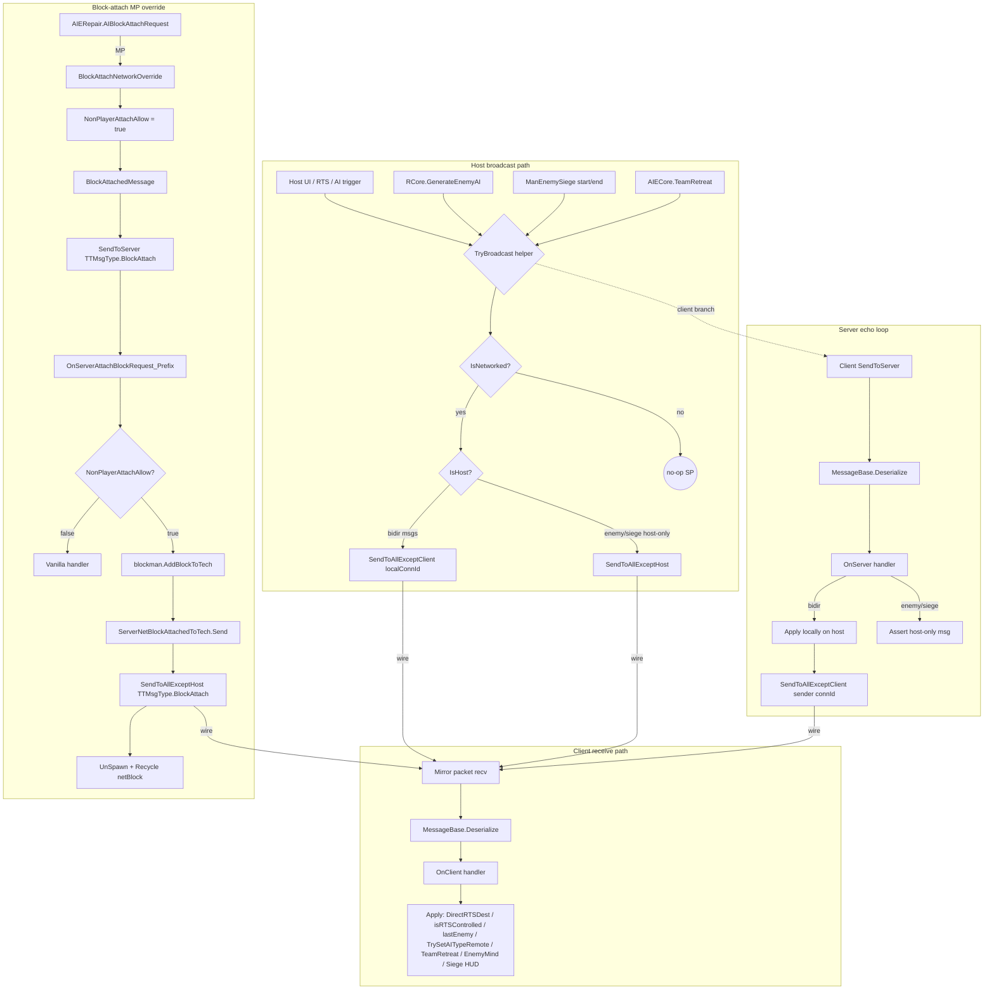

# Multiplayer Sync Pipeline

> **Category:** Infrastructure
> **Timing:** NetAIClockPeriod=30 (Operations 0.6s in MP), PushTeamDeltasToClients 1Hz, siege invokes — catalogued in [21 Timing & Cadence Register](21_timing-cadence.md).

## Summary

TAC AI extends TerraTech's stock Mirror/UNet networking to keep AI state, RTS orders, retreat status, enemy-AI smarts, siege events, and AI-driven block-attach operations in sync between host and clients. The pipeline lives primarily in [NetworkHandler.cs](../Modified/TACtical_AI-master/TACtical_AI-master/TAC_AI/NetworkHandler.cs), which reserves seven custom `TTMsgType` IDs (`4317`-`4323`), defines a `MessageBase` subclass per ID, wires per-`NetPlayer` subscriptions in Harmony postfixes (`OnStartClient`/`OnStartServer`), and exposes paired `TryBroadcast*` send helpers plus matching `OnClient*`/`OnServer*` receive handlers.

Every `TryBroadcastXxx` follows the same template: `if (!ManNetwork.IsNetworked) return;` for SP short-circuit, then `if (ManNetwork.IsHost)` fans out via `SendToAllExceptClient(localConnectionID, MSGTYPE, msg, Host)` (excludes host's own loopback) else `SendToServer(MSGTYPE, msg)`. Bidirectional server handlers apply locally on host then echo the same payload to every other client via `SendToAllExceptClient(netMsg.conn.connectionId, ...)` — the classic "client tells host, host tells everyone else" topology. Two host-only broadcasts (`AIEnemyType`, `AIEnemySiege`) use `SendToAllExceptHost` and assert on receive — they are not legal upstream messages.

The mod also hijacks the stock `TTMsgType.BlockAttach` for AI-built blocks: [AIERepair.BlockAttachNetworkOverride](../Modified/TACtical_AI-master/TACtical_AI-master/TAC_AI/AI/AIERepair.cs) sets `NonPlayerAttachAllow=true`, sends a `BlockAttachedMessage`, and [ManLooseBlocksPatches.OnServerAttachBlockRequest_Prefix](../Modified/TACtical_AI-master/TACtical_AI-master/TAC_AI/PatchBatch/ManagerPatches.cs) intercepts on the host to perform `AddBlockToTech` directly, then fans out via `SendToAllExceptHost`. Outside the `TTMsgType` channel, three TerraTechETCUtil `NetworkHook<T>` side-channels exist: `AutoMineInfMessage` (ToClientsOnly), `NetworkedNPTBribe` (ToServerOnly), and `NetworkedAITeamUpdate` (ToClientsOnly, batched 1Hz delta-sync).

## Entry points

| Trigger | Helper | File | Line |
|---|---|---|---|
| AI driver dropdown change | `TryBroadcastNewAIState` | [GUIAIManager.cs](../Modified/TACtical_AI-master/TACtical_AI-master/TAC_AI/GUIAIManager.cs) | 1541 |
| AI type dropdown change | `TryBroadcastNewAIState` | [GUIAIManager.cs](../Modified/TACtical_AI-master/TACtical_AI-master/TAC_AI/GUIAIManager.cs) | 1598 |
| RTS set-auto bridge | `TryBroadcastNewAIState` | [World/ManWorldRTS.cs](../Modified/TACtical_AI-master/TACtical_AI-master/TAC_AI/World/ManWorldRTS.cs) | 1233 |
| `RTSControlled` setter | `TryBroadcastRTSControl` | [AI/TankAIHelper.cs](../Modified/TACtical_AI-master/TACtical_AI-master/TAC_AI/AI/TankAIHelper.cs) | 503 |
| `RTSDestination` setter | `TryBroadcastRTSCommand` | [AI/TankAIHelper.cs](../Modified/TACtical_AI-master/TACtical_AI-master/TAC_AI/AI/TankAIHelper.cs) | 537 |
| Attack-move right-click | `TryBroadcastRTSAttack` | [TankExtensions.cs](../Modified/TACtical_AI-master/TACtical_AI-master/TAC_AI/TankExtensions.cs) | 35 |
| RTS queue / group attack | `TryBroadcastRTSAttack` | [World/ManWorldRTS.cs](../Modified/TACtical_AI-master/TACtical_AI-master/TAC_AI/World/ManWorldRTS.cs) | 133 |
| Group attack commands | `TryBroadcastRTSAttack` | [World/TechUnitGroup.cs](../Modified/TACtical_AI-master/TACtical_AI-master/TAC_AI/World/TechUnitGroup.cs) | 106, 516 |
| Enemy AI generated (host) | `TryBroadcastNewEnemyState` | [Enemy/RCore.cs](../Modified/TACtical_AI-master/TACtical_AI-master/TAC_AI/Enemy/RCore.cs) | 47, 64 |
| Siege start/end (host) | `TryBroadcastNewEnemySiege` | [World/ManEnemySiege.cs](../Modified/TACtical_AI-master/TACtical_AI-master/TAC_AI/World/ManEnemySiege.cs) | 224, 278 |
| Team retreat toggle | `TryBroadcastNewRetreatState` | [AI/AIECore.cs](../Modified/TACtical_AI-master/TACtical_AI-master/TAC_AI/AI/AIECore.cs) | 399, 413 |
| AI block attach (MP) | `BlockAttachNetworkOverride` | [AI/AIERepair.cs](../Modified/TACtical_AI-master/TACtical_AI-master/TAC_AI/AI/AIERepair.cs) | 1497 |
| `NetPlayer.OnStartClient` postfix | subscribes 7 client handlers | [NetworkHandler.cs](../Modified/TACtical_AI-master/TACtical_AI-master/TAC_AI/NetworkHandler.cs) | 535 |
| `NetPlayer.OnStartServer` postfix | subscribes 7 server handlers, caches `Host` netId | [NetworkHandler.cs](../Modified/TACtical_AI-master/TACtical_AI-master/TAC_AI/NetworkHandler.cs) | 553 |
| `ManNetwork.AddPlayer` postfix | delayed `WarnPlayers` (16s) | [PatchBatch/ManagerPatches.cs](../Modified/TACtical_AI-master/TACtical_AI-master/TAC_AI/PatchBatch/ManagerPatches.cs) | 151 |

## Flow

## Node reference

| Node | Role | File | Line |
|---|---|---|---|
| `Host` netId field | Cached host `NetworkInstanceId` | [NetworkHandler.cs](../Modified/TACtical_AI-master/TACtical_AI-master/TAC_AI/NetworkHandler.cs) | 15 |
| `HostExists` flag | One-shot guard for server subscribe | [NetworkHandler.cs](../Modified/TACtical_AI-master/TACtical_AI-master/TAC_AI/NetworkHandler.cs) | 16 |
| `localConnectionID` accessor | `ManNetwork.inst.Client.connection.connectionId` | [NetworkHandler.cs](../Modified/TACtical_AI-master/TACtical_AI-master/TAC_AI/NetworkHandler.cs) | 203 |
| `AITypeChangeMessage` (4317) | `(uint netTechID, int AIType, int AIDriving)` | [NetworkHandler.cs](../Modified/TACtical_AI-master/TACtical_AI-master/TAC_AI/NetworkHandler.cs) | 26 |
| `AIRetreatMessage` (4318) | `(int Team, bool Retreat)` | [NetworkHandler.cs](../Modified/TACtical_AI-master/TACtical_AI-master/TAC_AI/NetworkHandler.cs) | 53 |
| `AIRTSCommandMessage` (4319) | `(uint netTechID, Vector3 Position)` | [NetworkHandler.cs](../Modified/TACtical_AI-master/TACtical_AI-master/TAC_AI/NetworkHandler.cs) | 77 |
| `AIRTSControlMessage` (4320) | `(uint netTechID, bool RTSControl)` | [NetworkHandler.cs](../Modified/TACtical_AI-master/TACtical_AI-master/TAC_AI/NetworkHandler.cs) | 100 |
| `AIRTSAttackComm` (4321) | `(uint netTechID, uint targetNetTechID)` | [NetworkHandler.cs](../Modified/TACtical_AI-master/TACtical_AI-master/TAC_AI/NetworkHandler.cs) | 123 |
| `AIEnemySet` (4322) | `(uint netTechID, int enemyType)` host-only | [NetworkHandler.cs](../Modified/TACtical_AI-master/TACtical_AI-master/TAC_AI/NetworkHandler.cs) | 147 |
| `AIEnemyStagedSiege` (4323) | `(int Team, int TeamTargeted, long MaxHP, bool Starting)` host-only | [NetworkHandler.cs](../Modified/TACtical_AI-master/TACtical_AI-master/TAC_AI/NetworkHandler.cs) | 171 |
| `TryBroadcastRTSCommand` | Host fan-out or client upstream | [NetworkHandler.cs](../Modified/TACtical_AI-master/TACtical_AI-master/TAC_AI/NetworkHandler.cs) | 205 |
| `OnClientAcceptRTSCommand` | Apply `DirectRTSDest` | [NetworkHandler.cs](../Modified/TACtical_AI-master/TACtical_AI-master/TAC_AI/NetworkHandler.cs) | 224 |
| `OnServerAcceptRTSCommand` | Apply locally + echo to all except sender | [NetworkHandler.cs](../Modified/TACtical_AI-master/TACtical_AI-master/TAC_AI/NetworkHandler.cs) | 239 |
| `TryBroadcastRTSControl` | Bi-directional | [NetworkHandler.cs](../Modified/TACtical_AI-master/TACtical_AI-master/TAC_AI/NetworkHandler.cs) | 257 |
| `OnClientAcceptRTSControl` / `OnServerAcceptRTSControl` | Apply `isRTSControlled`, echo | [NetworkHandler.cs](../Modified/TACtical_AI-master/TACtical_AI-master/TAC_AI/NetworkHandler.cs) | 276, 291 |
| `TryBroadcastRTSAttack` | Bi-directional | [NetworkHandler.cs](../Modified/TACtical_AI-master/TACtical_AI-master/TAC_AI/NetworkHandler.cs) | 310 |
| `OnClientAcceptRTSAttack` / `OnServerAcceptRTSAttack` | Apply `lastEnemy`, echo | [NetworkHandler.cs](../Modified/TACtical_AI-master/TACtical_AI-master/TAC_AI/NetworkHandler.cs) | 329, 346 |
| `TryBroadcastNewAIState` | Bi-directional | [NetworkHandler.cs](../Modified/TACtical_AI-master/TACtical_AI-master/TAC_AI/NetworkHandler.cs) | 366 |
| `OnClientSetNewAIState` / `OnServerSetNewAIState` | Apply via `TrySetAITypeRemote` (ownership check), echo | [NetworkHandler.cs](../Modified/TACtical_AI-master/TACtical_AI-master/TAC_AI/NetworkHandler.cs) | 385, 402 |
| `TryBroadcastNewRetreatState` | Bi-directional | [NetworkHandler.cs](../Modified/TACtical_AI-master/TACtical_AI-master/TAC_AI/NetworkHandler.cs) | 422 |
| `OnClientSetRetreatState` / `OnServerSetRetreatState` | Apply `AIECore.TeamRetreat`, echo | [NetworkHandler.cs](../Modified/TACtical_AI-master/TACtical_AI-master/TAC_AI/NetworkHandler.cs) | 441, 455 |
| `TryBroadcastNewEnemyState` | `HostExists && IsHost` gate, `SendToAllExceptHost` | [NetworkHandler.cs](../Modified/TACtical_AI-master/TACtical_AI-master/TAC_AI/NetworkHandler.cs) | 472 |
| `OnClientEnemyAISetup` | Apply `EnemyMind.CommanderSmarts` | [NetworkHandler.cs](../Modified/TACtical_AI-master/TACtical_AI-master/TAC_AI/NetworkHandler.cs) | 481 |
| `OnServerEnemyAISetup` | Assertion-only — host should never receive | [NetworkHandler.cs](../Modified/TACtical_AI-master/TACtical_AI-master/TAC_AI/NetworkHandler.cs) | 496 |
| `TryBroadcastNewEnemySiege` | Host-only, `SendToAllExceptHost` | [NetworkHandler.cs](../Modified/TACtical_AI-master/TACtical_AI-master/TAC_AI/NetworkHandler.cs) | 501 |
| `OnClientEnemySiegeUpdate` | Apply `ManEnemySiege.InitSiegeWarning`/`EndSiege` | [NetworkHandler.cs](../Modified/TACtical_AI-master/TACtical_AI-master/TAC_AI/NetworkHandler.cs) | 511 |
| `OnServerEnemySiegeUpdate` | Assertion-only | [NetworkHandler.cs](../Modified/TACtical_AI-master/TACtical_AI-master/TAC_AI/NetworkHandler.cs) | 528 |
| `Patches.OnStartClient.Postfix` | Subscribes 7 client handlers per `NetPlayer` | [NetworkHandler.cs](../Modified/TACtical_AI-master/TACtical_AI-master/TAC_AI/NetworkHandler.cs) | 538 |
| `Patches.OnStartServer.Postfix` | Subscribes 7 server handlers, sets `Host`/`HostExists` | [NetworkHandler.cs](../Modified/TACtical_AI-master/TACtical_AI-master/TAC_AI/NetworkHandler.cs) | 556 |
| `OnServerAttachBlockRequest_Prefix` | Host-side AI block-attach interceptor | [PatchBatch/ManagerPatches.cs](../Modified/TACtical_AI-master/TACtical_AI-master/TAC_AI/PatchBatch/ManagerPatches.cs) | 33 |
| `AddPlayer_Postfix` | Schedules 16s `WarnPlayers` | [PatchBatch/ManagerPatches.cs](../Modified/TACtical_AI-master/TACtical_AI-master/TAC_AI/PatchBatch/ManagerPatches.cs) | 151 |
| `NetTechPatches.SaveTechData_Prefix` | If `BulkAdding`, swap to `QueueSaveTechData` | [PatchBatch/GlobalPatches.cs](../Modified/TACtical_AI-master/TACtical_AI-master/TAC_AI/PatchBatch/GlobalPatches.cs) | 101 |
| `AIBlockAttachRequest` | SP direct vs MP override switch | [AI/AIERepair.cs](../Modified/TACtical_AI-master/TACtical_AI-master/TAC_AI/AI/AIERepair.cs) | 1480 |
| `BlockAttachNetworkOverride` | Host-asserted send of `BlockAttachedMessage` | [AI/AIERepair.cs](../Modified/TACtical_AI-master/TACtical_AI-master/TAC_AI/AI/AIERepair.cs) | 1497 |
| `BulkAdding` flag | Coalesces save traffic during bulk attach | [AI/AIERepair.cs](../Modified/TACtical_AI-master/TACtical_AI-master/TAC_AI/AI/AIERepair.cs) | 36, 1607 |
| `AutoMineInfMessage` hook | `NetworkHook<T>` ToClientsOnly | [AI/AIERepair.cs](../Modified/TACtical_AI-master/TACtical_AI-master/TAC_AI/AI/AIERepair.cs) | 737 |
| `NetworkedNPTBribe` hook | `NetworkHook<T>` ToServerOnly | [GUINPTInteraction.cs](../Modified/TACtical_AI-master/TACtical_AI-master/TAC_AI/GUINPTInteraction.cs) | 30 |
| `NetworkedAITeamUpdate` hook | `NetworkHook<T>` ToClientsOnly, batched 1Hz | [World/ManBaseTeams.cs](../Modified/TACtical_AI-master/TACtical_AI-master/TAC_AI/World/ManBaseTeams.cs) | 1580 |
| `CheckNeedNetworkHooks` | Wires team-delta subscriptions when host | [World/ManBaseTeams.cs](../Modified/TACtical_AI-master/TACtical_AI-master/TAC_AI/World/ManBaseTeams.cs) | 1365 |
| `TrySetAITypeRemote` | Per-tech ownership check | [AI/TankAIHelper.cs](../Modified/TACtical_AI-master/TACtical_AI-master/TAC_AI/AI/TankAIHelper.cs) | 756 |
| `DirectRTSDest` | Receive-only mutator, no broadcast | [AI/TankAIHelper.cs](../Modified/TACtical_AI-master/TACtical_AI-master/TAC_AI/AI/TankAIHelper.cs) | 571 |

## Key data / state

- **`TTMsgType` IDs 4317-4323**: seven custom Mirror message types reserved by [NetworkHandler.cs:18-24](../Modified/TACtical_AI-master/TACtical_AI-master/TAC_AI/NetworkHandler.cs). Cast from raw `int` into the `TTMsgType` enum.
- **`MessageBase` variants**: `AITypeChangeMessage`, `AIRetreatMessage`, `AIRTSCommandMessage`, `AIRTSControlMessage`, `AIRTSAttackComm`, `AIEnemySet`, `AIEnemyStagedSiege`. Each overrides both `Serialize(NetworkWriter)` and `Deserialize(NetworkReader)`; the write/read order MUST mirror exactly.
- **Reused stock IDs**: `TTMsgType.BlockAttach` (hijacked via `BlockAttachedMessage` for AI-block attach), `TTMsgType.UnspawnTech` (cleanup paths in `AIGlobals`), `TTMsgType.SetAIMode` (vanilla AI-mode write in `TankAIHelper.cs:1401, 1420`).
- **`NonPlayerAttachAllow`** ([AI/AIERepair.cs](../Modified/TACtical_AI-master/TACtical_AI-master/TAC_AI/AI/AIERepair.cs)): global static signal flag. Set true around `SendToServer(TTMsgType.BlockAttach, ...)` in `BlockAttachNetworkOverride`, read by `OnServerAttachBlockRequest_Prefix` to decide pass-through vs hijack. NOT per-message tagged — straight-line `true`/`false` toggle without try/finally.
- **`BulkAdding`** ([AI/AIERepair.cs](../Modified/TACtical_AI-master/TACtical_AI-master/TAC_AI/AI/AIERepair.cs:36)): set true by `AIERepair.InstaRepair` (line 1607) and `RawTechLoader` (lines 3257, 3294). When true, `NetTechPatches.SaveTechData_Prefix` swaps `SaveTechData()` for `QueueSaveTechData()` to coalesce per-block traffic.
- **`HostExists`** ([NetworkHandler.cs:16](../Modified/TACtical_AI-master/TACtical_AI-master/TAC_AI/NetworkHandler.cs)): single-shot guard. Set true in `OnStartServer.Postfix` after first server `NetPlayer` subscribes. Never reset.
- **`Host`** ([NetworkHandler.cs:15](../Modified/TACtical_AI-master/TACtical_AI-master/TAC_AI/NetworkHandler.cs)): cached host `NetworkInstanceId`, used as `excludingPlayer` arg in `SendToAllExceptClient` calls.
- **`localConnectionID`** ([NetworkHandler.cs:203](../Modified/TACtical_AI-master/TACtical_AI-master/TAC_AI/NetworkHandler.cs)): `ManNetwork.inst.Client.connection.connectionId`. Used in every host fan-out to exclude the host's own loopback. On dedicated-style hosting paths where `Client` is null, NREs (caught by outer `try/catch`, silently dropped).
- **`NetworkHook<T>` side-channels** (TerraTechETCUtil, separate from `TTMsgType`): `AutoMineInfMessage` ToClientsOnly, `NetworkedNPTBribe` ToServerOnly, `NetworkedAITeamUpdate` ToClientsOnly (custom batched serializer `PackTeamInfo` / `PackTeamBBInfo` / `PackTeamRemovedInfo` with `byte`-prefixed count, pushed via 1Hz `PushTeamDeltasToClients` invoke).

## Exit points

| Apply | Target | File | Line |
|---|---|---|---|
| Client RTS dest | `DirectRTSDest(reader.Position)` | [NetworkHandler.cs](../Modified/TACtical_AI-master/TACtical_AI-master/TAC_AI/NetworkHandler.cs) | 231, 246 |
| Client RTS control | `helper.isRTSControlled = reader.RTSControl` | [NetworkHandler.cs](../Modified/TACtical_AI-master/TACtical_AI-master/TAC_AI/NetworkHandler.cs) | 283, 298 |
| Client RTS attack | `helper.lastEnemy = targeting.tech.visible` | [NetworkHandler.cs](../Modified/TACtical_AI-master/TACtical_AI-master/TAC_AI/NetworkHandler.cs) | 338, 355 |
| Client AI state | `helper.TrySetAITypeRemote(sender, type, driver)` | [NetworkHandler.cs](../Modified/TACtical_AI-master/TACtical_AI-master/TAC_AI/NetworkHandler.cs) | 393, 410 |
| Team retreat | `AIECore.TeamRetreat(reader.Team, reader.Retreat)` | [NetworkHandler.cs](../Modified/TACtical_AI-master/TACtical_AI-master/TAC_AI/NetworkHandler.cs) | 447, 461 |
| Enemy smarts | `EnemyMind.CommanderSmarts = ...` | [NetworkHandler.cs](../Modified/TACtical_AI-master/TACtical_AI-master/TAC_AI/NetworkHandler.cs) | 488 |
| Siege HUD | `ManEnemySiege.InitSiegeWarning` / `EndSiege` | [NetworkHandler.cs](../Modified/TACtical_AI-master/TACtical_AI-master/TAC_AI/NetworkHandler.cs) | 518 |
| Host block attach | `blockman.AddBlockToTech` + `ServerNetBlockAttachedToTech.Send` + `UnSpawn` + `Recycle` | [PatchBatch/ManagerPatches.cs](../Modified/TACtical_AI-master/TACtical_AI-master/TAC_AI/PatchBatch/ManagerPatches.cs) | 60-77 |
| Client block attach | `SendToAllExceptHost(TTMsgType.BlockAttach, BAM)` | [PatchBatch/ManagerPatches.cs](../Modified/TACtical_AI-master/TACtical_AI-master/TAC_AI/PatchBatch/ManagerPatches.cs) | 66 |
| Server echo (all bidir) | `SendToAllExceptClient(netMsg.conn.connectionId, ...)` | [NetworkHandler.cs](../Modified/TACtical_AI-master/TACtical_AI-master/TAC_AI/NetworkHandler.cs) | 249, 301, 358, etc. |

## Cross-pipeline integration

- **Enemy AI** ([Enemy/RCore.cs](../Modified/TACtical_AI-master/TACtical_AI-master/TAC_AI/Enemy/RCore.cs)): `GenerateEnemyAI` host-only fans out `AIEnemySet` to set `EnemyMind.CommanderSmarts` on clients.
- **World siege** ([World/ManEnemySiege.cs](../Modified/TACtical_AI-master/TACtical_AI-master/TAC_AI/World/ManEnemySiege.cs)): host broadcasts `AIEnemyStagedSiege(starting=true)` from `ThrowWarnPlayers`, `(starting=false)` from `CheckSiegeEnded` — clients drive their siege HUD off this.
- **Repair** ([AI/AIERepair.cs](../Modified/TACtical_AI-master/TACtical_AI-master/TAC_AI/AI/AIERepair.cs)): `AIBlockAttachRequest` branches SP/MP; MP path goes through `BlockAttachNetworkOverride` -> stock `TTMsgType.BlockAttach` -> hijacked prefix. `BulkAdding` coalesces save traffic during bulk repair/respawn. `AutoMineInfMessage` hook lets host force infinite-mine mode on clients.
- **RTS / Movement** ([AI/TankAIHelper.cs](../Modified/TACtical_AI-master/TACtical_AI-master/TAC_AI/AI/TankAIHelper.cs)): `RTSControlled`/`RTSDestination` setters drive network broadcasts. `DirectRTSDest` is the receive-only mutator that skips the broadcast (avoids feedback loop on apply). `TrySetAITypeRemote` enforces the only per-tech ownership check in the pipeline.
- **GUI / Input** ([GUIAIManager.cs](../Modified/TACtical_AI-master/TACtical_AI-master/TAC_AI/GUIAIManager.cs), [TankExtensions.cs](../Modified/TACtical_AI-master/TACtical_AI-master/TAC_AI/TankExtensions.cs)): dropdown changes and right-click attack-move are the canonical user-facing initiators.
- **Base teams** ([World/ManBaseTeams.cs](../Modified/TACtical_AI-master/TACtical_AI-master/TAC_AI/World/ManBaseTeams.cs)): `NetworkedAITeamUpdate` side-channel batches team-state deltas 1Hz from host to clients via `NetworkHook` rather than `TTMsgType`.
- **NPT bribe** ([GUINPTInteraction.cs](../Modified/TACtical_AI-master/TACtical_AI-master/TAC_AI/GUINPTInteraction.cs)): `NetworkedNPTBribe` ToServerOnly hook for client-to-host bribe requests.
- **Save/load** ([PatchBatch/GlobalPatches.cs:101](../Modified/TACtical_AI-master/TACtical_AI-master/TAC_AI/PatchBatch/GlobalPatches.cs)): `NetTechPatches.SaveTechData_Prefix` returns false when `BulkAdding` to suppress per-block save churn.
- **Other MP gates**: `TankBeamPatches.OnUpdate_Postfix` skipped entirely under `ManNetwork.IsNetworked` ([PatchBatch/GlobalPatches.cs:150](../Modified/TACtical_AI-master/TACtical_AI-master/TAC_AI/PatchBatch/GlobalPatches.cs)). `ModuleItemConsumePatches.InitRecipeOutput_Prefix` and `ModuleHeartPatches.UpdatePickupTargets_Prefix` are host-only gated.

## Key invariants

1. **SP short-circuit**: every `TryBroadcastXxx` returns immediately if `!ManNetwork.IsNetworked`. Gameplay code calls setters uniformly without branching on netplay.
2. **Host is authoritative**: only host runs sim-shaping work (enemy-base sell intercepts, AI block-attach overrides, sleep suppression). Clients are pure replication targets.
3. **Server echo**: bidirectional messages always re-broadcast on host. Original sender excluded via `netMsg.conn.connectionId`.
4. **Per-tech ownership** is only enforced in `TrySetAITypeRemote` (`sender.CurTech?.Team == tank.Team`). RTS messages have no ownership check.
5. **Subscription is per-NetPlayer**: TT's Mirror layer binds subscriptions to `NetPlayer.netId`. `HostExists` prevents duplicate server-side subscription.

## Known issues

### Bugs

| Severity | Issue | Location |
|---|---|---|
| HIGH | `HostExists` is never reset. If a player hosts, returns to main menu, and hosts again in the same process, server handlers are not re-subscribed (`Host` netId also stale). | [NetworkHandler.cs:16, 571](../Modified/TACtical_AI-master/TACtical_AI-master/TAC_AI/NetworkHandler.cs) |
| MED | `localConnectionID` NREs on dedicated-style hosting paths where `ManNetwork.inst.Client` is null — caught by outer `try/catch`, message silently dropped with a `LogNet` warning. | [NetworkHandler.cs:203](../Modified/TACtical_AI-master/TACtical_AI-master/TAC_AI/NetworkHandler.cs) |
| MED | `BlockAttachNetworkOverride` returns `canidate.tank == tank` immediately after `SendToServer`. Mirror send is non-blocking — actual attach happens later on host. Caller uses return value to decide whether to keep iterating, so it can mis-report failure when attach is in flight. | [AI/AIERepair.cs:1528](../Modified/TACtical_AI-master/TACtical_AI-master/TAC_AI/AI/AIERepair.cs) |
| MED | `TrySetAITypeRemote` no-ops the log if `sender == null` but does NOT return; next line dereferences `sender.CurTech` and would NRE (the `?.` only guards `CurTech`, not `sender`). The intended early-return is commented out at lines 950-951. | [AI/TankAIHelper.cs:947-953](../Modified/TACtical_AI-master/TACtical_AI-master/TAC_AI/AI/TankAIHelper.cs) |
| MED | `OnServerAttachBlockRequest_Prefix` lacks early-return on `NetT == null` / `canidate == null` / `netBlock.IsNull()`. All error paths fall through; function returns `false` unconditionally at line 83 when `NonPlayerAttachAllow=true`, swallowing the vanilla handler even on validation failure. Block-attach request silently dropped, no client retry path. | [PatchBatch/ManagerPatches.cs:36-86](../Modified/TACtical_AI-master/TACtical_AI-master/TAC_AI/PatchBatch/ManagerPatches.cs) |
| MED | `NonPlayerAttachAllow` is a global static set/cleared straight-line without `try/finally`. Any exception inside the send window leaks the flag, and any concurrent vanilla `BlockAttach` for a non-AI block during the window gets misrouted. Mitigated only by Unity's single-threaded message pump. | [AI/AIERepair.cs:1519-1529](../Modified/TACtical_AI-master/TACtical_AI-master/TAC_AI/AI/AIERepair.cs) |
| LOW | `SendToAllExceptClient(localConnectionID, ...)` correctness depends on Mirror not reassigning host's loopback connectionId post-reconnect. If reassigned, host receives its own broadcast and double-applies. | [NetworkHandler.cs:214 etc.](../Modified/TACtical_AI-master/TACtical_AI-master/TAC_AI/NetworkHandler.cs) |
| LOW | Client-side AI block attach (`!ManNetwork.IsHost` branch) only logs and drops the request — no deferred retry, no message back to requester. AI may keep retrying forever. | [AI/AIERepair.cs:1499](../Modified/TACtical_AI-master/TACtical_AI-master/TAC_AI/AI/AIERepair.cs) |
| LOW | `OnClient/ServerSetRetreatState` catch logs "receive failiure! Could not decode intake!?" — misleading, since `AIECore.TeamRetreat` now wraps its whole body (including both `ManOverlay.WorldPositionForFloatingText` calls) in its own `try/catch`, so downstream throws no longer surface at this handler. Only the wrong message text remains (cosmetic). | [NetworkHandler.cs:452, 468](../Modified/TACtical_AI-master/TACtical_AI-master/TAC_AI/NetworkHandler.cs) |
| LOW | `EndSiege` call passes no team scope. If two teams could siege simultaneously, second END would clear the wrong HUD. | [NetworkHandler.cs:520](../Modified/TACtical_AI-master/TACtical_AI-master/TAC_AI/NetworkHandler.cs) |
| LOW | No host-migration / teardown reset. `HostExists` is set only server-side (line 571) and never cleared, so a process that has hosted once keeps server subscriptions gated off (`if (!HostExists)`, line 558) on any later host session. Same root cause as the HIGH `HostExists` row. | [NetworkHandler.cs:558, 571](../Modified/TACtical_AI-master/TACtical_AI-master/TAC_AI/NetworkHandler.cs) |

### Dead code

- `OnServerEnemyAISetup` and `OnServerEnemySiegeUpdate` are assertion-only — they fire `DebugTAC_AI.Assert(true, ...)` and exist purely to detect routing mistakes ([NetworkHandler.cs:496-499, 528-531](../Modified/TACtical_AI-master/TACtical_AI-master/TAC_AI/NetworkHandler.cs)). Real path never reached by design.
- Commented-out early-return at [AI/TankAIHelper.cs:950-951](../Modified/TACtical_AI-master/TACtical_AI-master/TAC_AI/AI/TankAIHelper.cs) in `TrySetAITypeRemote`.

### Tech debt

- Misspelled "Receive failiure!" across `On*RTSCommand`/`On*RTSControl`/`On*RTSAttack`/`On*SetNewAIState`/`On*SetRetreatState` log messages — cosmetic, but creates grep-noise.
- `NonPlayerAttachAllow` and `BulkAdding` are global statics used as message-scoped signal flags — should be per-message tags or scope-guarded with `using`/`try/finally`.
- No documentation that `DirectRTSDest` is the broadcast-skipping mutator vs `RTSDestination` setter being the broadcast path; easy to call the wrong one and create either a feedback loop or a missing sync.
- `Host` netId and `HostExists` flag have no reset path on session teardown.
- Block-attach override is monolithic in the Harmony prefix; would benefit from extracting hijack-vs-passthrough into a helper.

