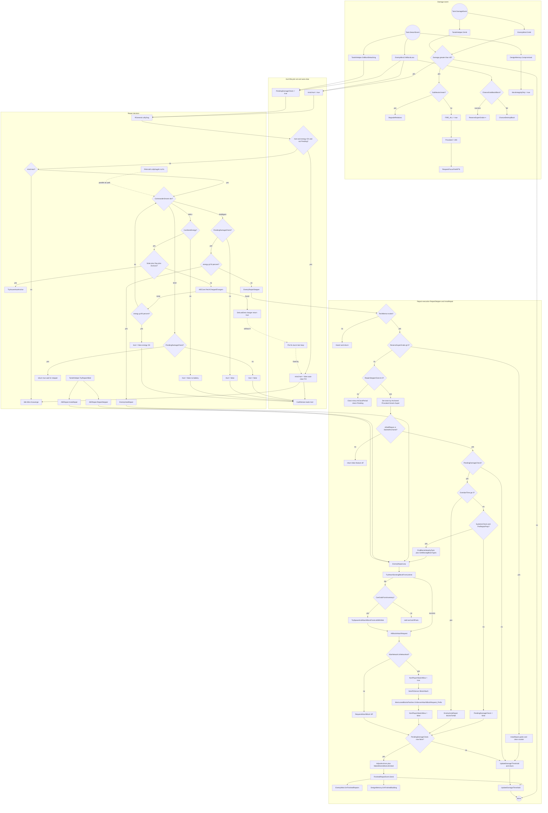

# Repair / Damage System

> **Category:** Infrastructure
> **Timing:** RepairStepperClock variants (Operations-clock, 0.8-24s) and BlockAttachDelay catalogued in [21 Timing & Cadence Register](21_timing-cadence.md).

## Summary

The TAC AI repair/damage system is event-driven on top of vanilla `Tank.DamageEvent` / `Tank.DetachEvent`. When an AI tech takes a hit above `DamageAlertThreshold` (45) or loses a block, subscribers on `EnemyMind` and `TankAIHelper` flip `mind.Hurt = true` and `helper.PendingDamageCheck = true`. On each AI tick the active behaviour ([RGeneral.LollyGag](../Modified/TACtical_AI-master/TACtical_AI-master/TAC_AI/Enemy/RGeneral.cs) for ground, [RAircraft.LollyGagAir](../Modified/TACtical_AI-master/TACtical_AI-master/TAC_AI/Enemy/EnemyOperations/RAircraft.cs) for air, [AIERepair.RepairStepper](../Modified/TACtical_AI-master/TACtical_AI-master/TAC_AI/AI/AIERepair.cs) for player-allied techs, [RRepair.EnemyRepairStepper](../Modified/TACtical_AI-master/TACtical_AI-master/TAC_AI/Enemy/RRepair.cs) for enemy techs) inspects those flags and dispatches one of three responses:

1. **Charger fetch / solar anchor** — Meh-tier ground techs run to a friendly charger via `AIECore.FetchChargedChargers`, or anchor in daylight if `SolarsAvail`.
2. **Stepped repair** — `EnemyRepairStepper` / `AIERepair.RepairStepper` reattach blocks from a `DesignMemory` blueprint on a clocked cadence (`RepairStepperClock` derived from `eDelay*` / `bDelay*` and `CommanderSmarts`).
3. **Insta-repair** — `EnemyInstaRepair` / `AIERepair.InstaRepair` slams as many blocks as possible in a single tick. Used for bases, the `IntAIligent` smarts tier with sufficient energy, `ReserveSuperGrabs` payout, and overdue catch-up when the stepper falls behind.

Repair source priority inside the lerp functions is *loose nearby blocks first*, then *inventory/spawn* if `CanGrabFromInventory` (or `helper.UseInventory`) is true.

The recent fix in [RGeneral.LollyGag](../Modified/TACtical_AI-master/TACtical_AI-master/TAC_AI/Enemy/RGeneral.cs):47-53 added an unconditional `Hurt` auto-clear at the top of the function: if energy is full (or the tech cannot store energy at all) **and** `!PendingDamageCheck`, `Hurt` is cleared regardless of which sub-branch the tech took. This closes the "permanent flee mode" bug where Meh-tier techs that finished energy recovery via `FetchChargedChargers`'s early `return true` (RGeneral.cs:71-75) never reached any of the per-branch `mind.Hurt = false` writes, so `CanRetreat` stayed true forever. `RAircraft.LollyGagAir` did **not** receive the same fix — see Known issues.

`PendingDamageCheck` is set by `OnBlockDetaching`, `OnBlockLoss`, `DesignMemory.Initiate`, `ResetOnSwitchAlignments`, several base/loaded-base spawn paths, and the repair stepper itself. It is cleared exclusively by the repair-stepper paths in `AIERepair.cs` and `RRepair.cs` once `TechMemor.SystemsCheck()` returns false (or hard-cleared when `PreRepairPrep` refuses the job). `DamageThreshold` (0-100 percentage) is recomputed every tick by `UpdateDamageThreshold` from `(1 - blockCount/maxBlockCount) * 100` (or root-block HP for 1-block techs) and feeds retreat/engage planners independent of `Hurt`.

The `AttemptedRepairs` counter that the gated `// && helper.AttemptedRepairs < N` comments reference no longer exists as a field on `TankAIHelper` — every call site is commented out. Treat it as dead code (see Known issues).

## Entry points

| Trigger | File | Sets |
|---|---|---|
| `Tank.DamageEvent` → `EnemyMind.OnHit` (subscribed in `Initiate`) | [EnemyMind.cs:101 / 167](../Modified/TACtical_AI-master/TACtical_AI-master/TAC_AI/Enemy/EnemyMind.cs) | `mind.Hurt = true` (171); `AIControl.Provoked = ProvokeTime` (210); `FIRE_ALL`; revenge / focus-fire requests; `DegradeRelations` for SubNeutral teams |
| `Tank.DamageEvent` → `TankAIHelper.OnHit` (re-subscribed in `SetForRemoval`) | [TankAIHelper.cs:1284](../Modified/TACtical_AI-master/TACtical_AI-master/TAC_AI/AI/TankAIHelper.cs) | `Provoked`, `FIRE_ALL`, focus-fire requests. Does NOT set `Hurt` — that lives on `EnemyMind` |
| `Tank.DetachEvent` → `EnemyMind.OnBlockLoss` (static) | [EnemyMind.cs:103 / 213](../Modified/TACtical_AI-master/TACtical_AI-master/TAC_AI/Enemy/EnemyMind.cs) | `mind.Hurt = true`, `PendingDamageCheck = true`, `FIRE_ALL = true`, then `ChanceGrabBackBlock` or `ChanceDestroyBlock`. Skips on `FirstUpdateAfterSpawn` / `RawTechLoader.Rebuilding` |
| `Tank.DetachEvent` → `TankAIHelper.OnBlockDetaching` | [TankAIHelper.cs:690](../Modified/TACtical_AI-master/TACtical_AI-master/TAC_AI/AI/TankAIHelper.cs) | `PendingDamageCheck = true`, `dirtyExtents = true`, `PendingHeightCheck = true`, `dirtyAI = Dirty` for Player AIAlign |
| `Tank.DetachEvent` → `DesignMemory.Compromised` | [AIERepair.cs:86 / 147](../Modified/TACtical_AI-master/TACtical_AI-master/TAC_AI/AI/AIERepair.cs) | `blockIntegrityDirty = true`; `conveyorsBorked` if conveyor lost; schedules `SaveTech` for player-edited techs |
| `RLoadedBases` base-attack hooks | [RLoadedBases.cs:401, 588](../Modified/TACtical_AI-master/TACtical_AI-master/TAC_AI/Enemy/RLoadedBases.cs) | `PendingDamageCheck = true` for funder/base techs |
| `ManWorldRTS` reload | [ManWorldRTS.cs:1153](../Modified/TACtical_AI-master/TACtical_AI-master/TAC_AI/Enemy/ManWorldRTS.cs) | `PendingDamageCheck = true` |
| `TankAIHelper.ResetOnSwitchAlignments` | [TankAIHelper.cs:1026](../Modified/TACtical_AI-master/TACtical_AI-master/TAC_AI/AI/TankAIHelper.cs) | `PendingDamageCheck = true` |
| `DesignMemory.Initiate` (TechMemor spawn) | [AIERepair.cs:82 / 90](../Modified/TACtical_AI-master/TACtical_AI-master/TAC_AI/AI/AIERepair.cs) | `PendingDamageCheck = true`, `blockIntegrityDirty = true` (even when `DoFirstSave=true` and tech is complete — see Known issues) |

`DamageAlertThreshold = 45` ([AIGlobals.cs:365](../Modified/TACtical_AI-master/TACtical_AI-master/TAC_AI/AIGlobals.cs)) gates both `OnHit` handlers — sub-threshold chip damage is ignored entirely (no Hurt, no Provoked).

## Flow

## Node reference

| Node | File | Notes |
|---|---|---|
| `EnemyMind.OnHit` | [EnemyMind.cs:167](../Modified/TACtical_AI-master/TACtical_AI-master/TAC_AI/Enemy/EnemyMind.cs) | Subscribed in `Initiate`. Threshold-gated by `DamageAlertThreshold` (45). Sets `Hurt`, `Provoked`, `FIRE_ALL`, focus-fire requests, SubNeutral `DegradeRelations`. |
| `TankAIHelper.OnHit` | [TankAIHelper.cs:1284](../Modified/TACtical_AI-master/TACtical_AI-master/TAC_AI/AI/TankAIHelper.cs) | Subscribed for player/allied techs. Does NOT set Hurt (field lives on EnemyMind). Sets `Provoked`, focus-fire. |
| `EnemyMind.OnBlockLoss` (static) | [EnemyMind.cs:213](../Modified/TACtical_AI-master/TACtical_AI-master/TAC_AI/Enemy/EnemyMind.cs) | Subscribed via `Tank.DetachEvent`. Sets `Hurt = true`, `PendingDamageCheck = true`, `FIRE_ALL = true`, then either `TechMemor.ChanceGrabBackBlock()` or `ChanceDestroyBlock`. Skips on `FirstUpdateAfterSpawn` / `RawTechLoader.Rebuilding`. |
| `TankAIHelper.OnBlockDetaching` | [TankAIHelper.cs:690](../Modified/TACtical_AI-master/TACtical_AI-master/TAC_AI/AI/TankAIHelper.cs) | Player-side: marks `PendingDamageCheck`, `dirtyExtents`, `PendingHeightCheck` and (Player AIAlign) `dirtyAI = Dirty`. |
| `EnemyMind.ChanceDestroyBlock` | [EnemyMind.cs:240](../Modified/TACtical_AI-master/TACtical_AI-master/TAC_AI/Enemy/EnemyMind.cs) | License-tier gate then `Random.Range(0,100) >= EnemyBlockDropChance` roll. Inline comment notes SPRINT1-1.6 fix from `Range(0,99)` to `Range(0,100)` to honor 100% drop setting. |
| `DesignMemory.Compromised` | [AIERepair.cs:147](../Modified/TACtical_AI-master/TACtical_AI-master/TAC_AI/AI/AIERepair.cs) | Marks `blockIntegrityDirty`, flags `conveyorsBorked` if conveyor lost. May schedule `SaveTech` for player-edited techs. |
| `DesignMemory.Initiate` | [AIERepair.cs:82](../Modified/TACtical_AI-master/TACtical_AI-master/TAC_AI/AI/AIERepair.cs) | Sets `PendingDamageCheck = true`, `blockIntegrityDirty = true`. Hooks `FinishedRepairEvent -> OnFinishedBuilding`. |
| `DesignMemory.SystemsCheck` | [AIERepair.cs:369](../Modified/TACtical_AI-master/TACtical_AI-master/TAC_AI/AI/AIERepair.cs) | Updates `Helper.DamageThreshold` from blockcount ratio; returns `true` if damaged and not out of parts. |
| `RRepair.EnemyInstaRepair` | [RRepair.cs:84](../Modified/TACtical_AI-master/TACtical_AI-master/TAC_AI/Enemy/RRepair.cs) | Bursts up to `RepairAttempts` reattach passes in one call. Bails unless `KickStart.AISelfRepair \|\| StartedAnchored`. |
| `RRepair.EnemyRepairStepper` | [RRepair.cs:135](../Modified/TACtical_AI-master/TACtical_AI-master/TAC_AI/Enemy/RRepair.cs) | Main per-tick enemy repair driver. Handles `ReserveSuperGrabs`, clocked cadence, overdue catch-up via `EnemyInstaRepair`, MP/SP lerp branches, `FinishedRepairEvent` on completion. Always calls `UpdateDamageThreshold` last. |
| `RRepair.EnemyRepairLerp` | [RRepair.cs:44](../Modified/TACtical_AI-master/TACtical_AI-master/TAC_AI/Enemy/RRepair.cs) | Single repair pass: existing loose blocks first, then inventory spawn if allowed. |
| `RRepair.QueueEnemyRepairLerp` | [RRepair.cs:61](../Modified/TACtical_AI-master/TACtical_AI-master/TAC_AI/Enemy/RRepair.cs) | Identical to `EnemyRepairLerp` but uses non-`Inst` variants in SP. Forwards to `EnemyRepairLerp` on MP. |
| `RRepair.CanGrabFromInventory` | [RRepair.cs:11](../Modified/TACtical_AI-master/TACtical_AI-master/TAC_AI/Enemy/RRepair.cs) | Gate: `(EnemiesHaveCreativeInventory \|\| AllowInvBlocks \|\| AllowEnemiesToStartBases) && (Smarts >= Smrt \|\| BuildAssist)`. |
| `RRepair.EnemyNewTechConstruction` | [RRepair.cs:287](../Modified/TACtical_AI-master/TACtical_AI-master/TAC_AI/Enemy/RRepair.cs) | EXPERIMENTAL AI-based new tech building. Bursts `EnemyInstaRepair` with `blockCount + 10` attempts. |
| `AIERepair.RepairStepper` | [AIERepair.cs:1625](../Modified/TACtical_AI-master/TACtical_AI-master/TAC_AI/AI/AIERepair.cs) | Allied/player mirror of `EnemyRepairStepper`. Uses `sDelaySafe/Combat` for Advanced, `delaySafe/Combat` otherwise. |
| `AIERepair.InstaRepair` | [AIERepair.cs:1592](../Modified/TACtical_AI-master/TACtical_AI-master/TAC_AI/AI/AIERepair.cs) | Allied/player burst repair. Toggles `BulkAdding` during the loop. |
| `AIERepair.RepairLerp` / `RepairLerpInstant` | [AIERepair.cs:1560 / 1577](../Modified/TACtical_AI-master/TACtical_AI-master/TAC_AI/AI/AIERepair.cs) | Player/ally repair pass. Inventory spawn via `TrySpawnAndAttachBlockFromList`. |
| `AIERepair.AIBlockAttachRequest` | [AIERepair.cs:1480](../Modified/TACtical_AI-master/TACtical_AI-master/TAC_AI/AI/AIERepair.cs) | Final attachment call. SP uses `RequestAttachBlock`; MP routes through `BlockAttachNetworkOverride`. |
| `AIERepair.BlockAttachNetworkOverride` | [AIERepair.cs:1497](../Modified/TACtical_AI-master/TACtical_AI-master/TAC_AI/AI/AIERepair.cs) | Host-only. Sets `NonPlayerAttachAllow = true` (1519), sends `BlockAttachedMessage`, clears the flag (1529). |
| `AIERepair.NonPlayerAttachAllow` (field) | [AIERepair.cs:35](../Modified/TACtical_AI-master/TACtical_AI-master/TAC_AI/AI/AIERepair.cs) | Static bool gating `ManLooseBlocksPatches.OnServerAttachBlockRequest_Prefix`. When true the server prefix bypasses player-only checks and lets the AI attach. Restored to false immediately after `SendToServer`. |
| `AIERepair.PreRepairPrep` (allied) | [AIERepair.cs:1535](../Modified/TACtical_AI-master/TACtical_AI-master/TAC_AI/AI/AIERepair.cs) | Verifies TechMemor exists; re-saves if player added blocks; returns true if memory count != current. |
| `RRepair.PreRepairPrep` (enemy) | [RRepair.cs:16](../Modified/TACtical_AI-master/TACtical_AI-master/TAC_AI/Enemy/RRepair.cs) | Same as above but calls `mind.AIControl.InsureTechMemor("PreRepairPrep", true)` on null. |
| `RGeneral.LollyGag` | [RGeneral.cs:39](../Modified/TACtical_AI-master/TACtical_AI-master/TAC_AI/Enemy/RGeneral.cs) | Top-level repair-decision FSM for ground enemy techs. Implements smarts-tiered branches (Meh → charger/solar, Smrt → stepper-only, IntAIligent → insta-if-energy / stepper). The recent fix (lines 47-53) auto-clears `Hurt` whenever energy is full and `!PendingDamageCheck`. |
| `RGeneral.CanRetreat` | [RGeneral.cs:16](../Modified/TACtical_AI-master/TACtical_AI-master/TAC_AI/Enemy/RGeneral.cs) | Reads `mind.Hurt` + charger/solar/`DamageThreshold` to decide retreat eligibility. The Hurt-stuck bug fed directly into this. |
| `RAircraft.LollyGagAir` | [RAircraft.cs:193](../Modified/TACtical_AI-master/TACtical_AI-master/TAC_AI/Enemy/EnemyOperations/RAircraft.cs) | Air-tech parallel of `LollyGag`. **Does NOT include the auto-clear fix** — see Known issues. |
| `AIECore.FetchChargedChargers` | [AIECore.cs:271](../Modified/TACtical_AI-master/TACtical_AI-master/TAC_AI/AI/AIECore.cs) | Linear scan of `Chargers` for nearest same-team charger with `CanTransferCharge(tank)`. Returns `IAIFollowable finalPos` and `Tank theBase`. Range filter `sqrMagnitude > 1` skips self. Also used by `BAssassin`, `BEnergizer`. |
| `AIECore.ChargedChargerExists` | [AIECore.cs:253](../Modified/TACtical_AI-master/TACtical_AI-master/TAC_AI/AI/AIECore.cs) | Boolean fast-path used by `CanRetreat`. |
| `TankAIHelper.UpdateDamageThreshold` | [TankAIHelper.cs:5615](../Modified/TACtical_AI-master/TACtical_AI-master/TAC_AI/AI/TankAIHelper.cs) | Updates `DamageThreshold` from `(1 - blockCount/maxBlockCount) * 100`. 1-block techs scale by root-block HP. Called every tick at end of stepper / TryRepair* paths. |
| `TankAIHelper.PendingDamageCheck` | [TankAIHelper.cs:268](../Modified/TACtical_AI-master/TACtical_AI-master/TAC_AI/AI/TankAIHelper.cs) | Public bool. The commented-out property shim at TankAIHelper.cs:257-267 logs the setter stacktrace via `StackTraceUtility.ExtractStackTrace()` — evidence this flag was a debugging hot-spot. |
| `TankAIHelper.DamageThreshold` | [TankAIHelper.cs:270](../Modified/TACtical_AI-master/TACtical_AI-master/TAC_AI/AI/TankAIHelper.cs) | 0-100 percentage. Read by `CanRetreat`, `RLoadedBases` retreat math, `ManBaseTeams` team retreat. |
| `TankAIHelper.GetHealthPercent` / `GetHealthFraction` | [TankAIHelper.cs:2288 / 2294](../Modified/TACtical_AI-master/TACtical_AI-master/TAC_AI/AI/TankAIHelper.cs) | `100 - DamageThreshold` accessors. |
| `EnemyMind.OnFinishedRepairs` | [EnemyMind.cs:267](../Modified/TACtical_AI-master/TACtical_AI-master/TAC_AI/Enemy/EnemyMind.cs) | Subscribed to `FinishedRepairEvent`. On enemy techs whose name contains the build-assist arrow glyph, strips the glyph and re-rolls personality via `RCore.GenerateEnemyAI`, sets `AIAlign = NonPlayer`, `BuildAssist = false`. |
| `DesignMemory.OnFinishedBuilding` | [AIERepair.cs:139](../Modified/TACtical_AI-master/TACtical_AI-master/TAC_AI/AI/AIERepair.cs) | Subscribed to `FinishedRepairEvent`. Calls `RawTechLoader.ReconstructConveyorSequencing` if conveyors were broken during repair. |
| `AIERepair.RefreshDelays` | [AIERepair.cs:48](../Modified/TACtical_AI-master/TACtical_AI-master/TAC_AI/AI/AIERepair.cs) | Computes `delaySafe`, `eDelaySafe = 300`, `eDelayCombat = 900`, `bDelaySafe = 30 * 5 / BaseDifficulty`, etc. from `DelayNormal/Smart/Enemy/Base * RepairDelayMulti`. |
| `ManagerPatches.ManLooseBlocksPatches.OnServerAttachBlockRequest_Prefix` | [ManagerPatches.cs:33](../Modified/TACtical_AI-master/TACtical_AI-master/TAC_AI/PatchBatch/ManagerPatches.cs) | Server-side Harmony prefix on `ManLooseBlocks.OnServerAttachBlockRequest`. Returns false (skip vanilla) only when `NonPlayerAttachAllow == true`, then performs the AI-side attach + `ServerNetBlockAttachedToTech.Send`. |

## Key data / state

| Symbol | File | Role |
|---|---|---|
| `mind.Hurt` | [EnemyMind.cs](../Modified/TACtical_AI-master/TACtical_AI-master/TAC_AI/Enemy/EnemyMind.cs) | Boolean "I've been threatened" flag. Raised only by `OnHit` (above-threshold damage) and `OnBlockLoss`. Cleared in `LollyGag` (auto-clear plus per-tier clears) and `LollyGagAir` (per-tier only — see bug). Drives `CanRetreat` and the entire `LollyGag` decision tree. |
| `helper.PendingDamageCheck` | [TankAIHelper.cs:268](../Modified/TACtical_AI-master/TACtical_AI-master/TAC_AI/AI/TankAIHelper.cs) | Master "needs repair work" flag. Set by `OnBlockDetaching`, `OnBlockLoss`, `DesignMemory.Initiate`, `ResetOnSwitchAlignments`, `RLoadedBases` (lines 401, 588), `ManWorldRTS.cs:1153`. Cleared only by stepper paths via `TechMemor.SystemsCheck()` result, or hard-cleared when `PreRepairPrep` refuses ([RRepair.cs:228, 234, 243]; [AIERepair.cs:1046, 1131, 1190, 1273, 1336, 1388, 1678]). |
| `helper.DamageThreshold` | [TankAIHelper.cs:270](../Modified/TACtical_AI-master/TACtical_AI-master/TAC_AI/AI/TankAIHelper.cs) | 0-100 percentage updated by `UpdateDamageThreshold`. Initialized 0; capped 100 = total destruction. Read by combat planners (`CanRetreat` for Smrt tier bails below 50; `DetermineCombatAllyEnemy` Pilot bails > 20, ground > 30); independent of `Hurt`. |
| `helper.AttemptedRepairs` | DEAD — every reference commented out | Conceptual field. Old behaviour: cap "3-4 retries per tick" per `LollyGag` wake. Comment-only call sites: [RRepair.cs:150, 197, 237, 289, 297]; [RGeneral.cs:93, 103, 108, 115]; [RAircraft.cs:231, 236, 245, 250, 257]; [AIERepair.cs:1650, 1675]. Throttling now relies on `RepairStepperClock` / `OverdueTime` / `ReserveSuperGrabs`. |
| `mind.TechMemor.ReserveSuperGrabs` | [AIERepair.cs](../Modified/TACtical_AI-master/TACtical_AI-master/TAC_AI/AI/AIERepair.cs) | Counter incremented by `ChanceGrabBackBlock` on detach (roll `Random.Range(0,2000) < KickStart.Difficulty`, or `< 150` in CommitDeathMode). Consumed at [RRepair.cs:143-147] which calls `EnemyInstaRepair(grabs)` and zeroes the counter. Disabled when `EnemyBlockDropChance == 0`. `RBolts.cs:39` sets it to `-256` to suppress reclaims during bolt firing; safety clamp at [RRepair.cs:280-281] resets to 0 each tick. `TurboAICheat` ([RRepair.cs:155]) pre-loads `5 * AIClockPeriod` grabs. |
| `AIERepair.NonPlayerAttachAllow` | [AIERepair.cs:35](../Modified/TACtical_AI-master/TACtical_AI-master/TAC_AI/AI/AIERepair.cs) | Static MP gate. Set true at [AIERepair.cs:1519] immediately before `SendToServer(BlockAttach)`, reset false at [AIERepair.cs:1529]. The server prefix at [ManagerPatches.cs:35] only short-circuits vanilla when this is true — effectively a "this attach is an AI repair, allow it" override window. |
| `DamageAlertThreshold = 45` | [AIGlobals.cs:365](../Modified/TACtical_AI-master/TACtical_AI-master/TAC_AI/AIGlobals.cs) | Damage threshold below which `OnHit` ignores the hit entirely (no Hurt, no Provoked). Both `EnemyMind.OnHit` and `TankAIHelper.OnHit` consult it. |
| `ProvokeTime = 200` | [AIGlobals.cs:363](../Modified/TACtical_AI-master/TACtical_AI-master/TAC_AI/AIGlobals.cs) | `AIControl.Provoked` value applied on `OnHit`. ~200/40 = 5 seconds of pursuit refresh suppression. |
| `BatteryRetreatPercent = 0.25f` | [AIGlobals.cs:374](../Modified/TACtical_AI-master/TACtical_AI-master/TAC_AI/AIGlobals.cs) | Energy fraction below which Meh+ techs are eligible to retreat. |
| `RetreatBelowTechDamageThreshold = 50` | [AIGlobals.cs:417](../Modified/TACtical_AI-master/TACtical_AI-master/TAC_AI/AIGlobals.cs) | `CanRetreat` Smrt-tier threshold. |
| `RetreatBelowTeamDamageThreshold = 30` | [AIGlobals.cs:418](../Modified/TACtical_AI-master/TACtical_AI-master/TAC_AI/AIGlobals.cs) | `ManBaseTeams` team-average flee threshold. |

## Exit points

| Sink | File | Effect |
|---|---|---|
| `helper.PendingDamageCheck = false` | [RRepair.cs:228, 234, 243](../Modified/TACtical_AI-master/TACtical_AI-master/TAC_AI/Enemy/RRepair.cs); [AIERepair.cs:1046, 1131, 1190, 1273, 1336, 1388, 1678](../Modified/TACtical_AI-master/TACtical_AI-master/TAC_AI/AI/AIERepair.cs) | Repair complete (or unfixable). Triggers `FinishedRepairEvent` in the stepper paths. |
| `mind.Hurt = false` | [RGeneral.cs:52, 78, 84, 99, 121](../Modified/TACtical_AI-master/TACtical_AI-master/TAC_AI/Enemy/RGeneral.cs); [RAircraft.cs:216, 222, 241, 263](../Modified/TACtical_AI-master/TACtical_AI-master/TAC_AI/Enemy/EnemyOperations/RAircraft.cs) | Tech exits flee/regen state. Allows `LollyGag` to dispatch normal idle behaviours (mine, scavenge, default). |
| `FinishedRepairEvent.Send(helper)` | [RRepair.cs:253](../Modified/TACtical_AI-master/TACtical_AI-master/TAC_AI/Enemy/RRepair.cs); [AIERepair.cs:1683](../Modified/TACtical_AI-master/TACtical_AI-master/TAC_AI/AI/AIERepair.cs) | Subscribers: `EnemyMind.OnFinishedRepairs`, `DesignMemory.OnFinishedBuilding`. Also triggers `AIControl.AdjustAnchors()` + `MakeMinersMineUnlimited()` for `StartedAnchored` techs ([RRepair.cs:248-252]). |
| `mind.TechMemor.SaveTech()` | [RRepair.cs:266](../Modified/TACtical_AI-master/TACtical_AI-master/TAC_AI/Enemy/RRepair.cs) | Called when repair finishes but `IsDesignComplete` is false — purges floating/invalid blocks from the design memory snapshot. |
| `UpdateDamageThreshold` | [RRepair.cs:282](../Modified/TACtical_AI-master/TACtical_AI-master/TAC_AI/Enemy/RRepair.cs); [TankAIHelper.cs:5660, 5696](../Modified/TACtical_AI-master/TACtical_AI-master/TAC_AI/AI/TankAIHelper.cs) | Recomputes `DamageThreshold`. Feeds retreat decisions and `ManBaseTeams` team-average flee. |
| `RGeneral.CanRetreat → true` | [RGeneral.cs:16](../Modified/TACtical_AI-master/TACtical_AI-master/TAC_AI/Enemy/RGeneral.cs) | When `Hurt && (low energy + charger/solar available) \|\| (Smrt && DamageThreshold < 50)`. Adds tech to `AIECore.RetreatingTeams`. |
| `ManBaseTeams` team retreat | [ManBaseTeams.cs:1118-1124](../Modified/TACtical_AI-master/TACtical_AI-master/TAC_AI/World/ManBaseTeams.cs) | When team-average `DamageThreshold <= 30`, whole team flagged for retreat. |

## Cross-pipeline integration

- **Combat planners** (`DetermineCombatAllyEnemy`, `BMech`, `RGuardian` etc.) read `DamageThreshold` independent of `Hurt` to decide attack-vs-flee. So a tech with `Hurt=false` but high `DamageThreshold` will still bail.
- **Retreat coordination** — `RGeneral.CanRetreat` adds techs to `AIECore.RetreatingTeams`; `ManBaseTeams` raises team-average flees when `<= 30`. The pre-fix stuck-Hurt bug effectively kept Meh-tier ground techs in `RetreatingTeams` permanently, dragging team averages.
- **Network/MP** — All AI block attaches in MP go through `BlockAttachNetworkOverride` → `NonPlayerAttachAllow` flag → server-side `ManLooseBlocksPatches.OnServerAttachBlockRequest_Prefix`. Without this Harmony prefix, the server rejects any non-player attach. SP attaches use vanilla `RequestAttachBlock` directly.
- **Build-assist rename** — `EnemyMind.OnFinishedRepairs` ([EnemyMind.cs:267]) reroll fires when a player-converted enemy finishes its first repair. Strips the build-assist arrow glyph, calls `RCore.GenerateEnemyAI` to re-roll personality, sets `AIAlign = NonPlayer`, `BuildAssist = false`.
- **Conveyor reconstruction** — `DesignMemory.OnFinishedBuilding` reconstructs conveyor sequencing only when `conveyorsBorked` was set by `Compromised` during the repair window.
- **Bolt-fire suppression** — `RBolts.cs:39` sets `ReserveSuperGrabs = -256` to prevent split techs from being grabbed back into the parent during bolt animations; safety clamp at [RRepair.cs:280-281] resets to 0 each tick after.
- **Base difficulty scaling** — `bDelaySafe` / `bDelayCombat` are divided by `KickStart.BaseDifficulty` in `RefreshDelays` so harder difficulties build/repair bases faster.

## Known issues

### Bugs (Severity)

- **LOW — `RAircraft.LollyGagAir` `Hurt`-clear diverges from `LollyGag`.** Ground [RGeneral.LollyGag](../Modified/TACtical_AI-master/TACtical_AI-master/TAC_AI/Enemy/RGeneral.cs) clears `Hurt` only when `GetEnergyPercent() > 0.9f` (the `FetchChargedChargers` early-return is gated on `energy < 0.9f`, lines 62-73), while [RAircraft.LollyGagAir](../Modified/TACtical_AI-master/TACtical_AI-master/TAC_AI/Enemy/EnemyOperations/RAircraft.cs):162-287 clears on its own raw-capacity conditions (`spareCapacity < 100` at line 183, or the can't-store branch at line 191) and has no `FetchChargedChargers` recharge path. An air `Meh`-tier tech with `storageTotal > 500` and `spareCapacity >= 100` can hold `Hurt = true` until energy recharges. Narrow; folding the two clear ladders into one helper (see tech debt) would close it.
- **LOW — `OnHit` resubscribe order in `EnemyMind.SetForRemoval`.** [EnemyMind.cs:157-170] unsubscribes `OnHit`, then conditionally resubscribes `AIControl.OnHit`. If `AIControl` is destroyed before `SetForRemoval` runs (e.g., during tank teardown), the assert fires but the tech now has NO damage handler — silent on the rest of its tick.
- **LOW — `Helper.PendingDamageCheck = true` set inside `DesignMemory.Initiate`** ([AIERepair.cs:90]) even when `DoFirstSave=true` and the tech is complete. Every freshly spawned tech with TechMemor enters its first `LollyGag` tick with `PendingDamageCheck = true` even if `SystemsCheck()` would return false. Wasted cycle but harmless — stepper hits the `else` at [RRepair.cs:239] or the `PendingDamageCheck = false` path immediately.

### Dead code

- **`AttemptedRepairs` counter.** Field does not exist on `TankAIHelper`. Every gated comment (`// && helper.AttemptedRepairs < 3`, `< 4`, `== 0`, `++`) at [RRepair.cs:150, 197, 237, 289, 297]; [RGeneral.cs:87, 97, 102, 109]; [RAircraft.cs:200, 205, 214, 219, 226]; [AIERepair.cs:1650, 1675] is silently dead. **Effect:** Smarter enemies now retry repair every tick (limited only by `RepairStepperClock`) instead of giving up after N failed attempts per `LollyGag` wake.
- **Commented-out `PendingDamageCheck` debug property** at [TankAIHelper.cs:309-320]. Property wrapper that logs the setter stacktrace via `StackTraceUtility.ExtractStackTrace()`. Left in place as a one-uncomment debug aid.
- **`RRepair.QueueEnemyRepairLerp` `overrideChecker` parameter.** Defined as `bool overrideChecker = false` at [RRepair.cs:61] but never read inside the function body. Caller at [RRepair.cs:233] also does not pass it.
- **`AssistedRepair` commented out.** [AIERepair.cs:1693] carries a long `/*// Abandoned - Too Technical!` block for a snapshot-based assisted repair feature. Never compiled.

### Tech debt

- **`NonPlayerAttachAllow` is a static bool with no concurrency guard.** Set true at [AIERepair.cs:1519], false at [AIERepair.cs:1529], with a `SendToServer` in between. TerraTech is single-threaded so this is currently safe, but if anything ever processes block attaches off the main thread the window could leak. Consider wrapping in `using (NonPlayerAttachScope)` or making it a stack counter.
- **`AttemptedRepairs` either delete or restore.** The fact that every reference is commented but the comments remain in source is dishonest documentation. Either commit to `RepairStepperClock` / `OverdueTime` throttling and strip the dead comments, or add the field back with a proper cap.
- **Hurt-clear logic duplicated across `LollyGag` and `LollyGagAir`.** Promote the auto-clear (or the entire `Hurt` lifecycle FSM) to a shared helper on `TankAIHelper` or `EnemyMind`. The current shape invites exactly the kind of drift documented above.
- **`PendingDamageCheck` is read/written by 11+ sites across 5 files** with no central setter, no event, and the only protection is the commented-out logging shim. The setter shim should be uncommented (or replaced by an event) for any future debugging.
- **Delay constants (`eDelaySafe`, `bDelaySafe`, etc.) are `internal static` fields recomputed in `RefreshDelays`** rather than properties or readonly. They can be silently mutated by anything in the assembly.
